# Diagramas de Memoria Cortex: Estado Actual y Arquitectura Objetivo

## Documento

- Fecha: 2026-04-26
- Proyecto: Cortex
- Objetivo: explicar visualmente como funciona hoy la memoria de Cortex, desde el nivel micro hasta el nivel empresarial, y mostrar la arquitectura objetivo recomendada
- Audiencia: tecnica y no tecnica

---

## Como leer este documento

Este documento esta organizado de menor a mayor escala:

1. Primero se muestra como Cortex guarda y recupera memoria dentro de un proyecto.
2. Luego se muestra como ONNX y el CI participan en ese proceso.
3. Despues se muestra como queda la topologia real de memoria en multi-proyecto.
4. Finalmente se muestra que puede hacer hoy una empresa chica y cual es la arquitectura objetivo para llegar a una memoria empresarial completa.

La idea principal es separar tres conceptos que muchas veces se mezclan:

- `vault/` = conocimiento durable, compartible, revisable por humanos
- `.memory/chroma` = memoria episodica operativa persistida en Chroma
- recuperacion hibrida = fusion inteligente entre ambas capas en el momento de buscar

---

## 1. Vista micro: como Cortex guarda memoria hoy

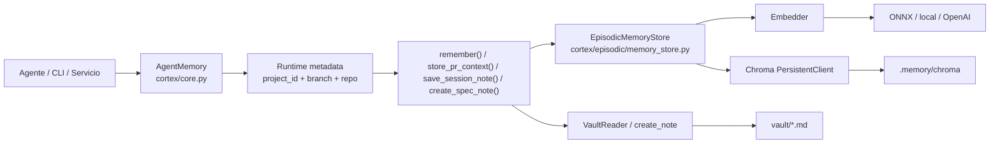

### Que muestra este diagrama

- La memoria episodica y la memoria semantica no son lo mismo.
- Cuando Cortex guarda un hecho operativo, ese hecho entra por `AgentMemory`.
- Antes de persistirlo, Cortex le agrega contexto de ejecucion real: `project_id`, `branch` y `repo`.
- La memoria episodica se embebe y se guarda en Chroma.
- La memoria semantica se guarda como archivo Markdown en `vault/`.

### Idea clave

Hoy Cortex no piensa la memoria como "un solo deposito", sino como una combinacion de:

- una capa operativa vectorial
- una capa documental durable

---

## 2. Vista micro: como Cortex recupera memoria hoy

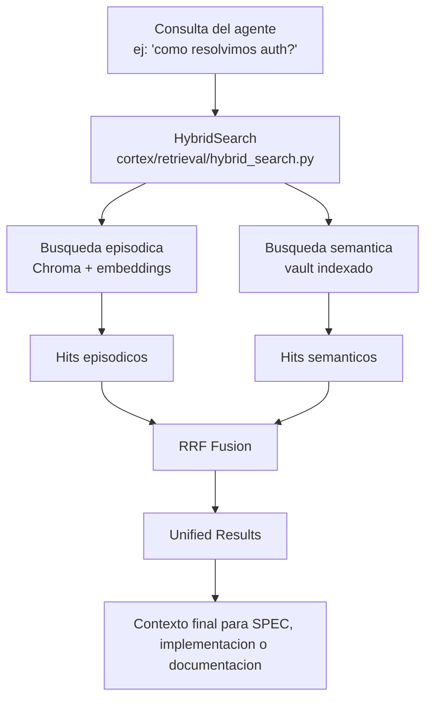

### Que muestra este diagrama

- Cortex busca en ambos mundos por separado.
- No mezcla los datos al guardar; los mezcla al recuperar.
- La fusion se hace con `RRF`, para que resultados de ambas capas compitan en un ranking comun.

### Idea clave

La "memoria hibrida" hoy existe sobre todo en la etapa de recuperacion.  
La arquitectura actual esta orientada a responder mejor, no a unificar fisicamente todo en un solo storage.

---

## 3. Como interviene ONNX realmente

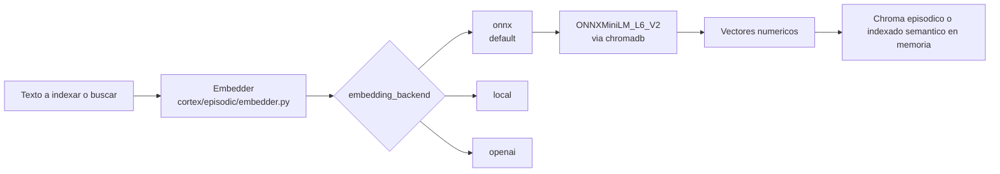

### Que muestra este diagrama

- ONNX hoy es el backend default de embeddings.
- Se usa tanto para la capa episodica como para la capa semantica.
- No es un servicio aparte de empresa: es el motor local que transforma texto en vectores.

### Lo mas importante

ONNX no crea por si solo una "memoria corporativa".  
ONNX solo hace posible que la memoria se pueda buscar semanticamente.

---

## 4. Como se indexa la documentacion del vault

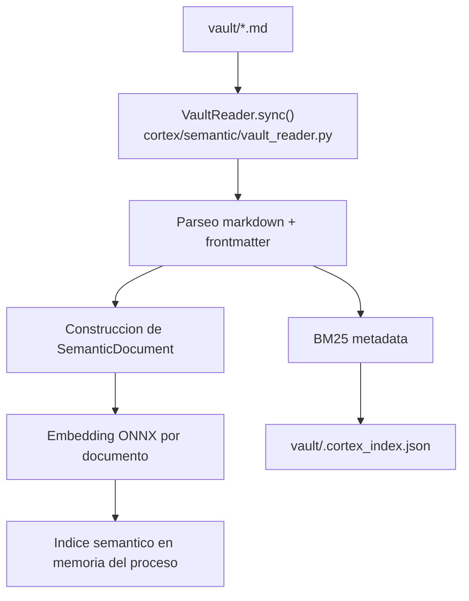

### Que muestra este diagrama

- La documentacion del `vault/` se convierte en documentos semanticos buscables.
- Cada documento recibe embedding.
- El indice semantico principal vive en memoria del proceso.
- Lo que se persiste en disco para esta parte es liviano: metadatos de apoyo como `vault/.cortex_index.json`.

### Implicancia real

Hoy la capa semantica no queda persistida como una gran base vectorial compartida del tipo "empresa completa en un solo Chroma".  
Se re-indexa cuando hace falta.

---

## 5. Como participa CI hoy

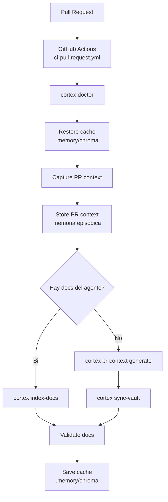

### Que muestra este diagrama

- El CI si usa memoria.
- El CI si puede regenerar o reindexar conocimiento documental.
- El CI guarda contexto episodico de PR en `.memory/chroma`.
- El CI cachea `.memory/chroma` entre runs del workflow.

### Lo que no significa

Esto no significa que exista una memoria canonica global versionada en `main`.  
Lo que existe hoy es:

- uso operativo de `.memory/chroma` en CI
- cache de esa memoria entre ejecuciones
- y conocimiento durable en `vault/` si ese contenido se versiona

---

## 6. Topologia actual de memoria por proyecto y por rama

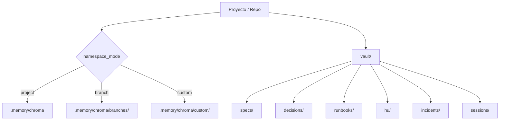

### Que muestra este diagrama

- La memoria episodica hoy es modular.
- El default real es por proyecto.
- Si se activa `namespace_mode: branch`, la memoria episodica queda separada por rama.
- El `vault/` organiza conocimiento durable por carpetas, no por vectores.

### Interpretacion

La modularidad hoy esta mas fuerte que la transversalidad total.  
Eso fue una decision saludable para evitar mezcla de contexto, ruido y acoplamiento excesivo.

---

## 7. Por que `.memory/`, `*.chroma/` y `vault/sessions/` aparecen en `.gitignore`

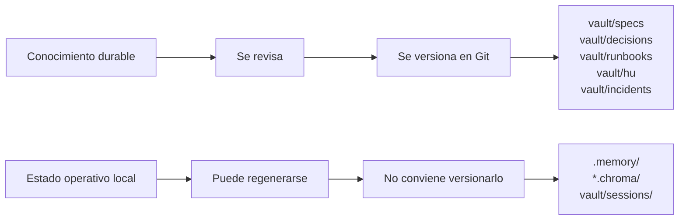

### Que muestra este diagrama

- Git no debe guardar todo indiscriminadamente.
- Hay una diferencia entre conocimiento durable y estado operativo.
- `.memory/` y `*.chroma/` representan almacenamiento tecnico regenerable y ruidoso.
- `vault/sessions/` puede tener mucho churn y no siempre conviene versionarlo por defecto.

### Filosofia de fondo

Antes podia existir la intuicion de que "si todo es memoria, todo deberia guardarse en Git".  
Ahora Cortex separa mejor:

- lo que debe quedar como patrimonio empresarial durable
- de lo que es estado operativo de una corrida, indexado o cache

Eso mejora:

- gobernanza
- limpieza del repositorio
- revisabilidad
- y claridad sobre cual es la verdadera fuente de verdad

---

## 8. Como se ve hoy Cortex a nivel empresa

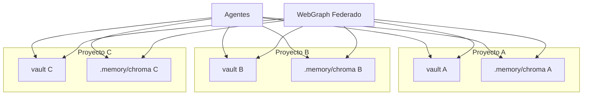

### Que muestra este diagrama

- Hoy Cortex esta muy preparado para varios proyectos.
- Pero cada proyecto sigue teniendo su propia frontera natural de memoria.
- WebGraph puede federar observacion y analisis entre proyectos.
- Eso no equivale todavia a una unica memoria empresarial canonica de escritura y lectura.

### Conclusion honesta

Hoy Cortex soporta muy bien:

- multi-proyecto
- memoria modular
- conocimiento durable por repo
- observabilidad federada

Pero todavia no resuelve automaticamente:

- una macro memoria episodica corporativa unica
- una capa de promocion nativa entre memorias locales y memoria central

---

## 9. Como una empresa chica puede aproximarse hoy a la vision original

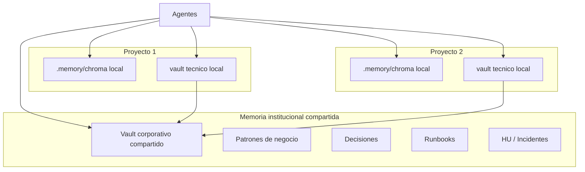

### Que muestra este diagrama

- Una empresa chica puede usar un vault corporativo compartido como memoria institucional.
- Cada proyecto conserva su memoria episodica local para no mezclar ruido.
- El conocimiento relevante se promueve al vault compartido cuando ya es durable.

### Por que esta opcion es sana

- minimiza complejidad
- evita que errores o sesiones locales contaminen a toda la empresa
- mantiene transversalidad donde mas valor aporta: patrones, decisiones, reglas de negocio y runbooks

---

## 10. Antes vs ahora: cambio conceptual

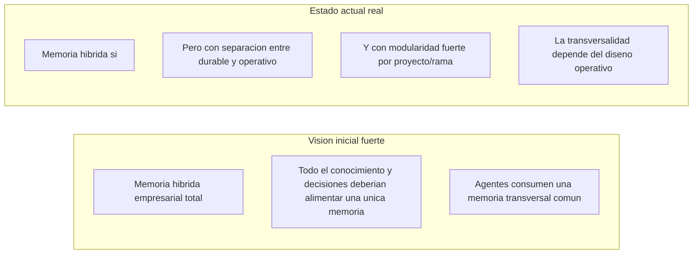

### Lectura conceptual

La vision inicial no estaba equivocada.  
Lo que paso es que la implementacion real maduro hacia un modelo mas gobernable:

- menos monolitico
- mas trazable
- mas compatible con multi-proyecto
- y mas claro respecto de que debe ser patrimonio institucional y que no

### Sintesis

Antes el ideal era una gran memoria transversal unica.  
Ahora el sistema real funciona mejor como:

- memoria institucional durable compartida
- mas memorias episodicas modulares
- mas recuperacion hibrida unificada

---

## 11. Arquitectura objetivo recomendada

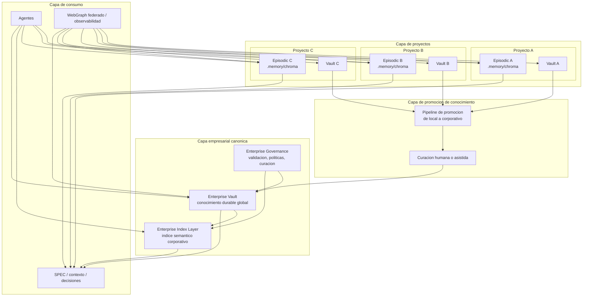

### Que propone esta arquitectura objetivo

- Mantener la memoria episodica cerca de cada proyecto.
- Mantener la memoria durable global en una capa empresarial canonica.
- Agregar una capa explicita de promocion y curacion.
- Permitir que los agentes lean tanto contexto local como contexto corporativo.
- Evitar que toda sesion, todo ruido o todo log termine contaminando la memoria institucional.

### Filosofia final de la arquitectura objetivo

La empresa no necesita una sola memoria plana.  
Necesita una arquitectura de memoria con niveles:

- memoria local de trabajo
- memoria documental de proyecto
- memoria institucional corporativa
- y reglas de promocion entre niveles

Ese modelo conserva el espiritu original de Cortex, pero lo vuelve sostenible, auditable y escalable.

---

## 12. Conclusiones finales

- Cortex hoy si tiene memoria hibrida real.
- Esa memoria hoy funciona mejor a nivel proyecto que a nivel empresa total automatica.
- El `vault/` representa mejor la memoria institucional durable que `.memory/chroma`.
- `.memory/chroma` representa mejor la memoria operativa persistente y buscable.
- ONNX hoy es el motor de embeddings, no la memoria empresarial en si misma.
- El CI hoy alimenta memoria y reindexa conocimiento, pero no construye por si solo una macro memoria corporativa canonica.
- La arquitectura objetivo mas sana no es una bolsa unica de todo, sino una memoria por capas con promocion de conocimiento hacia una capa empresarial durable.

---

## Archivo relacionado

Este documento complementa el avance general documentado en:

- [AVANCE-Alineacion-Fases-MultiProyecto-y-Gobernanza.md](/D:/DevSecDocOps/DevSecDocOps-3erCortex/cortex-repo/cortex/AVANCE-Alineacion-Fases-MultiProyecto-y-Gobernanza.md)
