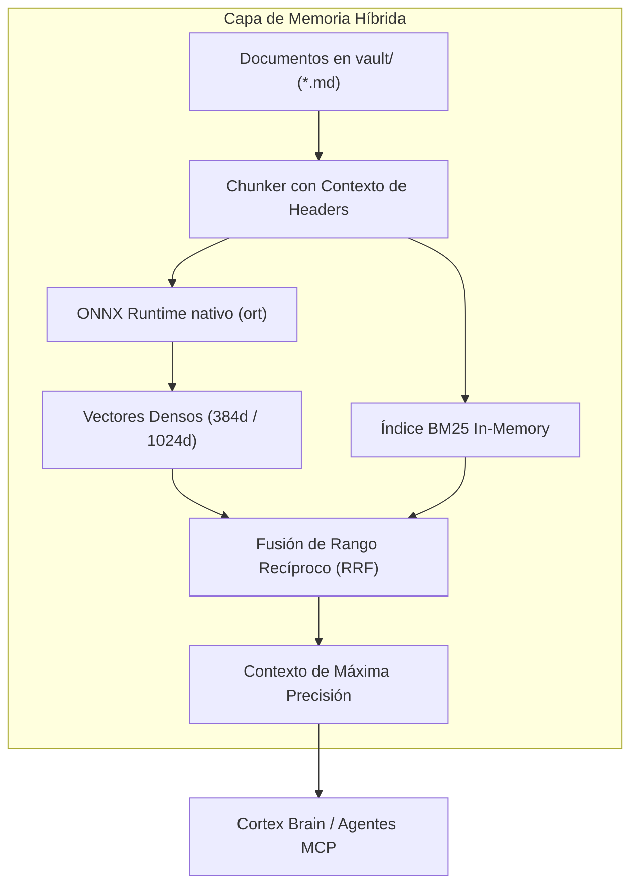

<div align="center">
  <br />
  <a href="https://github.com/MachuaninEzequiel/Cortex" target="_blank">
    
  </a>
  <br />

  <h1>CORTEX 2.0</h1>

  <p>
    <strong>Memoria cognitiva híbrida, gobernanza de sesiones y un Brain de IA local nativo en Rust — para tus agentes y tu equipo.</strong>
  </p>

  <p>
    <a href="README.md">English</a> · <a href="README.es.md">Español</a> · <a href="docs/GUIA-MIGRACION-RUST.md">Guía de Migración Python -> Rust</a>
  </p>

  <p>
    
    
    
    
    
    
  </p>
</div>

---

## Qué es Cortex

Cortex es una **capa de memoria y gobernanza para agentes de IA**. Vive en tu repositorio y les da a todos los agentes que uses — Claude Code, Cursor, Codex, OpenCode, Pi o cualquier herramienta con MCP — el mismo contexto persistente, el mismo flujo disciplinado y el mismo cierre verificable que tiene un buen equipo de ingeniería: *specs -> trabajo verificado -> sesiones documentadas*.

Todo corre **en tu máquina**. La experiencia central no necesita API keys, ni nube, ni telemetría: un binario nativo (Rust), tu vault como markdown y — opcionalmente — un LLM local que habla el idioma de tu proyecto.

---

## Por qué existe

Los agentes de IA son potentes y amnésicos. Cada sesión arranca de cero: olvidan decisiones, pierden contexto entre tareas y rara vez dejan evidencia verificable de lo que hicieron. Cuantos más agentes usás, peor la fragmentación.

Cortex resuelve las tres fallas que vuelven poco confiable el trabajo con agentes a escala:

| Falla | Qué hace Cortex |
| :--- | :--- |
| **Amnesia** | Las sesiones persisten cada decisión y resultado como memoria híbrida (episódica + semántica), consultable en dos idiomas. |
| **Sin disciplina** | Cada unidad de trabajo es una Sesión spec-driven con checkpoints, quality gates y cierre verificable. "Listo" significa *probado*, no *dicho*. |
| **Sin contexto compartido** | El mismo vault, las mismas sesiones y las mismas reglas los leen todos los agentes vía CLI y MCP — una sola fuente de verdad por proyecto. |

---

## La vida dentro de Cortex

Una Sesión es la unidad de trabajo. Abre desde una spec, registra checkpoints mientras avanzás y se cierra solo cuando la verificación pasa:

```text
abrir una sesión  ->  cortex session current / checkpoint / task
hacer el trabajo  ->  tu agente, tu IDE, tu forma
cerrarla          ->  cortex finish            (corren los verification hooks)
¿y ahora?         ->  cortex next              (lo sugiere el Action Engine)
```

---

## Cortex Brain Desktop App

**Cortex Brain** es una aplicación de escritorio nativa, ultraliviana e interactiva construida en **Tauri 2 + React + Rust**, equipada con inferencia local in-process mediante `llama.cpp` y el modelo **Liquid LFM2.5 1.2B Instruct**:

<div align="center">
  
</div>

### Capacidades Principales de Cortex Brain

* **LLM Local In-Process (100% Offline):** Equipado con **Liquid LFM2.5 1.2B Instruct (Q4_K_M)** (~712 MB en RAM). Responde en milisegundos con cero dependencias en la nube y sin enviar tu código a servidores externos.
* **WebGraph Interactivo & Orbital:** Mapeo y exploración visual en tiempo real de todos los archivos, módulos, specs de requerimientos y ADRs de arquitectura de tu proyecto.
* **Cortex Doctor & Auditoría en Vivo:** Diagnóstico de salud continuo de la estructura de tu proyecto, sesiones activas, índices vectoriales y estado del LLM.
* **Floating Launcher Global (Ctrl + Shift + B):** Abrí o minimizá Cortex Brain instantáneamente desde cualquier editor (VSCode, Cursor, Zed) o navegador con un atajo global de teclado y modo *Always-on-Top*.
* **Protocolo Autónomo de Herramientas Seguras:** Ejecuta herramientas de consulta (`vault.stats`, `memory.search`, `git.status`, `doctor.inspect`) de forma autónoma para enriquecer el contexto, mientras las acciones mutadoras requieren aprobación explícita.
* **Zero RAM Overhead (Auto-Unload):** Descarga automáticamente el modelo LLM de la memoria RAM tras 90 segundos de inactividad, liberando recursos del sistema hasta la próxima consulta.

---

## WebGraph Visual del Proyecto

El **WebGraph** analiza el AST y la documentación de tu repositorio para generar una topología interactiva orbital de conocimiento:

<div align="center">
  
</div>

* **Directorio Lateral y Filtro:** Buscá y filtrá rápidamente entre módulos, ADRs, specs y archivos fuente.
* **Fijación de Contexto:** Hacé click en cualquier nodo del grafo para fijarlo en el chat y pedirle a Cortex Brain análisis de dependencias y responsabilidades.
* **Servidor Web Dedicado:** Levantá el servidor HTTP nativo (`cortex-rs webgraph serve`) con 1 click para explorar el grafo a pantalla completa en tu navegador web.

---

## Auditoría de Salud: Cortex Doctor

Mantené tu repositorio en perfecto estado de gobernanza y calidad mediante diagnósticos automatizados:

<div align="center">
  
</div>

* **Verificación de Layout:** Estructura `.cortex/` y `vault/` validada contra los estándares de ingeniería.
* **Inspección de Sesiones:** Detección de sesiones activas, cantidad de checkpoints y consistencia de hashes de Git.
* **Salud Vectorial:** Consistencia de índices ONNX y fingerprint de modelos por idioma.

---

## Memoria Cognitiva Híbrida & Embeddings ONNX

Cortex combina **búsqueda léxica BM25** con **búsqueda semántica vectorial densa** mediante **ONNX Runtime nativo (`ort`)**:



* **Enrutamiento por Idioma (`config.yaml`):**
  * **Inglés (`en`):** `all-MiniLM-L6-v2` (384 dimensiones).
  * **Español (`es`):** `intfloat/multilingual-e5-large` (1024 dimensiones) para máxima fidelidad semántica en español.
* **Fingerprint Salado:** La clave en `.cortex_index.json` valida el modelo y la dimensión (`sha256(model + schema + texto)`). Si se cambia de modelo, el índice se actualiza automáticamente sin mezclar dimensiones.

---

## Tríada de Agentes & Skills Composed (Estándar Matt Pocock)

Cortex incorpora el flujo de trabajo moderno por fases (`CheckpointPhase`) inspirado en los estándares abiertos de skills:

```text
Grill (Aclarar) -> Spec (Especificar) -> Plan (Descomponer) -> Implement (TDD) -> Review (Revisar) -> Close (Documentar)
```

1. **Tríada Thin + Craft On-Demand:**
   * `/cortex-sync`: Pre-flight, análisis de dependencias, lectura de `CONTEXT.md` y proposal mode antes de crear specs.
   * `/cortex-SDDwork`: Implementación disciplinada de specs con verificación de claims.
   * `/cortex-documenter`: Cierre verificable de sesión, ejecución de quality gates y documentación en el vault.
2. **Familia de 8 Skills Abiertas (`templates/composed/`):**
   * `grill/`, `to-spec/`, `to-tickets/`, `implement/`, `tdd/`, `diagnose/`, `review/`, `glossary/`.

---

## Servidor MCP Universal (32 Tools Canónicas)

Cortex expone **32 herramientas canónicas** a cualquier cliente MCP (**Claude Code, Cursor, Windsurf, Codex, OpenCode, Pi, Antigravity**):

```bash
# Servidor MCP nativo por transporte stdio (sub-milisegundos de latencia)
cortex-rs mcp-serve
```

Configuración en `.mcp.json`:
```json
{
  "mcpServers": {
    "cortex": {
      "command": "cortex-rs",
      "args": ["mcp-serve"]
    }
  }
}
```

---

## Descarga e Instalación

### 1. Instaladores de Cortex Brain Desktop (Releases)

Descargá la última versión lista para usar desde [GitHub Releases](https://github.com/MachuaninEzequiel/Cortex/releases):

* **Windows:** `Cortex Brain_x64-setup.exe` (Instalador estándar NSIS).
* **macOS:** `Cortex Brain_universal.dmg` (Compatible con Apple Silicon M1/M2/M3/M4 e Intel).
* **Linux:** `Cortex Brain_amd64.deb` o binario portable.

---

### 2. Compilación del CLI Nativo (`cortex-rs`)

Si deseás compilar el CLI de Rust y tenerlo en paralelo con tu versión de Python:

```bash
# 1. Clonar el repositorio
git clone https://github.com/MachuaninEzequiel/Cortex.git
cd Cortex

# 2. Compilar el CLI y la App Desktop
npm --prefix apps/brain-ui run build
cd rust && cargo build --release -p cortex-cli -p cortex-brain-app --features llama

# 3. Instalar en ~/.local/bin
cp target/release/cortex-cli ~/.local/bin/cortex-rs
cp target/release/cortex-brain ~/.local/bin/cortex-brain
```

> Para una guía paso a paso sobre cómo convivir y probar sin romper nada, consultá la [**Guía de Coexistencia y Migración**](docs/GUIA-MIGRACION-RUST.md).

---

## Licencia

Distribuido bajo la Licencia MIT. Consultá `LICENSE` para más detalles.