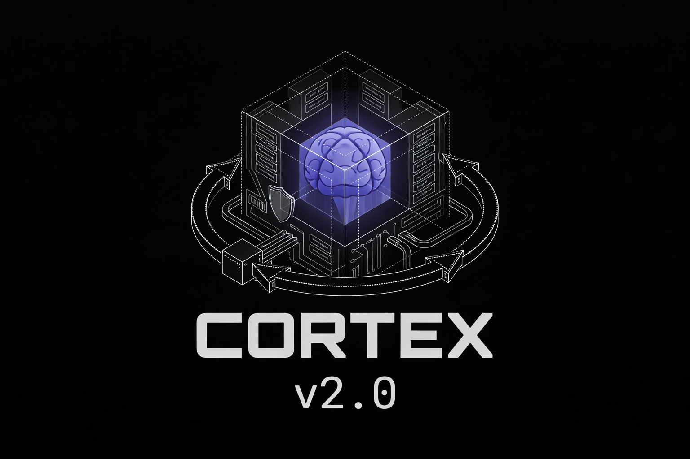
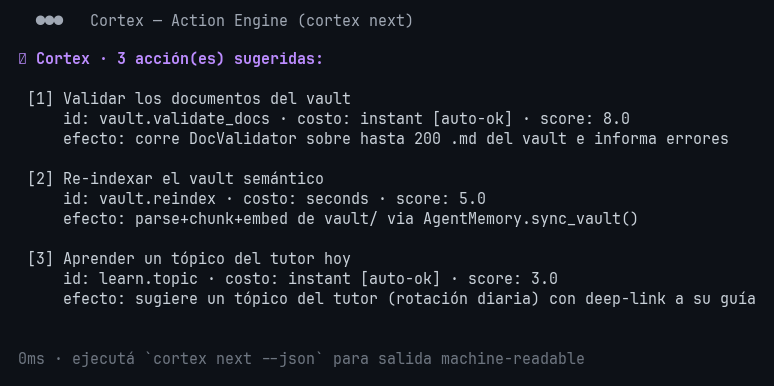
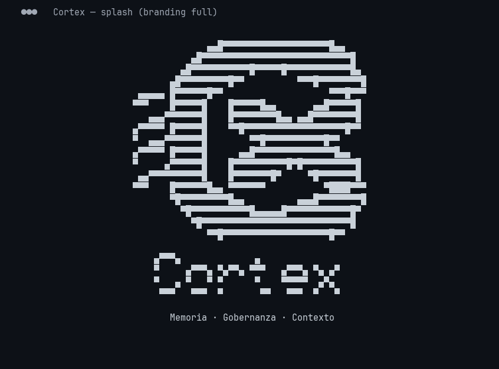
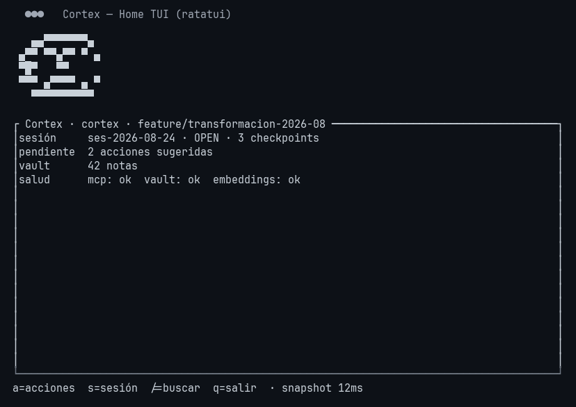
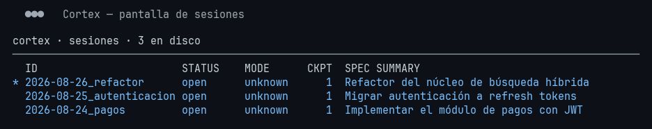

<div align="center">
  <br />
  <a href="https://github.com/MachuaninEzequiel/Cortex" target="_blank">
    
  </a>
  <br />

  <h1>CORTEX</h1>

  <p>
    <strong>Memoria híbrida, gobernanza y un brain de IA local — para tus agentes y tu equipo.</strong>
  </p>

  <p>
    <a href="README.md">🇬🇧 English</a> · <a href="README.es.md">🇪🇸 Español</a>
  </p>
</div>

---

## Qué es Cortex

Cortex es una **capa de memoria y gobernanza para agentes de IA**. Vive en
tu repositorio y les da a todos los agentes que uses — Claude Code, Cursor,
Codex, OpenCode, Pi o cualquier herramienta con MCP — el mismo contexto
persistente, el mismo flujo disciplinado y el mismo cierre verificable que
tiene un buen equipo de ingeniería: *specs → trabajo verificado → sesiones
documentadas*.

Todo corre **en tu máquina**. La experiencia central no necesita API keys,
ni nube, ni telemetría: un binario nativo (Rust), tu vault como markdown y
— opcionalmente — un LLM local que habla el idioma de tu proyecto.

## Por qué existe

Los agentes de IA son potentes y amnésicos. Cada sesión arranca de cero:
olvidan decisiones, pierden contexto entre tareas y rara vez dejan evidencia
verificable de lo que hicieron. Cuantos más agentes usás, peor la
fragmentación.

Cortex resuelve las tres fallas que vuelven poco confiable el trabajo con
agentes a escala:

| Falla | Qué hace Cortex |
|---|---|
| **Amnesia** | Las sesiones persisten cada decisión y resultado como memoria híbrida (episódica + semántica), consultable en dos idiomas. |
| **Sin disciplina** | Cada unidad de trabajo es una Sesión spec-driven con checkpoints, quality gates y cierre verificable. "Listo" significa *probado*, no *dicho*. |
| **Sin contexto compartido** | El mismo vault, las mismas sesiones y las mismas reglas los leen todos los agentes vía CLI y MCP — una sola fuente de verdad por proyecto. |

## La vida dentro de Cortex

Una Sesión es la unidad de trabajo. Abre desde una spec, registra
checkpoints mientras avanzás y se cierra solo cuando la verificación pasa:

```text
abrir una sesión  →  cortex session current / checkpoint / task
hacer el trabajo  →  tu agente, tu IDE, tu forma
cerrarla          →  cortex finish            (corren los verification hooks)
¿y ahora?         →  cortex next              (lo sugiere el Action Engine)
```

El **Action Engine** es la capa proactiva de Cortex: lee el estado del
proyecto y sugiere el siguiente paso útil — validar docs, re-indexar el
vault, aprender un tópico — cada uno con costo, score y efecto concreto:



## Tres modos operativos

Cada sesión corre en uno de tres modos, inferidos automáticamente. Describen
**cómo llegan los checkpoints** a la sesión:

| Modo | Cómo se registra el progreso |
|---|---|
| **Managed** | Un skill orquestador verifica cada paso antes de avanzar. |
| **Observed** | Tu IDE emite checkpoints por hooks (Claude Code, Cursor, Pi, OpenCode…). |
| **BYO** | Traé tu propio workflow; el reconstructor sintetiza la sesión desde git diff + checkpoints. |

## Interfaces

Cortex no es una herramienta monolítica — es una familia de superficies
alrededor de un mismo núcleo nativo:

| Superficie | Formato |
|---|---|
| **CLI** | 25+ familias de comandos (`session`, `docs`, `ci`, `setup`, `search`, `context`, `next`, `hu`, `pr-context`, `reindex`, `ide`…). Texto y `--json`. |
| **TUI** | Interfaz de terminal ratatui: splash, home y pantalla de sesiones. |
| **Servidor MCP** | `cortex mcp-serve` expone 30+ tools canónicas a cualquier cliente MCP. |
| **Integración IDE** | 11 adapters validados instalan hooks, prompts y skills en tu editor/agente. |
| **Brain** | El asistente local de IA (solo lectura por diseño). |

### La TUI







### El CLI

```text
cortex session list      sesiones en disco, tabla viva
cortex next              sugerencias del Action Engine
cortex search "auth"     retrieval híbrido episódico + semántico
cortex context           bundle de contexto enriquecido para la tarea
cortex doctor            chequeo de salud de gobernanza
cortex tutor             guía interactiva offline
```

### El servidor MCP

Un comando expone Cortex a cualquier agente con MCP:

```text
cortex mcp-serve   →  initialize / list_tools / call_tool por stdio
```

Las tools se agrupan por familia: **búsqueda** (`cortex_search`,
`cortex_search_vector`, `cortex_context`), **spec y docs**
(`cortex_create_spec`, `cortex_write_doc`, `cortex_emit_proposal`),
**sesiones** (`cortex_session_open/checkpoint/close`, `cortex_save_session`,
`cortex_finish_session`), **revisión** (`cortex_self_review_note`,
`cortex_review_checkpoint`, `cortex_verify_session_claims`), **work items**
(`cortex_import_hu`, `cortex_get_hu`) y **autopilot**
(`cortex_autopilot_start/preflight/checkpoint/finish/status`).

## Sus partes

| Parte | Rol |
|---|---|
| `rust/crates/cortex-app` | Servicios núcleo: sesiones, documenter, retrieval, quality gates. |
| `rust/crates/cortex-cli` | El CLI nativo — salida texto y `--json` para cada comando. |
| `rust/crates/cortex-tui` | Pantallas ratatui (splash, home, sesiones). |
| `rust/crates/cortex-mcp` | El servidor MCP con payloads de tools canónicos. |
| `rust/crates/cortex-actions` | El Action Engine (scheduler, registry, learning, signals). |
| `rust/crates/cortex-setup` | Bootstrap, templates, adapters de IDE y hooks. |
| `rust/crates/cortex-brain` | El asistente local de IA (llama.cpp, feature opcional). |
| resto del workspace | embed, webgraph, pipeline, doctor, tutor, enterprise, config. |

## IAs locales

Cortex trae un asistente local y una capa opcional con modelo:

- **cortex-brain** — un asistente nativo (Rust + llama.cpp) que conoce
  *este* proyecto. Responde preguntas de solo lectura y propone el comando
  exacto para todo lo demás. Las mutaciones son imposibles por diseño:
  propone, y corrés vos.

```text
🧠 cortex-brain — backend: llama.cpp (GGUF)

Vos: ¿cuántas notas hay en el vault?
🔧 sugerencia del modelo [read]: vault.stats
¿Ejecutás 'vault.stats' ? [s/N]: s
Vault: 128 notas .md
```

- Sin modelo, degrada a un router determinista (cero tokens).
- Los embedders son **por idioma**: español (`multilingual-e5-large`,
  MRR@10 0.96) e inglés (`MiniLM-L6-v2`, MRR@10 1.0), elegidos por
  frontmatter o heurística.

## Addons e integraciones

Cortex se adapta a los stacks que ya usás:

| Addon | Qué instala |
|---|---|
| **11 adapters de IDE/agente** | Claude Code, Codex, OpenCode, Pi, Cursor, Windsurf, VS Code, Claude Desktop, Hermes, Antigravity… — cada uno con hooks validados, prompts y skills de agente. |
| **Skills** | Templates de skill de agente para el workflow orquestador (el modo *Managed*). |
| **Plugin CI** | `cortex ci validate-pr` y comandos de review-session para pipelines de PR. |
| **Pipeline** | Un pipeline nativo con stages de security/lint/test/documentation. |

## Idioma

UI y salidas son bilingües — español por defecto, inglés a demanda
(`ui.language` en config, o `LANG=en`). La calidad de retrieval está medida
por idioma y es deliberadamente alta en ambos.

## Estado

Cortex es **100% nativo Rust** desde la transformación 2026-08: el CLI ya no
delega en Python, cada comando que el oráculo expone está wireado, y el
paquete Python sobrevive solo como oráculo de paridad congelado del CI.
Versión: **0.7.0**.

> Las guías de instalación y uso viven fuera de este README — ver
> `docs/` (próximamente). Licencia: MIT (`LICENSE`).