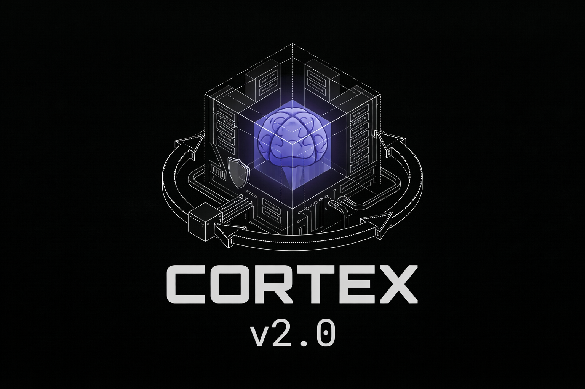

<div align="center">
  <br />
    <a href="https://github.com/MachuaninEzequiel/Cortex" target="_blank">
      
    </a>
  <br />

  <h1>CORTEX v2.0</h1>

  <p>
    <strong>Calidad, Seguridad y Documentación como sistema de gobernanza para Organizaciones y DevAgents</strong>
  </p>

  <p>
    <a href="https://github.com/MachuaninEzequiel/Cortex"></a>
    <a href="https://github.com/MachuaninEzequiel/Cortex"></a>
    <a href="https://github.com/MachuaninEzequiel/Cortex">85%25-brightgreen.svg" alt="Coverage" /></a>
    <a href="https://github.com/MachuaninEzequiel/Cortex"></a>
    <a href="https://github.com/MachuaninEzequiel/Cortex"></a>
    <a href="LICENSE"></a>
  </p>

</div>

---

## El Manifiesto Cortex: Gobernanza Total

En la era de los agentes de IA, la **Amnesia de Sesión** es el mayor enemigo de la productividad. Los agentes convencionales inician cada tarea en blanco, ignorando las decisiones arquitectónicas pasadas, las vulnerabilidades detectadas y el contexto histórico de tu negocio.

**Cortex redefine la relación humano-agente.** No es solo una base de conocimientos; es un **Sistema de Gobernanza** que obliga a la IA a seguir un ciclo de vida disciplinado de ingeniería de software, garantizando que el "saber hacer" nunca se pierda y que cada commit esté respaldado por documentación técnica de alta fidelidad.

---

## ¿Por qué Cortex?

| Problema                                       | Solución Cortex                           |
| ---------------------------------------------- | ----------------------------------------- |
| Agentes olvidan contexto entre sesiones        | Memoria Híbrida RRF persistente           |
| Código sin documentación actualizada           | `save-session` obligatorio post-tarea     |
| Sin trazabilidad de decisiones arquitectónicas | Especificaciones técnicas (`create-spec`) |
| Vulnerabilidades detectadas tarde              | SecuritySubAgent en tiempo real           |
| Tests como afterthought                        | TestSubAgent integrado en flujo           |

---

## El Modelo de Ejecución Tripartito (SDDwork)

La Pre-Release 2.0 introduce un sistema de orquestación donde la responsabilidad se divide en tres roles especializados para maximizar la precisión:

### 1. `Cortex-sync` (El Analista / SPECsWriter)

Su misión es la **preparación**. Recupera contexto histórico del Vault y de la memoria episódica para refinar los requisitos.

- **Output**: Generación de una **Especificación Técnica (`create-spec`)** validada antes de tocar una sola línea de código.
- **Responsabilidades**:
  - Análisis de memorias previas relacionadas
  - Detección de patrones arquitectónicos existentes
  - Identificación de dependencias y riesgos
  - Refinamiento de requisitos con contexto histórico

### 2. `Cortex-SDDwork` (El Orquestador)

Coordina la implementación técnica mediante subagentes especializados:

- **CodeSubAgent**: Encargado de la lógica funcional y implementación de features.
- **SecuritySubAgent**: Revisa vulnerabilidades y cumplimiento de estándares OWASP/SEC en tiempo real.
- **TestSubAgent**: Asegura la cobertura >80% y estabilidad del cambio con tests unitarios e integración.

**Flujo de trabajo:**

```
Especificación → CodeSubAgent → SecuritySubAgent → TestSubAgent → [Loop hasta aprobar]
```

### 3. `Sug-agent cortex-documenter` (El Guardián)

Es el paso final **obligatorio**. Ninguna tarea se considera terminada si este agente no ha persistido el conocimiento en el Vault. Es un subagente llamado por el orquestador de forma obligatoria al final de la realización completa de un SPEC, posee reglas definidas y SKILLS optimizadas para la generación de documentación técnica de alta fidelidad, con los estándares estrictos de Obsidian.

- **Output**: **Notas de Sesión (`save-session`)** estructuradas que alimentan la memoria futura de todo el equipo.
- **Contenido generado:**
  - Decisiones técnicas tomadas y justificación
  - Cambios realizados con diff resumido
  - TODOs pendientes y technical debt identificado
  - Links a issues/PRs relacionados
  - Métricas de cobertura y calidad

---

## Pilares Tecnológicos

### Memoria Híbrida RRF (Reciprocal Rank Fusion)

Cortex combina dos capas cognitivas para una recuperación perfecta:

- **Capa Episódica**: Eventos de CI, logs y resúmenes de PRs almacenados en **ChromaDB** con embeddings ONNX.
- **Capa Semántica**: El conocimiento profundo de la empresa almacenado como archivos **Markdown** en tu Vault (Obsidian-compatible).
- **Fusión Inteligente**: El motor realiza búsquedas cruzadas y fusiona resultados usando **RRF verdadero cross-source**, dando al agente el contexto exacto ordenado por relevancia.

**Características técnicas:**

- ✅ Embeddings locales via ONNX Runtime (`<1ms` latency)
- ✅ Soporte multi-backend: ONNX (default), sentence-transformers, OpenAI
- ✅ Búsqueda semántica + BM25 fallback híbrida
- ✅ True RRF: competición justa entre fuentes episódicas y semánticas

### Aislamiento y Anti-Amnesia

Cortex prohíbe explícitamente el uso de memorias genéricas o volátiles. En un repositorio gobernado por Cortex, la **única fuente de verdad** es el sistema local sincronizado, eliminando alucinaciones y fugas de contexto.

**Garantías:**

- ❌ No usa memoria de sesión volátil
- ❌ No depende de context windows externos
- ✅ Vault local como source of truth
- ✅ Git-tracked memoria para auditoría completa

### Eficiencia ONNX

Sin dependencias pesadas. Cortex utiliza un backend basado en **ONNX Runtime** para embeddings, permitiendo inicializaciones en `< 1ms` incluso en hardware modesto.

**Performance:**

```
Modelo:           all-MiniLM-L6-v2 (384 dimensions)
Latencia:         <1ms por embedding (CPU)
Memory footprint: ~50MB (vs ~2.5GB PyTorch)
API keys:         No requeridas
```

### Context Enricher Proactivo

Sistema de inyección contextual inteligente que analiza archivos modificados y automáticamente sugiere contexto relevante:

- **Detección de dominio/tópico** mediante análisis semántico
- **Co-occurrence boost** basado en grafos de archivos modificados conjuntamente
- **Multi-strategy search**: topic, files, keywords, PR titles, graph expansion
- **Budget control**: max items y max chars configurables

---

## CLI Reference (v2.0)

Todas las funciones están gobernadas por el envoltorio CLI de Typer:

| Comando                 | Función en el Ciclo de Vida | Descripción                                                                        |
| ----------------------- | --------------------------- | ---------------------------------------------------------------------------------- |
| `cortex setup agent`    | **Cognitive**               | Configura Vault, Memoria, Skills y el Servidor MCP en tu IDE.                      |
| `cortex setup pipeline` | **DevOps**                  | Configura Workflows de GitHub y scripts de auditoría (`devsecdocops.sh`).          |
| `cortex setup full`     | **Total**                   | Instalación completa (Agente + Pipeline).                                          |
| `cortex create-spec`    | **Pre-Work**                | Define metas, requerimientos y criterios de aceptación antes de codear.            |
| `cortex save-session`   | **Post-Work**               | Persiste cambios, decisiones y TODOs en el Vault (obligatorio).                    |
| `cortex search`         | **Retrieve**                | Búsqueda híbrida RRF en ambas capas de memoria.                                    |
| `cortex context`        | **Enrich**                  | Inyecta contexto temprano basado en archivos modificados.                          |
| `cortex hu`             | **Work Items**              | Importa HU/work items externos (read-only) y los persiste en `vault/hu/`.          |
| `cortex remember`       | **Store**                   | Almacena memorias episódicas manualmente (con `--summarize` para LLM compression). |
| `cortex forget`         | **Delete**                  | Elimina memorias por ID con confirmación.                                          |
| `cortex stats`          | **Monitor**                 | Muestra estadísticas del vault y memoria episódica.                                |
| `cortex install-skills` | **Coach**                   | Inyecta habilidades de Obsidian en `.cortex/skills/`.                              |
| `cortex mcp-server`     | **Bridge**                  | Inicia el servidor universal para integración con IDEs.                            |

**Ejemplos de uso:**

```bash
# Flujo completo de desarrollo gobernado
$ cortex create-spec "Implementar auth JWT con refresh tokens"
✓ Especificación creada: .cortex/specs/2026-04-21-jwt-auth.md

# ... (agente trabaja, subagentes ejecutan) ...

$ cortex save-session --pr #123
✓ Sesión guardada: vault/sessions/2026-04-21-pr123.md
✓ Decisions: 3 | Changes: 12 files | TODOs: 2 | Coverage: 87%

# Búsqueda inteligente de contexto
$ cortex search "error handling en middleware"
🔍 Found 8 results (RRF fused):
  [0.89] EPISODIC: PR #119 fix-auth-middleware (2026-04-15)
  [0.85] SEMANTIC: vault/architecture/auth-patterns.md
  [0.82] EPISODIC: CI failure log - test_auth.py (2026-04-14)
  ...
```

---

## Integración Universal (MCP Server)

Cortex expone sus capacidades nativamente mediante el **Model Context Protocol (MCP)**. Configúralo en tu IDE favorito para que tus asistentes tengan "superpoderes" cognitivos.

### Prerrequisitos para MCP

Antes de configurar MCP en cualquier IDE, asegúrate de:

1. **Tener Cortex instalado** en tu entorno Python:

   ```bash
   pip install cortex-memory
   # O en modo desarrollo:
   pip install -e ".[dev]"
   ```

2. **Tener el proyecto inicializado** con `config.yaml`:

   ```bash
   cd /ruta/a/tu/proyecto
   cortex setup agent  # Esto crea config.yaml y el vault
   ```

3. **Verificar que el servidor MCP funciona**:
   ```bash
   cortex mcp-server --project-root /ruta/a/tu/proyecto
   ```

### Configuración por IDE

#### Cursor

**Paso 1: Abrir configuración MCP**

- Ve a `Settings` → `MCP` → `Add Server`

**Paso 2: Configurar el servidor Cortex**

- **Name**: `cortex`
- **Command**: `python`
- **Args**:

  ```
  -m
  cortex.cli.main
  mcp-server
  --project-root
  C:\ruta\absoluta\a\tu\proyecto
  ```

  ⚠️ **IMPORTANTE**: Reemplaza `C:\ruta\absoluta\a\tu\proyecto` con la ruta REAL donde está tu `config.yaml`. Usa siempre rutas absolutas (completas), no relativas.

**Paso 3: Verificar conexión**

- Cursor debería mostrar `Connected: true` en la sección MCP
- Si muestra error, revisa los logs en `Settings` → `MCP` → `Logs`

**Solución de problemas comunes en Cursor:**

| Error                                      | Causa                                             | Solución                                                                        |
| ------------------------------------------ | ------------------------------------------------- | ------------------------------------------------------------------------------- |
| `FileNotFoundError: Config file not found` | La ruta `--project-root` es incorrecta o relativa | Usa ruta absoluta completa al directorio del proyecto                           |
| `Connection closed`                        | El servidor no pudo iniciar                       | Ejecuta `cortex mcp-server --project-root <ruta>` en terminal para ver el error |
| `Module not found: cortex`                 | Python no encuentra el paquete                    | Asegúrate de instalar Cortex en el mismo Python que usa Cursor                  |

### Arquitectura Específica para Cursor

**Limitación de Cursor:** Cursor solo soporta subagentes, no agentes de primer nivel. Por esto, Cortex usa una arquitectura híbrida específica para este IDE:

**Subagentes inyectados en Cursor:**

1. **`cortex-sync`**: Pre-flight analysis (sin cambios)
   - Llama a `cortex_sync_ticket` para inyectar contexto histórico
   - Crea la especificación técnica con `cortex_create_spec`
   - NO tiene permisos de escritura

2. **`cortex-SDDwork-cursor`**: Orquestador híbrido (combina explorer + implementer)
   - **Fase de Exploración**: Analiza arquitectura, encuentra archivos relevantes, identifica patrones
   - **Fase de Implementación**: Diseña y escribe el código, valida cambios
   - **Fast Track**: Para tareas simples (1-2 archivos), implementa directamente
   - **Deep Track**: Para tareas complejas, hace análisis profundo antes de implementar
   - Delega obligatoriamente a `cortex-documenter` al final

3. **`cortex-documenter`**: Especialista en documentación
   - Genera notas de sesión en `vault/sessions/`
   - Crea ADRs si hubo decisiones técnicas significativas
   - Indexa en memoria episódica con `cortex_save_session`
   - Usa skills de Obsidian (propiedades, backlinks, tags)

**Flujo de trabajo en Cursor:**

```
Usuario → cortex-sync → cortex-SDDwork-cursor → cortex-documenter
          (spec)       (explora + implementa)   (documenta)
```

**Diferencias con otros IDEs:**

| IDE                     | Arquitectura                 | Subagentes                                          |
| ----------------------- | ---------------------------- | --------------------------------------------------- |
| Cursor                  | Híbrida (limitación del IDE) | 3: sync, sddwork-cursor, documenter                 |
| OpenCode/Claude Desktop | Estándar completa            | 5: sync, sddwork, explorer, implementer, documenter |
| VSCode                  | Estándar completa            | 5: sync, sddwork, explorer, implementer, documenter |

#### Antigravity / Claude Desktop

Edita tu archivo de configuración (ubicación varía según OS):

**macOS/Linux**: `~/Library/Application Support/Claude/claude_desktop_config.json`
**Windows**: `%APPDATA%\Claude\claude_desktop_config.json`

```json
{
  "mcpServers": {
    "cortex": {
      "command": "python",
      "args": [
        "-m",
        "cortex.cli.main",
        "mcp-server",
        "--project-root",
        "/ruta/absoluta/a/tu/proyecto"
      ]
    }
  }
}
```

#### VSCode (Cline / Roo)

Crea o edita `.vscode/mcp.json` en tu proyecto:

```json
{
  "servers": {
    "cortex": {
      "command": "python",
      "args": [
        "-m",
        "cortex.cli.main",
        "mcp-server",
        "--project-root",
        "${workspaceFolder}"
      ]
    }
  }
}
```

> **Nota**: `${workspaceFolder}` es una variable de VSCode que se expande automáticamente a la ruta del proyecto abierto.

### Herramientas MCP disponibles

Una vez conectado, tendrás acceso a estas herramientas:

- **`cortex_search`**: Búsqueda híbrida en memorias (palabras clave instantánea)
- **`cortex_search_vector`**: Búsqueda semántica profunda (requiere carga de modelo ONNX)
- **`cortex_context`**: Enriquecer contexto basado en archivos modificados
- **`cortex_sync_ticket`**: Inyectar contexto histórico para preparar specs (paso obligatorio de cortex-sync)
- **`cortex_create_spec`**: Crear especificaciones técnicas
- **`cortex_save_session`**: Persistir sesiones de trabajo
- **`cortex_import_hu`**: Importar una HU/work item externo en modo read-only (ej: `PROJ-123`)
- **`cortex_get_hu`**: Obtener la nota local ya importada de una HU/work item
- **`cortex_sync_vault`**: Sincronizar y re-indexar el vault

---

## Integracion Jira (read-only)

Cortex puede absorber informacion desde Jira (solo lectura) y persistirla como notas en `vault/hu/` para que quede disponible como memoria semantica y contexto de sesion.

### Activacion (opcional)

En `config.yaml` agrega (o edita) esta seccion:

```yaml
integrations:
  jira:
    enabled: false
    base_url: "https://TU-DOMINIO.atlassian.net"
    email_env: JIRA_EMAIL
    token_env: JIRA_API_TOKEN
```

Luego define credenciales via variables de entorno:

```bash
export JIRA_EMAIL="tu@email.com"
export JIRA_API_TOKEN="tu_api_token"
```

PowerShell:

```powershell
$env:JIRA_EMAIL="tu@email.com"
$env:JIRA_API_TOKEN="tu_api_token"
```

### Uso (CLI)

```bash
cortex hu import PROJ-123
cortex hu list
cortex hu show PROJ-123
```

Notas:
- Si Jira no esta habilitado/configurado, Cortex funciona igual.
- No hay ida y vuelta: no se comentan tickets, no se cambian estados, no se escribe nada en Jira.

## Instalación

**Prerrequisitos:**

- Python 3.10 o superior
- Git
- _(Opcional)_ Para LLM summarization: API key de OpenAI/Anthropic/Ollama

**Opción A: Desarrollo Local** _(Recomendado para contribuir)_

```bash
# Clonar repositorio
git clone https://github.com/MachuaninEzequiel/Cortex.git
cd Cortex

# Crear entorno virtual
python -m venv .venv
source .venv/bin/activate  # Linux/Mac
# o .venv\Scripts\activate  # Windows

# Instalar en modo desarrollo con dev dependencies
pip install -e ".[dev]"

# Configurar hooks de linting
pre-commit install

# Setup inicial (elige tu perfil)
cortex setup agent        # Para desarrolladores (Vault + Skills + MCP)
cortex setup pipeline     # Para DevOps (GitHub Actions + auditoría)
cortex setup full         # Instalación completa (recomendado)
```

**Opción B: Usuario Final**

```bash
pip install cortex-memory

# Quick start
cortex setup agent
```

**Dependencias Opcionales:**

```bash
# Embedding backend alternativo (PyTorch ~2.5GB)
pip install cortex-memory[local]

# Integraciones LLM
pip install cortex-memory[openai]     # OpenAI GPT-4
pip install cortex-memory[anthropic]  # Claude
pip install cortex-memory[ollama]     # Local LLMs

# WebGraph UI (visualización de knowledge graphs)
pip install cortex-memory[webgraph]

# Todo junto
pip install cortex-memory[all]
```

---

## 📁 Estructura del Proyecto

```
Cortex/
├── cortex/                    # Paquete principal
│   ├── cli/                   # Interfaz de línea de comandos (Typer)
│   ├── core.py                # Fachada Principal (AgentMemory)
│   ├── pipeline/              # Workflows CI/CD y DevSecDocOps 🆕
│   ├── services/              # Capa de servicios inyectados 🆕
│   ├── models.py              # Modelos Pydantic (config, datos)
│   ├── episodic/              # Memoria episódica (ChromaDB + ONNX)
│   ├── semantic/              # Memoria semántica (Vault Markdown)
│   ├── retrieval/             # Motor de búsqueda híbrida (Adaptive RRF) 🆕
│   ├── embedders/             # Backends de embeddings (Factory) 🆕
│   ├── enricher/              # Context Enricher proactivo (Async) 🆕
│   ├── hooks/                 # Decorators para agents
│   ├── mcp/                   # Integración Universal IDE 🆕
│   │   └── server.py          # Servidor MCP con task delegation
│   └── webgraph/              # Visualización de grafos (Seguridad Local) 🆕
├── tests/                     # Suite de tests (pytest 100% coverage)
│   ├── unit/                  # Tests unitarios y matemáticos (Hypothesis) 🆕
│   ├── integration/           # Tests de integración MCP y CLI 🆕
│   └── e2e/                   # Pruebas end-to-end 🆕
├── docs/                      # Documentación extendida
├── examples/                  # Ejemplos de uso
├── scripts/                   # Utilidades DevOps
├── vault/                     # Vault por defecto (gitignored)
├── .cortex/                   # Configuración local Cortex
├── config.yaml                # Configuración principal
├── pyproject.toml             # Metadata y dependencias
├── CLAUDE.md                  # Instrucciones para Claude/Cursor
└── README.md                  # Este archivo
```

---

## Configuración Avanzada

El archivo `config.yaml` permite fine-tuning completo:

```yaml
# Memoria Episódica (vector DB)
episodic:
  persist_dir: .memory/chroma
  collection_name: cortex_episodic
  embedding_model: all-MiniLM-L6-v2
  embedding_backend: onnx # onnx | local | openai

# Memoria Semántica (vault markdown)
semantic:
  vault_path: vault

# Búsqueda Híbrida RRF
retrieval:
  top_k: 5 # Resultados por fuente
  episodic_weight: 1.0 # Peso RRF episódico
  semantic_weight: 1.0 # Peso RRF semántico

# Context Enricher
context_enricher:
  min_score: 0.1 # Score mínimo relevancia
  domain_confidence: 0.5 # Confianza mínima detección dominio
  max_items: 8 # Máximo items contexto
  max_chars: 2000 # Máximo caracteres inyectados
  strategies:
    topic: true
    files: true
    keywords: true
    pr_title: true
    graph_expansion: true # Co-occurrence boost

# LLM (opcional, para summarization)
llm:
  provider: none # none | openai | anthropic | ollama
  model: "" # ej: "gpt-4o-mini"

# Integrations (optional)
integrations:
  jira:
    enabled: false
    base_url: ""
    email_env: JIRA_EMAIL
    token_env: JIRA_API_TOKEN
```

---

## Testing y Calidad

Cortex mantiene estándares rigurosos de calidad:

- **Coverage objetivo**: >85%
- **Linting**: Ruff (velocidad extrema)
- **Type checking**: Mypy (seguridad tipado)
- **Pre-commit hooks**: Automáticos en dev mode
- **CI/CD**: GitHub Actions con pipeline DevSecDocOps

```bash
# Ejecutar suite completa de calidad
ruff check .          # Linting estático
ruff format .         # Formateo automático
pytest --cov=cortex   # Tests con coverage
mypy cortex/          # Type checking
```

---

## Changelog Reciente

### v2.4.0 (Architectural Overhaul) — Estabilización y Calidad Total

**🔴 Core & Pipeline:**

- ✅ `core.py` refactorizado en Fachada + inyección de `services/`.
- ✅ Nuevo módulo `cortex/pipeline/` para abstracciones DevSecDocOps (reemplaza scripts bash).
- ✅ Servidor MCP mejorado con delegación paralela (`_delegate_task`, `_delegate_batch`).

**🟡 Inteligencia y Velocidad:**

- ✅ **Adaptive RRF**: Los pesos de fusión se ajustan dinámicamente según la intención de búsqueda.
- ✅ **Async Context Enricher**: Resolución concurrente con `asyncio.gather` eliminando latencias bloqueantes.
- ✅ **Embedders Factory**: Carga perezosa de backends (ONNX, local, openai) optimizando el startup del CLI.

**🟢 Calidad & Seguridad:**

- ✅ Tests reestructurados en `unit/`, `integration/` y `e2e/`.
- ✅ **Property-Based Testing** (Hypothesis) implementado para probar límites matemáticos del RRF.
- ✅ **Contract Testing** parametrizado para cualquier nuevo backend de embeddings.
- ✅ **WebGraph Security**: Protección contra CSRF en localhost vía token `X-Cortex-WebGraph` y canvas UI estable.

---

### v2.0.0 (Pre-Release) — Base Inicial

**🔴 Fixes Críticos:**

- ✅ Semantic Memory ahora usa embeddings vectoriales reales (no keyword counting)
- ✅ RRF cross-source verdadero: fusión unificada con competición justa entre fuentes
- ✅ Timestamp restaurado en recuperación de memoria episódica

**🟡 Mejoras Importantes:**

- ✅ `AgentMemory.create_note()` agregado a API pública
- ✅ `CortexHook` decorator usa `functools.wraps` y maneja kwargs
- ✅ Config validada con Pydantic (rechaza valores inválidos)
- ✅ VaultReader comparte embedding model con capa episódica
- ✅ Safe YAML frontmatter generation (no más f-strings inseguras)

**🟢 Mejoras Menores:**

- ✅ Setuptools build backend modernizado
- ✅ Log messages más precisos
- ✅ Duplicate wiki-link regex eliminado
- ✅ CLI warnings mejorados
- ✅ Test fixtures centralizados en `conftest.py`

Ver [CHANGELOG.md](CHANGELOG.md) para historial completo.

---

## 🤝 Contribuir

¡Las contribuciones son bienvenidas! Por favor lee [CONTRIBUTING.md](CONTRIBUTING.md) para detalles sobre:

- Setup de entorno de desarrollo
- Flujo de ramas y convenciones
- Estándares de código y testing
- Guía de Pull Requests
- Ideas para contribuir (issues con label `help-wanted`)

---

## 📄 Licencia

Este proyecto está bajo la Licencia MIT — ver el archivo [LICENSE](LICENSE) para detalles.

---

## 👥 Autor

**MachuaninEzequiel** — [@MachuaninEzequiel](https://github.com/MachuaninEzequiel)

---

## Agradecimientos

- Equipo de **ChromaDB** por el excelente vector database
- Comunidad **ONNX Runtime** por hacer embeddings lightning-fast
- **Obsidian** por inspirar el formato de vault
- Todos los contribuyentes early-adopters de Cortex

---

<div align="center">
  <p>¿Problemas? ¿Ideas? ¡<a href="https://github.com/MachuaninEzequiel/Cortex/issues">Abre un issue</a>!</p>
  <p><strong>Cortex: La memoria dejo de ser el pasado. </strong></p>
</div>
