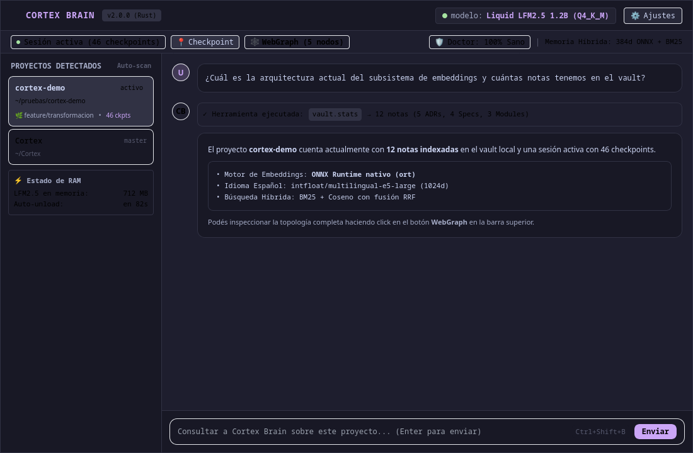
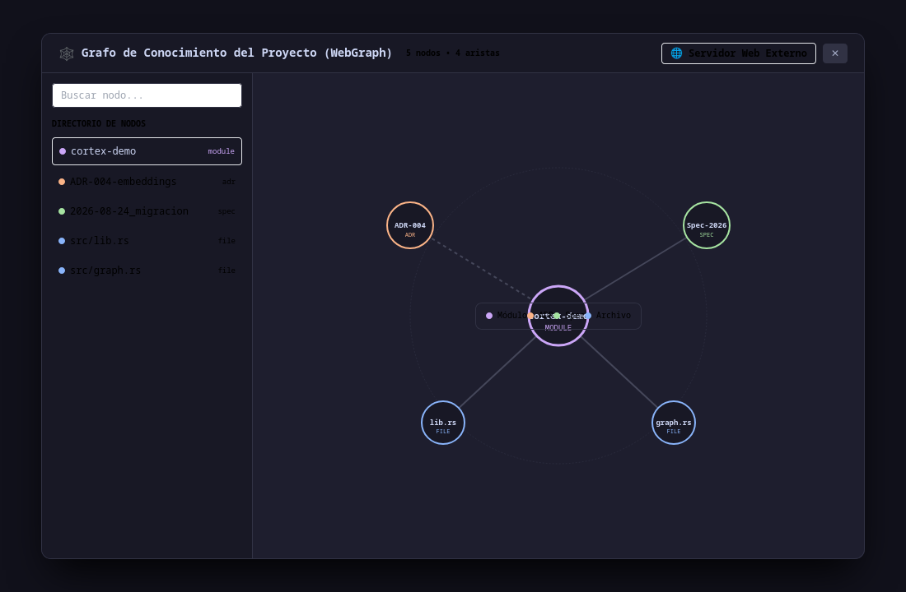
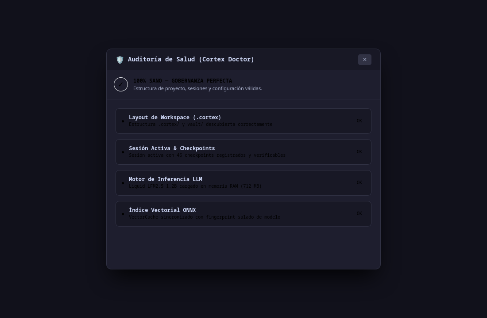
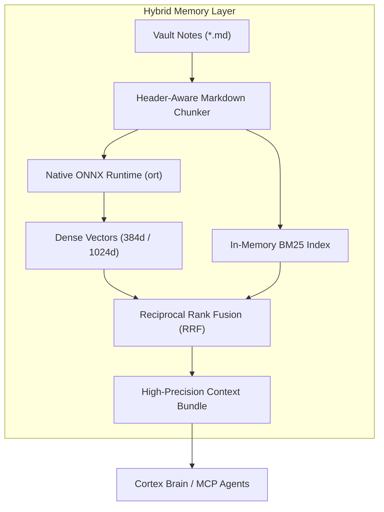

<div align="center">
  <br />
  <a href="https://github.com/MachuaninEzequiel/Cortex" target="_blank">
    
  </a>
  <br />

  <h1>CORTEX 2.0</h1>

  <p>
    <strong>Hybrid cognitive memory, session governance and an in-process local AI Brain in native Rust — for your agents and your engineering team.</strong>
  </p>

  <p>
    <a href="README.md">🇬🇧 English</a> · <a href="README.es.md">🇪🇸 Español</a> · <a href="docs/GUIA-MIGRACION-RUST.md">🦀 Migration Guide (Python → Rust)</a>
  </p>

  <p>
    
    
    
    
    
    
  </p>
</div>

---

## 🖥️ Cortex Brain Desktop App

**Cortex Brain** is a lightweight, interactive standalone desktop application built with **Tauri 2 + React + Rust**, equipped with in-process local inference via `llama.cpp` and the **Liquid LFM2.5 1.2B Instruct** model:

<div align="center">
  
</div>

### ✨ Core Capabilities of Cortex Brain

* **🧠 In-Process Local LLM (100% Offline):** Powered by **Liquid LFM2.5 1.2B Instruct (Q4_K_M)** (~712 MB in RAM). Responds with sub-second latency with zero cloud dependencies and no data ever leaving your machine.
* **🕸️ Interactive Orbital WebGraph:** Real-time visual topology mapping files, modules, requirement specs, and architecture ADRs across your repository.
* **🛡️ Live Cortex Doctor Audit:** Continuous health monitoring for workspace structure, active sessions, vector index consistency, and LLM state.
* **🚀 Global Floating Launcher (`Ctrl + Shift + B`):** Summon or hide Cortex Brain instantly from any code editor (VSCode, Cursor, Zed) or browser with a global shortcut and *Always-on-Top* mode.
* **⚡ Autonomous Safe Tool Protocol:** Read-only inspection tools (`vault.stats`, `memory.search`, `git.status`, `doctor.inspect`) run autonomously to enrich responses, while mutating actions require explicit user approval.
* **🍃 Zero RAM Overhead (Auto-Unload):** Automatically unloads the model from RAM after 90 seconds of inactivity, freeing system resources until your next query.

---

## 🕸️ Visual Project WebGraph

The **WebGraph** parses your repository AST and markdown vault to construct an interactive orbital knowledge map:

<div align="center">
  
</div>

* **Sidebar Directory & Search Filter:** Rapidly filter and inspect modules, ADRs, specs, and source files.
* **Context Pinning:** Click any node to pin it directly into the chat and ask Cortex Brain about dependencies and design responsibilities.
* **Dedicated Web Server:** Launch the native HTTP server (`cortex-rs webgraph serve`) with 1 click to view the graph full-screen in any web browser.

---

## 🛡️ Health & Governance: Cortex Doctor

Keep your codebase and governance in top health with continuous automated audits:

<div align="center">
  
</div>

* **Workspace Layout Verification:** Ensures `.cortex/` and `vault/` conform to standard engineering layouts.
* **Session Integrity Inspection:** Audits active sessions, checkpoint chains, and Git commit hash consistency.
* **Vector Health:** Verifies ONNX embedding cache parity and model fingerprints per language.

---

## 🧬 Hybrid Cognitive Memory & ONNX Embeddings

Cortex merges **lexical BM25 search** with **dense semantic vector retrieval** using native **ONNX Runtime (`ort`)**:


```mermaid
graph TD
    subgraph Hybrid_Memory [Hybrid Memory Layer]
        Doc["Vault Notes (*.md)"] --> Chunker["Header-Aware Markdown Chunker"]
        Chunker --> ONNX["Native ONNX Runtime (ort)"]
        Chunker --> BM25["In-Memory BM25 Index"]
        ONNX --> Dense["Dense Vectors (384d / 1024d)"]
        Dense --> RRF["Reciprocal Rank Fusion (RRF)"]
        BM25 --> RRF
        RRF --> Retrieval["High-Precision Context Bundle"]
    end
    Retrieval --> Brain["Cortex Brain / MCP Agents"]
```

* **Per-Language Model Routing (`config.yaml`):**
  * **English (`en`):** `all-MiniLM-L6-v2` (384 dimensions).
  * **Spanish (`es`):** `intfloat/multilingual-e5-large` (1024 dimensions) for maximum semantic retrieval fidelity in Spanish.
* **Salted Model Fingerprint:** The index key in `.cortex_index.json` validates model name and dimension (`sha256(model + schema + text)`). Switching models automatically re-indexes cleanly without mixing vector spaces.

---

## 🤖 Agent Triad & Composed Skills (Matt Pocock Standard)

Cortex adopts a modern phased workflow (`CheckpointPhase`) inspired by open skill standards:

```text
Grill (Clarify) → Spec (Specify) → Plan (Decompose) → Implement (TDD) → Review (Verify) → Close (Document)
```

1. **Thin + Craft On-Demand Triad:**
   * `/cortex-sync`: Pre-flight analysis, `CONTEXT.md` vocabulary enforcement, and proposal mode before committing to specs.
   * `/cortex-SDDwork`: Disciplined implementation of specs with verified claim validation.
   * `/cortex-documenter`: Verifiable session closure, quality gate execution, and vault documentation.
2. **Family of 8 Open Skills (`templates/composed/`):**
   * `grill/`, `to-spec/`, `to-tickets/`, `implement/`, `tdd/`, `diagnose/`, `review/`, `glossary/`.

---

## 🔌 Universal MCP Server (32 Canonical Tools)

Cortex exposes **32 canonical tools** over stdio transport to any MCP client (**Claude Code, Cursor, Windsurf, Codex, OpenCode, Pi, Antigravity**):

```bash
# Launch native stdio MCP server (sub-millisecond latency)
cortex-rs mcp-serve
```

Configuration in `.mcp.json`:
```json
{
  "mcpServers": {
    "cortex": {
      "command": "cortex-rs",
      "args": ["mcp-serve"]
    }
  }
}
```

---

## 📦 Downloads & Installation

### 🖥️ 1. Cortex Brain Desktop Installers (Releases)

Download ready-to-run releases from [GitHub Releases](https://github.com/MachuaninEzequiel/Cortex/releases):

* **Windows:** `Cortex Brain_x64-setup.exe` (Standard NSIS Installer).
* **macOS:** `Cortex Brain_universal.dmg` (Universal binary for Apple Silicon M1-M4 and Intel).
* **Linux:** `Cortex Brain_amd64.deb` or standalone binary.

---

### ⚡ 2. Building the Native Rust CLI (`cortex-rs`)

To compile the Rust CLI and run it side-by-side with your Python version:

```bash
# 1. Clone the repository
git clone https://github.com/MachuaninEzequiel/Cortex.git
cd Cortex

# 2. Build CLI and Desktop App
npm --prefix apps/brain-ui run build
cd rust && cargo build --release -p cortex-cli -p cortex-brain-app --features llama

# 3. Install to ~/.local/bin
cp target/release/cortex-cli ~/.local/bin/cortex-rs
cp target/release/cortex-brain ~/.local/bin/cortex-brain
```

> 📖 For detailed instructions on running Python and Rust concurrently with zero conflicts, read the [**Coexistence & Migration Guide**](docs/GUIA-MIGRACION-RUST.md).

---

## 📜 License

Distributed under the MIT License. See `LICENSE` for more information.