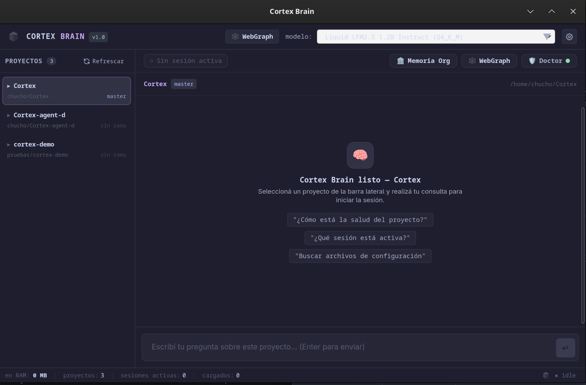

   
  

  <h1>Cortex</h1>

  
<strong>The organizational harness for corporate memory.</strong>

  

    <a href="README.md">English</a>
    ·
    <a href="README.es.md">Español</a>
    ·
    <a href="docs/GUIA-MIGRACION-RUST.md">Python / Rust coexistence guide</a>
  

---

## What it is

Cortex is the **organizational harness for corporate memory**: the nervous system of the company when the work is done by agents.

Every IDE, every model, and every session drinks from the same institutional memory. Specs, decisions, evidence, and context do not live in a chat that evaporates — they live in the repository, governed, auditable, reusable. This is not a chatbot. It is the operational-intelligence layer that turns loose agents into one organism: one truth, one close ritual, one memory.

The unit of work is a **session**: it opens from a spec, records checkpoints, and closes only when verification passes. “Done” means proven, not claimed. Everything runs **on your machine**.

## Why use it

Agents are powerful and amnesiac. Each conversation starts from zero, decisions scatter across tools, and almost nothing is left as verifiable record.

| Problem | What Cortex provides |
| --- | --- |
| Amnesia between sessions | Hybrid memory (episodic + semantic) over the project vault. |
| Undisciplined work | Sessions with checkpoints, quality gates, and evidence-based close. |
| A different context in every IDE | One vault and one MCP per project, shared by every agent. |
| Code leaving the machine | Local inference and search. The core experience needs no API keys and no telemetry. |

Cortex **only activates in projects where you installed it**. A folder without Setup does not expose tools or an MCP server.

## How it is composed

Four organs, one body:

1. **Cortex Brain** — the command bridge. Desktop app: setup, local chat, WebGraph, Doctor, organizational memory. The installer ships the native CLI (`cortex-cli`).
2. **Native CLI and MCP (Rust)** — the peripheral nervous system. Sessions, search, docs, doctor, IDE injection. The agent does not guess the project: it queries it.
3. **Vault and `.cortex/`** — the institutional archive. Governed markdown. Rust and Python read and write the same layout.
4. **Agents in the IDE** — the hands. Skills, subagents, and MCP, alive **only** in the folder where Cortex is installed.

The `cortex` command in the terminal (pip / pipx) remains Python until you migrate the IDE. They coexist.

### Tripartite memory — and a fourth, corporate one

Three memories, like a brain that refuses amnesia. A fourth, when the organization demands doctrine.

| Memory | Question it answers | Where it lives |
| --- | --- | --- |
| **Episodic** | What happened, when, in which session? | Events and local embeddings |
| **Semantic** | What is true in this system? | Vault: ADRs, specs, runbooks, glossary |
| **Procedural** | What should we do now? | Action Engine, `next`, autopilot |
| **Organizational** | What has the company already decided? | Candidates, promotion, enterprise vault |

This is not a dump into the prompt. Every turn **injects a dossier**: active session, checkpoints, hybrid hits (BM25 + ONNX vectors, fused with RRF), graph nodes, promulgated doctrine. The model does not receive the universe. It receives **the truth that matters now**.

### Local models — intelligence that does not leak

Two engines, no mandatory cloud:

- **Liquid LFM2.5** (GGUF, in-process via llama.cpp) is Brain’s voice. It occupies RAM only while you ask; it unloads when idle. You switch it live from the top bar.
- **ONNX embeddings** index the vault on disk. English on MiniLM, Spanish on e5-large: memory speaks the team’s language, not the vendor’s.

The IDE agent and Liquid drink from the **same** index. There is no one truth for chat and another for Cursor.

### WebGraph — the map Liquid can see and query

Knowledge is not a list. It is a graph: modules, specs, ADRs, files, dependency edges. WebGraph makes it **visible, orbital, queryable**.

Liquid does not hallucinate topology: it **asks**. A node pins into chat; Doctor and Org Memory hang off the same map. What memory remembers, the graph shows; what the graph shows, the model can cite.

  

---

## Install Cortex Brain

Install the app first. From there you can initialize a project, connect an IDE, and use Cortex **without cloning this repository and without `pip` or `cargo`**.

**Download** (0.2.6):

[github.com/MachuaninEzequiel/Cortex/releases/tag/brain-v0.2.6](https://github.com/MachuaninEzequiel/Cortex/releases/tag/brain-v0.2.6)

| System | File |
| --- | --- |
| Linux | `Cortex.Brain_0.2.6_amd64.deb` |
| Windows | `Cortex.Brain_0.2.6_x64-setup.exe` |
| macOS (Apple Silicon) | `Cortex.Brain_0.2.6_aarch64.dmg` |

Install the package and open **Cortex Brain**.

### How to use it

1. In the left sidebar, at the bottom: **Install Cortex**.
2. **Choose a folder** (your repo, empty or not).
3. **Preview**, then **Apply**.
   - **Init (agent)** creates `.cortex/`, config, vault, and `org.yaml`.
   - **Full** adds CI and WebGraph.
   - **IDEs** injects MCP into Cursor, Claude Code, OpenCode, VS Code, and similar tools, **only in that folder**.
4. **Open this folder in Brain** to chat against that project.

The installer ships `cortex-cli`. IDE MCP configs point at that binary.

### If the project does not show up on the left

None of these cases require re-running Init if the project **already** has Cortex.

1. **You chose the folder and did not open it.** Setup does not add it by itself. Do: Install Cortex → Choose folder → **Open this folder in Brain**. Do not run Init.
2. **The repo is not under your user profile** (`D:\…`, `C:\dev\…`). Refresh only walks the profile (`C:\Users\…`). Same sequence: Choose folder → Open this folder. Requires Brain 0.2.6 or later.
3. **There is a `.cortex/` directory but no config.** Brain requires `.cortex/config.yaml`, or `config.yaml` at the repo root, or `.cortex/workspace.yaml`. If root `config.yaml` exists, use case 1. If none of the three exist, then Init is required. If config and vault already exist, do not run Init: it overwrites them.

Refresh only lists repos **inside the user profile** that already have one of those yaml files. In practice: **Choose folder → Open this folder**, without Init.

---

## If you already use Cortex with Python

Take a backup first (`cp -r .cortex .cortex.backup` or a copy of the repo). It should not break the project — it has not in testing — but do it anyway.

Rust and Python share the same layout (`.cortex/` and `vault/`).

- The `cortex` command in the terminal **is still Python**. Do not uninstall it yet.
- In Brain, choose **the same folder**. Init is unnecessary if the project is already governed. You can use chat, Doctor, and memory, and re-inject the IDE when you want.
- Do not uninstall Python until you are comfortable. Both versions coexist.

### Switch the IDE to Rust (without touching the vault)

You do not need to replace folders. Notes in `vault/` and `.cortex/` are read by both engines.

1. Brain → Install Cortex → the project folder (**no Init**).
2. Under **IDEs**, OpenCode (or whichever you use) → Preview → Apply. That rewrites the MCP config; it does not overwrite the vault.
3. Quit and reopen the IDE on that repository.

Check: in `.mcp.json`, `command` must be `cortex-cli` or an absolute path to that executable, **not** `cortex`.

---

## Building from source

For people who develop Cortex, not people who only use it, see the [coexistence and build guide](docs/GUIA-MIGRACION-RUST.md).

## License

MIT. See `LICENSE`.
