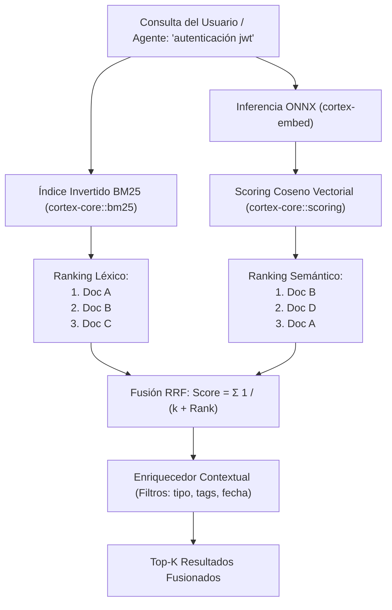

La búsqueda de información en Cortex no depende exclusivamente de embeddings semánticos ni de coincidencia de palabras clave. Ambos métodos tienen limitaciones individuales:

* **Búsqueda Vectorial (Embeddings):** Excelente para capturar conceptos generales y sinónimos (*"cómo autenticar usuarios"*), pero deficiente al buscar identificadores exactos, nombres de funciones o variables (*"`SessionService::get_active`"*).
* **Búsqueda Léxica (BM25):** Precisa para tokens exactos y nombres de símbolos, pero ciega a paráfrasis o consultas conceptuales abstractas.

Cortex resuelve esto implementando **Búsqueda Híbrida** con **Reciprocal Rank Fusion (RRF)** nativo en [`cortex-core::scoring`](file:///home/chucho/Cortex/rust/crates/cortex-core/src/scoring.rs) y [`cortex-core::bm25`](file:///home/chucho/Cortex/rust/crates/cortex-core/src/bm25.rs).

---

## Flujo de Recuperación Híbrida



---

## El Algoritmo Reciprocal Rank Fusion (RRF)

Para cada documento $d$ presente en cualquiera de los rankings parciales (léxico y semántico), su puntuación RRF final se calcula mediante la fórmula:

$$RRF(d) = \sum_{m \in M} \frac{w_m}{k + \text{rank}_m(d)}$$

Donde:
* $M$: Conjunto de métodos de recuperación ($M = \{\text{BM25}, \text{Vectorial}\}$).
* $w_m$: Peso asignado a cada método (configurable en `.cortex/config.yaml` vía `episodic_weight` y `semantic_weight`).
* $k$: Constante de suavizado (por defecto $k = 60$).
* $\text{rank}_m(d)$: Posición del documento $d$ en el ranking del método $m$ (1-indexado).

### Ventajas de RRF:
1. **Inmune a diferencias de escala:** No requiere normalizar las distancias coseno contra las puntuaciones BM25, ya que opera únicamente sobre el orden relativo de los resultados.
2. **Robustez ante falsos positivos:** Un documento que ocupa una posición moderada en ambos rankings superará a un documento que es primero en uno pero inexistente en el otro.

---

## Configuración de Pesos en `config.yaml`

Los parámetros de recuperación se pueden ajustar en `.cortex/config.yaml`:

```yaml
retrieval:
  top_k: 5              # Número de resultados a retornar (1-100)
  episodic_weight: 1.0  # Ponderación para memoria episódica
  semantic_weight: 1.0  # Ponderación para el Vault semántico
```

---

## Modos de Búsqueda en la CLI y MCP

* **Búsqueda Rápida / Léxica:** `cortex_search` o `cortex docs search` (búsqueda instantánea con filtros estructurales).
* **Búsqueda Vectorial Profunda:** `cortex_search_vector` (carga modelo ONNX para análisis conceptual).
* **Búsqueda Unificada / Contexto:** `cortex context <query>` (recuperación integral fusionada para prompt injection).
