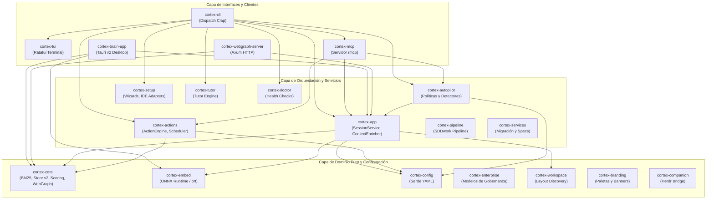

Cortex está diseñado siguiendo una arquitectura de **Rust workspace modular**, compuesta por **21 crates** con responsabilidades estrictamente delimitadas, cero dependencias circulares y total aislamiento del dominio de datos respecto a las interfaces de usuario.

---

## Mapa de Crates del Workspace Rust

---

## Descripción de los Crates Principales

### 1. Núcleo y Dominio (`cortex-core`)
Es el corazón algorítmico del sistema. **No depende de ninguna librería de binding externo** y puede compilarse y testearse 100% offline.
* **`bm25`**: Índice invertido nativo de alta velocidad para búsqueda léxica.
* **`scoring`**: Cálculo batch de similitud coseno con paralelismo Rayon.
* **`store`**: Formato binario de almacenamiento vectorial con esquema v2 y validación dimensional estricta.
* **`webgraph`**: Construcción de grafos semánticos $O(n^2)$ optimizados.

### 2. Inferencia de Embeddings (`cortex-embed`)
Envoltorio para **ONNX Runtime** (`ort`). Garantiza que la dimensión del vector sea **paramétrica** (extraída directamente del modelo cargado, sin valores mágicos *hardcodeados*) y maneja la tokenización local.

### 3. Orquestación y Sesiones (`cortex-app`)
Coordina los flujos de trabajo de los agentes:
* **`SessionService`**: Ciclo de vida de sesiones, checkpoints, handoffs y tareas granulares.
* **`ContextEnricher`**: Enriquecimiento contextual que fusiona notas del Vault con memoria episódica según filtros de edad, tags y tipo de documento.
* **`WorkItemService`**: Integración con historias de usuario y tickets.

### 4. Protocolo de Contexto para Modelos (`cortex-mcp`)
Implementa un servidor de **Model Context Protocol (MCP)** sobre `rmcp` y `tokio`. Expone las 32 herramientas canónicas que permiten a los LLMs consultar la memoria, abrir sesiones, emitir propuestas arquitectónicas y generar documentación sin fricciones.

### 5. Motor de Decisiones (`cortex-actions` y `cortex-autopilot`)
* **`cortex-actions`**: Evalúa el contexto activo frente a un catálogo de acciones posibles para emitir sugerencias probabilísticas con ratio de aceptación medible (`cortex next`).
* **`cortex-autopilot`**: Monitorea el flujo de trabajo del agente bajo tres modos: `observe`, `assist` y `autopilot`, ejecutando preflights de seguridad y validando checkpoints.

---

## Principio de Cero Dependencias Externas en Runtime

A diferencia de otras soluciones que requieren microservicios en Docker, bases de datos vectoriales pesadas en la nube o intermediarios de red, Cortex funciona como un **binario único y autocontenido**. Los índices se almacenan como archivos estructurados locales (`.cortex/memory/` y `.cortex/vault/`), garantizando latencias inferiores a 10 ms en todas las operaciones.
