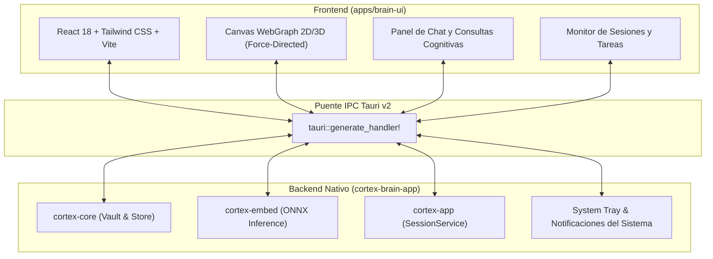

**CortexBrain** es la aplicación de escritorio visual y standalone de Cortex ([`crates/cortex-brain-app`](file:///home/chucho/Cortex/rust/crates/cortex-brain-app) y [`apps/brain-ui`](file:///home/chucho/Cortex/apps/brain-ui)).

Construida con **Tauri v2**, combina la velocidad del backend en Rust con una interfaz moderna y reactiva en **React + Tailwind CSS**.

---

## Arquitectura de CortexBrain



---

## Funcionalidades Principales

1. **Explorador Visual de Memoria:** Visualización interactiva del grafo de relaciones entre todas las notas del Vault y los eventos episódicos.
2. **Monitor de Sesiones en Vivo:** Permite pausar, reanudar, crear checkpoints y cerrar sesiones con un solo clic.
3. **Chat de Consulta Cognitiva:** Panel integrado para realizar preguntas sobre la base de código directamente a la memoria de Cortex sin necesidad de abrir un IDE.
4. **Bandeja del Sistema (System Tray):** Notificaciones discretas sobre el estado de la indexación y accesos directos rápidos.
5. **Acceso a la Documentación:** Enlace directo a la documentación oficial y visualizador integrado.

---

## Ejecución en Modo Desarrollo

Para ejecutar CortexBrain en entorno local de desarrollo:

```bash
# Desde la raíz del repositorio:
pnpm --filter brain-ui dev
cargo tauri dev --manifest-path rust/crates/cortex-brain-app/Cargo.toml
```
