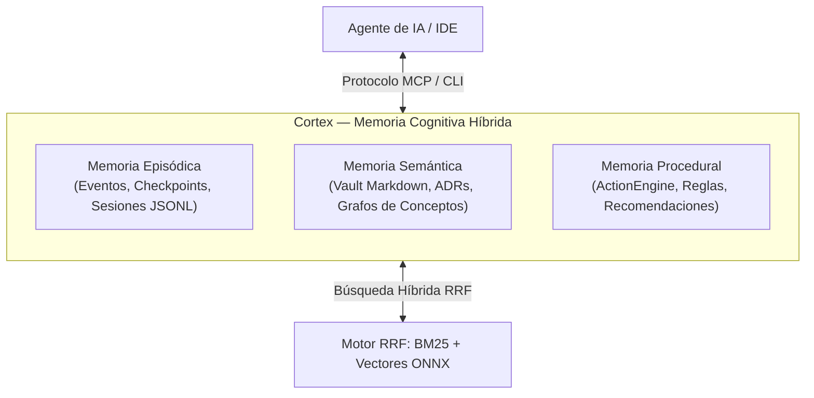

**Cortex** es un sistema de **memoria cognitiva híbrida** diseñado específicamente para agentes de Inteligencia Artificial dedicados al desarrollo de software (Claude Code, Cursor, Pi IDE, Codex, Antigravity, entre otros).

Construido en su totalidad en **Rust nativo** a través de un espacio de trabajo modular de **21 crates**, Cortex resuelve el problema de la amnesia contextual y el alto consumo de tokens de los LLMs mediante una infraestructura local de retención y recuperación de conocimiento ultra-rápida.

---

## El Problema: Amnesia Contextual y Deriva en Agentes de IA

Cuando un agente de IA interactúa en una base de código compleja, se enfrenta a tres desafíos críticos:

1. **Amnesia entre sesiones:** Cada nueva sesión de chat o prompt arranca desde cero, desconociendo decisiones arquitectónicas tomadas minutos antes.
2. **Consumo desmedido de contexto y tokens:** Intentar re-inyectar toda la documentación o el historial del repositorio en el prompt satura la ventana de contexto, incrementa los costos y genera degradación en el razonamiento del modelo (*needle in a haystack*).
3. **Falta de verificación y auditoría:** No existe trazabilidad formal de qué tareas se completaron, qué asunciones se tomaron y qué decisiones de diseño se aprobaron.

---

## La Solución de Cortex: Memoria Cognitiva Híbrida

Cortex aborda estos desafíos implementando un modelo cognitivo de tres niveles:

### 1. Memoria Episódica (¿Qué ocurrió?)
Registra la secuencia temporal de acciones, checkpoints de sesión, descubrimientos rápidos (`cortex remember`) y reclamos de verificación en archivos estructurados JSONL dentro de `.cortex/memory/`.

### 2. Memoria Semántica (¿Qué significa el código?)
Mantiene un **Vault** de notas Markdown canónicas estructuradas (`.cortex/vault/`) que encapsulan:
* Decisiones de arquitectura (ADRs).
* Especificaciones técnicas (`specs`).
* Diseños de componentes (`designs`).
* Handoffs entre agentes y humanos.
* Incidentes y postmortems.

### 3. Memoria Procedural (¿Qué debemos hacer a continuación?)
El motor **ActionEngine** evalúa el contexto actual de la sesión, los archivos modificados y las reglas organizacionales para proponer la siguiente mejor acción (`cortex next`), reduciendo la ambigüedad y guiando al agente paso a paso.

---

## Principios Fundamentales del Motor Rust

* ⚡ **100% Rust Nativo:** Cero dependencias en Python o microservicios pesados en tiempo de ejecución. Máxima velocidad de arranque y ejecución determinista.
* 🔒 **Local y Privado (Zero Cloud Leak):** Todo el almacenamiento y la inferencia de embeddings se ejecuta en su máquina mediante ONNX Runtime (`ort`). Sus datos nunca salen a la nube para ser indexados.
* 🎯 **Paridad Atómica:** Las operaciones de memoria, búsqueda y MCP están respaldadas por contratos rigurosos y tests de paridad de bytes.
* 🌐 **Protocolo MCP Estándar:** Expone un catálogo oficial de **32 herramientas MCP** para que cualquier IDE o agente compatible pueda interactuar sin fricciones.

---

## Siguientes Pasos

* Continúe a la [Guía de Inicio Rápido](/es/getting-started/quickstart/) para configurar su primer proyecto en 5 minutos.
* Revise la [Guía de Instalación y Requisitos](/es/getting-started/installation/) para compilar o instalar el binario `cortex-cli`.
