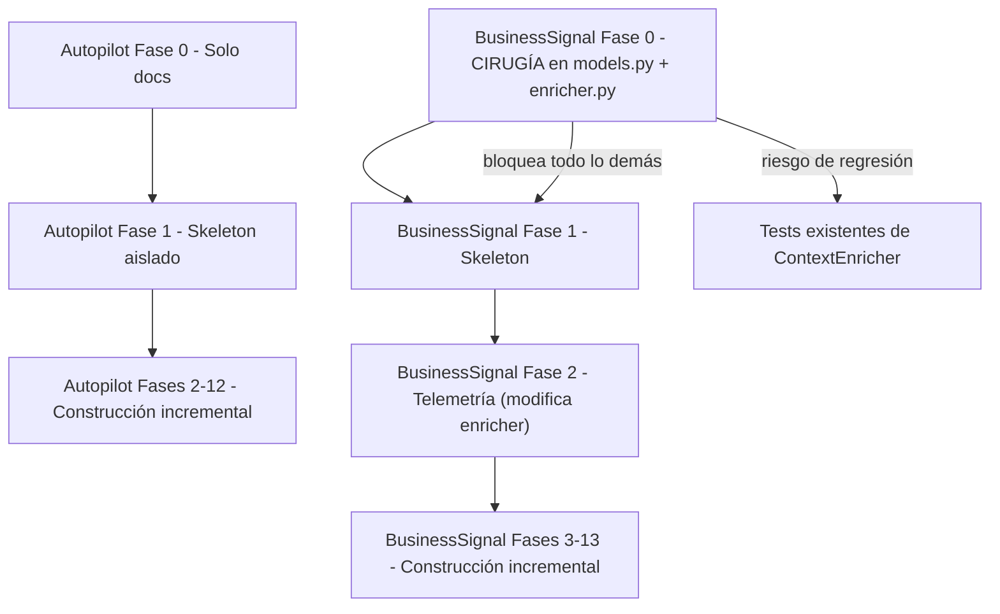

# Análisis de Complejidad e Incorporación: BusinessSignal vs Autopilot

> **Fecha:** 2026-05-10 | **Contexto:** Cortex `MachuaninEzequiel/Cortex`
> **Scope:** Comparación técnica entre ambas propuestas de módulo, evaluación de riesgo y dificultad de incorporación.

---

## 1. Punto de Partida: ¿Qué existe hoy en Cortex?

Antes de comparar, es crítico entender el **estado real** del codebase, porque eso define cuánto trabajo existe ya hecho y cuánto hay que construir desde cero.

### Autopilot — Estado Actual: **IMPLEMENTADO**

El módulo `cortex/autopilot/` ya existe con **18 archivos y 8 subdirectorios** en producción:

| Archivo/Directorio | Tamaño | Estado |
|---|---|---|
| `service.py` | 15 KB | ✅ Implementado |
| `cli.py` | 14 KB | ✅ Implementado |
| `doctor.py` | 9 KB | ✅ Implementado |
| `mcp_tools.py` | 7 KB | ✅ Implementado |
| `state_store.py` | 4 KB | ✅ Implementado |
| `session_builder.py` | 5 KB | ✅ Implementado |
| `models.py` | 3 KB | ✅ Implementado |
| `detectors/` | 4 archivos | ✅ Implementado (`base`, `default`, `ambiguous`) |
| `policies/` | dir | ✅ Implementado |
| `adapters/` | dir | ✅ Implementado |
| `renderers/` | dir | ✅ Implementado |
| `hooks/` | dir | ✅ Implementado |
| `delegation.py` | 5 KB | ✅ Implementado |
| `budget_profiles.py` | 2 KB | ✅ Implementado |

**Autopilot ya está en el código.** El plan de la carpeta `docs/autopilot/` fue la hoja de ruta que se ejecutó.

### BusinessSignal — Estado Actual: **INEXISTENTE**

No existe ningún directorio `cortex/business_signal/` en el codebase. La carpeta `docs/BusinessSignal/` es **puramente una propuesta documental** sin ninguna línea de código producida todavía.

---

## 2. Análisis Estructural de los Documentos

### 2.1 Volumen y Madurez de la Documentación

| Dimensión | Autopilot | BusinessSignal |
|---|---|---|
| Archivo principal (README) | **61.362 bytes / 2.076 líneas** | 4.479 bytes / 119 líneas |
| Archivo de plan | — (integrado en README) | 23.408 bytes / 793 líneas |
| Fases documentadas | **13 fases** (Fase 0–12) | **14 fases** (Fase 0–13) |
| Archivos de soporte | contracts.md, evals.md, marketplace.md, testing-strategy.md | architecture.md, data-model.md, detectors.md, product-surfaces.md, roadmap.md |
| Código de implementación embebido | ✅ Sí (modelos Pydantic completos, código de StateStore) | ❌ No (solo contratos conceptuales sin implementación) |
| Nota para agentes implementadores | ✅ Sí (8 reglas explícitas) | ✅ Sí (10 reglas explícitas) |
| Estado del plan | **Ejecutado parcialmente** (código existe) | **Propuesta sin iniciar** |

> [!IMPORTANT]
> La diferencia de **12x en el tamaño del README** refleja que Autopilot fue diseñado como spec de implementación con código incluido, mientras que BusinessSignal está aún en nivel conceptual/arquitectónico.

---

## 3. Análisis de Complejidad por Dimensiones

### 3.1 Complejidad de Integración con el Codebase Actual

#### Autopilot (Complejidad: **Media-Alta** — ya integrado)

Autopilot integra de forma directa con:
- `cortex/cli/main.py` — 1 línea de registro (`app.add_typer`)
- `cortex/mcp/server.py` — importa tools de Autopilot
- `cortex/context_enricher/` — uso de `AgentMemory.enrich()`
- `cortex/workspace/layout.py` — resolución de paths

El patrón de integración es **aditivo**: no modifica la lógica existente, solo agrega capas nuevas. Esto es el patrón más seguro.

#### BusinessSignal (Complejidad: **Alta** — requiere cirugía en core)

BusinessSignal tiene un **blocker crítico en Fase 0** que Autopilot no tuvo: necesita modificar modelos del core de Cortex antes de poder funcionar.

| Brecha | Archivo afectado | Riesgo |
|---|---|---|
| `EnrichedItem` no tiene `origin_scope`, `origin_project_id`, `origin_vault`, `memory_type` | `cortex/models.py` (línea 286) | 🔴 **BLOCKER** — sin esto no hay telemetría |
| `WorkContext` no tiene `project_id` formalizado | `cortex/models.py` (línea 262) | 🔴 Alto — identidad de proyecto ambigua |
| `ContextEnricher.enrich()` no emite eventos | `cortex/context_enricher/enricher.py` (21 KB) | 🟡 Medio — requiere agregar sink opcional |

**Confirmado por inspección del código real:**
- `EpisodicHit` y `SemanticDocument` **SÍ tienen** `origin_project_id` (líneas 57 y 68 de `models.py`)
- `EnrichedItem` en la línea 286 **NO tiene** esos campos — confirma el blocker documentado
- La metadata de origen **existe en los hits crudos pero se pierde al crear `EnrichedItem`**

Esto significa que BusinessSignal necesita primero **resolver un déficit técnico en el corazón del pipeline de retrieval** antes de poder construir su propia capa.

### 3.2 Complejidad Arquitectónica

#### Autopilot

```
Arquitectura: Estado + Servicio + Hooks + CLI + MCP
Capas: 5
Punto de entrada crítico: AutopilotService (hub central)
Acoplamiento IDE: ALTO (4 adapters: Claude Code, Cursor, OpenCode, Codex)
Acoplamiento a Cortex core: MEDIO (usa AgentMemory como fachada)
```

La mayor complejidad de Autopilot está en la **diversidad de entornos de ejecución** (múltiples IDEs, hooks, wrappers Windows/Linux) y en el **ciclo de vida de sesión** (estados: started → preflight_done → implementation_seen → documented → finished → failed).

#### BusinessSignal

```
Arquitectura: Telemetría → Agregación → Detección → Scoring → Superficies
Capas: 5 (diferente tipo de capas)
Punto de entrada crítico: ContextEnricher (sistema existente que debe modificarse)
Acoplamiento IDE: BAJO (solo CLI y MCP, sin hooks)
Acoplamiento a Cortex core: ALTO (modifica models.py y context_enricher)
```

La mayor complejidad de BusinessSignal está en la **calidad de los datos** (sin `origin_project_id` en `EnrichedItem` no hay nada que analizar) y en el **sistema de scoring multi-dimensional** con pesos configurables.

### 3.3 Complejidad del Modelo de Datos

| Aspecto | Autopilot | BusinessSignal |
|---|---|---|
| Modelos Pydantic nuevos | ~8 modelos (AutopilotSessionState, AutopilotEvent, etc.) | ~7 modelos core + 4 modelos de agregación |
| Persistencia nueva | 2 stores (JSON sessions + JSONL events) | 4 stores (events, aggregates, signals, feedback) |
| Lifecycle de entidades | Estado de sesión (6 transiciones) | Lifecycle de señales (5 transiciones) |
| Política de retención | Rotación de JSONL + cleanup command | Retención configurable por días + FIFO/time_window |
| Datos sensibles | Bajo (solo eventos de sesión) | **Medio-Alto** (metadata de proyectos, clientes, dominios) |

### 3.4 Complejidad Algorítmica

#### Autopilot — Algoritmos:
- **DetectorRegistry:** Reglas de prioridad y fallback sobre ~7 detectores
- **PolicyRegistry:** Evaluación en cada transición de estado
- **SessionBuilder + Self-review:** Render de session note desde eventos + validación
- **Two-stage delegation review:** Spec compliance + quality review
- Complejidad: **O(detectores × transiciones)** — predecible y acotada

#### BusinessSignal — Algoritmos:
- **AggregationService:** Agregación incremental de eventos por múltiples dimensiones (proyecto, HU, sprint, dominio, cliente)
- **Scoring multi-dimensional:** `signal_score = concentration×0.35 + continuity×0.20 + evidence_quality×0.20 + sequence×0.15 + domain×0.10`
- **SequenceSimilarityDetector:** Jaccard distance + Longest Common Subsequence
- **ProjectConcentrationDetector:** Análisis de distribución histórica ponderada
- **RiskEchoDetector:** Correlación con tipos de documentos de riesgo
- **SignalLifecycle:** Estado de señales + auto-expiración + re-detección
- Complejidad: **O(eventos × detectores × ventanas temporales)** — puede escalar negativamente sin límites adecuados

> [!WARNING]
> BusinessSignal tiene una complejidad algorítmica significativamente mayor que Autopilot. El detector `SequenceSimilarityDetector` usando LCS tiene complejidad O(n×m) sobre secuencias de proyectos. Sin acotamiento de ventanas temporales, esto puede degradar performance en proyectos con muchos eventos.

---

## 4. Análisis de Riesgo de Incorporación

### 4.1 Matriz de Riesgos

| Riesgo | Autopilot | BusinessSignal |
|---|---|---|
| **Romper CLI existente** | 🟡 Medio (ya mitigado — subcomando aislado) | 🟡 Medio (mismo patrón) |
| **Romper ContextEnricher** | 🟢 Bajo (no lo toca) | 🔴 **ALTO** — modifica `enricher.py` + `models.py` |
| **Romper tests existentes de `models.py`** | 🟢 Bajo | 🔴 **ALTO** — cualquier cambio a `EnrichedItem` rompe tests |
| **Degradar performance del pipeline de retrieval** | 🟢 Bajo | 🔴 **ALTO** — el sink de telemetría corre en el hot path del enriquecimiento |
| **Conflicto con otros módulos** | 🟡 Conflicto con Superpowers (detectado y documentado) | 🟡 Conflicto con `feedback_loop.py` existente (ya documenta el riesgo) |
| **Cold start sin datos** | 🟢 N/A | 🔴 **ALTO** — necesita N enriquecimientos mínimos antes de poder emitir señales |
| **Falsos positivos** | 🟡 Medio (detectores por heurística) | 🔴 **ALTO** — señales de negocio incorrectas tienen impacto político real |
| **Privacidad cross-project** | 🟢 Bajo | 🔴 **ALTO** — metadata de clientes/proyectos en enterprise |
| **Complejidad de QA** | 🟡 Medio (requiere múltiples IDEs) | 🟡 Medio (requiere datos históricos sintéticos) |

### 4.2 Riesgo Específico de la Fase 0 de BusinessSignal

La Fase 0 de BusinessSignal es la más riesgosa de todo el roadmap de ambos módulos:

```
Modificar: cortex/models.py → class EnrichedItem (línea 286)
Modificar: cortex/context_enricher/enricher.py (21.502 bytes)
Modificar: config.yaml schema → agregar project.id y project.client_id
```

Esto significa que **el primer paso de BusinessSignal toca los mismos archivos que son la columna vertebral de Cortex**. Si algo sale mal aquí, se rompen:
- El pipeline de enriquecimiento de contexto
- Los tests del ContextEnricher
- Los tests de los modelos compartidos
- Potencialmente, el Autopilot si depende de `EnrichedItem`

**Autopilot en su Fase 0 solo creó documentos.** No tocó ningún archivo de producción.

### 4.3 Secuenciación de Dependencias



BusinessSignal tiene **una dependencia crítica en cadena** que no puede saltarse. Sin la Fase 0 no hay telemetría, sin telemetría no hay agregación, sin agregación no hay detectores, sin detectores no hay señales.

---

## 5. Comparación Directa: Dimensiones Clave

### 5.1 Tabla de Complejidad Global

| Dimensión | Autopilot | BusinessSignal | Delta |
|---|---|---|---|
| **Archivos a crear (MVP)** | ~25 archivos | ~20 archivos | Similar |
| **Archivos del core a modificar** | 2 (cli/main.py, mcp/server.py) | **4-5** (models.py, enricher.py, config.yaml, mcp/server.py, cli/main.py) | BS es más riesgoso |
| **Dependencias previas necesarias** | Ninguna (Cortex ya es suficiente) | **Autopilot debe existir** para Fase 8 | BS depende de Autopilot |
| **Tiempo hasta primer valor visible** | Fase 3 (CLI headless funcionando) | **Fase 4-5** (después de resolver blocker + telemetría + agregación) | Autopilot más rápido |
| **Complejidad algorítmica** | Baja-Media | **Alta** (LCS, scoring multi-dim) | BS más complejo |
| **Testing con datos reales** | Medio (mock de IDE) | **Alto** (requiere histórico de enrichments) | BS más difícil de testear |
| **Riesgo de regresión** | Bajo | **Alto** | BS más riesgoso |
| **Valor en modo shadow/observe** | Alto (observe mode desde Fase 0) | **Bajo** (necesita datos acumulados) | Autopilot más seguro de adoptar |
| **Impacto en performance** | Nulo (no toca hot path) | **Medio** (sink en hot path de enrichment) | BS tiene overhead |
| **Expertise de dominio requerido** | Ciclos de vida de sesión, hooks IDE | **Analytics, estadística, scoring, privacidad** | BS necesita más expertise |

### 5.2 Puntaje de Complejidad (1=bajo, 5=alto)

| Área | Autopilot | BusinessSignal |
|---|---|---|
| Integración con core | ⚡⚡ (2) | ⚡⚡⚡⚡ (4) |
| Riesgo de regresión | ⚡⚡ (2) | ⚡⚡⚡⚡ (4) |
| Complejidad algorítmica | ⚡⚡ (2) | ⚡⚡⚡⚡ (4) |
| Testing con datos reales | ⚡⚡⚡ (3) | ⚡⚡⚡⚡ (4) |
| Velocidad para dar valor | ⚡⚡ (2) | ⚡⚡⚡⚡ (4) |
| Complejidad de producto | ⚡⚡⚡ (3) | ⚡⚡⚡⚡⚡ (5) |
| **TOTAL** | **14/30** | **25/30** |

> **BusinessSignal es ~1.8x más complejo que Autopilot en términos de riesgo de incorporación.**

---

## 6. Análisis de la Planificación

### 6.1 Fortalezas del Plan de Autopilot

1. **Contratos primero:** Fase 0 es solo documentos. Sin tocar código.
2. **Código implementación incluido en el plan:** Los modelos Pydantic exactos están en el README — un agente puede implementar sin ambigüedad.
3. **Milestones claros:** MVP, MCP, Harness Piloto, Budget, Marketplace.
4. **Gestión de modo:** observe → assist → autopilot reduce riesgo de adopción.
5. **Casos edge documentados:** Conflicto con Superpowers, rotación JSONL, Windows wrappers.
6. **Gate de salida por fase:** Cada fase tiene criterio de salida con comando de test.

### 6.2 Fortalezas del Plan de BusinessSignal

1. **No objetivos claros:** Documenta explícitamente qué NO debe hacer (10 items).
2. **Blocker reconocido:** La Fase 0 identifica el problema de `EnrichedItem` antes de empezar.
3. **Privacidad first:** Documenta que content no debe guardarse en eventos.
4. **Pesos configurables desde el día 1:** El scoring es parametrizable desde la Fase 0.
5. **Shadow mode:** Opción de modo invisible antes de exponer señales.
6. **Feedback loop temprano:** Está en Fase 7, antes de Autopilot (Fase 8).

### 6.3 Brechas del Plan de BusinessSignal vs Autopilot

| Brecha | Autopilot | BusinessSignal |
|---|---|---|
| Código de implementación en el plan | ✅ Completo (models.py + state_store.py listos para copiar) | ❌ Solo contratos conceptuales |
| Estrategia de testing con datos sintéticos | ✅ Definida (mock de AgentMemory) | ⚠️ Mencionada pero no especificada |
| Compatibilidad con nuevo layout vs legacy | ✅ Explícita (WorkspaceLayout) | ✅ Mencionada |
| Definición de Done Global | ✅ Checklist de 11 items | ❌ No existe |
| Primer paso de implementación concreto | ✅ EPIC-AUTOPILOT-01 con 7 tareas detalladas | ❌ Solo fases, sin epics |
| Estrategia de rollback | ✅ Implicit (disable, uninstall) | ❌ No documentada |

---

## 7. Recomendaciones Estratégicas

### 7.1 Secuencia Recomendada

```
[AHORA]          Autopilot — completar fases faltantes (packaging, marketplace)
                 ↓
[PASO 1]         BusinessSignal Fase 0 — Resolver blocker de EnrichedItem
                 con tests de regresión completos ANTES de avanzar
                 ↓
[PASO 2]         BusinessSignal Fases 1-2 — Skeleton + Telemetría
                 en modo shadow (disabled por defecto)
                 ↓
[PASO 3]         BusinessSignal Fases 3-5 — Detector MVP + CLI
                 solo cuando haya datos reales de enrichment
                 ↓
[FUTURO]         BusinessSignal Fases 6-13 — MCP, Autopilot, Enterprise
```

### 7.2 Antes de Iniciar BusinessSignal

1. **Auditar el impacto de modificar `EnrichedItem`:** Buscar todos los lugares donde se construye este objeto para entender el scope real del cambio.
2. **Crear tests de regresión para el pipeline completo** antes de tocar `models.py`.
3. **Decidir la estrategia de `project_id`:** ¿Se infiere del path? ¿Es configuración explícita? ¿Qué pasa con proyectos multi-repo? Esto no está resuelto y es fundamental.
4. **Evaluar el impacto de performance del sink de telemetría** con un benchmark del `ContextEnricher.enrich()` actual.
5. **Definir la política de privacidad cross-project** antes de generar cualquier señal en enterprise.

### 7.3 Lo que BusinessSignal Necesita del Plan que No Tiene

- Un **EPIC-BUSINESSSIGNAL-00** tan detallado como el EPIC-AUTOPILOT-01 con tareas atómicas.
- Una **Definición de Done Global** con checklist.
- Una **estrategia de testing con datos sintéticos** para los detectores.
- Un **modelo de evaluación de señales** (¿cómo sé si el detector `ProjectConcentration` está funcionando bien?).
- Una **decisión arquitectónica formal** sobre qué hacer con `EnrichedItem` (extender vs crear `EnrichedEvidenceRef` paralelo).

---

## 8. Conclusión

| | Autopilot | BusinessSignal |
|---|---|---|
| **Estado** | Implementado (código existe) | Propuesta documental |
| **Complejidad de incorporación** | **Media** (ya hecho, incrementar) | **Alta** (blocker + cirugía en core) |
| **Riesgo de regresión** | **Bajo** (aislado del core) | **Alto** (toca `models.py` + `enricher.py`) |
| **Tiempo hasta primer valor** | **Inmediato** (ya funciona) | **Medio-Largo** (resolver blocker primero) |
| **Complejidad algorítmica** | **Baja-Media** | **Alta** (LCS, scoring multi-dim, señales) |
| **Planificación** | **Muy madura** (spec ejecutable) | **Conceptualmente sólida, necesita detallar implementación** |
| **Dimensión del reto** | Operacional (integración IDE, hooks) | Analítico (datos, scoring, privacidad) |

**BusinessSignal es el módulo más ambicioso de los dos**, porque no solo agrega funcionalidad: convierte la memoria de Cortex en inteligencia de negocio. Pero esa ambición tiene un costo: requiere modificar el corazón del sistema, necesita datos históricos acumulados para funcionar, y tiene riesgo de falsos positivos con impacto político real.

**Autopilot fue el camino correcto para empezar**: aditivo, aislado, con valor inmediato y reversible. BusinessSignal es el siguiente paso lógico, pero necesita construirse sobre un Cortex con Autopilot maduro y sobre un pipeline de telemetría sólido y bien testeado.
