# Red Neuronal Conceptual de Cortex: Módulos, Flujos y Conexiones

Este diagrama representa la red conceptual y de dependencias funcionales de Cortex. Ilustra cómo interactúan molecularmente los componentes desde el momento en que el desarrollador interactúa con su entorno hasta la persistencia física en disco, el enrutamiento de subagentes y la activación de las **32 tools MCP nativas**.

---

## 1. Topología de la Red Conceptual

```mermaid
flowchart TD
    %% Subgrafo: Entrada del Desarrollador y Host
    subgraph DEV_LAYER["1. Capa de Interacción y Entorno Host"]
        HUMAN["Desarrollador (Humano)"]
        CLI_INPUT["Comando CLI / Prompt"]
        
        subgraph HOSTS["Host Environments Detectados"]
            HOST_AGY["Google Antigravity (agy / Gemini CLI)"]
            HOST_PI["Pi Agent (pi.dev)"]
            HOST_CLAUDE["Claude Code (Anthropic)"]
            HOST_CURSOR["Cursor IDE / Codex / OpenCode"]
            HOST_DESK["Cortex Brain Desktop App"]
        end
    end

    %% Subgrafo: Bootstrap y Detección
    subgraph BOOTSTRAP_LAYER["2. Capa de Bootstrap e Inyección (cortex-setup)"]
        LAYOUT["WorkspaceLayout (.cortex/)"]
        DETECTOR["HostDetector (detect_host)"]
        POLICY_SHIELD["Escudo de Políticas & ToS (is_provider_allowed)"]
        DISCOVERY["CLI Model Discovery (discover_models_for_host)"]
        ADAPTERS["IDE Adapters (Inyección de Skills & Hooks)"]
    end

    %% Subgrafo: Portero y Micro-Decisiones Cognitivas
    subgraph SYSTEM_ONE_LAYER["3. Motor de Micro-Decisiones SystemOne (cortex-judgement)"]
        UTTERANCE_GATE["Utterance Gate (Clasificador de Acto en <10ms)"]
        ROUTER_EVAL["Model Routing Evaluator"]
        MENU_REBUILDER["Rebuild Specialist Menu"]
        SCORE_EVAL["Primitiva Score (Impacto ADR 0.0..2.0)"]
        SQUEEZE_EVAL["Search Squeeze (Noul Filter)"]
        PACK_EVAL["Context Pack (Canonical vs Pointers)"]
        COMPACT_EVAL["Session Compact (Poda de Tools Antiguas)"]
        WORTH_REM_EVAL["Filtro worth_remembering"]
    end

    %% Subgrafo: Servidor MCP Nativo (32 Tools)
    subgraph MCP_SERVER_LAYER["4. Servidor MCP Nativo (cortex-mcp v2.2 rmcp)"]
        MCP_DISPATCHER["Dispatcher Stdio Central"]

        subgraph TOOLS_SYSTEM["Ping & Sistema"]
            T_PING["cortex_ping"]
        end

        subgraph TOOLS_RETRIEVAL["Recuperación & Búsqueda"]
            T_SEARCH["cortex_search"]
            T_SEARCH_VEC["cortex_search_vector"]
            T_CONTEXT["cortex_context"]
            T_SYNC_TICKET["cortex_sync_ticket"]
            T_SYNC_VAULT["cortex_sync_vault"]
        end

        subgraph TOOLS_SPEC["Especificación & Propuestas"]
            T_CREATE_SPEC["cortex_create_spec"]
            T_EMIT_PROP["cortex_emit_proposal"]
            T_VALIDATE_HANDOFF["cortex_validate_handoff"]
            T_IMPORT_HU["cortex_import_hu"]
            T_GET_HU["cortex_get_hu"]
        end

        subgraph TOOLS_SESSION["Ciclo de Sesión & Tareas"]
            T_SESS_OPEN["cortex_session_open"]
            T_SESS_CHECKPOINT["cortex_session_checkpoint"]
            T_SESS_CLOSE["cortex_session_close"]
            T_SESS_STATUS["cortex_session_status"]
            T_SESS_LIST["cortex_session_list"]
            T_SESS_SAVE["cortex_save_session"]
            T_CLOSE_SESS["cortex_close_session"]
            T_TASK_LIST["cortex_session_task_list"]
            T_TASK_UPDATE["cortex_session_task_update"]
        end

        subgraph TOOLS_AUDIT["Verificación & Auditoría"]
            T_VERIFY_CLAIMS["cortex_verify_session_claims"]
            T_REVIEW_CHECKPOINT["cortex_review_checkpoint"]
        end

        subgraph TOOLS_FINISH["Documenter & Cierre"]
            T_FINISH_SESS["cortex_finish_session"]
            T_DOC_BRIEFING["cortex_documenter_briefing"]
            T_SELF_REVIEW["cortex_self_review_note"]
            T_WRITE_DOC["cortex_write_doc"]
            T_WRITE_DESIGN["write_design_note_canonical"]
        end

        subgraph TOOLS_AUTOPILOT["Autopilot Autónomo"]
            T_AP_START["cortex_autopilot_start"]
            T_AP_PREFLIGHT["cortex_autopilot_preflight"]
            T_AP_CHECKPOINT["cortex_autopilot_checkpoint"]
            T_AP_FINISH["cortex_autopilot_finish"]
            T_AP_STATUS["cortex_autopilot_status"]
        end
    end

    %% Subgrafo: Subagentes Especialistas y Model Router
    subgraph SPECIALISTS_LAYER["5. Subagentes y Model Router (cortex-judgement / cortex-setup)"]
        ROLE_ARCHITECT["Architect / Designer (cortex-code-designer)"]
        ROLE_IMPLEMENTER["Implementer (cortex-code-implementer / cortex-SDDwork)"]
        ROLE_DOCUMENTER["Documenter (cortex-documenter)"]
        ROLE_AUDITOR["Auditor / Reviewer (review_checkpoint)"]
    end

    %% Subgrafo: Modelos de Inteligencia Artificial
    subgraph LLM_LAYER["6. Modelos de Lenguaje"]
        subgraph CLOUD_LLM["Modelos Cloud por Suscripción"]
            LLM_PRO["Modelos de Razonamiento Profundo (Gemini 2.5 Pro / Claude 3.5 Sonnet)"]
            LLM_FAST["Modelos Ágiles de Código / Prosa (Gemini 2.5 Flash / Claude 3.5 Haiku)"]
        end
        subgraph LOCAL_LLM["Modelos Locales Soberanos (cortex-brain)"]
            LLM_GGUF["Modelos GGUF Locales (llama.cpp en ~/.cache/cortex/models)"]
            ROUTER_DET["Router Determinista (Protocolo TOOL)"]
        end
    end

    %% Subgrafo: Aplicación y Servicios Centrales
    subgraph CORE_SERVICES_LAYER["7. Núcleo de Aplicación y Servicios (cortex-app / cortex-services)"]
        SESSION_SRV["SessionService (Gestor de Sesión Viva)"]
        DOC_SRV["DocumenterEngine (Reconstructor + ContradictionDetector)"]
        ENRICHER_SRV["ContextEnricher (Topic, Multi-match, Graph expansion)"]
        AP_SRV["AutopilotService (State Machine & Detectores)"]
        ACTION_ENGINE["ActionEngine (cortex next / Scheduler top-5)"]
    end

    %% Subgrafo: Motor de Memoria Híbrida y Embeddings
    subgraph MEMORY_ENGINE_LAYER["8. Motor de Memoria Híbrida (cortex-core / cortex-embed)"]
        HYBRID_FUSION["Hybrid Fusion RRF (k=60)"]
        TIERED_MEMORY["Tiered Memory Policy (Primaria: 1.0 vs Archivo: 0.2)"]
        BM25_ENGINE["Motor BM25 Léxico (cortex-core)"]
        EMBED_ENGINE["Motor de Embeddings ONNX (cortex-embed Mean-Pool L2)"]
    end

    %% Subgrafo: Almacenamiento Persistente en Disco
    subgraph STORAGE_LAYER["9. Persistencia en Disco (.cortex/ Layout Canónico)"]
        CONFIG_YAML["config.yaml (Ajustes de Cortex y SystemOne)"]
        ORG_YAML["org.yaml (Reglas de Promoción Enterprise)"]
        VAULT_DIR[".cortex/vault/ (Notas Markdown Obsidian: specs, adrs, hu, sessions)"]
        EPISODIC_DIR[".cortex/memory/ (JSONL de recuerdos episódicos)"]
        VECTORS_BIN[".cortex/vectors.v3.bin (Almacén Vectorial CCTXV3)"]
        SESSIONS_DIR[".cortex/sessions/ (Archivos YAML de Sesiones)"]
    end

    %% Subgrafo: Memoria Organizacional Enterprise
    subgraph ENTERPRISE_LAYER["10. Capa Enterprise y Gobernanza (cortex-enterprise)"]
        PROMOTION_ENGINE["PromotionRulesEngine (Evaluación de Candidatos)"]
        ENTERPRISE_VAULT["Vault Central de Organización Compartido"]
    end

    %% Conexiones Principales
    HUMAN --> CLI_INPUT
    CLI_INPUT --> HOSTS
    HOSTS --> DETECTOR
    DETECTOR --> POLICY_SHIELD
    POLICY_SHIELD --> DISCOVERY
    DISCOVERY --> ADAPTERS
    ADAPTERS --> LAYOUT
    ADAPTERS --> MCP_DISPATCHER

    CLI_INPUT --> UTTERANCE_GATE
    UTTERANCE_GATE -- "implement" --> T_SESS_OPEN
    UTTERANCE_GATE -- "question" --> T_CONTEXT
    UTTERANCE_GATE -- "done" --> T_FINISH_SESS

    MCP_DISPATCHER --> TOOLS_SYSTEM
    MCP_DISPATCHER --> TOOLS_RETRIEVAL
    MCP_DISPATCHER --> TOOLS_SPEC
    MCP_DISPATCHER --> TOOLS_SESSION
    MCP_DISPATCHER --> TOOLS_AUDIT
    MCP_DISPATCHER --> TOOLS_FINISH
    MCP_DISPATCHER --> TOOLS_AUTOPILOT

    T_SESS_STATUS --> MENU_REBUILDER
    MENU_REBUILDER --> SPECIALISTS_LAYER

    SPECIALISTS_LAYER --> ROUTER_EVAL
    ROUTER_EVAL --> CLOUD_LLM
    HOSTS --> LOCAL_LLM

    TOOLS_SESSION --> SESSION_SRV
    TOOLS_FINISH --> DOC_SRV
    TOOLS_RETRIEVAL --> ENRICHER_SRV
    TOOLS_AUTOPILOT --> AP_SRV

    ENRICHER_SRV --> HYBRID_FUSION
    HYBRID_FUSION --> TIERED_MEMORY
    TIERED_MEMORY --> BM25_ENGINE
    TIERED_MEMORY --> EMBED_ENGINE

    BM25_ENGINE --> VAULT_DIR
    EMBED_ENGINE --> VECTORS_BIN
    SESSION_SRV --> SESSIONS_DIR
    DOC_SRV --> VAULT_DIR
    DOC_SRV --> WORTH_REM_EVAL
    WORTH_REM_EVAL --> EPISODIC_DIR

    VAULT_DIR --> PROMOTION_ENGINE
    PROMOTION_ENGINE --> ENTERPRISE_VAULT
```

---

## 2. Descripción de Nodos y Redes Moleculares

### Red 1: Entrada y Validación de Host (Nodos 1 al 2)
- El desarrollador ingresa una instrucción en su CLI o IDE.
- `HostDetector` inspecciona las variables de proceso y los archivos del workspace, estableciendo la identidad del host.
- `PolicyShield` aplica las reglas de aislamiento para asegurar que ninguna credencial o token se utilice fuera de su runtime legítimo.
- `CLI Discovery` lee pasivamente los modelos disponibles en disco para evitar esperas y armar el menú canónico `provider:model_id`.

### Red 2: Portero Cognitivo y Despacho Rápido (Nodo 3)
- `UtteranceGate` recibe el texto bruto. En menos de 10ms y sin cargar modelos de lenguaje pesados, determina si la intención es consulta pura (`question`), trabajo de código (`implement`) o finalización (`done`).
- Desacopla la sesión del chatter casual, evitando crear registros vacíos.

### Red 3: Despliegue de Herramientas MCP (Nodo 4)
- El servidor `cortex-mcp` provee el canal de ejecución para el agente.
- Las **32 tools** cubren la totalidad del ciclo:
  - *Retrieval*: búsqueda vectorial, híbrida y enriquecida con expansión de grafos.
  - *Session*: máquina de estados con checkpoints atómicos de avance.
  - *Audit*: verificación de claims e invariantes con testing real.
  - *Finish*: reconstrucción de diffs y generación de notas.
  - *Autopilot*: autonomía supervisada con perfiles de presupuesto.

### Red 4: Ruteo de Especialistas y Selección de Modelos (Nodos 5 y 6)
- `Rebuild Specialist Menu` inspecciona la sesión en tiempo real:
  - Sin checkpoints: recomienda `cortex-code-designer`.
  - Con tareas en curso: recomienda `cortex-code-implementer`.
  - Con claims no verificados: recomienda `review_checkpoint` (Auditor).
  - Tareas listas: recomienda `cortex-documenter`.
- El `ModelRouter` vincula al subagente seleccionado con el modelo óptimo (Cloud o Local GGUF).

### Red 5: Memoria Híbrida, RRF y Tiered Memory (Nodos 7 y 8)
- Las consultas confluyen en el motor de fusión RRF ($k=60$).
- La política de **Tiered Memory** protege al agente de la saturación cognitiva atenuando los documentos marcados como `archive` al 20% de su peso normal, manteniendo el contexto limpio sin perder información histórica.

### Red 6: Persistencia, Documentación y Promoción (Nodos 9 y 10)
- Al concluir el trabajo, el `Documenter` vuelca las decisiones tomadas en el Vault semántico (`.cortex/vault/`).
- `worth_remembering` valida qué recuerdos merecen pasar a la memoria episódica a largo plazo (`.cortex/memory/`).
- Finalmente, el motor Enterprise evalúa si las soluciones locales califican para incorporarse a la base de conocimiento de la organización (`org.yaml`).
