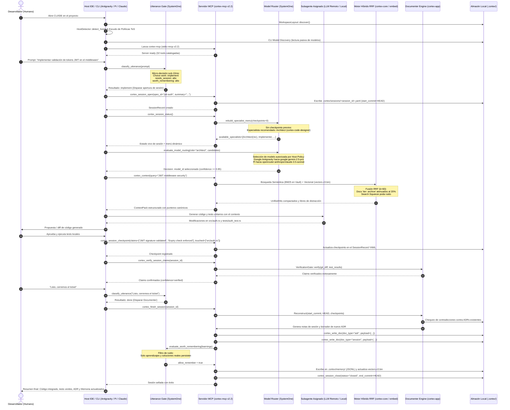
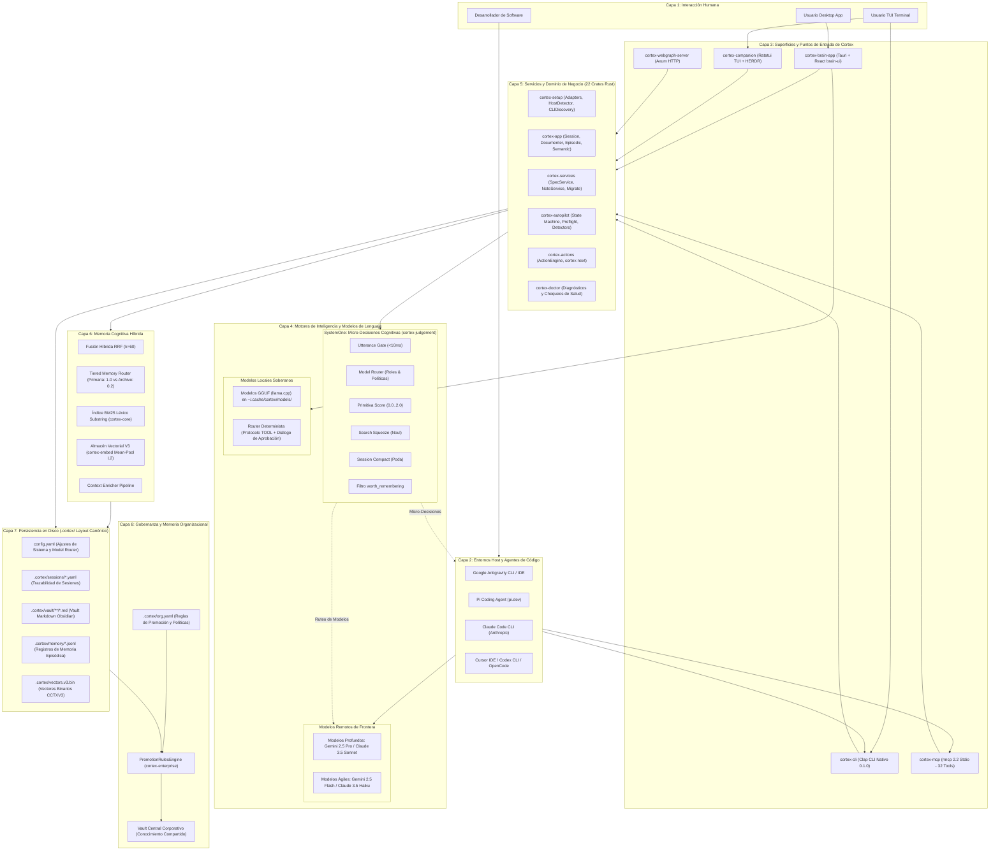

# Diagramas de Arquitectura y Secuencia de Cortex

Este documento presenta dos gráficos formales de ingeniería:
1. **Diagrama de Secuencia Temporal End-to-End**: La cronología exacta de llamadas y respuestas en una sesión de desarrollo completa.
2. **Diagrama de Bloques de Arquitectura Global de Sistemas**: La estructura por capas del sistema Cortex, interconectando usuarios, CLIs de agentes, modelos locales y remotos, micro-decisiones de SystemOne y el almacenamiento persistente.

---

## 1. Diagrama de Secuencia Temporal End-to-End



---

## 2. Diagrama de Bloques de Arquitectura Global de Sistemas



---

## 3. Diagrama de Arquitectura UML Formal (Componentes, Bases de Datos y Estereotipos)

Este diagrama sigue el estándar formal de **Diagrama de Componentes y Despliegue UML 2.5**, utilizando la simbología canónica:
- **Actor UML**: `Dev` (Desarrollador Humano).
- **Cilindros de Base de Datos UML** (`[(BDD)]`): Representando las distintas estructuras de almacenamiento persistente (`.cortex/sessions`, `.cortex/vault`, `.cortex/vectors.v3.bin`, `.cortex/memory`, `org.yaml`).
- **Componentes con Estereotipos**: `<<host>>`, `<<mcp-server>>`, `<<system-one>>`, `<<llm>>`, `<<subagent>>`, `<<memory-engine>>`.
- **Interfaces y Puertos**: Puertos de entrada/salida (`rmcp 2.2 stdio`, `RRF k=60`, `BM25`, `JSON-RPC 2.0`).

```mermaid
flowchart TB
    %% Actor Humano
    DEV([👤 Actor: Desarrollador])

    %% Host IDE y Aislamiento de Entorno
    subgraph COMP_HOST ["<<host-environment>> Entornos de Desarrollo"]
        direction TB
        HOST_IDE["<<component>><br/><b>Host Agent IDE</b><br/>(Antigravity / Pi / Claude Code / Cursor)"]
        SHIELD["<<guard>><br/><b>HostPolicyShield</b><br/>(Aislamiento ToS Google vs OpenRouter)"]
        HOST_IDE --- SHIELD
    end

    %% Servidor Cortex MCP
    subgraph COMP_MCP ["<<mcp-server>> cortex-mcp v2.2"]
        direction TB
        MCP_CORE["<<component>><br/><b>Servidor rmcp (stdio)</b><br/>JSON-RPC 2.0 Protocol"]
        
        subgraph MCP_INTERFACES ["<<interfaces>> Catálogo de 32 Tools"]
            direction LR
            PORT_SYS["○ Sys / Ping (1)"]
            PORT_SEARCH["○ Search / Context (5)"]
            PORT_SESS["○ Sessions / Tasks (9)"]
            PORT_SPEC["○ Specs / HU (5)"]
            PORT_AUDIT["○ Audit / Claims (2)"]
            PORT_DOC["○ Documenter (5)"]
            PORT_AUTO["○ Autopilot (5)"]
        end
        MCP_CORE --> MCP_INTERFACES
    end

    %% Motor Cognitivo Rápido: SystemOne
    subgraph COMP_S1 ["<<system-one>> Motor Cognitivo Reflejo (cortex-judgement)"]
        direction TB
        S1_GATE["<<classifier>> Utterance Gate<br/>(<10ms, work_choice, needs_session)"]
        S1_ROUTER["<<router>> Model Router<br/>(Confidence >= 0.85, Roles: Arch/Impl/Doc)"]
        S1_SQUEEZE["<<filter>> Search Squeeze<br/>(Poda de Noul / Distractores)"]
        S1_COMPACT["<<reducer>> Session Compact<br/>(Compresión de Historial con JEV)"]
        S1_WORTH["<<gatekeeper>> worth_remembering<br/>(Guarda de Aprendizajes Clave)"]
    end

    %% Capa de Inteligencia Deliberativa: LLMs y Subagentes
    subgraph COMP_AI ["<<deliberative-intelligence>> Razonamiento y Modelos"]
        direction TB
        subgraph CLOUD_LLM ["<<llm-remote>> Modelos Remotos"]
            LLM_DEEP["Deep Reasoning:<br/>Gemini 2.5 Pro / Claude 3.5 Sonnet"]
            LLM_FAST["Fast Reflexive:<br/>Gemini 2.5 Flash / Haiku"]
        end

        subgraph LOCAL_LLM ["<<llm-sovereign>> Modelos Locales"]
            LLM_GGUF["Local GGUF llama.cpp<br/>(~/.cache/cortex/models/)"]
        end

        subgraph SUBAGENTS ["<<subagents>> Personas Especializadas"]
            SA_ARCH["cortex-code-designer<br/>(Arquitectura & SDD)"]
            SA_IMPL["implement-craft<br/>(Implementación & Tests)"]
            SA_DOC["cortex-documenter<br/>(ADRs & Cierre)"]
        end
    end

    %% Capa de Memoria Híbrida
    subgraph COMP_MEM ["<<memory-engine>> Motor de Recuperación Híbrida (cortex-core)"]
        direction TB
        RRF_FUSION["<<algorithm>> Fusión RRF (k=60)"]
        BM25_ENGINE["<<search-engine>> BM25 Lexical (Token Match)"]
        VEC_ENGINE["<<vector-engine>> Embeddings Cosine k-NN"]
        TIER_ROUTER["<<filter>> Tiered Router (Active: 1.0 vs Archive: 0.2)"]
        
        RRF_FUSION --> BM25_ENGINE
        RRF_FUSION --> VEC_ENGINE
        RRF_FUSION --> TIER_ROUTER
    end

    %% Bases de Datos y Almacenamiento Persistente (Cilindros UML)
    subgraph COMP_STORAGE ["<<persistence-layer>> Bases de Datos Físicas (.cortex/)"]
        direction TB
        DB_SESSIONS[("🛢️ BDD Episódica<br/><b>sessions/*.yaml</b><br/>session_events.jsonl")]
        DB_VAULT[("🛢️ BDD Semántica<br/><b>vault/**/*.md</b><br/>Specs, ADRs, Notes")]
        DB_VECTORS[("🛢️ BDD Vectorial V3<br/><b>vectors.v3.bin</b><br/>HNSW + L2 Embeddings")]
        DB_CONFIG[("🛢️ BDD Config<br/><b>workspace.toml</b><br/>config.yaml")]
        DB_ENTERPRISE[("🛢️ BDD Corporativa<br/><b>org.yaml</b><br/>Enterprise Central Vault")]
    end

    %% Relaciones y Flujos de Datos UML
    DEV -->|Prompt de Desarrollo| HOST_IDE
    HOST_IDE -->|JSON-RPC 2.0 (stdio)| MCP_CORE
    HOST_IDE -.->|Micro-evaluación <10ms| S1_GATE
    
    S1_ROUTER -.->|Asignación de Modelo| CLOUD_LLM
    HOST_IDE -->|Contexto Enriquecido| SUBAGENTS
    SUBAGENTS -->|Inferencia| CLOUD_LLM
    SUBAGENTS -->|Inferencia Soberana| LOCAL_LLM

    MCP_CORE -->|Consultas RRF / Context| RRF_FUSION
    MCP_CORE -->|Auditoría / Claims| S1_SQUEEZE
    MCP_CORE -->|Evaluación de Ruido| S1_WORTH

    BM25_ENGINE -->|Lectura Tokens| DB_VAULT
    VEC_ENGINE -->|Lectura Vectores k-NN| DB_VECTORS
    
    MCP_CORE -->|Escritura de Sesión & Checkpoints| DB_SESSIONS
    MCP_CORE -->|Escritura de ADRs & Specs| DB_VAULT
    MCP_CORE -->|Persistencia de Aprendizajes| DB_CONFIG
    DB_VAULT -.->|Reglas de Promoción| DB_ENTERPRISE
```

---

## 4. Síntesis Arquitectónica de la Interacción

1. **Separación de Responsabilidades**:
   - El **Desarrollador** define la intención y valida las decisiones.
   - El **Host CLI/IDE** provee el entorno de trabajo del agente y la conexión al modelo.
   - **SystemOne** actúa como el *Sistema 1 de Kahneman*: decisiones reflejas deterministas en $<10$ms (portero de intenciones, poda de ruido, ruteo de subagentes, calificación de impacto de ADRs).
   - Los **LLMs Remotos** actúan como el *Sistema 2 de Kahneman*: razonamiento deliberado, generación de código y resolución de problemas.
   - Los **Modelos Locales GGUF** en Cortex Brain operan con soberanía total para consultas rápidas de salud, estadísticas y grafos sin enviar telemetría a la nube.
   - Los **22 Crates de Rust de Cortex** garantizan paridad matemática, latencia nativa, tipado seguro e invariantes de memoria que persisten en `.cortex/`.

