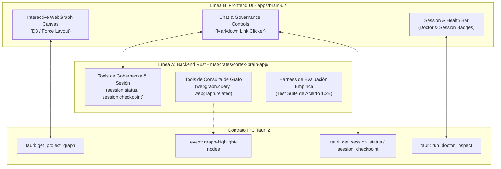

# 🧠 Plan Maestro de Evolución: Cortex Brain 2.0 (Orquestación, WebGraph Bidireccional y Gobernanza)

Este documento define la especificación técnica completa y la división de trabajo en **Épicas estrictamente desacopladas** para que **dos agentes trabajen en paralelo en terminales independientes** sin colisiones de archivos ni dependencias circulares.

---

## 🏛️ Arquitectura y Contrato de Comunicación entre Agentes

Para garantizar cero conflictos entre terminales:
* **Línea A (Backend Rust):** Trabaja **exclusivamente** dentro de `rust/crates/cortex-brain-app/` y `rust/crates/cortex-brain/`. No toca `apps/brain-ui/`.
* **Línea B (Frontend UI & Visual Canvas):** Trabaja **exclusivamente** dentro de `apps/brain-ui/`. No toca `rust/`.
* **Punto de Encuentro (IPC Contract):** Ambas líneas respetan los comandos Tauri y eventos definidos en este contrato.



---

## 📋 Contrato de Comandos y Eventos Tauri (IPC Interface)

### 1. Comandos Tauri
```typescript
// 1. Obtener grafo del proyecto para renderizar en WebGraph
tauriInvoke("get_project_graph", { project: string }): Promise<{
  nodes: Array<{ id: string; label: string; kind: "file" | "spec" | "adr" | "module"; path: string; metadata?: Record<string, any> }>;
  edges: Array<{ source: string; target: string; relation: "imports" | "documents" | "tests" | "depends_on" }>;
}>;

// 2. Estado de gobernanza y sesiones
tauriInvoke("get_session_status", { project: string }): Promise<{
  active: boolean;
  session_id?: string;
  spec_path?: string;
  checkpoints_count: number;
  last_checkpoint?: string;
}>;

// 3. Inspección de salud de Cortex
tauriInvoke("run_doctor_inspect", { project: string }): Promise<{
  is_healthy: boolean;
  checks: Array<{ name: string; status: "ok" | "warn" | "fail"; message: string; auto_fix_tool?: string }>;
}>;
```

### 2. Eventos Tauri Embebidos
* `graph-highlight-nodes`: Emite `{ node_ids: string[], topic: string }` cuando el Brain detecta que una respuesta involucra nodos específicos del grafo para iluminarlos en tiempo real.

---

## 🅰️ Línea A: Backend Rust, Tools de Gobernanza y Harness Empírico
> **Archivos exclusivos:** `rust/crates/cortex-brain-app/src/*`, `rust/crates/cortex-brain/src/*`

### Épica A1: Tools de Ciclo de Vida y Gobernanza de Cortex
1. **`session.status` (Read):**
   - Inspecciona `.cortex/sessions/` y reporta la sesión activa actual, el spec asociado y la cantidad de checkpoints registrados.
2. **`session.checkpoint <nota>` (SafeAction):**
   - Genera un checkpoint canónico con timestamp y nota descriptiva en la sesión activa.
3. **`session.finish_and_document` (SafeAction):**
   - Explica que antes del cierre se invoca al agente documentador (`cortex docs` / documenter) para capturar los diffs y dejar la nota en `vault/session-notes/`.
4. **`doctor.inspect` (Read):**
   - Ejecuta las validaciones de salud de Cortex (`workspace.yaml`, índice del vault, estado de memoria episódica) y devuelve recomendaciones.

### Épica A2: Tools de Grafo y Referencias Markdown Exactas
1. **`webgraph.query` & `webgraph.related` (Read):**
   - Consulta el árbol de dependencias, ADRs y módulos del proyecto.
   - Emite el evento `graph-highlight-nodes` hacia la UI para iluminar los nodos consultados.
2. **Formateo Canónico de Enlaces Markdown:**
   - Enriquecer el system prompt y las tools (`memory.search`, `docs.related`) para que siempre incluyan la ruta exacta en formato de enlace markdown: `[vault/adrs/ADR-001.md](file:///<full_path>)`.

### Épica A3: Harness de Evaluación Empírica del Modelo 1.2B
1. **Banco de Pruebas Automatizado (`eval_model_governance.rs`):**
   - Suite de 20 casos de prueba en lenguaje natural coloquial:
     - *"cerrá lo que estuvimos haciendo"* $\rightarrow$ debe proponer `session.finish_and_document`.
     - *"dónde se define el token de auth"* $\rightarrow$ debe llamar a `memory.search` o `docs.related` y dar la ruta `.md`.
     - *"cómo se relacionan los módulos de la app"* $\rightarrow$ debe llamar a `webgraph.query`.
     - *"fijate si el proyecto está sano"* $\rightarrow$ debe llamar a `doctor.inspect`.
   - Medición automatizada de: tasa de acierto de tools, precisión de argumentos y ausencia de alucinaciones.

---

## 🅱️ Línea B: Frontend UI, Canvas de WebGraph Interactivo y Controles
> **Archivos exclusivos:** `apps/brain-ui/src/*`

### Épica B1: Visor Interactivo de WebGraph Embebido
1. **Componente `WebGraphModal.tsx` / `WebGraphCanvas.tsx`:**
   - Canvas de grafo interactivo renderizado con nodos circulares y aristas (archivos `.rs`/`.ts`, specs `.md`, ADRs, módulos).
   - Soporte para zoom, paneo y drag de nodos.
2. **Botón `[ 🕸️ WebGraph ]` en la barra superior:**
   - Abre el visor con un solo click cargando los datos vía `get_project_graph`.

### Épica B2: Interacción Bidireccional WebGraph $\leftrightarrow$ Chat en Tiempo Real
1. **Del WebGraph al Chat (Node Pinning / Reference):**
   - Al hacer click en un nodo del WebGraph, se agrega un tag interactivo en el chat: `[ 🏷️ Nodo: lib.rs ✕ ]`.
   - El usuario puede escribir directamente: *"¿Qué responsabilidad tiene este archivo y con qué ADRs se relaciona?"*.
2. **Del Chat al WebGraph (Visual Highlighting):**
   - Listener del evento `graph-highlight-nodes`: cuando el Brain responde sobre un tema, el canvas del WebGraph **ilumina con un brillo verde/cyan** los nodos involucrados y atenúa los demás.

### Épica B3: Barra de Gobernanza, Salud y Renderizado de Links `.md`
1. **Barra de Gobernanza en el Header (`GovernanceBar.tsx`):**
   - Badge de Sesión Activa (`Sesión #014: Refactor IPC` o `Sin sesión activa`).
   - Botón rápido `[ 📌 Checkpoint ]` y `[ 🛡️ Doctor ]`.
2. **Renderizado de Enlaces de Archivos Markdown:**
   - Parser de links en el componente `Chat.tsx`: cuando el modelo responde con un archivo (ej: `[ADR-020.md](...)`), renderizarlo como un botón/enlace interactivo con icono de documento que copia la ruta o la resalta en el WebGraph.
