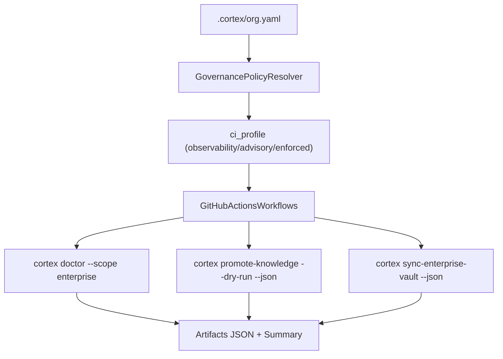

# Plan de Acción: EPIC 4 - Gobernanza y CI Enterprise

## Documento

- Fecha: 2026-04-29
- Proyecto: `Cortex`
- Epic objetivo: `E4 - Gobernanza y CI enterprise`
- Estado: **Planificación detallada (sin implementación aún)**
- Dependencias: `EPIC 1` + `EPIC 2` + `EPIC 3 (V1)` completadas

---

## 1. Resumen Ejecutivo

Con EPIC 3 ya existe un pipeline de promoción (review + promote + sync enterprise vault). EPIC 4 convierte esa capacidad en **operación gobernada**: políticas configurables (observability/advisory/enforced) ejecutables desde CI, con reportes estables (JSON + resumen humano) y verificación de salud enterprise desde `doctor`.

El objetivo no es “agregar más checks”, sino **codificar disciplina**:

- Qué se valida en CI y cuándo bloquea.
- Cómo se reportan candidatos de promoción y drift documental.
- Cómo se asegura que la memoria enterprise permanezca consistente y auditable.

---

## 2. Estado actual relevante (lo existente que EPIC 4 reutiliza)

- `org.yaml` ya define un perfil de CI: `governance.ci_profile` (`observability|advisory|enforced`) en [`cortex/enterprise/models.py`](../../cortex/enterprise/models.py).
- `doctor` ya soporta scope enterprise/all y valida:
  - presencia/validez de `.cortex/org.yaml`
  - `vault-enterprise/` si aplica
  - alineación branch isolation (config.yaml vs org.yaml)
  - validación del `vault/` (markdown integrity) en [`cortex/doctor.py`](../../cortex/doctor.py)
- EPIC 3 ya aporta comandos CI-friendly:
  - `cortex promote-knowledge --dry-run/--json`
  - `cortex sync-enterprise-vault --json`
  - `cortex review-knowledge` (operación humana, fuera de CI)

Brecha: falta conectar todo esto en **workflows enterprise**, con enforcement configurable y reportes consistentes.

---

## 3. Objetivo de la EPIC 4

Habilitar una gobernanza enterprise ejecutable desde CI, con tres perfiles:

- **observability**: corre checks, genera reportes, **no bloquea** merges.
- **advisory**: reporta warnings claros y propone acciones; bloquea solo fallas críticas (ej. config inválida).
- **enforced**: bloquea merges si fallan políticas (docs inválidas, promoción pendiente/violaciones).

---

## 4. Definition of Done (DoD) — EPIC 4

- [ ] Existe al menos un workflow enterprise oficial (ej. `ci-enterprise-governance.yml`) que corre checks de:
  - salud enterprise (`doctor --scope enterprise`)
  - validación e indexado del enterprise vault (`sync-enterprise-vault`)
  - reporte de promotion candidates (`promote-knowledge --dry-run --json`)
- [ ] Los workflows ejecutan enforcement según `governance.ci_profile` (observability/advisory/enforced).
- [ ] Se generan artefactos JSON estables consumibles por humanos o herramientas.
- [ ] `doctor` reporta salud enterprise incluyendo checks específicos de promoción/policy (no solo existencia de vault).
- [ ] `setup templates` provee templates enterprise (workflows) alineados al modelo.
- [ ] Tests cubren: render templates + doctor enterprise checks nuevos.

---

## 5. Diseño de alto nivel

---

## 6. Historias Técnicas ultra detalladas

### E4-S1 — Diseñar perfiles de enforcement

**Objetivo**: mapear `governance.ci_profile` a comportamiento CI sin ambigüedad.

- **Entrada**: `EnterpriseOrgConfig.governance.ci_profile`
- **Salida**: reglas de bloqueo por check

**Contrato propuesto (V1):**

- **observability**
  - nunca bloquea por docs/promotion
  - solo falla si hay errores “hard” de ejecución (ej. crash)
- **advisory**
  - falla si:
    - `doctor --scope enterprise` reporta failures
    - enterprise vault validation tiene errors
  - no falla por “promotion pending”, pero lo reporta como warning
- **enforced**
  - falla si:
    - `doctor --scope enterprise` tiene failures
    - `sync-enterprise-vault` falla (errors o strict warnings según policy)
    - hay promotion candidates (según policy definida)

**Entregable**: tabla de decisiones codificada en workflow y (opcional) en un helper Python.

---

### E4-S2 — Extender `doctor` enterprise

**Objetivo**: que `doctor --scope enterprise` exprese salud enterprise real.

Agregar checks enterprise para:

- **enterprise_vault_validation**: si existe `vault-enterprise/`, validar markdown (similar a `_validate_vault` pero apuntando al enterprise vault).
- **promotion_policy_integrity**:
  - si `promotion.enabled=true`, verificar que `vault-enterprise/.cortex/promotion/` sea accesible o creable
  - (V1) verificar que `promotion.allowed_doc_types` no sea vacío cuando promotion está habilitado
- **promotion_records_presence** (warning): si promotion está habilitado pero no hay records aún.

**Archivos**:
- Modificar [`cortex/doctor.py`](../../cortex/doctor.py)

**Criterios de aceptación**:
- `doctor --scope enterprise` reporta checks nuevos, con severidad consistente.

---

### E4-S3 — Crear pasos CI para promotion y validación

**Objetivo**: workflow que corra en repos gobernados y produzca reportes.

**Workflow recomendado**: `.github/workflows/ci-enterprise-governance.yml`

Pasos mínimos:

- `cortex doctor --scope enterprise` (output visible en logs)
- `cortex promote-knowledge --dry-run --json` → guardar como artefacto `.promotion-plan.json`
- `cortex sync-enterprise-vault --json --output .enterprise-doc-validation.json`
- (opcional) `cortex validate-docs --vault vault` para el vault local

**Enforcement**:
- implementar gating condicional según `ci_profile`:
  - en observability: `continue-on-error: true` + summary
  - en enforced: steps críticos sin `continue-on-error` y/o un step final que evalúa JSON y hace `exit 1`

**Artefactos**:
- `.promotion-plan.json`
- `.enterprise-doc-validation.json`
- (opcional) `.doctor-report.json` si se agrega salida JSON al doctor (decisión V1 vs V2)

---

### E4-S4 — Reportes de estado en CI

**Objetivo**: salida consumible por humanos y máquinas.

- **Resumen humano**: step que imprime:
  - cantidad de candidatos de promoción
  - cantidad de errors/warnings en enterprise vault
  - top 5 archivos con errores
- **Salida para observabilidad**: artefactos JSON + (opcional) comentario en PR (similar al pipeline existente).

---

## 7. Archivos a crear/modificar (plan)

### Crear

- `docs/enterprise/PLAN-EPIC-4.md` (este documento)
- `.github/workflows/ci-enterprise-governance.yml` (workflow oficial del repo)
- (opcional) `cortex/pipeline/stages/enterprise_governance.py` si se decide factorizar lógica

### Modificar

- [`cortex/doctor.py`](../../cortex/doctor.py) — checks enterprise adicionales
- [`cortex/cli/main.py`](../../cortex/cli/main.py) — solo si se agrega output JSON para `doctor` o flags de governance
- [`cortex/setup/templates.py`](../../cortex/setup/templates.py)
  - agregar template de workflow enterprise
  - conectar generación según `org.yaml`/preset

---

## 8. Plan de testing (EPIC 4)

- **Unit**
  - tests de doctor enterprise checks nuevos (casos: sin org.yaml, con org.yaml, con enterprise vault inválido, con promotion habilitada sin records)
- **Template render**
  - tests que validen que `setup templates` genera el workflow enterprise esperado
  - validar que contiene steps claves y gating por perfil

---

## 9. Riesgos y mitigaciones

- **Riesgo: CI demasiado bloqueante**
  - Mitigación: perfiles + defaults en `small-company` → advisory
- **Riesgo: gobernanza difícil de entender**
  - Mitigación: reportes JSON + resumen humano claro
- **Riesgo: drift entre workflow real y templates**
  - Mitigación: tests de render + usar templates como fuente de verdad para workflows generados

---

## 10. Orden recomendado de implementación

1. Definir tabla de enforcement (E4-S1) y reflejarla en un workflow mínimo
2. Extender `doctor` con checks enterprise adicionales (E4-S2)
3. Implementar workflow enterprise y artefactos JSON (E4-S3)
4. Mejorar reportes/summary y hardening de UX (E4-S4)
5. Tests (doctor + templates)

