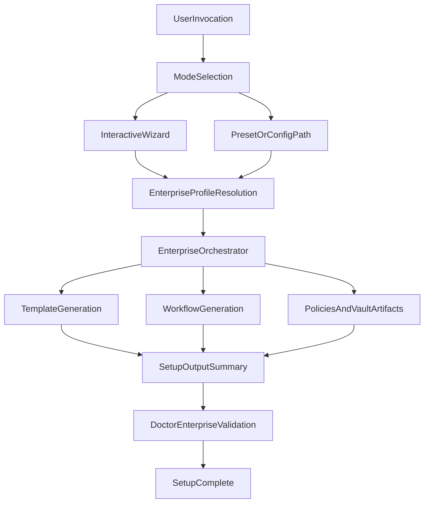

# Plan de Acción: EPIC 5 - Setup Enterprise Interactivo

## Documento

- **Fecha**: 2026-04-29
- **Proyecto**: Cortex
- **Epic objetivo**: E5 - Setup enterprise interactivo
- **Estado**: Planificación (sin implementación)
- **Fuentes base**:
  - [D:/DevSecDocOps/DevSecDocOps-3erCortex/cortex-repo/cortex/docs/enterprise/BACKLOG-Enterprise-Memory-Productization.md](D:/DevSecDocOps/DevSecDocOps-3erCortex/cortex-repo/cortex/docs/enterprise/BACKLOG-Enterprise-Memory-Productization.md)
  - [D:/DevSecDocOps/DevSecDocOps-3erCortex/cortex-repo/cortex/docs/enterprise/PLAN-EPIC-4.md](D:/DevSecDocOps/DevSecDocOps-3erCortex/cortex-repo/cortex/docs/enterprise/PLAN-EPIC-4.md)
  - [D:/DevSecDocOps/DevSecDocOps-3erCortex/cortex-repo/cortex/docs/enterprise/AVANCE-EPIC-4-IMPLEMENTACION.md](D:/DevSecDocOps/DevSecDocOps-3erCortex/cortex-repo/cortex/docs/enterprise/AVANCE-EPIC-4-IMPLEMENTACION.md)
  - [C:/Users/CHUCHO/.cursor/plans/plan-epic-3_915a2ef9.plan.md](C:/Users/CHUCHO/.cursor/plans/plan-epic-3_915a2ef9.plan.md)

## 1. Resumen Ejecutivo

La Épica 5 busca convertir la configuración enterprise de Cortex en una experiencia de setup repetible, guiada y automatizable. El objetivo es que un cliente pueda desplegar una topología enterprise funcional usando `cortex setup enterprise`, con dos modos operativos: interactivo (wizard) y no interactivo (presets/configuración declarativa).

La implementación debe maximizar reutilización de artefactos ya preparados en épicas previas (especialmente E3 y E4), minimizar fricción de adopción y mantener compatibilidad con setups actuales.

## 2. Estado Actual Relevante

- E4 dejó bases útiles para E5 (doctor enterprise, templates/workflows y validaciones iniciales), pero aún hay puntos de cierre contractual que impactan al setup enterprise.
- En el backlog, E5 aparece como pendiente completo en DoD, historias y validación.
- Existe una brecha entre capacidades enterprise disponibles y la experiencia de onboarding productizada para cliente final.

## 3. Objetivo y Alcance

### Objetivo principal

Entregar un flujo `cortex setup enterprise` robusto, con UX guiada y ejecución declarativa, que genere estructura enterprise coherente desde cero o sobre repos existentes.

### Alcance incluido (V1)

- Nuevo modo de setup enterprise en el orquestador.
- Wizard interactivo para preguntas clave de organización.
- Ejecución no interactiva por preset/config (`--preset`, `--org-config`, `--dry-run`, salida resumen JSON).
- Generación consistente de artefactos enterprise base.
- Presets iniciales para 3 perfiles objetivo.
- Smoke tests de flujos interactivo y no interactivo.

### Fuera de alcance (V1)

- Extender el set inicial de presets más allá de los 3 definidos.
- Migración totalmente automática de todos los layouts legacy complejos.
- Reescritura de lógica de negocio de E3/E4; E5 consume contratos existentes.

## 4. Definition of Done (DoD)

La Épica 5 se considera completada cuando:

- Existe `cortex setup enterprise` integrado al CLI principal.
- El comando soporta modo interactivo y no interactivo.
- La generación de estructura enterprise es consistente y verificable.
- Se soportan presets `small-company`, `multi-project-team` y `regulated-organization`.
- Se dispone de `--dry-run` y resumen JSON para auditoría y automatización.
- Hay smoke tests estables para caminos críticos.
- La documentación de uso y troubleshooting queda actualizada.

## 5. Diseño de Alto Nivel

## 6. Historias Técnicas Detalladas

### E5-S1 - Orquestación enterprise

- **Objetivo**: introducir `SetupMode.ENTERPRISE` y su pipeline en setup.
- **Archivos foco**:
  - [D:/DevSecDocOps/DevSecDocOps-3erCortex/cortex-repo/cortex/cortex/setup/orchestrator.py](D:/DevSecDocOps/DevSecDocOps-3erCortex/cortex-repo/cortex/cortex/setup/orchestrator.py)
- **Aceptación**:
  - Nuevo modo enruta correctamente según flags.
  - El flujo enterprise no rompe modos existentes.

### E5-S2 - Wizard interactivo

- **Objetivo**: capturar configuración organizacional mediante prompts guiados.
- **Archivos foco**:
  - [D:/DevSecDocOps/DevSecDocOps-3erCortex/cortex-repo/cortex/cortex/setup/enterprise_wizard.py](D:/DevSecDocOps/DevSecDocOps-3erCortex/cortex-repo/cortex/cortex/setup/enterprise_wizard.py)
- **Aceptación**:
  - Wizard cubre datos mínimos para materializar estructura enterprise.
  - Maneja defaults seguros y validación de entradas.

### E5-S3 - Modo no interactivo y dry-run

- **Objetivo**: habilitar setup declarativo por preset/config con salida estructurada.
- **Archivos foco**:
  - [D:/DevSecDocOps/DevSecDocOps-3erCortex/cortex-repo/cortex/cortex/setup/orchestrator.py](D:/DevSecDocOps/DevSecDocOps-3erCortex/cortex-repo/cortex/cortex/setup/orchestrator.py)
  - [D:/DevSecDocOps/DevSecDocOps-3erCortex/cortex-repo/cortex/cortex/setup/enterprise_presets.py](D:/DevSecDocOps/DevSecDocOps-3erCortex/cortex-repo/cortex/cortex/setup/enterprise_presets.py)
- **Aceptación**:
  - Flags `--preset`, `--org-config`, `--dry-run` operativos.
  - Resumen JSON consistente para CI/automatización.

### E5-S4 - Ensamblado completo de artefactos enterprise

- **Objetivo**: generar org config, vaults/runbooks, workflows, workspace inicial y políticas.
- **Archivos foco**:
  - [D:/DevSecDocOps/DevSecDocOps-3erCortex/cortex-repo/cortex/cortex/setup/templates.py](D:/DevSecDocOps/DevSecDocOps-3erCortex/cortex-repo/cortex/cortex/setup/templates.py)
  - [D:/DevSecDocOps/DevSecDocOps-3erCortex/cortex-repo/cortex/cortex/setup/orchestrator.py](D:/DevSecDocOps/DevSecDocOps-3erCortex/cortex-repo/cortex/cortex/setup/orchestrator.py)
- **Aceptación**:
  - Estructura generada queda coherente e idempotente.
  - Integración consistente con assets ya existentes.

### E5-S5 - Presets enterprise iniciales

- **Objetivo**: definir presets para perfiles de adopción típicos.
- **Archivos foco**:
  - [D:/DevSecDocOps/DevSecDocOps-3erCortex/cortex-repo/cortex/cortex/setup/enterprise_presets.py](D:/DevSecDocOps/DevSecDocOps-3erCortex/cortex-repo/cortex/cortex/setup/enterprise_presets.py)
- **Aceptación**:
  - Presets cubren caminos base y permiten customización incremental.
  - Documentación describe cuándo usar cada preset.

## 7. Archivos a Crear/Modificar

### Crear

- [D:/DevSecDocOps/DevSecDocOps-3erCortex/cortex-repo/cortex/cortex/setup/enterprise_wizard.py](D:/DevSecDocOps/DevSecDocOps-3erCortex/cortex-repo/cortex/cortex/setup/enterprise_wizard.py)
- [D:/DevSecDocOps/DevSecDocOps-3erCortex/cortex-repo/cortex/cortex/setup/enterprise_presets.py](D:/DevSecDocOps/DevSecDocOps-3erCortex/cortex-repo/cortex/cortex/setup/enterprise_presets.py)
- [D:/DevSecDocOps/DevSecDocOps-3erCortex/cortex-repo/cortex/docs/enterprise/PLAN-EPIC-5.md](D:/DevSecDocOps/DevSecDocOps-3erCortex/cortex-repo/cortex/docs/enterprise/PLAN-EPIC-5.md)

### Modificar

- [D:/DevSecDocOps/DevSecDocOps-3erCortex/cortex-repo/cortex/cortex/setup/orchestrator.py](D:/DevSecDocOps/DevSecDocOps-3erCortex/cortex-repo/cortex/cortex/setup/orchestrator.py)
- [D:/DevSecDocOps/DevSecDocOps-3erCortex/cortex-repo/cortex/cortex/setup/templates.py](D:/DevSecDocOps/DevSecDocOps-3erCortex/cortex-repo/cortex/cortex/setup/templates.py)
- Documentación operativa enterprise asociada al flujo de setup.

## 8. Plan de Testing

- Unit tests para parseo de flags y selección de modo.
- Unit tests de presets (schema, defaults, overrides).
- Smoke test `setup enterprise` interactivo (camino feliz).
- Smoke tests no interactivos para los 3 presets requeridos.
- Test de `--dry-run` para validar no side-effects y salida JSON.
- Test de regresión para no afectar setup no-enterprise existente.

## 9. Riesgos y Mitigaciones

- **Riesgo**: wizard demasiado extenso/complex para v1.
  - **Mitigación**: limitar preguntas a mínimo necesario y delegar detalle a `org-config`.
- **Riesgo**: romper setups locales existentes.
  - **Mitigación**: aislamiento por `SetupMode`, regresión de modos previos y smoke tests.
- **Riesgo**: contratos E3/E4 ambiguos para consumo en setup.
  - **Mitigación**: congelar contrato mínimo antes de integrar wizard completo.
- **Riesgo**: adopción lenta por defaults incorrectos.
  - **Mitigación**: presets opinionados + documentación de selección rápida.

## 10. Orden Recomendado de Implementación

1. Alinear contrato mínimo de integración con entregables E3/E4 ya implementados.
2. Implementar E5-S1 (orquestación enterprise y routing CLI).
3. Implementar E5-S3 (no interactivo, dry-run, salida JSON).
4. Implementar E5-S5 (presets iniciales) en paralelo con S3.
5. Implementar E5-S2 (wizard) montado sobre contratos/presets estables.
6. Implementar E5-S4 (ensamblado final de artefactos y hardening).
7. Ejecutar validación integral, documentación y checklist de cierre.

## 11. Checklist Final de Cierre

- [ ] Comando enterprise estable y documentado.
- [ ] Modo interactivo validado.
- [ ] Modo no interactivo con presets validado.
- [ ] Dry-run + JSON summary validados.
- [ ] Smoke tests de presets e interactivo en verde.
- [ ] Compatibilidad con setup actual preservada.
- [ ] Documentación de operación enterprise actualizada.
