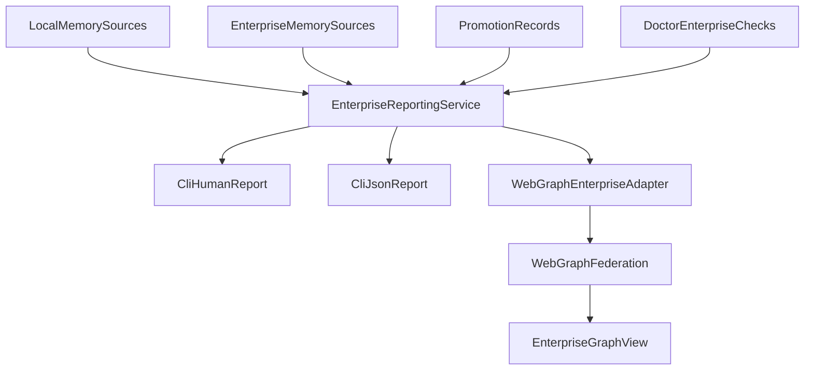

# Plan de Acción: EPIC 6 - Observabilidad y Reporting

## Documento

- **Fecha**: 2026-04-29
- **Proyecto**: Cortex
- **Epic objetivo**: E6 - Observabilidad y reporting
- **Estado**: Planificación (sin implementación)
- **Dependencias**:
  - E2 operativo
  - E3 operativo
  - E4 base disponible
  - E5 implementada como capa de adopción/setup, no como dependencia bloqueante
- **Fuentes base**:
  - [D:/DevSecDocOps/DevSecDocOps-3erCortex/cortex-repo/cortex/docs/enterprise/BACKLOG-Enterprise-Memory-Productization.md](D:/DevSecDocOps/DevSecDocOps-3erCortex/cortex-repo/cortex/docs/enterprise/BACKLOG-Enterprise-Memory-Productization.md)
  - [D:/DevSecDocOps/DevSecDocOps-3erCortex/cortex-repo/cortex/docs/enterprise/PLAN-EPIC-4.md](D:/DevSecDocOps/DevSecDocOps-3erCortex/cortex-repo/cortex/docs/enterprise/PLAN-EPIC-4.md)
  - [D:/DevSecDocOps/DevSecDocOps-3erCortex/cortex-repo/cortex/docs/enterprise/PLAN-EPIC-5.md](D:/DevSecDocOps/DevSecDocOps-3erCortex/cortex-repo/cortex/docs/enterprise/PLAN-EPIC-5.md)
  - [D:/DevSecDocOps/DevSecDocOps-3erCortex/cortex-repo/cortex/docs/enterprise/AVANCE-EPIC-4-IMPLEMENTACION.md](D:/DevSecDocOps/DevSecDocOps-3erCortex/cortex-repo/cortex/docs/enterprise/AVANCE-EPIC-4-IMPLEMENTACION.md)
  - [D:/DevSecDocOps/DevSecDocOps-3erCortex/cortex-repo/cortex/docs/enterprise/AVANCE-EPIC-5-IMPLEMENTACION.md](D:/DevSecDocOps/DevSecDocOps-3erCortex/cortex-repo/cortex/docs/enterprise/AVANCE-EPIC-5-IMPLEMENTACION.md)
  - [C:/Users/CHUCHO/.cursor/plans/plan-epic-3_915a2ef9.plan.md](C:/Users/CHUCHO/.cursor/plans/plan-epic-3_915a2ef9.plan.md)

## 1. Resumen Ejecutivo

La Épica 6 busca convertir las capacidades enterprise ya construidas en una superficie clara de observabilidad operativa. El objetivo es que una organización pueda inspeccionar el estado de su memoria, el pipeline de promoción y la relación entre memoria local/corporativa mediante reportes legibles y salidas JSON reutilizables.

Esta épica no introduce un nuevo modelo enterprise; capitaliza lo ya implementado en E2 (retrieval multi-nivel), E3 (promotion pipeline), E4 (checks y artefactos de gobernanza) y E5 (setup/adopción). Su foco es consolidar visibilidad operativa y preparar una capa mínima de reporting utilizable tanto por CLI como por WebGraph.

## 2. Estado Actual Relevante

- E2 ya expone scopes, metadata de origen y resultados multi-fuente reutilizables para reporting.
- E3 ya produce trazabilidad formal de promoción y estados auditables.
- E4 ya dejó checks enterprise en `doctor` y artefactos JSON en CI, aunque el contrato de enforcement aún no está completamente cerrado.
- E5 ya genera estructura enterprise, workflows e integración inicial que sirven como vía de adopción para E6.
- La brecha actual es que no existe una vista operativa consolidada y legible sobre salud de memoria, actividad de promoción y topología enterprise visible en WebGraph.

## 3. Objetivo y Alcance

### Objetivo principal

Entregar una primera capa de observabilidad enterprise con comandos CLI y servicios reutilizables que permitan inspeccionar salud de memoria, estado de promociones y relaciones enterprise en WebGraph.

### Alcance incluido (V1)

- Nuevo servicio central `cortex/enterprise/reporting.py`.
- Comando `cortex memory-report` con salida humana y JSON.
- Reporte de promoción con pendientes, últimas promociones, rechazos y warnings.
- Enriquecimiento mínimo de WebGraph con noción enterprise y filtro por scope.
- Contrato JSON estable para automatización y futura integración en CI/UI.
- Tests unitarios y smoke tests de CLI/reporting.

### Fuera de alcance (V1)

- Dashboard visual completo o UI dedicada fuera de CLI/WebGraph.
- Analytics históricos avanzados o métricas temporales agregadas.
- Observabilidad distribuida externa (Prometheus, Grafana, etc.).
- Revisión completa del modelo de enforcement de E4; E6 solo lo consume.

## 4. Definition of Done (DoD)

La Épica 6 se considera completada cuando:

- Existe un comando `cortex memory-report` operativo.
- El reporte expone salud de memoria por fuente y gaps relevantes.
- Existe trazabilidad legible de promociones, pendientes y rechazos.
- La salida JSON de reporting es estable y utilizable por otros flujos.
- WebGraph puede enriquecerse con información enterprise mínima y filtrar por scope.
- Hay cobertura de tests para reporting, CLI y enriquecimiento mínimo de WebGraph.
- La documentación operativa de la épica queda actualizada.

## 5. Diseño de Alto Nivel

## 6. Historias Técnicas Detalladas

### E6-S1 - Reporte de memoria

- **Objetivo**: implementar un reporte de salud de memoria unificado para fuentes local y enterprise.
- **Archivos foco**:
  - [D:/DevSecDocOps/DevSecDocOps-3erCortex/cortex-repo/cortex/cortex/enterprise/reporting.py](D:/DevSecDocOps/DevSecDocOps-3erCortex/cortex-repo/cortex/cortex/enterprise/reporting.py)
  - [D:/DevSecDocOps/DevSecDocOps-3erCortex/cortex-repo/cortex/cortex/cli/main.py](D:/DevSecDocOps/DevSecDocOps-3erCortex/cortex-repo/cortex/cortex/cli/main.py)
- **Aceptación**:
  - Existe `cortex memory-report` con salida humana.
  - Existe `--json` con contrato estable.
  - El reporte muestra volumen por fuente, docs promovidos y gaps de salud.

### E6-S2 - Reporte de promotion

- **Objetivo**: exponer visibilidad operativa del pipeline de promoción reutilizando la traza ya generada por E3.
- **Archivos foco**:
  - [D:/DevSecDocOps/DevSecDocOps-3erCortex/cortex-repo/cortex/cortex/enterprise/reporting.py](D:/DevSecDocOps/DevSecDocOps-3erCortex/cortex-repo/cortex/cortex/enterprise/reporting.py)
  - [D:/DevSecDocOps/DevSecDocOps-3erCortex/cortex-repo/cortex/cortex/enterprise/knowledge_promotion.py](D:/DevSecDocOps/DevSecDocOps-3erCortex/cortex-repo/cortex/cortex/enterprise/knowledge_promotion.py)
  - [D:/DevSecDocOps/DevSecDocOps-3erCortex/cortex-repo/cortex/cortex/cli/main.py](D:/DevSecDocOps/DevSecDocOps-3erCortex/cortex-repo/cortex/cortex/cli/main.py)
- **Aceptación**:
  - El reporte muestra candidatos pendientes.
  - El reporte muestra últimas promociones y rechazos.
  - El reporte expone warnings relevantes sin inventar una nueva fuente de verdad.

### E6-S3 - Enriquecimiento WebGraph enterprise

- **Objetivo**: reflejar la topología enterprise en WebGraph con filtro por scope y relaciones básicas entre proyecto y memoria corporativa.
- **Archivos foco**:
  - [D:/DevSecDocOps/DevSecDocOps-3erCortex/cortex-repo/cortex/cortex/webgraph/federation.py](D:/DevSecDocOps/DevSecDocOps-3erCortex/cortex-repo/cortex/cortex/webgraph/federation.py)
  - [D:/DevSecDocOps/DevSecDocOps-3erCortex/cortex-repo/cortex/cortex/webgraph/service.py](D:/DevSecDocOps/DevSecDocOps-3erCortex/cortex-repo/cortex/cortex/webgraph/service.py)
  - [D:/DevSecDocOps/DevSecDocOps-3erCortex/cortex-repo/cortex/cortex/enterprise/reporting.py](D:/DevSecDocOps/DevSecDocOps-3erCortex/cortex-repo/cortex/cortex/enterprise/reporting.py)
- **Aceptación**:
  - Existen nodos enterprise mínimos.
  - Se puede filtrar por `scope`.
  - Se muestran relaciones entre proyecto y memoria corporativa sin romper visualizaciones actuales.

## 7. Archivos a Crear/Modificar

### Crear

- [D:/DevSecDocOps/DevSecDocOps-3erCortex/cortex-repo/cortex/cortex/enterprise/reporting.py](D:/DevSecDocOps/DevSecDocOps-3erCortex/cortex-repo/cortex/cortex/enterprise/reporting.py)
- [D:/DevSecDocOps/DevSecDocOps-3erCortex/cortex-repo/cortex/docs/enterprise/PLAN-EPIC-6.md](D:/DevSecDocOps/DevSecDocOps-3erCortex/cortex-repo/cortex/docs/enterprise/PLAN-EPIC-6.md)

### Modificar

- [D:/DevSecDocOps/DevSecDocOps-3erCortex/cortex-repo/cortex/cortex/cli/main.py](D:/DevSecDocOps/DevSecDocOps-3erCortex/cortex-repo/cortex/cortex/cli/main.py)
- [D:/DevSecDocOps/DevSecDocOps-3erCortex/cortex-repo/cortex/cortex/webgraph/federation.py](D:/DevSecDocOps/DevSecDocOps-3erCortex/cortex-repo/cortex/cortex/webgraph/federation.py)
- [D:/DevSecDocOps/DevSecDocOps-3erCortex/cortex-repo/cortex/cortex/webgraph/service.py](D:/DevSecDocOps/DevSecDocOps-3erCortex/cortex-repo/cortex/cortex/webgraph/service.py)
- [D:/DevSecDocOps/DevSecDocOps-3erCortex/cortex-repo/cortex/cortex/enterprise/knowledge_promotion.py](D:/DevSecDocOps/DevSecDocOps-3erCortex/cortex-repo/cortex/cortex/enterprise/knowledge_promotion.py)
- Documentación operativa enterprise vinculada a reporting y WebGraph.

## 8. Plan de Testing

- Unit tests para `cortex/enterprise/reporting.py`.
- Unit tests del comando `cortex memory-report` en salida humana y JSON.
- Tests de reporte de promotion con pendientes, promociones y rechazos.
- Tests mínimos de WebGraph enriquecido con filtro por scope.
- Tests de regresión para no romper CLI actual ni visualización actual de WebGraph.
- Validación estructural del JSON de reporting para uso automatizado.

## 9. Riesgos y Mitigaciones

- **Riesgo**: dependencia difusa con contratos aún abiertos de E4.
  - **Mitigación**: consumir solo checks/artefactos ya estables y no redefinir enforcement en E6.
- **Riesgo**: duplicar la fuente de verdad del pipeline de promoción.
  - **Mitigación**: reutilizar records/estados ya generados por E3.
- **Riesgo**: enriquecer WebGraph antes de estabilizar el modelo de reporting.
  - **Mitigación**: implementar primero el contrato de datos y luego proyectarlo en WebGraph.
- **Riesgo**: salidas humanas y JSON divergentes entre sí.
  - **Mitigación**: construir ambas desde un modelo intermedio único en `reporting.py`.
- **Riesgo**: scope enterprise degradando experiencia actual local.
  - **Mitigación**: mantener defaults backward-compatible y agregar pruebas de regresión específicas.

## 10. Orden Recomendado de Implementación

1. Definir contrato de datos de reporting (salida humana + JSON) reutilizando E2/E3/E4.
2. Implementar E6-S1 (`reporting.py` + `cortex memory-report`).
3. Implementar E6-S2 reutilizando trazabilidad de promoción existente.
4. Alinear el formato de reporting con artefactos/health checks ya expuestos por E4.
5. Implementar E6-S3 cuando el modelo de datos ya esté estabilizado.
6. Ejecutar validación integral, hardening de regresión y documentación de cierre.

## 11. Checklist Final de Cierre

- [ ] Existe `cortex memory-report` documentado y usable.
- [ ] La salida JSON de reporting es estable.
- [ ] El reporte de promotion expone pendientes, promociones y rechazos.
- [ ] WebGraph refleja información enterprise mínima con filtro por scope.
- [ ] Tests de reporting y regresión en verde.
- [ ] Compatibilidad con CLI/WebGraph actual preservada.
- [ ] Documentación operativa enterprise actualizada.

---
name: Plan Epic 6 Observability
overview: Definir un plan detallado de la Épica 6 para incorporar observabilidad y reporting enterprise en Cortex, alineado con el backlog y con el formato/rigor de los planes previos, incluyendo alcance, historias técnicas, secuencia de implementación, validación y riesgos.
todos:
  - id: scope-epic6
    content: Consolidar alcance, dependencias y criterios de aceptación de E6 desde backlog y avances previos.
    status: pending
  - id: draft-plan-epic6
    content: Redactar PLAN-EPIC-6 con estructura y nivel de detalle alineados a E4/E5.
    status: pending
  - id: define-sequence-epic6
    content: Establecer secuencia técnica E6-S1..E6-S3 con riesgos y dependencias reales.
    status: pending
  - id: prepare-validation-epic6
    content: Definir plan de testing, validación JSON y checklist final de cierre para E6.
    status: pending
isProject: false
---

# Plan de Acción: EPIC 6 - Observabilidad y Reporting

## Documento

- **Fecha**: 2026-04-29
- **Proyecto**: Cortex
- **Epic objetivo**: E6 - Observabilidad y reporting
- **Estado**: Planificación (sin implementación)
- **Dependencias**:
  - E2 operativo
  - E3 operativo
  - E4 base disponible
  - E5 implementada como capa de adopción/setup, no como dependencia bloqueante
- **Fuentes base**:
  - [D:/DevSecDocOps/DevSecDocOps-3erCortex/cortex-repo/cortex/docs/enterprise/BACKLOG-Enterprise-Memory-Productization.md](D:/DevSecDocOps/DevSecDocOps-3erCortex/cortex-repo/cortex/docs/enterprise/BACKLOG-Enterprise-Memory-Productization.md)
  - [D:/DevSecDocOps/DevSecDocOps-3erCortex/cortex-repo/cortex/docs/enterprise/PLAN-EPIC-4.md](D:/DevSecDocOps/DevSecDocOps-3erCortex/cortex-repo/cortex/docs/enterprise/PLAN-EPIC-4.md)
  - [D:/DevSecDocOps/DevSecDocOps-3erCortex/cortex-repo/cortex/docs/enterprise/PLAN-EPIC-5.md](D:/DevSecDocOps/DevSecDocOps-3erCortex/cortex-repo/cortex/docs/enterprise/PLAN-EPIC-5.md)
  - [D:/DevSecDocOps/DevSecDocOps-3erCortex/cortex-repo/cortex/docs/enterprise/AVANCE-EPIC-4-IMPLEMENTACION.md](D:/DevSecDocOps/DevSecDocOps-3erCortex/cortex-repo/cortex/docs/enterprise/AVANCE-EPIC-4-IMPLEMENTACION.md)
  - [D:/DevSecDocOps/DevSecDocOps-3erCortex/cortex-repo/cortex/docs/enterprise/AVANCE-EPIC-5-IMPLEMENTACION.md](D:/DevSecDocOps/DevSecDocOps-3erCortex/cortex-repo/cortex/docs/enterprise/AVANCE-EPIC-5-IMPLEMENTACION.md)
  - [C:/Users/CHUCHO/.cursor/plans/plan-epic-3_915a2ef9.plan.md](C:/Users/CHUCHO/.cursor/plans/plan-epic-3_915a2ef9.plan.md)

## 1. Resumen Ejecutivo

La Épica 6 busca convertir las capacidades enterprise ya construidas en una superficie clara de observabilidad operativa. El objetivo es que una organización pueda inspeccionar el estado de su memoria, el pipeline de promoción y la relación entre memoria local/corporativa mediante reportes legibles y salidas JSON reutilizables.

Esta épica no introduce un nuevo modelo enterprise; capitaliza lo ya implementado en E2 (retrieval multi-nivel), E3 (promotion pipeline), E4 (checks y artefactos de gobernanza) y E5 (setup/adopción). Su foco es consolidar visibilidad operativa y preparar una capa mínima de reporting utilizable tanto por CLI como por WebGraph.

## 2. Estado Actual Relevante

- E2 ya expone scopes, metadata de origen y resultados multi-fuente reutilizables para reporting.
- E3 ya produce trazabilidad formal de promoción y estados auditables.
- E4 ya dejó checks enterprise en `doctor` y artefactos JSON en CI, aunque el contrato de enforcement aún no está completamente cerrado.
- E5 ya genera estructura enterprise, workflows e integración inicial que sirven como vía de adopción para E6.
- La brecha actual es que no existe una vista operativa consolidada y legible sobre salud de memoria, actividad de promoción y topología enterprise visible en WebGraph.

## 3. Objetivo y Alcance

### Objetivo principal

Entregar una primera capa de observabilidad enterprise con comandos CLI y servicios reutilizables que permitan inspeccionar salud de memoria, estado de promociones y relaciones enterprise en WebGraph.

### Alcance incluido (V1)

- Nuevo servicio central `cortex/enterprise/reporting.py`.
- Comando `cortex memory-report` con salida humana y JSON.
- Reporte de promoción con pendientes, últimas promociones, rechazos y warnings.
- Enriquecimiento mínimo de WebGraph con noción enterprise y filtro por scope.
- Contrato JSON estable para automatización y futura integración en CI/UI.
- Tests unitarios y smoke tests de CLI/reporting.

### Fuera de alcance (V1)

- Dashboard visual completo o UI dedicada fuera de CLI/WebGraph.
- Analytics históricos avanzados o métricas temporales agregadas.
- Observabilidad distribuida externa (Prometheus, Grafana, etc.).
- Revisión completa del modelo de enforcement de E4; E6 solo lo consume.

## 4. Definition of Done (DoD)

La Épica 6 se considera completada cuando:

- Existe un comando `cortex memory-report` operativo.
- El reporte expone salud de memoria por fuente y gaps relevantes.
- Existe trazabilidad legible de promociones, pendientes y rechazos.
- La salida JSON de reporting es estable y utilizable por otros flujos.
- WebGraph puede enriquecerse con información enterprise mínima y filtrar por scope.
- Hay cobertura de tests para reporting, CLI y enriquecimiento mínimo de WebGraph.
- La documentación operativa de la épica queda actualizada.

## 5. Diseño de Alto Nivel

## 6. Historias Técnicas Detalladas

### E6-S1 - Reporte de memoria

- **Objetivo**: implementar un reporte de salud de memoria unificado para fuentes local y enterprise.
- **Archivos foco**:
  - [D:/DevSecDocOps/DevSecDocOps-3erCortex/cortex-repo/cortex/cortex/enterprise/reporting.py](D:/DevSecDocOps/DevSecDocOps-3erCortex/cortex-repo/cortex/cortex/enterprise/reporting.py)
  - [D:/DevSecDocOps/DevSecDocOps-3erCortex/cortex-repo/cortex/cortex/cli/main.py](D:/DevSecDocOps/DevSecDocOps-3erCortex/cortex-repo/cortex/cortex/cli/main.py)
- **Aceptación**:
  - Existe `cortex memory-report` con salida humana.
  - Existe `--json` con contrato estable.
  - El reporte muestra volumen por fuente, docs promovidos y gaps de salud.

### E6-S2 - Reporte de promotion

- **Objetivo**: exponer visibilidad operativa del pipeline de promoción reutilizando la traza ya generada por E3.
- **Archivos foco**:
  - [D:/DevSecDocOps/DevSecDocOps-3erCortex/cortex-repo/cortex/cortex/enterprise/reporting.py](D:/DevSecDocOps/DevSecDocOps-3erCortex/cortex-repo/cortex/cortex/enterprise/reporting.py)
  - [D:/DevSecDocOps/DevSecDocOps-3erCortex/cortex-repo/cortex/cortex/enterprise/knowledge_promotion.py](D:/DevSecDocOps/DevSecDocOps-3erCortex/cortex-repo/cortex/cortex/enterprise/knowledge_promotion.py)
  - [D:/DevSecDocOps/DevSecDocOps-3erCortex/cortex-repo/cortex/cortex/cli/main.py](D:/DevSecDocOps/DevSecDocOps-3erCortex/cortex-repo/cortex/cortex/cli/main.py)
- **Aceptación**:
  - El reporte muestra candidatos pendientes.
  - El reporte muestra últimas promociones y rechazos.
  - El reporte expone warnings relevantes sin inventar una nueva fuente de verdad.

### E6-S3 - Enriquecimiento WebGraph enterprise

- **Objetivo**: reflejar la topología enterprise en WebGraph con filtro por scope y relaciones básicas entre proyecto y memoria corporativa.
- **Archivos foco**:
  - [D:/DevSecDocOps/DevSecDocOps-3erCortex/cortex-repo/cortex/cortex/webgraph/federation.py](D:/DevSecDocOps/DevSecDocOps-3erCortex/cortex-repo/cortex/cortex/webgraph/federation.py)
  - [D:/DevSecDocOps/DevSecDocOps-3erCortex/cortex-repo/cortex/cortex/webgraph/service.py](D:/DevSecDocOps/DevSecDocOps-3erCortex/cortex-repo/cortex/cortex/webgraph/service.py)
  - [D:/DevSecDocOps/DevSecDocOps-3erCortex/cortex-repo/cortex/cortex/enterprise/reporting.py](D:/DevSecDocOps/DevSecDocOps-3erCortex/cortex-repo/cortex/cortex/enterprise/reporting.py)
- **Aceptación**:
  - Existen nodos enterprise mínimos.
  - Se puede filtrar por `scope`.
  - Se muestran relaciones entre proyecto y memoria corporativa sin romper visualizaciones actuales.

## 7. Archivos a Crear/Modificar

### Crear

- [D:/DevSecDocOps/DevSecDocOps-3erCortex/cortex-repo/cortex/cortex/enterprise/reporting.py](D:/DevSecDocOps/DevSecDocOps-3erCortex/cortex-repo/cortex/cortex/enterprise/reporting.py)
- [D:/DevSecDocOps/DevSecDocOps-3erCortex/cortex-repo/cortex/docs/enterprise/PLAN-EPIC-6.md](D:/DevSecDocOps/DevSecDocOps-3erCortex/cortex-repo/cortex/docs/enterprise/PLAN-EPIC-6.md)

### Modificar

- [D:/DevSecDocOps/DevSecDocOps-3erCortex/cortex-repo/cortex/cortex/cli/main.py](D:/DevSecDocOps/DevSecDocOps-3erCortex/cortex-repo/cortex/cortex/cli/main.py)
- [D:/DevSecDocOps/DevSecDocOps-3erCortex/cortex-repo/cortex/cortex/webgraph/federation.py](D:/DevSecDocOps/DevSecDocOps-3erCortex/cortex-repo/cortex/cortex/webgraph/federation.py)
- [D:/DevSecDocOps/DevSecDocOps-3erCortex/cortex-repo/cortex/cortex/webgraph/service.py](D:/DevSecDocOps/DevSecDocOps-3erCortex/cortex-repo/cortex/cortex/webgraph/service.py)
- [D:/DevSecDocOps/DevSecDocOps-3erCortex/cortex-repo/cortex/cortex/enterprise/knowledge_promotion.py](D:/DevSecDocOps/DevSecDocOps-3erCortex/cortex-repo/cortex/cortex/enterprise/knowledge_promotion.py)
- Documentación operativa enterprise vinculada a reporting y WebGraph.

## 8. Plan de Testing

- Unit tests para `cortex/enterprise/reporting.py`.
- Unit tests del comando `cortex memory-report` en salida humana y JSON.
- Tests de reporte de promotion con pendientes, promociones y rechazos.
- Tests mínimos de WebGraph enriquecido con filtro por scope.
- Tests de regresión para no romper CLI actual ni visualización actual de WebGraph.
- Validación estructural del JSON de reporting para uso automatizado.

## 9. Riesgos y Mitigaciones

- **Riesgo**: dependencia difusa con contratos aún abiertos de E4.
  - **Mitigación**: consumir solo checks/artefactos ya estables y no redefinir enforcement en E6.
- **Riesgo**: duplicar la fuente de verdad del pipeline de promoción.
  - **Mitigación**: reutilizar records/estados ya generados por E3.
- **Riesgo**: enriquecer WebGraph antes de estabilizar el modelo de reporting.
  - **Mitigación**: implementar primero el contrato de datos y luego proyectarlo en WebGraph.
- **Riesgo**: salidas humanas y JSON divergentes entre sí.
  - **Mitigación**: construir ambas desde un modelo intermedio único en `reporting.py`.
- **Riesgo**: scope enterprise degradando experiencia actual local.
  - **Mitigación**: mantener defaults backward-compatible y agregar pruebas de regresión específicas.

## 10. Orden Recomendado de Implementación

1. Definir contrato de datos de reporting (salida humana + JSON) reutilizando E2/E3/E4.
2. Implementar E6-S1 (`reporting.py` + `cortex memory-report`).
3. Implementar E6-S2 reutilizando trazabilidad de promoción existente.
4. Alinear el formato de reporting con artefactos/health checks ya expuestos por E4.
5. Implementar E6-S3 cuando el modelo de datos ya esté estabilizado.
6. Ejecutar validación integral, hardening de regresión y documentación de cierre.

## 11. Checklist Final de Cierre

- [ ] Existe `cortex memory-report` documentado y usable.
- [ ] La salida JSON de reporting es estable.
- [ ] El reporte de promotion expone pendientes, promociones y rechazos.
- [ ] WebGraph refleja información enterprise mínima con filtro por scope.
- [ ] Tests de reporting y regresión en verde.
- [ ] Compatibilidad con CLI/WebGraph actual preservada.
- [ ] Documentación operativa enterprise actualizada.
