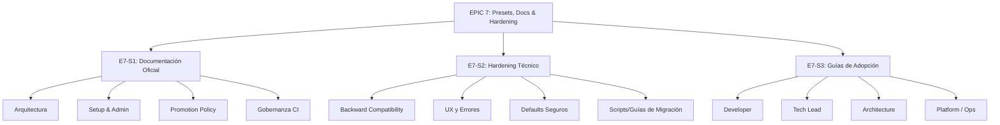

# Plan de Acción: EPIC 7 - Presets, Docs y Hardening

## Documento

- **Fecha**: 2026-04-29
- **Proyecto**: Cortex
- **Epic objetivo**: E7 - Presets, docs y hardening
- **Estado**: Planificación (sin implementación)
- **Dependencias**:
  - E1 a E6 en estado razonablemente estable
- **Fuentes base**:
  - `docs/enterprise/BACKLOG-Enterprise-Memory-Productization.md`
  - `docs/enterprise/PLAN-EPIC-6.md`

## 1. Resumen Ejecutivo

La Épica 7 es el esfuerzo final para cerrar la iniciativa "Enterprise Memory Productization" transformándola en un producto maduro, usable, explicable y sostenible a largo plazo. A diferencia de las épicas anteriores que se centraron en construir la maquinaria funcional (topologías, retrieval, promoción, gobernanza, setup y observabilidad), esta etapa busca garantizar que el producto no se rompa en producción, sea fácil de adoptar por diferentes tipos de usuarios (developers, tech leads, arquitectos, platform) y cuente con toda la documentación oficial.

## 2. Estado Actual Relevante

- **E1-E6** han implementado exitosamente las bases del comportamiento corporativo, incluyendo la configuración `.cortex/org.yaml`, un retrieval multi-nivel eficiente, pipeline auditable de promociones, un setup guiado (E5) y reporting de observabilidad (E6).
- Existen presets iniciales creados en E5 (`small-company`, `multi-project-team`, `regulated-organization`), pero requieren validación profunda y refinamiento de defaults.
- La funcionalidad opera bien en "caminos felices", sin embargo, se debe aplicar hardening frente a fallos o inconsistencias ("defaults peligrosos" o UX poco clara en los mensajes de error).
- Se ha generado gran cantidad de características que aún no están formalmente explicadas en guías de adopción o documentación de arquitectura.
- No hay estrategias explícitas para migrar desde repositorios configurados previamente con la versión no-enterprise de Cortex.

## 3. Objetivo y Alcance

### Objetivo principal

Cerrar la iniciativa Cortex Enterprise Productization como un producto pulido. El objetivo es entregar una documentación exhaustiva, guías de adopción claras por perfiles, presets seguros y un sistema robusto, sin degradar la experiencia de usuarios legacy (backward compatibility).

### Alcance incluido (V1)

- **Documentación**: Arquitectura final, setup enterprise, promotion policy y gobernanza CI.
- **Hardening Técnico**: Revisión de backward compatibility, limpieza de defaults inseguros, pulido de mensajes de error de CLI/runtime y manejo de migraciones desde setups locales de Cortex.
- **Guías de Adopción**: Creación de manuales para desarrolladores, tech leads, arquitectura y platform engineers/operaciones.
- **Checklists**: Preparación de checklists para lanzamiento interno, setup en clientes reales y migraciones.

### Fuera de alcance (V1)

- Introducción de nuevas funcionalidades u operaciones a nivel enterprise.
- Refactorizaciones profundas de las Epics 1 a 6 que no sean estrictamente de estabilización, control de fallos o backward compatibility.
- Entrenamiento o workshops en vivo (esto será parte de otro backlog de go-to-market).

## 4. Definition of Done (DoD)

La Épica 7 se considera completada cuando:

- La documentación de producto enterprise está completa y publicada/mergeada.
- Las guías de adopción (dev, tech lead, arquitecura, platform) están redactadas y claras.
- Se han ejecutado validaciones de código (hardening) cerrando defaults peligrosos o fallos silenciados y puliendo errores de CLI.
- Existen herramientas y/o guías para migrar proyectos antiguos a la nueva topología.
- Todos los checklists de lanzamiento y validación de adopciones son aprobados.

## 5. Diseño de Alto Nivel / Estructura Documental

A diferencia de diagramas de sistema, el esfuerzo de E7 se puede estructurar en tres grandes pilares:

## 6. Historias Técnicas Detalladas

### E7-S1 - Documentación de producto enterprise

- **Objetivo**: Escribir la documentación de referencia oficial de Cortex Enterprise.
- **Archivos foco**:
  - Directorio `docs/enterprise/`
  - `README.md` (Actualización)
- **Aceptación**:
  - Documento de arquitectura final (cómo interactúan memoria local, vault corporativo, retrieval y CLI).
  - Documento de setup enterprise (cómo usar `cortex setup enterprise`, presets).
  - Documento sobre promotion policy (reglas, `org.yaml`, validaciones).
  - Documento sobre gobernanza y CI (cómo conectar Cortex CI pipelines con políticas corporativas).

### E7-S2 - Hardening técnico

- **Objetivo**: Asegurar que Cortex Enterprise sea seguro por defecto y resistente a malas configuraciones, además de mantener viva la funcionalidad no-enterprise.
- **Archivos foco**:
  - Toda la base de código `cortex/enterprise/`
  - Controladores de CLI (`cortex/cli/`)
  - Manejadores de errores y parseadores YAML.
- **Aceptación**:
  - Pruebas que verifiquen que repositorios viejos (sin `org.yaml`) sigan funcionando como siempre.
  - Auditoría de los campos de `org.yaml` eliminando o asegurando defaults que puedan filtrar info accidentalmente.
  - Mensajes de error amigables (ej: si falta el vault corporativo, explicar claramente cómo configurarlo en lugar de lanzar un KeyError).
  - Diseño y validación de una guía/asistente de migración desde modo local a enterprise.

### E7-S3 - Adopcion por perfiles

- **Objetivo**: Habilitar el rollout interno y externo mediante la creación de playbooks orientados a diferentes roles dentro de las empresas.
- **Archivos foco**:
  - Directorio `docs/adoption/` o `docs/enterprise/guides/`
- **Aceptación**:
  - **Guía Developer**: Cómo interactuar con Cortex a diario sin fricción con el enterprise.
  - **Guía Tech Lead**: Cómo revisar promociones y guiar al equipo en el uso de memoria de proyecto.
  - **Guía Arquitectura**: Cómo estructurar repos y políticas en el macro-entorno.
  - **Guía Platform/Operaciones**: Cómo configurar Cortex CI/CD, administrar observabilidad y hacer deployment de los repos corporativos.

## 7. Archivos a Crear/Modificar

### Crear

- Documentos de Arquitectura, Setup, Políticas de Promoción y Gobernanza en `docs/enterprise/`.
- Guías de adopción por perfiles (`docs/enterprise/guides/`).
- Documento o script de ayuda a la migración (`docs/enterprise/migration_guide.md` o en la CLI).

### Modificar

- `README.md` principal del repositorio.
- `cortex/enterprise/config.py` y validadores para hardening de defaults.
- `cortex/cli/` para mejoras de UX en errores y posibles comandos de migración.

## 8. Plan de Testing / Revisión

- **Testing manual (Hardening)**: Ejecutar `cortex` en directorios antiguos (Cortex <= E1) para confirmar compatibilidad total.
- **Testing unitario**: Confirmar que los presets no cargan con configuraciones defectuosas por omisión. Tests de parseo frente a `org.yaml` corruptos.
- **Revisión de pares (Documentación)**: Lectura cruzada de los manuales de adopción, especialmente verificando que el flujo de trabajo del developer (que es el más afectado en la base) siga siendo simple y natural.
- **Simulaciones**: Simular el onboarding de una nueva empresa usando sólo los documentos recién generados.

## 9. Riesgos y Mitigaciones

- **Riesgo**: Que la documentación se retrase por depender de detalles muy técnicos.
  - **Mitigación**: Usar los planes y "Avances" de las Epicas 1-6 como base; la documentación debe ser un resumen estructurado de esos esfuerzos.
- **Riesgo**: Rotura de instalaciones locales ("Backward Compatibility").
  - **Mitigación**: Aplicar una política estricta de regresión; la ausencia de un flag de "enterprise" o de `org.yaml` debe saltarse toda la lógica enterprise y volver al fallback base.
- **Riesgo**: Sobrecargar a los developers con reglas corporativas complejas.
  - **Mitigación**: La Guía de Developer debe concentrarse en cómo la épica les beneficia sin añadir tareas pesadas; el overhead debe quedar en CI (E4) o al mando de los Leads (E3).

## 10. Orden Recomendado de Implementación

1. **E7-S2 (Hardening de Backward Compatibility & Defaults)**: Asegurar el código primero. Ajustar fallos, pulir los errores y garantizar que no haya regresiones.
2. **Migraciones**: Redactar/Probar el camino de migración de setups viejos a nuevos.
3. **E7-S1 (Documentación de Producto)**: Basándose en el código estable, documentar las capacidades y configuraciones formales (Arquitectura, Setup, Gobernanza, Promotion).
4. **E7-S3 (Guías de Adopción)**: Con el producto estable y la documentación técnica de referencia lista, redactar los playbooks enfocados en humanos.
5. **Generar los Checklists Finales**: Finalizar la épica y la iniciativa principal preparándose para el lanzamiento.

## 11. Checklist Final de Cierre

- [ ] Backward compatibility auditada y garantizada por tests.
- [ ] UX de la CLI pulida; los errores informan a los usuarios con sugerencias de acciones a tomar.
- [ ] Documentación técnica de referencia (`Arquitectura`, `Setup`, `Promotion`, `CI`) publicada.
- [ ] Playbooks de adopción (Dev, Tech Lead, Arquitecto, Platform) creados.
- [ ] Checklist interno de lanzamiento definido.
- [ ] Validada la estrategia de migración desde modo no-enterprise.
