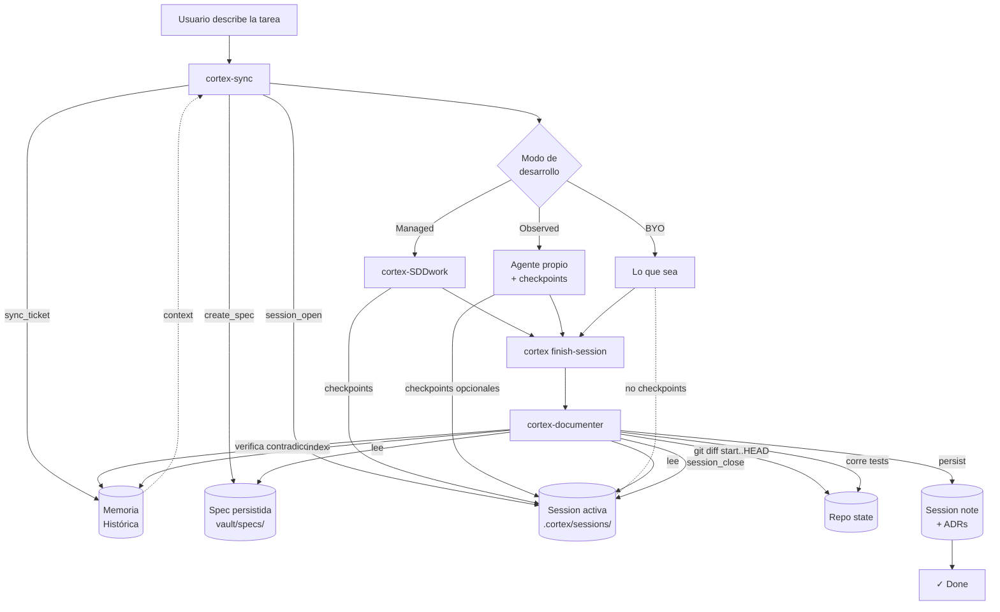

# Cortex: The Pluggable Middle Architecture

> **Documento arquitectónico** — Reformulación del modelo tripartito de Cortex para soportar workflows heterogéneos sin perder gobernanza.
>
> **Estado:** Propuesta. Pendiente de implementación.
> **Autor del diseño:** Sesión de iteración arquitectónica.
> **Pre-requisito de lectura:** `README.md`, `docs/agents/MEJORA-TRIPARTITO.md`.

---

## Índice

1. [El problema que resuelve esta arquitectura](#1-el-problema)
2. [El principio rector](#2-el-principio-rector)
3. [Visión general en una imagen](#3-vision-general)
4. [Los tres modos de operación](#4-los-tres-modos)
5. [La primitiva nueva: Session](#5-la-primitiva-session)
6. [El nuevo flujo end-to-end](#6-flujo-end-to-end)
7. [El documenter reborn (reconstrucción + interactivo)](#7-documenter-reborn)
8. [Verification hooks: el nuevo contrato del spec](#8-verification-hooks)
9. [Sesiones visibles: nueva superficie CLI](#9-sesiones-visibles)
10. [Cómo cambia cada pieza del framework](#10-cambios-por-pieza)
11. [Roadmap de implementación](#11-roadmap)
12. [Decisiones tomadas (Q&A)](#12-decisiones)
13. [Apéndice A: ejemplos de uso](#13-apendice-a)
14. [Apéndice B: glosario](#14-apendice-b)

---

<a name="1-el-problema"></a>
## 1. El problema que resuelve esta arquitectura

### 1.1 El estado actual

Cortex hoy impone un protocolo tripartito **obligatorio**:

```
┌──────────────┐    ┌─────────────────┐    ┌──────────────────┐
│ cortex-sync  │───▶│ cortex-SDDwork  │───▶│cortex-documenter │
│ (spec)       │    │ (implementa)    │    │ (persiste)       │
└──────────────┘    └─────────────────┘    └──────────────────┘
```

Esto funciona, pero **fuerza al usuario a trabajar con el agente de Cortex** en el medio. En la realidad, los desarrolladores ya tienen sus propios stacks:

- Cursor Composer con skills custom
- Claude Code con sus propios subagentes/skills
- Cline / Roo Code
- Codex con AGENTS.md
- Pi Coding Agent
- O simplemente picar a mano

**Forzar `cortex-SDDwork` en el medio es fricción que pocos van a pagar.** Pero **eliminar SDDwork** rompería todo lo que aporta valor para usuarios sin tooling propio.

### 1.2 La tensión a resolver

| Necesidad | Conflicto |
|---|---|
| Usuarios con tooling propio quieren libertad | SDDwork les agrega fricción innecesaria |
| Usuarios sin tooling se benefician de la disciplina | Eliminar SDDwork los deja sin guía |
| Cortex necesita garantizar calidad de memoria | Sin contrato, el documenter recibe basura |
| El framework debe ser opinionado | Pero no rígido al punto de excluir |

### 1.3 La solución en una frase

> **Hacer pluggable el middle, manteniendo intacto el contrato entrada/salida (spec → diff verificable).**

---

<a name="2-el-principio-rector"></a>
## 2. El principio rector

### 2.1 Inversión filosófica

**Antes (Cortex actual):**
> Cortex impone un protocolo. Los agentes cooperan emitiendo YAML estructurado entre ellos.

**Después (Pluggable Middle):**
> Cortex envuelve un workflow. Observa entrada (spec) y salida (estado verificable del repo), sin requerir cooperación del middle.

### 2.2 Las tres invariantes

1. **La spec es el contrato.** Lo que el sync produce es la fuente de verdad sobre qué se va a hacer.
2. **El diff es el resultado.** El estado verificable del repo (diff + tests + commits) es la fuente de verdad sobre qué se hizo.
3. **El medio es opaco.** Cortex no necesita saber cómo se produjo el diff. Solo necesita comparar diff vs spec.

### 2.3 Corolarios

- El documenter ya no depende de YAML cooperativo del middle.
- El "context extraction from chat" deja de ser necesario: el chat es ruido, el diff es señal.
- El handoff se vuelve **un comando explícito del usuario** (`cortex finish-session`), no una negociación entre agentes.

---

<a name="3-vision-general"></a>
## 3. Visión general en una imagen

```
┌─────────────────────────────────────────────────────────────────────────┐
│                                                                         │
│                           CORTEX FRAMEWORK                              │
│                                                                         │
│  ┌─────────────────────────────────────────────────────────────────┐    │
│  │                      SESSION (primitiva nueva)                  │    │
│  │  • spec_id   • start_commit   • status   • checkpoints[]        │    │
│  └─────────────────────────────────────────────────────────────────┘    │
│                                                                         │
│   ┌──────────────┐         ┌───────────────┐         ┌──────────────┐   │
│   │   SYNC       │ abre la │  *** MIDDLE   │ cierra  │  DOCUMENTER  │   │
│   │  (analista)  │ session │   PLUGGABLE   │ session │ (guardián)   │   │
│   │              │────────▶│      ***      │────────▶│              │   │
│   │ produce spec │         │               │         │ persiste     │   │
│   │ + verif.     │         │ Managed       │         │ session note │   │
│   │   hooks      │         │ Observed      │         │ + ADR(s)     │   │
│   │              │         │ BYO           │         │              │   │
│   └──────┬───────┘         └───────────────┘         └──────┬───────┘   │
│          │                                                  │           │
│          │              ┌──────────────────────┐            │           │
│          └─────────────▶│ MEMORIA HÍBRIDA RRF  │◀───────────┘           │
│                         │ episódica + semántica│                        │
│                         │   + enterprise       │                        │
│                         └──────────────────────┘                        │
│                                                                         │
└─────────────────────────────────────────────────────────────────────────┘
```

**Lectura del diagrama:**

- **Sync** y **Documenter** son las dos puntas **obligatorias** del framework.
- En el medio hay un slot **pluggable** que admite tres tipos de "middle".
- La **Session** es el contenedor que conecta los tres componentes, viva durante todo el ciclo.
- La **Memoria Híbrida** se nutre de sync (spec) y documenter (session note + ADRs).

---

<a name="4-los-tres-modos"></a>
## 4. Los tres modos de operación

### 4.1 Tabla comparativa

| Modo | Middle | Contrato disponible | Calidad de session note | Para quién |
|---|---|---|---|---|
| **🟢 Managed** | `cortex-SDDwork` | Spec + diff + checkpoints estructurados | **Máxima** | Usuarios sin tooling propio o que quieren disciplina |
| **🟡 Observed** | Agente del usuario + checkpoints opcionales (hooks o tool calls) | Spec + diff + checkpoints parciales | **Alta** | Cursor, Claude Code custom, etc. |
| **🔵 BYO (Bring Your Own)** | Cualquier cosa (otro agente, manual, vibe coding) | Spec + diff | **Buena** | Cualquiera, mínima fricción |

**Punto clave:** la calidad **degrada con gracia**. No se rompe.

### 4.2 Modo Managed (diagrama secuencial)

```
USER          SYNC         SESSION      SDDWORK      SUBAGENTS    DOCUMENTER
 │             │             │            │             │             │
 │  "fix bug"  │             │            │             │             │
 ├────────────▶│             │            │             │             │
 │             │  sync_ticket│            │             │             │
 │             ├─────────────│            │             │             │
 │             │  create_spec│            │             │             │
 │             ├────────────▶│  OPEN      │             │             │
 │             │             ├───────────▶│             │             │
 │             │             │            │ delegate    │             │
 │             │             │            ├────────────▶│             │
 │             │             │            │             │ explora     │
 │             │             │  checkpoint│             │             │
 │             │             │◀───────────┼─────────────┤             │
 │             │             │            │ delegate    │             │
 │             │             │            ├────────────▶│             │
 │             │             │            │             │ implementa  │
 │             │             │  checkpoint│             │             │
 │             │             │◀───────────┼─────────────┤             │
 │             │             │            │             │             │
 │  finish     │             │            │             │             │
 ├─────────────┼─────────────┼────────────┼─────────────┼────────────▶│
 │             │             │            │             │             │ lee Session
 │             │             │            │             │             │ verifica diff
 │             │             │            │             │             │ persiste
 │  ✓ done     │             │            │             │             │
 │◀────────────┼─────────────┼────────────┼─────────────┼─────────────┤
```

### 4.3 Modo Observed (diagrama secuencial)

```
USER         SYNC       SESSION     USER'S AGENT     IDE HOOK      DOCUMENTER
 │            │           │             │               │              │
 │ "fix bug"  │           │             │               │              │
 ├───────────▶│           │             │               │              │
 │            │ create_   │             │               │              │
 │            │ spec      │             │               │              │
 │            ├──────────▶│ OPEN        │               │              │
 │            │           │             │               │              │
 │ cursor:    │           │             │               │              │
 │ "implement"│           │             │               │              │
 ├────────────┼───────────┼────────────▶│               │              │
 │            │           │             │ trabaja...    │              │
 │            │           │             │               │              │
 │            │           │ checkpoint  │               │              │
 │            │           │◀────────────┤ (opcional)    │              │
 │            │           │             │               │              │
 │            │           │             │ git commit    │              │
 │            │           │             ├──────────────▶│              │
 │            │           │ checkpoint  │               │              │
 │            │           │◀────────────┼───────────────┤ (opcional)   │
 │            │           │             │               │              │
 │ finish     │           │             │               │              │
 ├────────────┼───────────┼─────────────┼───────────────┼─────────────▶│
 │            │           │             │               │              │ lee Session
 │            │           │             │               │              │ verifica diff
 │            │           │             │               │              │ merge checkpts
 │ ✓ done     │           │             │               │              │
 │◀───────────┼───────────┼─────────────┼───────────────┼──────────────┤
```

### 4.4 Modo BYO (diagrama secuencial)

```
USER          SYNC         SESSION       [ANYTHING]        DOCUMENTER
 │             │             │              │                 │
 │  "fix bug"  │             │              │                 │
 ├────────────▶│             │              │                 │
 │             │ create_spec │              │                 │
 │             ├────────────▶│ OPEN         │                 │
 │             │             │              │                 │
 │             │             │              │                 │
 │  desarrolla con lo que quiera (cualquier agente, manual)   │
 ├═════════════════════════════════════════▶│                 │
 │                                                            │
 │                                                            │
 │  finish-session                                            │
 ├════════════════════════════════════════════════════════════▶│
 │                                                            │ lee Session
 │                                                            │ reconstruye:
 │                                                            │  - diff = HEAD-start
 │                                                            │  - corre tests
 │                                                            │  - verif. claims
 │                                                            │  - busca contradic.
 │                                                            │ persiste
 │  ✓ done                                                    │
 │◀════════════════════════════════════════════════════════════│
```

**Observación crítica:** en BYO mode, el documenter es **fully autónomo**. No necesita NADA del middle. Solo necesita la Session (que contiene el spec y el start_commit) y el repo actual.

---

<a name="5-la-primitiva-session"></a>
## 5. La primitiva nueva: Session

### 5.1 Definición

La **Session** es el contenedor que ancla todo el ciclo de vida. Es lo que hace posible el pluggable middle.

### 5.2 Schema

```yaml
# .cortex/sessions/2026-05-16_auth-jwt-refresh.yaml
session_id: 2026-05-16_auth-jwt-refresh
spec_path: vault/specs/2026-05-16_auth-jwt-refresh.md
spec_summary: "Implementar refresh tokens JWT con rotación"

# Snapshot del repo al abrir
start_commit: abc123def456
start_branch: feature/jwt-refresh
opened_at: 2026-05-16T10:00:00Z

# Estado actual
status: open           # open | closed | handoff | abandoned
mode: unknown          # managed | observed | byo (se infiere al cerrar)

# Enriquecimiento opcional
checkpoints:
  - timestamp: 2026-05-16T10:15:00Z
    source: cortex-code-explorer
    verified_claims: ["dependency graph mapped"]
    artifacts_touched: []
    note: ""
  - timestamp: 2026-05-16T10:45:00Z
    source: cortex-code-implementer
    verified_claims: ["JWT validation added"]
    unverified_claims: ["performance negligible"]
    artifacts_touched: ["src/auth.py", "src/middleware.py"]
    note: "TTL hardcodeado por ahora"

# Cierre
closed_at: null
end_commit: null
documenter_decision: null  # "complete" | "handoff" | "abandoned"
session_note_path: null    # vault/sessions/...
adrs_created: []
```

### 5.3 Lifecycle (diagrama de estados)

```
                  cortex_session_open
                   (auto al create-spec)
                          │
                          ▼
                    ┌──────────┐
              ┌────▶│   OPEN   │
              │     └────┬─────┘
              │          │
              │ ┌────────┼─────────┐
              │ │        │         │
              │ ▼        ▼         ▼
       checkpoint   finish     abandon
              │     normal       │
              │        │         │
              │        ▼         ▼
              │  ┌──────────┐ ┌───────────┐
              │  │ CLOSED   │ │ABANDONED  │
              │  │(complete)│ │           │
              │  └──────────┘ └───────────┘
              │
              │        ▼ (si checks fallan)
              │  ┌──────────┐
              │  │ HANDOFF  │
              │  └──────────┘
              │
              └─── puede recibir más checkpoints
                   mientras está OPEN
```

### 5.4 MCP tools nuevas

| Tool | Quién la llama | Cuándo |
|---|---|---|
| `cortex_session_open(spec_id)` | Internamente desde `cortex_create_spec` | Auto al crear spec |
| `cortex_session_checkpoint(session_id, source, claims, ...)` | Cualquier agente o hook | Durante el desarrollo |
| `cortex_session_close(session_id, intent)` | Usuario via CLI o agente al final | Al terminar |
| `cortex_session_status(session_id)` | Cualquiera (debugging, agentes que quieren contexto) | En cualquier momento |
| `cortex_session_list(status?)` | CLI principalmente | Para ver qué hay activo |

---

<a name="6-flujo-end-to-end"></a>
## 6. El nuevo flujo end-to-end

### 6.1 Diagrama unificado (Mermaid)



### 6.2 Decision tree del usuario

```
                  ¿Cómo querés desarrollar?
                          │
          ┌───────────────┼──────────────────┐
          │               │                  │
          ▼               ▼                  ▼
    Soy nuevo,       Tengo mis           Quiero
    quiero guía      skills/agente       hacerlo libre
          │               │                  │
          ▼               ▼                  ▼
   ┌──────────┐   ┌──────────────┐   ┌──────────────┐
   │  MANAGED │   │  OBSERVED    │   │   BYO        │
   │  SDDwork │   │  Tu agente   │   │  Manual / *  │
   └──────────┘   └──────────────┘   └──────────────┘
          │               │                  │
          └───────────────┴──────────────────┘
                          │
                          ▼
                ┌──────────────────┐
                │  finish-session  │  ← punto único de cierre
                └──────────────────┘
                          │
                          ▼
                ┌──────────────────┐
                │   documenter     │  ← misma calidad de gobernanza
                └──────────────────┘
```

---

<a name="7-documenter-reborn"></a>
## 7. El documenter reborn (reconstrucción + interactivo)

### 7.1 La promoción del documenter

El documenter pasa de ser **consumidor de YAML** a ser **agente autónomo de gobernanza**. Es el que tiene más responsabilidad en la nueva arquitectura.

### 7.2 Algoritmo de reconstrucción

```
INPUT: session_id
OUTPUT: AgentHandoff sintético + decisiones (ADR, session note, etc.)

STEP 1: Cargar contexto
  ├─ session = read(.cortex/sessions/<id>.yaml)
  ├─ spec = read(session.spec_path)
  └─ checkpoints = session.checkpoints (puede estar vacío en BYO)

STEP 2: Computar diff observable
  ├─ diff = git diff session.start_commit..HEAD
  ├─ files_touched = parse_diff(diff)
  └─ end_commit = git rev-parse HEAD

STEP 3: Ejecutar verification hooks (del spec)
  ├─ for hook in spec.verification_hooks:
  │     result = run(hook.command)
  │     record(hook.name, result.passed, result.output)
  └─ verification_results = {...}

STEP 4: Cross-check contra realidad
  ├─ files_in_scope_check = (files_touched ⊆ spec.files_in_scope)?
  ├─ scope_drift = files_touched − spec.files_in_scope
  ├─ unimplemented = spec.files_in_scope − files_touched
  └─ contradictions = cortex_search(spec.summary, find=conflicting)

STEP 5: Construir AgentHandoff sintético
  ├─ verified_claims = derived from diff + tests
  ├─ unverified_claims = from spec.acceptance_criteria that diff doesn't prove
  ├─ artifacts_produced = files_touched
  ├─ context_for_next = checkpoints.flat() + scope_drift_notes
  └─ suggested_adr = apply 3/3 criteria over decisions in checkpoints + diff

STEP 6: Decidir modo de cierre
  ├─ if all verification_hooks passed AND no unimplemented:
  │     status = complete
  ├─ elif partial implementation OR some hooks failed:
  │     status = handoff (write next-session-needs)
  └─ else:
        status = abandoned (con razones)

STEP 7: [SI MODO INTERACTIVO] Pedir confirmación al usuario
  ├─ Mostrar resumen del session note antes de persistir
  ├─ Mostrar ADRs sugeridos para aprobar/rechazar
  ├─ Permitir editar inline
  └─ Esperar confirmación

STEP 8: Persistir
  ├─ write_session_note(...)
  ├─ for adr in approved_adrs: write_adr(...)
  ├─ update CONTEXT.md if new terms
  ├─ index in episodic + semantic memory
  └─ session_close(session_id, status)
```

### 7.3 Documenter: dos modos de operación

El usuario puede elegir entre **automático** e **interactivo** (ver decisión Q3 más abajo).

```
                  ┌─────────────────────────┐
                  │   cortex finish-session │
                  └────────────┬────────────┘
                               │
                ┌──────────────┴──────────────┐
                │                             │
                ▼                             ▼
       ┌─────────────────┐         ┌──────────────────┐
       │   AUTO MODE     │         │ INTERACTIVE MODE │
       │   (default)     │         │  (--interactive) │
       └────────┬────────┘         └────────┬─────────┘
                │                           │
                ▼                           ▼
         documenter ejecuta            documenter ejecuta
         los 6 primeros pasos          los 6 primeros pasos
                │                           │
                ▼                           ▼
         persiste directo             muestra resumen al usuario:
                │                       - draft session note
                │                       - ADRs sugeridos
                │                       - discrepancias detectadas
                │                       - scope drift
                │                           │
                │                           ▼
                │                     usuario: aprueba/edita/rechaza
                │                           │
                │                           ▼
                │                     persiste con ediciones
                │                           │
                └────────────┬──────────────┘
                             ▼
                     ┌──────────────┐
                     │ Session cerrada │
                     │ Memoria indexada│
                     └─────────────────┘
```

### 7.4 Modo interactivo: qué ve el usuario

Mockup de la UX:

```
$ cortex finish-session --interactive

📋 Resumen de la sesión 2026-05-16_auth-jwt-refresh

Spec: vault/specs/2026-05-16_auth-jwt-refresh.md
Diff: 4 archivos modificados, +127 -45 líneas
Tests: ✅ 12/12 pasaron
Duración: 1h 34min

═══════════════════════════════════════════════════════════════════
DRAFT SESSION NOTE
═══════════════════════════════════════════════════════════════════

# JWT Refresh Token Implementation
status: completed
date: 2026-05-16

## Cambios verificados
- src/auth.py: validación JWT con rotación de refresh tokens
- src/middleware.py: nuevo middleware de renovación
- tests/auth_test.py: 5 nuevos tests

## Decisiones in-flight
- TTL hardcodeado a 7 días (ver decisión sugerida más abajo)
- bcrypt en lugar de argon2 (Lambda no soporta argon2)

## Discrepancias detectadas
⚠️ Spec listó tests/middleware_test.py en scope, pero no fue tocado.

═══════════════════════════════════════════════════════════════════
ADRs SUGERIDOS
═══════════════════════════════════════════════════════════════════

🟡 Sugerencia 1: ADR-2026-05-16 - "TTL hardcodeado de 7 días"
   Criterios:
     ✓ Hard to reverse (rotación cambia experiencia de usuario)
     ✓ Surprising sin contexto
     ✓ Trade-off real (vs config dinámica)
   → ¿Crear ADR? [Y/n/edit]

🔴 Sugerencia 2: ADR-2026-05-16 - "Renombramos userId a user_id"
   Criterios:
     ✗ No es hard-to-reverse
     ✗ No es sorprendente
     ✗ No hay trade-off
   → No cumple criterios. Se anotará en session note.

═══════════════════════════════════════════════════════════════════
ACCIONES
═══════════════════════════════════════════════════════════════════

[A]probar y persistir
[E]ditar session note inline
[H]andoff en lugar de complete (si el trabajo no terminó)
[C]ancelar (la sesión queda abierta)

>
```

---

<a name="8-verification-hooks"></a>
## 8. Verification hooks: el nuevo contrato del spec

### 8.1 Decisión tomada

**Los verification_hooks son OBLIGATORIOS en el spec.** Ver decisión Q2 en §12.

Esto sube la barra de calidad del spec, lo cual es exactamente el cambio que necesitamos para que el modo BYO funcione bien.

### 8.2 Nuevo formato del spec

```yaml
---
spec_id: 2026-05-16_auth-jwt-refresh
title: "Implementar refresh tokens JWT"
goal: "Permitir renovación de sesiones sin re-login"
files_in_scope:
  - src/auth.py
  - src/middleware.py
  - tests/auth_test.py
constraints:
  - "Compatible con AWS Lambda runtime"
  - "No introducir dependencias nuevas"
acceptance_criteria:
  - "Refresh token rota cada 7 días"
  - "Token revocado invalida la sesión"
  - "Auth response incluye refresh_token field"

# NUEVO: verification_hooks (obligatorio, mínimo 1)
verification_hooks:
  - name: "Tests unitarios"
    command: "pytest tests/auth_test.py -v"
    required: true
    success_criteria: "exit code 0"

  - name: "Type check"
    command: "mypy src/auth.py src/middleware.py"
    required: true
    success_criteria: "exit code 0"

  - name: "Lint"
    command: "ruff check src/auth.py src/middleware.py"
    required: false
    success_criteria: "exit code 0"
---
```

### 8.3 Por qué obligatorios

| Sin verification_hooks | Con verification_hooks |
|---|---|
| El documenter en BYO mode adivina si el trabajo terminó | El documenter sabe objetivamente si terminó |
| El sync produce specs vagos ("implementar feature X") | El sync se ve forzado a pensar cómo se verifica |
| Acceptance criteria son prosa | Acceptance criteria son ejecutables |
| Los usuarios pueden "cerrar" sesiones rotas | Las sesiones se cierran como `handoff` si verif. falla |

**El costo a corto plazo:** el sync tiene que pensar más antes de escribir el spec. **El beneficio a largo plazo:** todo el modo BYO funciona, y la memoria queda mucho más limpia.

### 8.4 Casos donde no hay tests (research, docs)

Si el spec no toca código (ej. tarea de research, escritura de docs), el verification_hook puede ser:

```yaml
verification_hooks:
  - name: "Documento entregado"
    command: "test -f docs/research-output.md"
    required: true
    success_criteria: "exit code 0"
```

O más simple: si la tarea no produce diff, sync puede marcar el spec con `type: research` y verification_hooks puede ser una checklist manual.

---

<a name="9-sesiones-visibles"></a>
## 9. Sesiones visibles: nueva superficie CLI

### 9.1 Decisión tomada

**Las sesiones son entidades de primera clase, visibles al usuario.** Ver decisión Q1 en §12.

### 9.2 Comandos nuevos

```bash
# Ver qué sesión está activa
cortex session current

# Listar todas las sesiones
cortex session list
cortex session list --status=open
cortex session list --status=handoff

# Ver detalle de una sesión
cortex session show 2026-05-16_auth-jwt-refresh

# Cerrar una sesión (alias de finish-session)
cortex session close 2026-05-16_auth-jwt-refresh

# Cerrar como handoff (trabajo incompleto)
cortex session close --handoff --reason="Tests rojos por race condition"

# Abandonar una sesión sin documentar (con confirmación)
cortex session abandon 2026-05-16_auth-jwt-refresh

# Cambiar la sesión activa (si hay múltiples abiertas)
cortex session switch 2026-05-16_other-task

# Diff de la sesión actual (lo que se desarrolló desde que se abrió)
cortex session diff

# Status detallado: spec + checkpoints + diff resumido
cortex session status
```

### 9.3 Output ejemplo: `cortex session list`

```
$ cortex session list

ACTIVE SESSIONS

ID                                       STATUS    AGE      MODE      SPEC
─────────────────────────────────────────────────────────────────────────────────
► 2026-05-16_auth-jwt-refresh            open      1h 34m   managed   JWT refresh tokens
  2026-05-15_dashboard-charts            open      1d 2h    observed  Dashboard de métricas

RECENT (last 7 days)

ID                                       STATUS    CLOSED   MODE      NOTES
─────────────────────────────────────────────────────────────────────────────────
  2026-05-15_login-redesign              closed    9h ago   byo       1 ADR
  2026-05-14_metrics-endpoint            handoff   1d ago   managed   2 next-needs
  2026-05-13_security-headers            closed    2d ago   managed   0 ADRs

► = currently active
```

### 9.4 Output ejemplo: `cortex session show`

```
$ cortex session show 2026-05-16_auth-jwt-refresh

📋 Session: 2026-05-16_auth-jwt-refresh
   Status:    🟢 open
   Mode:      managed (cortex-SDDwork)
   Opened:    2026-05-16 10:00 (1h 34m ago)
   Spec:      vault/specs/2026-05-16_auth-jwt-refresh.md

📊 Progress
   Files touched: 4 (3 in scope, 1 out of scope ⚠️)
   Lines:         +127 -45
   Commits:       3 since start_commit
   Tests:         12 passing (last run: 12m ago)

📍 Checkpoints (2)
   ├─ 10:15 cortex-code-explorer  → "dependency graph mapped"
   └─ 10:45 cortex-code-implementer
            → "JWT validation added"
            ⚠️ unverified: "performance negligible"

🎯 Spec Verification
   ├─ ✅ Tests unitarios (last passed: 12m ago)
   ├─ ⏸  Type check (not yet run)
   └─ ⏸  Lint (not yet run)

   Run all: cortex session verify

💡 Next step: cortex finish-session (or cortex session close --interactive)
```

### 9.5 Por qué visibles

- **Debugabilidad:** el usuario puede ver qué está pasando, no es magia.
- **Multi-tasking:** soporta múltiples sesiones en paralelo (varios specs activos a la vez).
- **Recuperación:** si algo se rompe, el usuario puede inspeccionar y rescatar.
- **Transparencia educativa:** el usuario nuevo aprende cómo funciona el framework viendo las sessions.

---

<a name="10-cambios-por-pieza"></a>
## 10. Cómo cambia cada pieza del framework

### 10.1 Resumen tabular

| Pieza | Cambio | Esfuerzo |
|---|---|---|
| `cortex-sync` (skill) | Agrega verification_hooks; abre Session; ofrece 3 caminos al final | S |
| `cortex-SDDwork` (skill) | Pierde estatus obligatorio; escribe checkpoints en vez de YAML inline | M |
| `cortex-documenter` (subagent) | Modo reconstrucción (autónomo) + modo interactivo | L |
| `cortex/handoff.py` | Mantiene schema, pero ya no es el contrato principal | XS |
| `cortex/session/` (NUEVO) | Módulo nuevo: SessionRecord, lifecycle, persistencia | M |
| `cortex/mcp/server.py` | + 5 tools nuevas (session_open/checkpoint/close/status/list) | M |
| `cortex/services/spec_service.py` | Crea Session al persistir spec; valida verification_hooks | S |
| `cortex/services/session_service.py` | Renombrar a `note_service.py`; integrar con Session | S |
| `cortex/cli/main.py` | Nuevos comandos `session ...` | S |
| `cortex/autopilot/` | Fusion: re-implementar Autopilot sobre Sessions | L |
| Templates (`session.md.j2`, `spec.md.j2`) | Spec template incluye verification_hooks | XS |

### 10.2 Sync (cambios concretos)

**Antes:**
```
1. cortex_sync_ticket()
2. read CONTEXT.md
3. glob + read
4. cortex_create_spec(...)
5. emit YAML handoff
6. "cambia al perfil cortex-SDDwork"
```

**Después:**
```
1. cortex_sync_ticket()
2. read CONTEXT.md
3. glob + read
4. cortex_create_spec(..., verification_hooks=[...])  ← MANDATORY
   └─ internamente: cortex_session_open()
5. ofrecer 3 caminos al usuario:
   "Spec lista. ¿Cómo querés desarrollar?
    1. cortex-SDDwork (managed, recomendado para empezar)
    2. Tu agente preferido (Cortex observará el resultado)
    3. Manual / libre
    Al terminar: cortex finish-session"
```

### 10.3 SDDwork (cambios concretos)

**Antes:** orquestador con responsabilidad de YAML handoff validation.

**Después:** orquestador opcional que escribe checkpoints. El prompt se simplifica:

```markdown
# Cortex SDDwork - Managed Implementation Mode (Optional)

## Cuándo se usa
- Usuario sin tooling propio
- Usuario que quiere disciplina forzada
- Tareas complejas que se benefician de explorer + implementer separados

## Tu trabajo
1. Leer spec.
2. Decidir Fast Track vs Deep Track (heurística existente).
3. Ejecutar el flujo (delegando o no según el track).
4. **En cada paso significativo**, llamar a cortex_session_checkpoint
   con: verified_claims, unverified_claims, artifacts_touched, note.
5. Al terminar: NO emitas YAML. Decile al usuario que corra finish-session.

## Lo que YA NO hacés
- Validar YAML handoffs (los checkpoints son validados por el MCP).
- Pasar contexto al documenter (lo lee desde Session).
- Llamar a documenter directamente (el usuario lo dispara con finish-session).
```

### 10.4 Documenter (cambios concretos)

**Antes:** consume YAML handoff, verifica claims, persiste.

**Después:**
- **Modo auto** (default): reconstruye + persiste sin preguntar.
- **Modo interactivo** (flag): reconstruye + muestra draft + espera aprobación.
- Lee Session ID en lugar de YAML inline.
- Algoritmo de reconstrucción (§7.2) reemplaza el "consume handoff".
- Verification gate actual se mantiene, pero opera sobre datos reconstruidos.
- ADR criteria 3/3 se mantiene.
- CONTEXT.md maintenance se mantiene.

### 10.5 Autopilot (fusion)

Decisión Q4: **no hay usuarios reales todavía → fusion libre.**

**Plan:** re-escribir Autopilot como capa de **políticas + hooks IDE** sobre la Session primitiva.

```
ANTES                              DESPUÉS
─────                              ────────
cortex autopilot start         →  cortex session open (auto en create-spec)
cortex autopilot checkpoint    →  cortex session checkpoint
cortex autopilot finish        →  cortex finish-session
cortex autopilot status        →  cortex session show
cortex autopilot doctor        →  cortex doctor (sección sessions)

cortex autopilot install --ide →  cortex session hooks install --ide
  └─ instala hooks que          (los hooks ahora emiten
     interceptan el lifecycle    cortex_session_checkpoint en eventos
                                 del IDE: commit, test, file save)
```

Los modos `observe | assist | autopilot` se mantienen como configuración del comportamiento, no como objetos paralelos.

---

<a name="11-roadmap"></a>
## 11. Roadmap de implementación

### 11.1 Visión general

```
Fase 0          Fase 1          Fase 2          Fase 3          Fase 4
Foundations     Documenter      SDDwork         Autopilot       Polish
                Reconstruction  Migration       Fusion          & Docs
   │               │               │               │               │
   ▼               ▼               ▼               ▼               ▼
┌──────────┐  ┌──────────┐  ┌──────────┐  ┌──────────┐  ┌──────────┐
│ Session  │  │   BYO    │  │ Managed  │  │ Observed │  │ Manifest │
│  primitiva  │   mode    │  │  mode    │  │   mode   │  │  + docs  │
│ MCP tools │  │ funciona │  │ unif.    │  │  + hooks │  │ + tests  │
│  CLI base │  │          │  │          │  │   IDE    │  │          │
└──────────┘  └──────────┘  └──────────┘  └──────────┘  └──────────┘
   ~1 wk         ~2 wk         ~1 wk         ~2 wk         ~1 wk
```

### 11.2 Fase 0 - Foundations (sin breaking changes)

**Goal:** establecer la primitiva Session sin afectar nada del flujo actual.

- [ ] Crear módulo `cortex/session/`:
  - `models.py` (SessionRecord, Checkpoint, schemas Pydantic)
  - `service.py` (SessionService: open, checkpoint, close, status, list)
  - `storage.py` (persistencia en `.cortex/sessions/`)
- [ ] MCP tools: `cortex_session_open`, `cortex_session_checkpoint`, `cortex_session_close`, `cortex_session_status`, `cortex_session_list`
- [ ] CLI: `cortex session` subcommand con `current/list/show/diff`
- [ ] Integrar `session_open` en `cortex_create_spec` (silent, no breaking)
- [ ] Tests unitarios del módulo
- [ ] Doctor: `cortex doctor --section sessions`

**Resultado:** Sessions se crean automáticamente con cada spec. Visibles via CLI. Pero nada las usa todavía. El flujo actual sigue funcionando 100% igual.

### 11.3 Fase 1 - Documenter Reconstruction Mode (habilita BYO)

**Goal:** el documenter puede operar sin handoff YAML.

- [ ] Implementar algoritmo de reconstrucción (§7.2) en `cortex/documenter/reconstruction.py`
- [ ] CLI: `cortex finish-session` (alias: `cortex session close`)
- [ ] Documenter subagent prompt actualizado para detectar modo:
  - Si recibe YAML handoff → modo legacy (compat)
  - Si recibe session_id → modo reconstrucción
- [ ] Verification hooks runner: `cortex/session/verification.py`
- [ ] Tests E2E: BYO scenario (crear spec, modificar archivos a mano, finish-session)
- [ ] Update `cortex-sync.md` skill: ofrecer 3 caminos al final

**Resultado:** **BYO mode funcional.** El usuario puede crear un spec, desarrollar con cualquier herramienta, correr `cortex finish-session`, y el documenter persiste correctamente.

### 11.4 Fase 2 - SDDwork Migration

**Goal:** SDDwork escribe checkpoints en lugar de YAML; el documenter en managed mode usa los mismos paths que en BYO.

- [ ] Actualizar `cortex-SDDwork.md` skill: emitir checkpoints en cada paso
- [ ] Actualizar subagents `cortex-code-explorer.md` y `cortex-code-implementer.md`: emitir checkpoints
- [ ] Eliminar dependencia del documenter de YAML handoff inline
- [ ] Mantener `cortex/handoff.py` como schema válido pero no como contrato obligatorio (deprecation soft)
- [ ] Update tests E2E: managed scenario funciona idéntico al usuario

**Resultado:** Managed y BYO usan el mismo backbone. Menos código duplicado.

### 11.5 Fase 3 - Autopilot Fusion + Observed Mode

**Goal:** unificar Autopilot con Sessions; habilitar hooks IDE para Observed mode.

- [ ] Re-implementar Autopilot lifecycle sobre Sessions:
  - `start` → wrapper de `session_open` con políticas
  - `checkpoint` → wrapper de `session_checkpoint`
  - `finish` → wrapper de `finish-session` con políticas
- [ ] Mantener modos `observe | assist | autopilot` como configuración
- [ ] Hooks IDE adapters:
  - Claude Code: hook on tool_use post → session_checkpoint
  - Cursor: command palette + git hooks
  - Pi: integración con just/pipeline
- [ ] CLI: `cortex session hooks install --ide <name>`

**Resultado:** **Observed mode funcional.** El usuario con Cursor instala el hook, y los commits + tests pasados se registran automáticamente como checkpoints.

### 11.6 Fase 4 - Documenter Interactive Mode + Polish

**Goal:** el documenter pregunta al usuario en modo interactivo; polish general.

- [ ] Implementar UX del modo interactivo (§7.4)
- [ ] Flag `--interactive` en `finish-session`
- [ ] Config: `documenter.default_mode: auto | interactive` en `config.yaml`
- [ ] Update README + Manifiesto
- [ ] Update docs en `docs/architecture/` con esta arquitectura
- [ ] Tests E2E: interactive scenario
- [ ] Update doctor para validar la nueva infra completa
- [ ] Migration guide para usuarios de versiones previas (aunque no hay)

**Resultado:** framework completo, documentado, ambos modos del documenter disponibles.

### 11.7 Total estimado

~7 semanas para llegar al estado final. Pero **Fase 1 ya entrega el 70% del valor** en ~3 semanas.

---

<a name="12-decisiones"></a>
## 12. Decisiones tomadas (Q&A)

Estas son las cuatro preguntas que se respondieron durante la iteración arquitectónica.

### Q1: ¿Sesiones visibles o invisibles?

**Decisión:** Visibles, entidades de primera clase.

**Razones:**
- Debugabilidad: el usuario puede inspeccionar qué está pasando.
- Multi-tasking: soporte natural para múltiples specs en paralelo.
- Transparencia educativa.
- El costo de UX es bajo (un sub-comando bien diseñado).

**Implementación:** §9.

---

### Q2: ¿verification_hooks obligatorios u opcionales?

**Decisión:** Obligatorios.

**Razones:**
- Sin verification_hooks, el modo BYO funciona mal (el documenter adivina).
- Sin verification_hooks, los specs siguen siendo prosa vaga.
- **Lo que cuesta hoy es bueno para después**: forzar al sync a pensar cómo se verifica eleva la calidad del framework completo.
- No hay usuarios todavía (Q4), por lo que la fricción a corto plazo no penaliza a nadie.

**Mitigaciones para casos edge:**
- Tareas de research: hook puede ser `test -f docs/output.md`.
- Tareas sin código: spec puede marcarse como `type: research`, hooks son checklist manual.

**Implementación:** §8.

---

### Q3: ¿Documenter auto o interactivo?

**Decisión:** Ambos, configurable. Default `auto`, flag `--interactive` para activar el modo guiado.

**Razones:**
- Auto sirve a usuarios que quieren velocidad.
- Interactivo sirve a usuarios que quieren detectar errores/desvíos.
- La complejidad incremental es razonable: el algoritmo de reconstrucción es el mismo; solo cambia el UI final.
- Config a nivel proyecto (`config.yaml`): `documenter.default_mode: auto | interactive`.

**Implementación:** §7.3 y §7.4. Es Fase 4 en el roadmap.

---

### Q4: ¿Autopilot fusion: prioridad alta o nice-to-have?

**Decisión:** Fusion libre, prioridad media-alta.

**Razones:**
- No hay usuarios reales → no hay penalización por breaking changes.
- Autopilot conceptualmente es la misma cosa que Sessions. Tenerlos separados es deuda técnica.
- Mejor consolidar ahora que después de tener usuarios.

**Implementación:** Fase 3 del roadmap (§11.5).

---

<a name="13-apendice-a"></a>
## 13. Apéndice A: ejemplos de uso

### A.1 Modo Managed (usuario nuevo)

```bash
# 1. Pedir el feature
$ claude-code "Quiero agregar logging estructurado a auth service"
# Claude usa skill cortex-sync automáticamente

# 2. Sync trabaja
[sync] sync_ticket → recupera contexto histórico
[sync] create_spec → vault/specs/2026-05-16_logging-auth.md
[sync] session abierta: 2026-05-16_logging-auth

[sync] ✅ Spec lista. ¿Cómo querés desarrollar?
       1. cortex-SDDwork (recomendado - guiado)
       2. Tu propio agente
       3. Manual

# 3. Usuario elige 1
> 1

# 4. SDDwork ejecuta
[SDDwork] Fast Track detectado (2 archivos)
[SDDwork] Implementando auth.py + middleware.py
[SDDwork] checkpoint: "logging configurado, tests pasando"

[SDDwork] ✅ Implementación terminada. Cuando estés listo:
          $ cortex finish-session

# 5. Usuario cierra
$ cortex finish-session
[documenter] Reconstruyendo desde Session 2026-05-16_logging-auth
[documenter] Diff: 2 archivos, +45 -3 líneas
[documenter] Verification hooks: ✅ tests, ✅ types, ✅ lint
[documenter] Session note: vault/sessions/2026-05-16_logging-auth.md
[documenter] ADRs: 0 (no cumple criterios 3/3)
[documenter] ✅ Indexado en memoria episódica + semántica
```

### A.2 Modo Observed (Cursor power user)

```bash
# 1. Sync produce spec
$ cortex create-spec --title "Dashboard charts refactor"
# Session abierta

# 2. Usuario instala hook de Cursor (una vez)
$ cortex session hooks install --ide cursor
# Cursor ahora emite checkpoint en cada git commit

# 3. Usuario trabaja en Cursor con sus skills custom
# - Cursor Composer hace cambios
# - Usuario commitea: hook emite checkpoint automático
# - Tests corren: hook emite checkpoint con resultado

# 4. Inspecciona progreso
$ cortex session show
# Muestra checkpoints registrados por el hook

# 5. Termina
$ cortex finish-session --interactive
# Documenter muestra draft, usuario aprueba
```

### A.3 Modo BYO (vibe coding total)

```bash
# 1. Sync
$ cortex create-spec --title "Refactor footer styling"
# Session abierta

# 2. Usuario hace lo que quiere (otro agente, manual, lo que sea)
# Sin checkpoints, sin nada

# 3. Cierra
$ cortex finish-session
[documenter] Reconstruyendo desde Session 2026-05-16_footer
[documenter] Modo: BYO (0 checkpoints)
[documenter] Diff: 1 archivo, +12 -8 líneas
[documenter] Verification hooks: ✅ visual snapshot tests
[documenter] ✅ Session note persistida
```

### A.4 Modo Handoff (trabajo incompleto)

```bash
$ cortex finish-session --handoff --reason="bcrypt incompatible con Lambda"

[documenter] Status: handoff
[documenter] Verification hooks: ❌ tests (3 fallando)
[documenter] Files in scope no tocados: tests/auth_integration_test.py

[documenter] Session note (handoff): vault/sessions/2026-05-16_auth_handoff.md
  next-session-needs:
    - Evaluar argon2 puro Python o sticking with bcrypt+legacy
    - Completar integration tests
  blockers:
    - AWS Lambda no soporta argon2 nativo
  verified-state:
    - JWT generation OK
    - Validation OK
  unverified-claims:
    - Performance bajo carga
```

---

<a name="14-apendice-b"></a>
## 14. Apéndice B: Glosario

| Término | Definición |
|---|---|
| **Session** | Primitiva nueva. Contenedor con spec_id + start_commit + checkpoints + status. Vive desde `create-spec` hasta `finish-session`. |
| **Checkpoint** | Registro estructurado opcional que cualquier agente o hook puede agregar a una Session durante el desarrollo. |
| **Pluggable Middle** | Filosofía arquitectónica que permite cualquier herramienta entre `sync` y `documenter`. |
| **Managed Mode** | Modo donde `cortex-SDDwork` es el middle. Máxima disciplina. |
| **Observed Mode** | Modo donde un agente externo es el middle pero emite checkpoints (manualmente o via hooks IDE). |
| **BYO Mode** | "Bring Your Own". Sin middle cooperativo. Cortex reconstruye todo desde diff observable. |
| **Reconstruction Mode** | Modo del documenter donde sintetiza un AgentHandoff equivalente desde spec + diff + tests, sin recibir YAML cooperativo. |
| **Verification Hooks** | Comandos ejecutables definidos en el spec que prueban objetivamente que el trabajo está hecho. |
| **Interactive Mode** | Modo del documenter donde muestra draft + ADRs sugeridos al usuario antes de persistir. |
| **Finish-session** | Comando que dispara el cierre: documenter reconstruye, verifica, persiste, cierra Session. |

---

## Estado del documento

- **Versión:** 1.0 (propuesta inicial)
- **Próximos pasos sugeridos:**
  1. Revisar y refinar este documento iterativamente.
  2. Crear specs ejecutables para cada Fase del roadmap (recursión meta: usar `cortex create-spec` para diseñar Fase 0).
  3. Comenzar implementación de Fase 0 cuando el diseño esté consolidado.

> **Nota:** Este documento es **propuesta arquitectónica**. No representa el estado actual del código. Para el estado actual, ver README.md y los docs en `docs/`.
