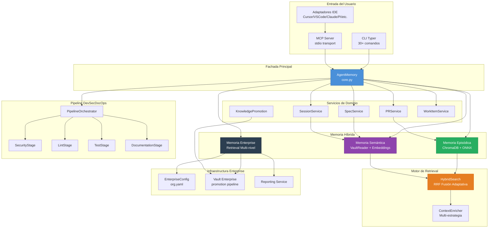

# Cortex Enterprise — Informe de Revisión Arquitectónica

**Fecha:** 2026-05-03  
**Alcance:** Análisis exhaustivo del proyecto Cortex v3.0 Enterprise  
**Autor:** Análisis automatizado de revisión de software  

---

## 1. Introducción al Proyecto

### 1.1 ¿Qué es Cortex?

Cortex es un **sistema de memoria cognitiva híbrida para agentes de IA**, diseñado como una plataforma de gobernanza empresarial que combate la "Amnesia de Sesión" inherente a los LLMs. Combina tres capas de memoria:

- **Capa Episódica** — ChromaDB con embeddings ONNX (<1ms latencia) para recuerdos de corto plazo
- **Capa Semántica** — Vault Markdown compatible con Obsidian para conocimiento persistente
- **Capa Enterprise** — Vault corporativo con pipelines de promoción, retrieval multi-nivel y gobernanza CI

### 1.2 Visión General del Sistema

### 1.3 Cantidad de Archivos y Módulos

| Categoría | Archivos | Descripción |
|-----------|---------|-------------|
| Núcleo Python (`cortex/`) | ~80 | Motor principal del sistema |
| Tests (`tests/`) | ~35 | Unit, integration, e2e |
| IDE Adapters (`cortex/ide/adapters/`) | 9 | Cursor, VSCode, Claude, Pi, etc. |
| Pi Environment (`cortex-pi/`) | ~20 | Agentes, skills, extensiones |
| Docs & Vault | ~30 | Guías, enterprise plans, refact specs |
| CI/CD (`.github/workflows/`) | 4 | PR, enterprise, security, release |
| Total aprox. | ~180+ | Excluyendo `.git`, `.venv`, caches |

### 1.4 Stack Tecnológico

- **Lenguaje:** Python 3.10+
- **Framework CLI:** Typer
- **Validación:** Pydantic v2
- **Vector Store:** ChromaDB (embeddings ONNX por defecto)
- **Protocolo:** MCP (Model Context Protocol) v1.2+
- **Web UI:** Flask (WebGraph)
- **Tests:** pytest + Hypothesis (property-based)
- **Linting:** Ruff
- **Type Checking:** mypy