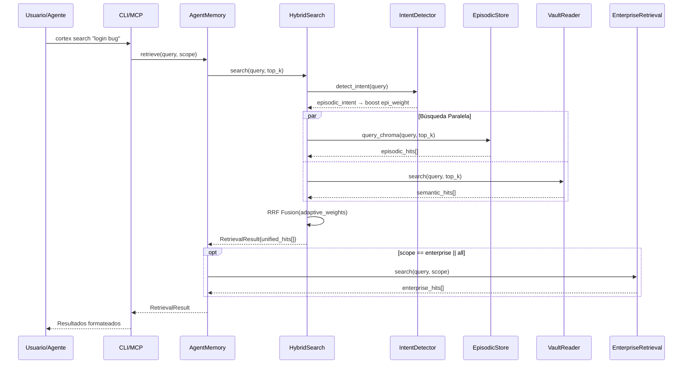
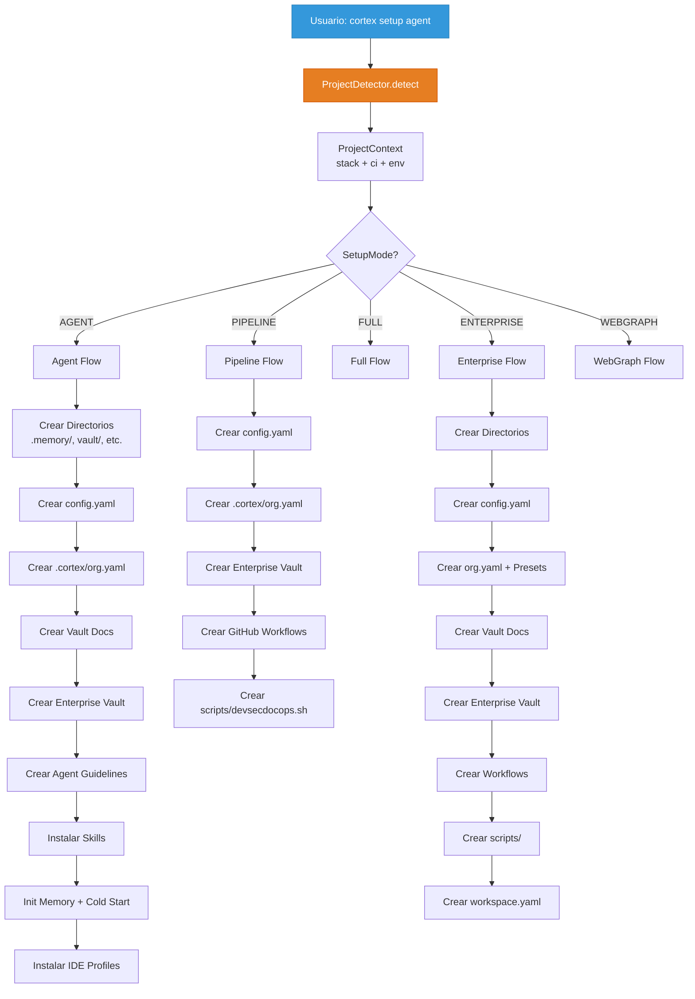
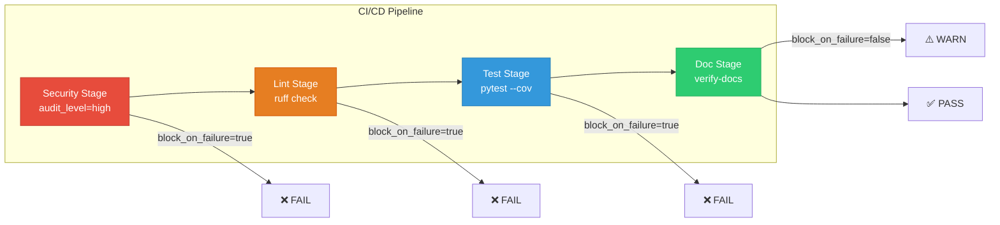
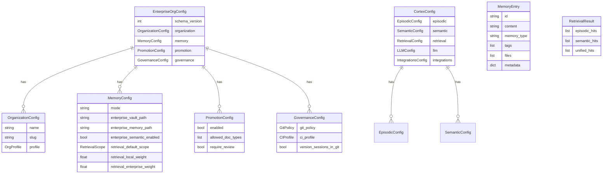
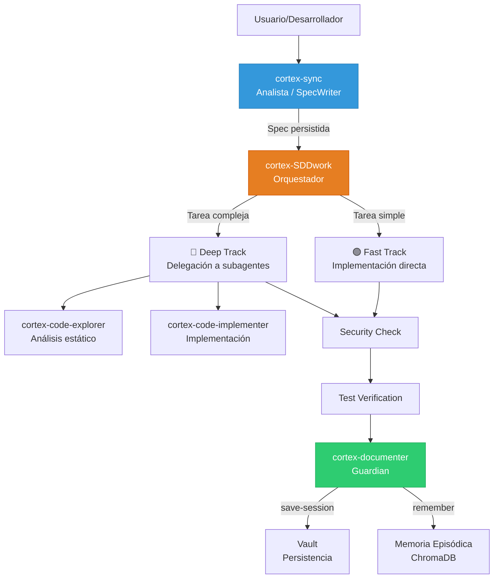

# Estructura y Lógica del Sistema

## 2. Arquitectura por Capas

Cortex sigue una **arquitectura hexagonal con fachada central** (`AgentMemory`):

```mermaid
graph TD
    subgraph "Capa de Presentación"
        CLI2[CLI<br/>cortex/cli/main.py]
        MCP2[MCP Server<br/>cortex/mcp/server.py]
        IDE2[IDE Adapters<br/>cortex/ide/]
        TUI[Tutor Engine<br/>cortex/tutor/]
    end

    subgraph "Fachada (Hexagonal Core)"
        AM[AgentMemory<br/>cortex/core.py]
        RTXC[RuntimeContext<br/>cortex/runtime_context.py]
        MDLS[Models & Config<br/>cortex/models.py<br/>cortex/core.py Pydantic]
    end

    subgraph "Capa de Dominio (Services)"
        SPS[SpecService]
        SES[SessionService]
        PRS2[PRService]
        WIS2[WorkItemService]
        KPS[KnowledgePromotion]
        REP[EnterpriseReporting]
    end

    subgraph "Capa de Infraestructura"
        EPI2[EpisodicMemoryStore<br/>cortex/episodic/]
        VW2[VaultReader<br/>cortex/semantic/]
        EBD[Embedder Factory<br/>cortex/embedders/]
        RRF2[HybridSearch<br/>cortex/retrieval/]
        CE2[ContextEnricher<br/>cortex/context_enricher/]
    end

    subgraph "Capa Enterprise"
        EC2[EnterpriseConfig<br/>cortex/enterprise/config.py]
        EM2[Enterprise Models<br/>cortex/enterprise/models.py]
        ERS[EnterpriseRetrievalService]
    end

    subgraph "Capa de Integración"
        SETP[Setup Orchestrator<br/>cortex/setup/]
        DOCC[Doctor<br/>cortex/doctor.py]
        PIN[Pipeline Orchestrator<br/>cortex/pipeline/]
        WEBG[WebGraph<br/>cortex/webgraph/]
    end

    CLI2 --> AM
    MCP2 --> AM
    IDE2 --> AM
    CLI2 --> DOCC & SETP
    AM --> EPI2 & VW2 & RRF2
    AM --> SPS & SES & PRS2 & WIS2 & KPS
    AM --> EC2 & EM2 & ERS
    EPI2 --> EBD
    VW2 --> EBD
    RRF2 --> CE2

    style AM fill:#3498db,stroke:#2980b9,color:#fff
    style EPI2 fill:#2ecc71,stroke:#27ae60,color:#fff
    style VW2 fill:#9b59b6,stroke:#8e44ad,color:#fff
    style EC2 fill:#e74c3c,stroke:#c0392b,color:#fff
```



## 3. Flujo de Datos Principal

### 3.1 Flujo de Búsqueda Híbrida (Retrieval)



### 3.2 Flujo de Setup (Orchestrator)



### 3.3 Flujo de Gobernanza (Pipeline DevSecDocOps)



## 4. Modelo de Datos Enterprise



## 5. Estructura del Workspace Actual (Legacy)

```
<repo-root>/
├── config.yaml                    # Configuración principal de Cortex
├── vault/                         # Vault de conocimiento (Markdown)
│   ├── architecture.md
│   ├── auth.md
│   ├── getting_started.md
│   ├── decisions/
│   ├── runbooks/
│   ├── sessions/
│   ├── incidents/
│   ├── hu/
│   └── specs/
├── vault-enterprise/              # Vault corporativo
│   ├── README.md
│   ├── decisions/
│   ├── runbooks/
│   ├── incidents/
│   └── hu/
├── .memory/                       # ChromaDB episódico (local)
│   └── chroma/
├── .cortex/                       # Workspace de Cortex
│   ├── AGENT.md
│   ├── system-prompt.md
│   ├── org.yaml                    # Config enterprise
│   ├── workspace.yaml
│   ├── skills/
│   │   ├── cortex-sync.md
│   │   ├── cortex-SDDwork.md
│   │   └── obsidian-*/
│   ├── subagents/
│   │   ├── cortex-code-explorer.md
│   │   ├── cortex-code-implementer.md
│   │   └── cortex-documenter.md
│   ├── logs/
│   └── webgraph/
│       ├── config.yaml
│       ├── workspace.yaml
│       └── cache/
├── scripts/
│   └── devsecdocops.sh
└── .github/
    └── workflows/
```

## 6. Modelo de Ejecución Tripartito (Agentes)



### Gobernanza de la cadena de agentes

El flujo tripartito está **forzado por el MCP server** mediante validación de gobernabilidad:

1. `cortex-sync` **DEBE** llamar a `cortex_sync_ticket` como primer paso (inyección de contexto vía ONNX)
2. `cortex-SDDwork` decide el track (Fast/Deep) basándose en complejidad
3. `cortex-documenter` es el cierre **obligatorio** (definition of done = documentación persistida)
4. Si `cortex_create_spec` se invoca sin `cortex_sync_ticket` previo → **rechazo técnico**