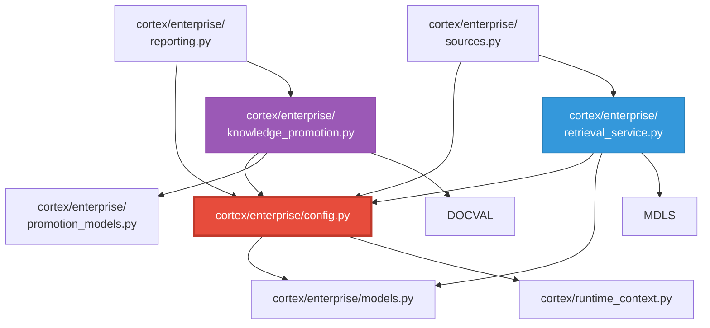
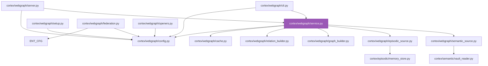
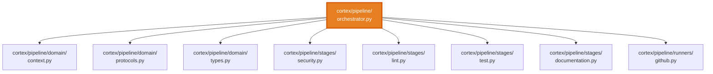
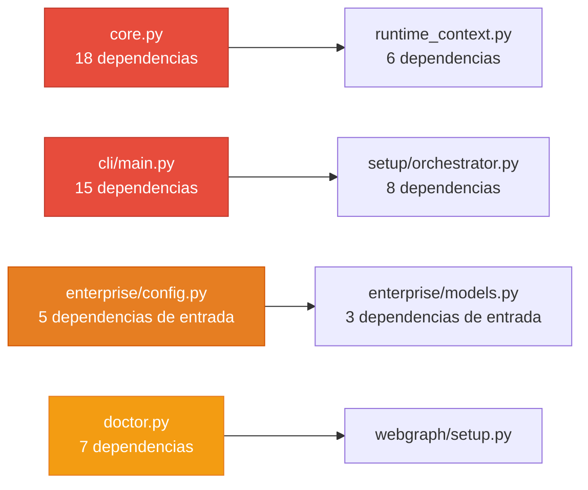

# Mapa de Dependencias entre Archivos

## 7. Grafo de Dependencias del Sistema

### 7.1 Dependencias del Núcleo (core.py es el hub central)

```mermaid
graph TD
    CORE["cortex/core.py<br/>(AgentMemory)"] --> RTXC["cortex/runtime_context.py"]
    CORE --> EPI["cortex/episodic/<br/>memory_store.py"]
    CORE --> SEM["cortex/semantic/<br/>vault_reader.py"]
    CORE --> RET["cortex/retrieval/<br/>hybrid_search.py"]
    CORE --> SPEC["cortex/services/<br/>spec_service.py"]
    CORE --> SESS["cortex/services/<br/>session_service.py"]
    CORE --> PRS["cortex/services/<br/>pr_service.py"]
    CORE --> WIS["cortex/workitems/<br/>service.py"]
    CORE --> ENT_CFG["cortex/enterprise/<br/>config.py"]
    CORE --> ENT_RET["cortex/enterprise/<br/>retrieval_service.py"]
    CORE --> ENT_PROM["cortex/enterprise/<br/>knowledge_promotion.py"]
    CORE --> CE["cortex/context_enricher/<br/>enricher.py"]
    CORE --> SUM["cortex/episodic/<br/>summarizer.py"]
    CORE --> MDLS["cortex/models.py"]

    EPI --> EMD["cortex/episodic/<br/>embedder.py"]
    EPI --> EBD_FAC["cortex/embedders/<br/>factory.py"]
    SEM --> MP["cortex/semantic/<br/>markdown_parser.py"]
    SEM --> EMD
    RET --> INT["cortex/retrieval/<br/>intent.py"]
    RET --> EPI
    RET --> SEM
    CE --> CE_CFG["cortex/context_enricher/<br/>config.py"]
    CE --> CE_OBS["cortex/context_enricher/<br/>observer.py"]
    CE --> CE_DOM["cortex/context_enricher/<br/>domain_detector.py"]
    CE --> CE_CO["cortex/context_enricher/<br/>co_occurrence.py"]

    ENT_CFG --> ENT_MDL["cortex/enterprise/<br/>models.py"]
    ENT_CFG --> RTXC
    ENT_RET --> ENT_CFG
    ENT_RET --> MDLS

    WIS --> WIS_JIRA["cortex/workitems/<br/>providers/jira.py"]

    style CORE fill:#3498db,stroke:#2980b9,color:#fff,stroke-width:3px
    style ENT_CFG fill:#e74c3c,stroke:#c0392b,color:#fff
    style RET fill:#e67e22,stroke:#d35400,color:#fff
```

### 7.2 Dependencias de CLI y Setup sobre el Core

```mermaid
graph TD
    CLI["cortex/cli/main.py"] --> CORE["cortex/core.py"]
    CLI --> DOCTOR["cortex/doctor.py"]
    CLI --> SETUP["cortex/setup/<br/>orchestrator.py"]
    CLI --> IDE_MOD["cortex/ide/"]
    CLI --> WEBG_CLI["cortex/webgraph/cli.py"]
    CLI --> MCP["cortex/mcp/server.py"]
    CLI --> TUTOR["cortex/tutor/<br/>engine.py + hint.py"]
    CLI --> GITP["cortex/git_policy.py"]
    CLI --> DOCVAL["cortex/doc_validator.py"]
    CLI --> DOCVER["cortex/doc_verifier.py"]
    CLI --> DOCGEN["cortex/doc_generator.py"]
    CLI --> FEEDBACK["cortex/feedback_loop.py"]
    CLI --> PR_CAP["cortex/pr_capture.py"]

    SETUP --> SETUP_TPL["cortex/setup/<br/>templates.py"]
    SETUP --> SETUP_CW["cortex/setup/<br/>cortex_workspace.py"]
    SETUP --> SETUP_DET["cortex/setup/<br/>detector.py"]
    SETUP --> SETUP_EP["cortex/setup/<br/>enterprise_presets.py"]
    SETUP --> SETUP_EW["cortex/setup/<br/>enterprise_wizard.py"]
    SETUP --> SETUP_CS["cortex/setup/<br/>cold_start.py"]

    DOCTOR --> ENT_CFG
    DOCTOR --> GITP
    DOCTOR --> WEBG_SETUP["cortex/webgraph/setup.py"]
    DOCTOR --> RTXC

    MCP --> CORE
    MCP --> MDLS

    IDE_MOD --> IDE_BASE["cortex/ide/base.py"]
    IDE_MOD --> IDE_REGISTRY["cortex/ide/registry.py"]
    IDE_MOD --> IDE_PROMPTS["cortex/ide/prompts.py"]
    IDE_MOD --> IDE_ADAPTERS["cortex/ide/adapters/<br/>cursor, vscode, claude, pi, etc."]

    style CLI fill:#3498db,stroke:#2980b9,color:#fff,stroke-width:3px
    style SETUP fill:#2ecc71,stroke:#27ae60,color:#fff
    style DOCTOR fill:#e67e22,stroke:#d35400,color:#fff
```

### 7.3 Dependencias Enterprise (Capa Corporativa)

### 7.4 WebGraph (Visualización de Grafos)

### 7.5 Pipeline DevSecDocOps

## 8. Matriz de Dependencias (Tabla de Impacto)

La siguiente tabla muestra qué archivo de origen importa a qué módulo destino, permitiendo evaluar el impacto de cambios.

| Archivo Fuente | core.py | enterprise/* | episodic/* | semantic/* | retrieval/* | context_enricher/* | webgraph/* | setup/* | ide/* | mcp/* |
|---|:---:|:---:|:---:|:---:|:---:|:---:|:---:|:---:|:---:|:---:|
| `cli/main.py` | ✅ | ✅ | — | — | — | — | ✅ | ✅ | ✅ | ✅ |
| `core.py` | — | ✅ | ✅ | ✅ | ✅ | ✅ | — | — | — | — |
| `mcp/server.py` | ✅ | — | — | — | — | ✅ | — | — | — | — |
| `doctor.py` | — | ✅ | — | — | — | — | ✅ | — | — | — |
| `setup/orchestrator.py` | ✅ | ✅ | — | — | — | — | ✅ | — | — | — |
| `enterprise/config.py` | — | ✅ | — | — | — | — | — | — | — | — |
| `enterprise/retrieval_service.py` | — | ✅ | — | — | ✅ | — | — | — | — | — |
| `enterprise/knowledge_promotion.py` | — | ✅ | — | — | — | — | — | — | — | — |
| `enterprise/reporting.py` | — | ✅ | ✅ | ✅ | — | — | — | — | — | — |
| `webgraph/service.py` | — | ✅ | ✅ | ✅ | — | — | — | — | — | — |
| `ide/__init__.py` | — | — | — | — | — | — | — | — | ✅ | — |

### 8.1 Archivos Más Acoplados (Mayor Riesgo de Cambio)

**Los 5 archivos con mayor acoplamiento (mayor riesgo de regresión):**

1. **`cortex/core.py`** — Hub central, importa de casi todos los módulos. **Cualquier cambio aquí impacta todo.**
2. **`cortex/cli/main.py`** — 1700+ líneas, importa de 15+ módulos. Punto de entrada único.
3. **`cortex/enterprise/config.py`** — Descubre/org.yaml y carga la config enterprise. Referenciado desde core, doctor, mcp, webgraph.
4. **`cortex/runtime_context.py`** — Funciones utilitarias de resolución de rutas. Usado por core, doctor, enterprise, episodic.
5. **`cortex/doctor.py`** — Valida 20+ aspectos del sistema. Referencia几乎所有 módulos.

## 9. Mapa de Resolución de Rutas (Actual — Legacy)

```mermaid
flowchart TD
    CONFIG["config.yaml<br/>(repo root)"] --> |persist_dir| EPIDIR[".memory/chroma"]
    CONFIG --> |vault_path| VAULTDIR["vault/"]
    
    ORG[".cortex/org.yaml"] --> |enterprise_vault_path| EVAULTDIR["vault-enterprise/"]
    ORG --> |enterprise_memory_path| EMEMDIR[".memory/enterprise/chroma"]
    
    subgraph "Resolución de Rutas Actual (Distribuida)"
        RM1["runtime_context.py<br/>resolve_episodic_persist_dir()"]
        RM2["core.py<br/>self.project_root = config_path.parent"]
        RM3["enterprise/config.py<br/>DEFAULT_ENTERPRISE_CONFIG_PATH = .cortex/org.yaml"]
        RM4["enterprise/models.py<br/>resolve_enterprise_vault_path()"]
        RM5["webgraph/config.py<br/>default_path = root / .cortex/webgraph/config.yaml"]
        RM6["ide/__init__.py<br/>_find_project_root() busca .cortex/"]
        RM7["doctor.py<br/>busca config.yaml en root, .cortex/ en root"]
    end

    RM2 --> |"project_root =<br/>config_path.parent"| ROOT["repo_root"]
    RM3 --> |"Path(.cortex / org.yaml)"| ROOT
    RM4 --> |"project_root / enterprise_vault_path"| EVAULTDIR
    RM5 --> |"root / .cortex / webgraph"| ROOT
    RM6 --> |"busca parent / .cortex"| ROOT
    RM1 --> |"project_root / persist_dir"| EPIDIR

    style CONFIG fill:#e74c3c,stroke:#c0392b,color:#fff
    style ORG fill:#e67e22,stroke:#d35400,color:#fff
    style RM2 fill:#3498db,stroke:#2980b9,color:#fff,stroke-width:3px
```

**⚠️ Problema clave:** La resolución de rutas está **distribuida** en 7+ puntos distintos. No existe un resolvedor centralizado. Esto es el núcleo del problema que el documento `REFAC-WORKSPACE-STRUCT.md` aborda.