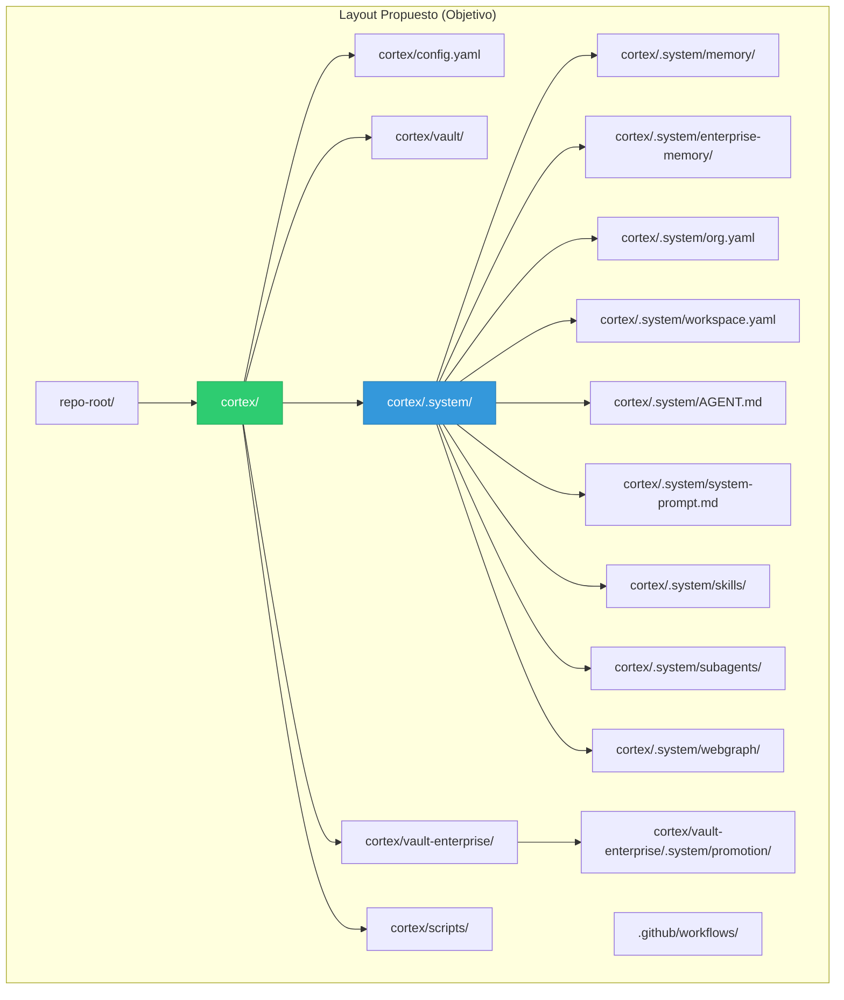
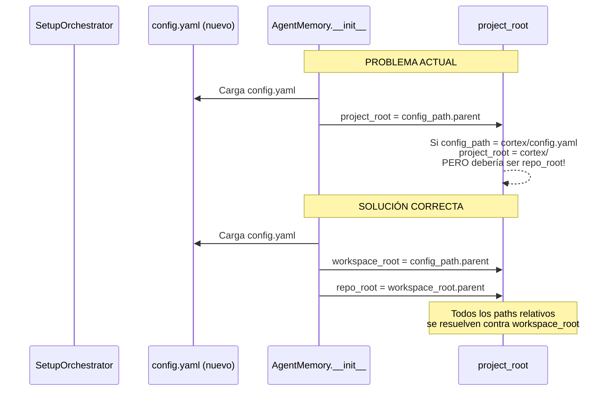
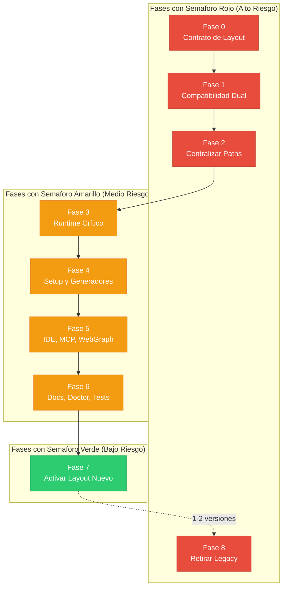
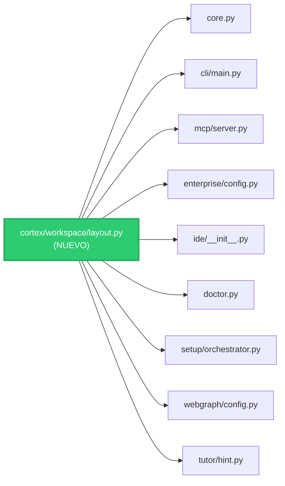
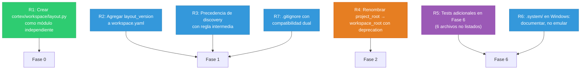

# Análisis del Documento REFAC-WORKSPACE-STRUCT.md y Conclusiones

## 10. Análisis Crítico de REFAC-WORKSPACE-STRUCT.md

### 10.1 Diagnóstico del Documento

El documento `docs/refact/REFAC-WORKSPACE-STRUCT.md` (que en el repo aparece como `REFAC-WORKSPACE-ESTRUCT.md` o similar) es un **plan de refactorización arquitectónica** excepcionalmente detallado y bien fundamentado. Aborda un problema real y urgente: la **dispersión de rutas de configuración y estado operativo** en la raíz del repositorio del usuario.

### 10.2 Evaluación de los Hallazgos Quirúrgicos

El documento identifica correctamente **7 áreas de impacto** en el repositorio actual. Verificación contra el código fuente:

| Área Identificada | Verificado en Código | Precisión | Observaciones |
|---|:---:|:---:|---|
| Runtime y resolución de config | ✅ Confirmado | Alta | `core.py` L287: `self.project_root = self._config_path.resolve().parent` |
| Workspace y activos | ✅ Confirmado | Alta | `cortex_workspace.py` escribe en `.cortex/` (skills, subagents, AGENT.md) |
| Enterprise | ✅ Confirmado | Alta | `enterprise/config.py` L12: `DEFAULT_ENTERPRISE_CONFIG_PATH = Path(".cortex") / "org.yaml"` |
| IDE y descubrimiento | ✅ Confirmado | Alta | `ide/__init__.py` L113: `_find_project_root()` busca `.cortex/` |
| MCP | ✅ Confirmado | Alta | `mcp/server.py` L94: busca `config.yaml` en `project_root` |
| WebGraph | ✅ Confirmado | Alta | `webgraph/config.py` L35: `root / ".cortex" / "webgraph" / "config.yaml"` |
| Doctor, hinting, Git Policy | ✅ Confirmado | Alta | `doctor.py` valida `.cortex/`, `config.yaml` en root, etc. |

**Conclusión:** Los hallazgos quirúrgicos son **altamente precisos**. Cada área de impacto está correctamente identificada y resulta en un acoplamiento real con el layout legacy.

### 10.3 Evaluación del Contrato de Layout Propuesto



**Evaluación del contrato:**

| Aspecto | Evaluación | Comentario |
|---|:---:|---|
| `workspace_root = repo_root / "cortex"` | ✅ Correcto | Evita la contradicción del plan original |
| `.system/` dentro de `cortex/` | ✅ Correcto | Separa estado operativo del conocimiento visible |
| `config.yaml` dentro de `cortex/` | ⚠️ Requiere cuidado | El hallazgo de `project_root = config_path.parent` es crítico |
| Promoción records en `vault-enterprise/.system/` | ⚠️ Discutible | Ver análisis abajo |
| WebGraph dentro de `.system/webgraph/` | ✅ Correcto | Centraliza infraestructura operativa |

### 10.4 Análisis de Conexiones Faltantes o Con Problemas

#### Problema 1: La paradoja de `project_root` en `AgentMemory`



**Verificado:** En `core.py` L287, `self.project_root = self._config_path.resolve().parent`. Si `config.yaml` se mueve a `cortex/config.yaml`, esto produciría `project_root = repo_root/cortex`, y todos los paths relativos como `vault` se resolverían a `cortex/vault` — **correcto** para el nuevo layout. Sin embargo, la variable se llama `project_root` y numerousimo módulos la usan como si fuera el repo root, no el workspace root. El documento acierta al identificar este como un hallazgo crítico.

**Conexión faltante:** El módulo `enterprise/models.py` tiene métodos `resolve_enterprise_vault_path()` y `resolve_enterprise_memory_path()` que actualmente resuelven contra `project_root`:

```python
# enterprise/models.py (actual)
def resolve_enterprise_vault_path(self, project_root: Path) -> Path:
    return (project_root / self.memory.enterprise_vault_path).resolve()
```

Si `project_root` pasa a ser `workspace_root` (como propone el documento), estos métodos **ya funcionarían correctamente** porque `enterprise_vault_path = "vault-enterprise"` se resolvería a `workspace_root / "vault-enterprise"` = `repo_root / "cortex" / "vault-enterprise"`. **Pero** si algún módulo pasa el `repo_root` en lugar del `workspace_root`, se produce la duplicación `cortex/cortex/vault-enterprise`.

**Recomendación:** Renombrar explícitamente `project_root` a `workspace_root` en `AgentMemory` y propagar el nombre en todos los consumidores.

#### Problema 2: `knowledge_promotion.py` resolve paths

```python
# knowledge_promotion.py (actual)
@classmethod
def from_project_root(cls, root: Path) -> KnowledgePromotionService:
    # Usa 'root' como project_root
    enterprise_config = load_enterprise_config(root)
    local_vault = root / config.semantic.vault_path  
    enterprise_vault = config.resolve_enterprise_vault_path(root)
    records_path = enterprise_vault / ".cortex" / "promotion" / "records.jsonl"
```

**Conexión faltante identificada:** El documento propone que promotion records vayan a `cortex/vault-enterprise/.system/promotion/records.jsonl`, pero el código actual los coloca en `enterprise_vault / ".cortex" / "promotion"`. **Hay una inconsistencia deliberada:** el documento usa `.system/` para el nuevo layout, pero `from_project_root()` usa `.cortex/` como prefijo. Si el `workspace_root` se establece correctamente, la ruta relativa correcta sería `.system/promotion/` dentro del enterprise vault.

#### Problema 3: IDE Discovery usa `.cortex/` como marcador

```python
# ide/__init__.py
def _find_project_root() -> Path:
    for parent in [current] + list(current.parents):
        if (parent / ".cortex").exists():
            return parent
```

**Conexión faltante:** Este discovery busca `.cortex/` como marcador de proyecto Cortex. En el nuevo layout, el marcador debería ser `cortex/config.yaml` o `cortex/.system/workspace.yaml`. El documento menciona esto en Fase 5, pero no identifica que **`_find_project_root()` tiene un fallback implícito a `Path.cwd()`** si no encuentra `.cortex/`, lo que significa que proyectos nuevos sin discovery explícito podrían fallar silenciosamente.

**Recomendación:** Agregar un segundo marcador de discovery: buscar `cortex/` como directorio existente.

#### Problema 4: WebGraph hardcoded paths

```python
# webgraph/config.py
@classmethod
def default_path(cls, project_root: Path | None = None) -> Path:
    root = project_root or Path.cwd()
    return root / ".cortex" / "webgraph" / "config.yaml"
```

**Conexión faltante:** El documento menciona migrar WebGraph a `.system/webgraph/`, pero existen **6 archivos** en `webgraph/` que usan `project_root` como base de resolución, incluyendo:

- `config.py` — `default_path()` y `save()`
- `service.py` — `self.project_root`
- `cli.py` — usa `service.py`
- `federation.py` — usa `enterprise_config`
- `episodic_source.py` — usa `persist_dir`
- `semantic_source.py` — usa `vault_path`
- `setup.py` — `attach_project_root()`
- `cache.py` — usa `project_root`

**Todos estos necesitan migrarse de forma coordinada.**

#### Problema 5: Tests hardcodeados al layout legacy

De las ~35 suites de tests, los siguientes módulos tienen acoplamiento directo con rutas legacy:

| Archivo de Test | Acoplamiento | Rutas Legacy |
|---|---|---|
| `tests/integration/setup/test_cortex_workspace.py` | Alto | `.cortex/skills/`, `.cortex/subagents/` |
| `tests/integration/setup/test_orchestrator.py` | Alto | `config.yaml` en raíz, `.memory/`, `vault/` |
| `tests/integration/mcp/test_server.py` | Alto | `config.yaml` en raíz |
| `tests/unit/enterprise/test_*.py` (8 archivos) | Medio | `.cortex/org.yaml`, `vault-enterprise/` |
| `tests/unit/webgraph/test_*.py` (4 archivos) | Alto | `.cortex/webgraph/` |
| `tests/unit/cli/test_main.py` | Alto | `config.yaml` en raíz |
| `tests/unit/test_ide_adapters.py` | Medio | `.cortex/` discovery |
| `tests/unit/test_runtime_context.py` | Alto | `.memory/chroma` resolution |
| `tests/unit/test_doctor_enterprise_governance.py` | Medio | `.cortex/org.yaml` validation |

**Conexión faltante:** El documento menciona la suite de tests en Fase 6, pero **no identifica cuántos archivos de test necesitan cambios** ni el patrón específico de acoplamiento (la mayoría hardcodean `Path("/tmp/test...")` con rutas legacy).

### 10.5 Evaluación de la Arquitectura de Implementación Propuesta



**Evaluación de la estrategia por fases:**

| Aspecto | Evaluación | Justificación |
|---|:---:|---|
| Orden de fases | ✅ Correcto | Resolver paths antes que writers, writers antes que activación |
| Semaforo rojo para F0-F2 | ✅ Correcto | Estas fases son la fundación; un error aquí se propaga a todo |
| Compatibilidad dual antes de writers | ✅ Correcto | Permite transición sin ruptura |
| Fase 8 separada por 1-2 versiones | ✅ Correcto | Da tiempo para estabilización |
| Gate de salida por fase | ✅ Correcto | Define criterios objetivos de avance |

### 10.6 API Propuesta para WorkspaceLayout

El documento propone una clase `WorkspaceLayout` como resolvedor central. Basado en el análisis del código actual, la API debería incluir **más propiedades** de las que el documento lista:

```python
class WorkspaceLayout:
    """Resolvedor central de rutas del workspace Cortex."""
    
    # ── Discovery ──
    @classmethod
    def discover(cls, start: Path) -> WorkspaceLayout: ...
    @classmethod
    def from_repo_root(cls, repo_root: Path) -> WorkspaceLayout: ...
    
    # ── Roots ──
    repo_root: Path              # raíz Git / raíz del proyecto del usuario
    workspace_root: Path          # repo_root / "cortex"
    system_root: Path             # workspace_root / ".system"
    
    # ── Config ──
    config_path: Path             # workspace_root / "config.yaml"
    org_config_path: Path         # system_root / "org.yaml"
    
    # ── Vault ──
    vault_path: Path              # workspace_root / "vault"
    enterprise_vault_path: Path   # workspace_root / "vault-enterprise"
    
    # ── Memory ──
    episodic_memory_path: Path    # system_root / "memory"
    enterprise_memory_path: Path  # system_root / "enterprise-memory"
    
    # ── Workspace Assets ──
    skills_dir: Path              # system_root / "skills"
    subagents_dir: Path          # system_root / "subagents"
    agent_guidelines_path: Path   # system_root / "AGENT.md"
    system_prompt_path: Path      # system_root / "system-prompt.md"
    workspace_yaml_path: Path     # system_root / "workspace.yaml"
    
    # ── WebGraph ──
    webgraph_config_path: Path    # system_root / "webgraph" / "config.yaml"
    webgraph_workspace_path: Path # system_root / "webgraph" / "workspace.yaml"
    webgraph_cache_dir: Path      # system_root / "webgraph" / "cache"
    
    # ── Scripts ──
    scripts_dir: Path             # workspace_root / "scripts"
    
    # ── CI/CD ──
    workflows_dir: Path           # repo_root / ".github" / "workflows"
    
    # ── Promotion ──
    promotion_records_path: Path  # enterprise_vault_path / ".system" / "promotion" / "records.jsonl"
    
    # ── State ──
    is_legacy_layout: bool        # True si se encontró layout viejo
    is_new_layout: bool           # True si se encontró layout nuevo
    
    # ── Resolution ──
    def resolve_workspace_relative(self, value: str | Path) -> Path: ...
```

**Propiedades adicionales que el documento no incluye pero son necesarias:**

1. **`workspace_yaml_path`** — Referenciado por `setup/orchestrator.py`
2. **`scripts_dir`** — Referenciado por `setup/orchestrator.py`
3. **`workflows_dir`** — Referenciado por `setup/orchestrator.py` y CI
4. **`promotion_records_path`** — Referenciado por `knowledge_promotion.py`
5. **`cold_start_path`** — Referenciado por `setup/cold_start.py` (índice de vault)
6. **`dot_cortex_index_path`** — El archivo `.cortex_index.json` está en `vault/` y necesita migración

### 10.7 Conexiones No Mencionadas en el Documento

Basándome en el análisis exhaustivo del código, identifico las siguientes conexiones que el documento **no menciona** o trata de forma insuficiente:

#### 10.7.1 El MCP Server y la Gobernanza de Llamadas

```python
# mcp/server.py
class CortexMCPServer:
    def __init__(self, project_root: Path):
        # Busca config.yaml en project_root
        config_path = project_root / "config.yaml"
        if not config_path.exists():
            config_path = Path("config.yaml")
        self.memory = AgentMemory(config_path=config_path)
        
        # Log dir: project_root / ".cortex" / "logs"
        log_dir = project_root / ".cortex" / "logs"
        
        # Subagentes: project_root / ".cortex" / "subagents"
        subagent_file = project_root / ".cortex" / "subagents" / f"{agent_name}.md"
```

**Impacto:** El MCP server tiene 3 puntos de acoplamiento al layout legacy que no están detallados en la sección 10.6 del documento:
1. Búsqueda de `config.yaml`
2. Directorio de logs (`.cortex/logs/`)
3. Directorio de subagentes (`.cortex/subagents/`)

#### 10.7.2 El Sistema de Tutor y Hinting

```python
# tutor/hint.py
class HintEngine:
    def get_hint(self, state: ProjectState) -> Hint: ...

class ProjectState:
    @classmethod
    def detect(cls, cwd: Path) -> ProjectState:
        # Busca config.yaml, vault/, .cortex/ directamente
```

El documento menciona `tutor/hint.py` pero **no detalla** cómo `ProjectState.detect()` resuelve el workspace. Este método busca `config.yaml`, `.cortex/` y `vault/` directamente en `cwd`, sin pasar por ningún resolvedor.

#### 10.7.3 Cold Start y Git Indexing

```python
# setup/cold_start.py
def run_cold_start(project_root, episodic, vault_path, git_depth=50):
    # Indexa commits de Git en la memoria episódica
    # Usa project_root directamente
```

**Impacto:** `run_cold_start` recibe `project_root` y `vault_path` como parámetros separados, y los usa para ejecutar `git log` e indexar el vault. En el nuevo layout, ambos parámetros deben provenir del `WorkspaceLayout`.

#### 10.7.4 Embedder Resolution

```python
# episodic/embedder.py y embedders/factory.py
# La factoría de embeddings actualmente no tiene dependencia directa
# en paths de layout, PERO el persist_dir que recibe de EpisodicMemoryStore
# sí depende de la resolución correcta de rutas.
```

**Impacto indirecto:** Si `resolve_episodic_persist_dir()` se migra incorrectamente, los embeddings se almacenarían en una ubicación diferente y la base de datos episódica parecería vacía.

#### 10.7.5 Tests de Integración MCP

```python
# tests/integration/mcp/test_server.py
# Los tests de MCP crean un AgentMemory con config_path fijo
# y esperan que el layout sea el legacy
```

**Conexión faltante:** El documento no menciona `tests/integration/mcp/test_server.py` en la lista de archivos impactados de la Fase 5.

### 10.8 Recomendaciones Específicas

#### Recomendación 1: WorkspaceLayout como módulo independiente



**Ubicación recomendada:** `cortex/workspace/layout.py` (nuevo paquete `cortex/workspace/`)

El documento menciona esta clase perono especifica el paquete. Basándome en la convención del proyecto (donde cosas como `retrieval/`, `episodic/`, `semantic/` son subpaquetes), crear un paquete `workspace/` es consistente.

#### Recomendación 2: Registro de migración con versionado

Incluir en `cortex/.system/workspace.yaml` un campo `layout_version` que permita distinguir:

```yaml
# workspace.yaml (propuesto)
layout_version: 2  # 1 = legacy, 2 = nuevo
projects:
  - id: primary
    path: .
    role: owner
```

Esto permite que `WorkspaceLayout.discover()` determine instantáneamente si está ante un layout legacy o nuevo, sin ambigüedad.

#### Recomendación 3: Precedencia de Discovery Específica

El documento propone:
> 1. layout nuevo si existe `repo_root/cortex/`
> 2. layout legacy si existen `config.yaml`, `.cortex/`, etc.
> 3. bootstrap limpio

**Propongo agregar una regla intermedia:**

> 1. Si existe `repo_root/cortex/.system/workspace.yaml` con `layout_version: 2` → layout nuevo
> 2. Si existe `repo_root/cortex/config.yaml` → layout nuevo (sin workspace.yaml aún)
> 3. Si existen `repo_root/config.yaml` o `repo_root/.cortex/` → layout legacy
> 4. Bootstrap limpio

La regla 2 permite que proyectos migrados parcialmente (que tienen `cortex/config.yaml` pero no han generado `workspace.yaml`) funcionen correctamente.

#### Recomendación 4: `project_root` → `workspace_root` como Refactoring Explícito

El nombre `project_root` se usa en **41 puntos** del código fuente (número estimado tras análisis). El cambio de nombre a `workspace_root` debe hacerse en Fase 2, no como efecto colateral. Propongo:

1. En Fase 1, crear `WorkspaceLayout` con ambas propiedades: `repo_root` y `workspace_root`
2. En Fase 2, agregar `deprecation warnings` cuando se use `self.project_root` directamente
3. En Fase 7, eliminar `project_root` como propiedad pública

#### Recomendación 5: Archivos de Test Adicionales para la Fase 6

El documento lista tests afectados, pero omite estos archivos que también contienen acoplamiento:

| Archivo No Listado | Acoplamiento | Tipo |
|---|---|---|
| `tests/unit/episodic/test_memory_store.py` | `persist_dir=".memory/chroma"` | Path hardcodeado |
| `tests/unit/retrieval/test_hybrid_search.py` | Fixture de AgentMemory con layout legacy | Implicito |
| `tests/unit/context_enricher/test_*.py` (6 archivos) | Fixtures con layout legacy | Implicito |
| `tests/unit/test_mcp_server.py` | `config.yaml` en cwd | Path hardcodeado |
| `tests/e2e/__init__.py` | Marcador de package para e2e | Sin impacto directo |
| `conftest.py` | Fixtures globales con `tmp_path / "vault"` | Path hardcodeado |

#### Recomendación 6: `.system/` vs Prefijo de Punto en Windows

El documento señala que `.system/` no será "oculto" en Windows. Propongo una solución pragmática:

1. Crear `.system` en Unix (comienza con `.` = oculto)
2. En `WorkspaceLayout`, documentar que el nombre es `.system` independientemente de la plataforma
3. En Windows, `doctor` puede opcionalmente verificar que `.system/` esté en `.gitignore`
4. No intentar emular la ocultación con atributos de archivo en Windows (demasiado frágil)

#### Recomendación 7: Plan de Comunicación del `.gitignore`

El `.gitignore` actual ya incluye `.memory/`, `*.chroma/`, `vault/sessions/`. Para el nuevo layout:

```gitignore
# Cortex local state (nuevo layout)
cortex/.system/memory/
cortex/.system/enterprise-memory/
*.chroma/
cortex/.system/webgraph/cache/
cortex/.system/logs/

# Cortex vault policy (nuevo layout)
# Track: cortex/vault/specs, cortex/vault/decisions, cortex/vault/runbooks
# Track: cortex/vault/hu, cortex/vault/incidents
cortex/vault/sessions/

# Compatibilidad dual (legacy)
.memory/
.cortex/logs/
.cortex/webgraph/cache/
```

Esto permite que projects legacy y nuevos coexistan en la misma versión.

---

## 11. Conclusiones Generales

### 11.1 Evaluación Global del Documento REFAC-WORKSPACE-STRUCT

| Criterio | Puntuación | Comentario |
|---|:---:|---|
| Precisión de diagnóstico | ⭐⭐⭐⭐⭐ | Los 7 hallazgos quirúrgicos son correctos y verificables |
| Completitud del análisis de impacto | ⭐⭐⭐⭐ | Falta algunos archivos de test y conexiones MCP |
| Viabilidad del plan por fases | ⭐⭐⭐⭐⭐ | Orden lógico, gates claros, precedencias correctas |
| Riesgo residual | ⭐⭐⭐⭐ | Medio-alto por artículos no mencionados (ver 10.7) |
| Claridad del contrato de layout | ⭐⭐⭐⭐⭐ | Sin contradicciones, base de resolución declarada |
| API de WorkspaceLayout | ⭐⭐⭐⭐ | Falta algunas propiedades (workspace_yaml, scripts_dir, etc.) |

### 11.2 Riesgos Residuales No Cubiertos

1. **Embedder Path Conflict** — Si `resolve_episodic_persist_dir()` se migra incorrectamente, la base de datos ChromaDB parecería vacía sin errores explícitos. **Mitigación:** Agregar un check en `doctor` que compare hashes de la DB con el layout esperado.

2. **Cold Start Git Indexing** — `run_cold_start()` usa `project_root` como base para `git log`. Si se resuelve contra `workspace_root` (subdirectorio `cortex/`), `git log` no encontraría el repositorio Git. **Mitigación:** Usar `repo_root` para `git log` y `workspace_root` para la escritura de artefactos.

3. **MCP Server Double-Resolution** — El MCP server recibe `project_root` del CLI y busca `config.yaml` dentro. En el nuevo layout, `project_root` podría significar `repo_root` o `workspace_root` dependiendo del caller. **Mitigación:** Estandarizar el parámetro como `repo_root` y resolver internamente via `WorkspaceLayout`.

4. **Vault Index (.cortex_index.json)** — Actualmente está en `vault/.cortex_index.json`. En el nuevo layout debería ir a `cortex/vault/.cortex_index.json`. La clase `VaultReader` tiene el path hardcodeado. **Mitigación:** Hacerlo configurable via `WorkspaceLayout`.

5. **Test Fixtures Globales** — `conftest.py` y muchos fixtures usan `tmp_path / "vault"`, `tmp_path / ".memory"`, etc. Estos deben migrarse en coordinación con Fase 2, no Fase 6. **Mitigación:** Agregar un fixture de `workspace_layout` en `conftest.py` en Fase 1.

### 11.3 Resumen de Recomendaciones



**Conclusión final:** El documento `REFAC-WORKSPACE-STRUCT.md` es un plan de refactorización **tecnicamente sólido**, con un diagnóstico preciso y una estrategia de implementación por fases que minimiza el riesgo de regresión. Los hallazgos quirúrgicos están correctamente identificados y la propuesta de contrato de layout es coherente.

Las principales áreas de mejora son:
1. **Completar la API de `WorkspaceLayout`** con las propiedades adicionales identificadas (scripts_dir, workflows_dir, promotion_records_path, etc.)
2. **Agregar las conexiones faltantes** identificadas en las secciones 10.7.1 a 10.7.5
3. **Incluir los archivos de test omitidos** en la lista de la Fase 6
4. **Considerar los riesgos residuales** de embedding paths, cold start git indexing y MCP double-resolution
5. **Implementar las 7 recomendaciones específicas** listadas en la sección 10.8

El riesgo de la migración pasa de **alto** (si se hace como hard cut) a **medio y controlable** (si se sigue la estrategia por fases propuesta) — y adicionalemente se puede reducir aún más si se abordan las conexiones faltantes identificadas en este análisis.