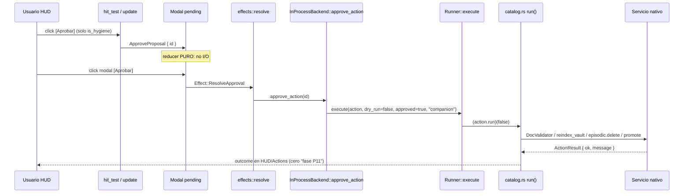
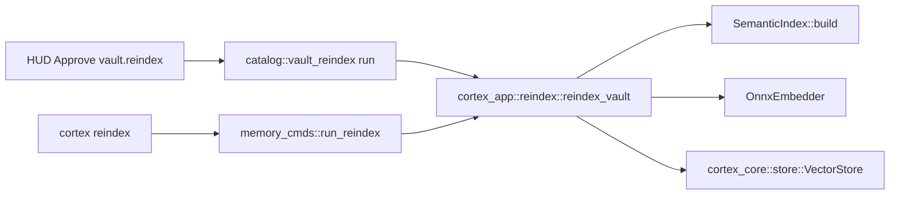
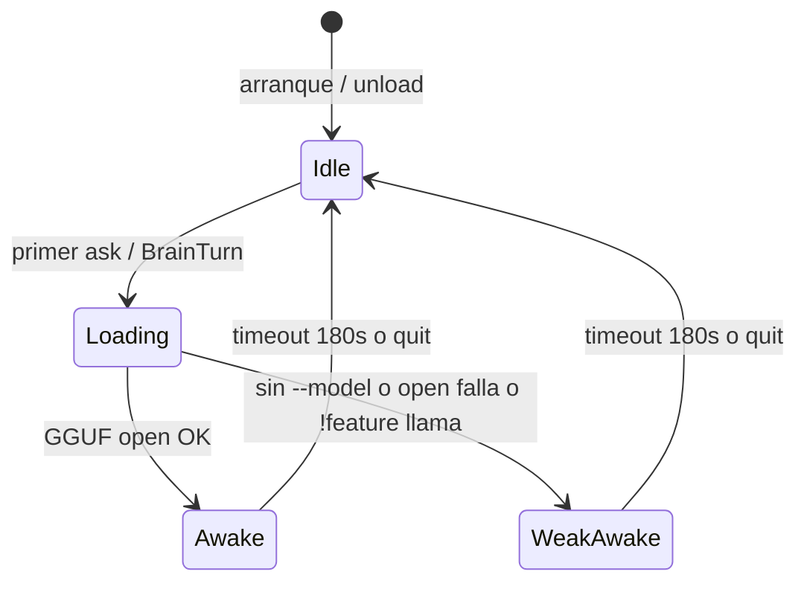

# 18 · Plan de implementación — resto de Cortex (HUD real, higiene real, Liquid)

| Campo | Valor |
|---|---|
| **Título** | Plan de implementación del resto (obra 17, deuda 16 filtrada) |
| **Autor** | plan de implementación para agente de código |
| **Fecha** | 2026-08-29 |
| **Estado** | Listo para ejecutar (PR1 primero) |
| **Rama** | `feature/transformacion-2026-08` |
| **Audiencia** | agente de código que implementa sin reinventar producto |
| **Copia canónica** | este archivo |

Este archivo es una **especificación de implementación**. Si hay conflicto entre este plan y una ocurrencia en el chat, gana este archivo. Si hay conflicto entre este archivo y el [17](17-PRODUCTO-EXPERTO-AL-LADO.md), gana el 17. Si hay conflicto entre el 16 y el 17, gana el 17.

Leé la tabla D1–D10 del 17 (§3) una vez. No la reabras. El resto de este archivo basta para ejecutar PR1.

---

## Overview

El HUD de Cortex ya pinta (commit `e55129b`, `feat(obra17): HUD en ratatui — cubos en celdas, Copiar, higiene`). Copiar usa OSC 52. Aprobar abre el modal existente. El Companion ya llama `Runner::execute(..., false, true, "companion")`. **El agujero de producto es que el `run()` del catálogo sigue siendo teatro**: `vault.validate_docs` y `vault.reindex` (las higienes que el HUD puede mostrar) fallan con mensajes de fases P11/P12 que ya cerraron.

Este plan conecta esos `run()` a los servicios nativos que ya existen, y después completa el resto de v1 del 17 en este orden inquebrantable: higiene real → prompt COMPOSED copiable → Liquid load/unload + logo = RAM → sidecar del mismo `AppState` → spawn Herdr honesto → gates §14. Recién entonces se tocan lotes 1 residual / `cortex finish` / learner / mentiras de plataforma del 16 que **no** contradicen el 17.

El agente que codea cierra sesiones. El HUD no. El HUD no inyecta texto al pane. El default no se mueve del HUD abajo ~25%.

---

## Background & Motivation

Hoy el usuario ve [Aprobar] sobre «Validar los documentos del vault». Click → modal → `InProcessBackend::approve_action` (`rust/crates/cortex-companion/src/engine.rs`) → `Runner::execute` → `catalog.rs` `ActionResult::fail("DocValidator nativo aún no existe (cola larga P11)")`. El tipo `cortex_app::doc_validator::DocValidator` existe y `validate_batch` está implementado. El mismo patrón vale para reindex (`run_reindex_real` en `cortex-cli`, privado, contra `SemanticIndex` + `OnnxEmbedder` + `VectorStore`).

`SessionSummary` no tiene `phase`. El prompt copiable no lee COMPOSED. Liquid se carga al arranque si hay `--model` y nunca se descarga. Sidecar pinta el Home 80×24 de cuatro botones. `spawn_split_sidecar` traga errores de resize/swap (`let _ =`) y reporta `"30% Dock"` igual. Eso es exactamente el teatro que el 16 nombró y que el 17 convirtió en producto: **si el HUD lo muestra, tiene que ser verdad**.

---

## Ley de producto (el 17 gana; no reabrir)

Leer entero (no skimear):

- `docs/transformacion/16-DEUDA-REAL-Y-NORTE-DE-PULIDO.md`
- `docs/transformacion/17-PRODUCTO-EXPERTO-AL-LADO.md` (contrato; D1–D10 cerradas)
- `assets/hud-v1/GRID.md` (geometría HUD; si HTML y GRID divergen, gana GRID)

**Cuando 16 y 17 chocan, 17 gana.** Esta tabla es ley. Si tu commit la viola, el commit es inválido aunque los tests pasen.

| 16 dijo | 17 (ley) | El agente debe |
|---|---|---|
| Sidecar 30% default | HUD ~25% abajo default | **Nunca** cambiar el default de `open` / `cortex-herdr-float --spawn` / action `open` del toml lejos de float/split abajo. Sidecar es atajo. |
| Inyectar texto al pane del agente | Copiar vía OSC 52 | **Nunca** llamar `send_text_to_pane` desde HUD, Copilot, Sidecar, Enter, Copiar, Aprobar. `herdr.rs::send_text_to_pane` queda `#[allow(dead_code)]`. |
| Companion puede finish/close sesiones | Nunca. El agente que codea cierra | HUD **no** muestra finish/close/checkpoint como Aprobar. `is_hygiene` no incluye `session.*` ni `setup.finish_bootstrap`. |
| Aprobar = catálogo amplio | Aprobar = higiene sola, y **real** | Filtrar `is_hygiene`. Cablear `run()` de esos ids. |
| Logo chico decorativo | Logo = estado Liquid RAM | Animar **solo** con load/unload. No GIF suelto. |

D1–D10 del 17 permanecen cerradas. No hay “mejor idea” de layout, inject, o botón Cerrar en el HUD.

---

## Caja de obediencia (cada commit)

Copiá y cumplí esto en **cada** commit. Si no podés, paramos; no se finge PASS.

```
Rama:            feature/transformacion-2026-08
Commits:         Conventional en español, UN gate por commit, locales, SIN PUSH
Identidad git:   si .gitconfig EPERM:
                 GIT_CONFIG_GLOBAL=/dev/null
                 GIT_AUTHOR_NAME=MachuaninEzequiel
                 GIT_AUTHOR_EMAIL=ezequieladrianmachuanin@gmail.com
                 GIT_COMMITTER_NAME=MachuaninEzequiel
                 GIT_COMMITTER_EMAIL=ezequieladrianmachuanin@gmail.com
Gate:            cargo test -p <crate> && cargo clippy -p <crate> -- -D warnings && cargo fmt -p <crate> -- --check
                 (fmt --check; si falla, cargo fmt -p <crate> y re-check)
unsafe:          #![forbid(unsafe_code)] en lógica nueva
Deps:            CERO crates.io nuevas. Path deps del workspace sí, si el PR lo pide.
Goldens:         NO recapturar bench/parity, MCP list_tools.json, ni tocar cortex/ ni tests/ Python
DoD:             un test que ROMPE si el usuario no puede hacer la cosa, no un len() de acciones
Cargo registry:  si EPERM/DNS, NO fingir PASS. Fallback normativo = cargo --offline
                 (ver § Rollout). Si target/ está vacío: parar. No rustc inventado.
```

Orden de PRs de este archivo = **ley**. Higiene `run()` antes que animación del logo. Copiar ya existe: no empieces por cosmética.

---

## Qué YA ESTÁ HECHO (verificar leyendo; no revertir; no rehacer)

HEAD de `feature/transformacion-2026-08` incluye `e55129b` `feat(obra17): HUD en ratatui — cubos en celdas, Copiar, higiene`.

| Pieza | Dónde | No hacer |
|---|---|---|
| `CompanionMode` en `AppState` | `lib.rs`, `app.rs::AppState::new` toma `UiRequest.mode` | No volver a tirar `mode` |
| Float Home = HUD hit-test, no `HOME_*` 80×24 | `app.rs::hit_test` rama `Float \| Copilot`; `runner.rs` llama `hud_areas` / `render_hud` | No pintar Home en Float |
| HUD dos columnas GRID, tokens bosque/menta | `screens/hud_screen.rs`, `hud_brand.rs` | No neón `#34D399` / `#10B981` |
| Voxels half-block desde PNG; papel no se pinta | `hud_brand.rs` `MARK`/`WORD`, `0` = transparente | No agregar PNG extra, no placa |
| Copiar + OSC 52 | `clipboard.rs`, `Effect::CopyPrompt`, Enter vacío copia | No inyectar |
| Filtro higiene | `hud_screen::is_hygiene` | No ensanchar a session/setup |
| Aprobar abre modal existente | `AppAction::ApproveProposal` → `pending`; no ejecuta en el reducer | No saltarse el modal |
| Skip recuerda id | `hud_skipped` | OK extender a Learner en PR10, no antes |
| Esc stack vacía en Float/Copilot sale | `AppAction::Back` setea `quit` | No cambiar Sidecar a quit (el dock persiste) |
| Herdr action `open` = float split | `integrations/herdr/herdr-plugin.toml` `id = "open"` | No cambiar default a sidecar |
| `cortex-herdr-float --spawn` → `spawn_float_hud` | `bin/float.rs` | No “arreglar” el default |
| Tests HUD | `tests/hud.rs` (8 tests) | Extender, no borrar |
| Paleta branding retinte forest/mint | `cortex-branding/src/palette.rs` (`CYAN` token = `#8FDCB0`) | No reintroducir neón |

**El HUD pinta. Aprobar todavía no ejecuta higiene.** Ese es el primer agujero. PR1 lo cierra.

---

## Goals & Non-Goals

### Goals (v1, en este orden)

1. Aprobar `vault.validate_docs` / `vault.reindex` (y el resto de `is_hygiene`) corre el servicio nativo. Cero `"requiere … nativo (fase P…)"`.
2. Prompt copiable según 17 §6.2 (fase COMPOSED → skill craft de la **siguiente** fase). Nunca «corré `cortex session …`» al humano.
3. Liquid load/unload. Logo idle ≠ awake. Sin GGUF = despierto débil (router determinista). Default sin `--model` sigue determinista.
4. Sidecar = mismo `AppState`, misma jerarquía de contenido que el HUD, más aire de chat. Cero cuatro tarjetas. Cero inject.
5. Spawn Herdr: error visible si resize/swap fallan; nunca «30%» sobre un pane al 80%.
6. Gates 17 §14 todos verdaderos (citarlos como aceptación).
7. Después: lote 1 residual no-HUD, `cortex finish` CLI+skills (no botón HUD), Skip→Learner si es barato, lote 5 mentiras de plataforma.

### Non-Goals (si te tienta, es un bug de producto)

- Recapturar goldens / tocar Python `cortex/` `tests/`
- Push a origin
- Crates.io nuevas sin ADR
- `send_text` como producto
- Fusionar `cortex-tui` + companion (lote 6: **fuera de este plan**)
- Radar / guardrails / fuzzy skills (17 v1.1 / 16 corte 2)
- GPU / LFM como default
- Borrado físico de Python
- Reabrir D1–D10
- Cambiar el default del HUD lejos de abajo ~25%
- Paleta neón
- Reescribir Copilot como cuarto producto (Copilot ya mapea el CTA a Copiar; no es el default)
- Prompt escrito por Liquid (v1.1)
- Auto-promover HUD→sidecar
- `session.close_stale` que cierre de verdad desde Companion
- Botón Finish/Cerrar/Checkpoint en el HUD
- Animación del logo sin load/unload

---

## Key Decisions

| # | Decisión | Rationale |
|---|---|---|
| K1 | **Orden de PRs = ley.** Higiene `run()` (PR1–PR2) antes que prompt (PR3) antes que logo/Liquid (PR4) antes que sidecar (PR5) antes que spawn (PR6) antes que gates snapshot (PR7). Lotes 16 residuales después. | 17 §16: «Aprobar-higiene real antes que animación del logo». Cosmética sobre teatro es el fallo de los agentes anteriores. |
| K2 | **HUD Approve no se recablea.** `approve_action` ya llama `Runner::execute`. Solo se cambia `catalog.rs::run()`. | El Companion no es el bug. El stub P6 sí. |
| K3 | **`cortex-actions` NO depende de `cortex-cli`.** Extraer `reindex_vault` + `vectors_dir(dot_cortex)` + `resolve_reindex_model` a `cortex_app::reindex`. CLI, catálogo y PR11 usan **la misma** `vectors_dir`. | `cortex-cli` ya depende de `cortex-actions`. Ciclo = no compile. El path CLI actual `workspace_root.join(".cortex").join("vectors")` es split-brain en layout nuevo. |
| K4 | **`SessionSummary.phase: Option<String>`** (última `Checkpoint.phase` en orden reverse). Literales de test se actualizan a `phase: None`. No `Default` mágico que esconda regresiones. | 17 §6.2 necesita fase en la UI. `summary_of` hoy tira checkpoints. |
| K5 | **Un solo enum de RAM.** `MarkRam` vive en `hud_brand.rs`. `pub type LiquidRam = crate::hud_brand::MarkRam;` en `app.rs`. Blit y `AppState.liquid` son el mismo tipo. Cero PNG extra. | Evita drift Idle/Awake entre logo y estado. D7. |
| K6 | **GGUF lazy en el runner, no en `update`.** `run_app` arranca `llm = None`. Load en el loop al ver `Effect::BrainTurn` **o** `!st.hud_ask.is_empty()` (primera consulta). `update` sigue puro. Timeout testeable: `st.liquid_idle: Duration` default 180 s. | `AppState::new` nunca abrió llama: un test de Idle al new no prueba el bug. |
| K7 | **Sidecar reusa `hud_copy` / `hud_approve` / `hud_skip` y `hud_ask`.** Añadir `CompanionMode::Sidecar` en **todos** los `matches!` de teclado/hit-test listados en PR5. Esc **no** hace quit. | Hoy Typed/Enter/q/hit_test son solo Float (q) o Float\|Copilot. Olvidar un sitio mata el dock. |
| K8 | **Spawn: una función pura `conclude_spawn` que los tres wrappers deben llamar.** Tests ejercitan `conclude_spawn`, no helpers huérfanos. Cero `let _ =` en swap/resize. Cero `Ok(())` si falta `pane_id`. | Extraer `parse_*` y dejar los wrappers iguales dejaría el bug verde. |
| K9 | **`session.close_stale` permanece report-only.** Se cambia el copy para no vender cierre. No llama `SessionService::close`. | D3. El agente que codea cierra. |
| K10 | **`cortex finish` es CLI + MCP/skills, nunca botón HUD.** Excepción D3: pantalla Sessions (no HUD) puede llamar `finish_session` in-process **después del modal**. `is_hygiene` sigue solo vault/learn/memory/knowledge. Wrapper: texto MCP que empieza con `❌` → `Err` (rc 1), no éxito verde. | 16 lote 2 ∩ 17 D3. Help raíz self-golden **no** se recaptura. |
| K11 | **Skip persistido es PR10, no bloquea v1 visual.** HUD Skip ya oculta el id en la corrida. Learner es extra barato. | 17: «v1 puede persistir skip o no». |
| K12 | **Path deps de workspace permitidas; crates.io no.** PR1 añade `cortex-core` + `sha2` (ya workspace) a `cortex-app`. PR2 puede añadir `cortex-enterprise` a `cortex-actions`. | Cero paquetes nuevos en Cargo.lock. |
| K13 | **DoD = test de comportamiento.** `actions.len() >= 4` no cuenta. El test de higiene ejecuta `run(false)` en fixture y aserta que el mensaje **no** contiene `P11`/`P12` y que el validador corrió. | 16 §13.2 / 17 §14. |
| K14 | **`memory.prune` deja de ser `report_action`.** Al borrar: `reversible=false`, `auto_ok=false`, `cost=Seconds`. Lo mismo `knowledge.promote`. Promote = `review` + `plan_promotion` + `apply_promotion` **con** `require_review: true` (default). No apagar review para que el test pase. `vault.validate_docs` sigue report-like. `learn.topic` no se toca. | `apply_promotion` salta no-reviewed. Discover+apply a pelo imprime `promovidos: 0`. |
| K15 | **Backup+rollback de vectors viven dentro de `reindex_vault`.** `ReindexOutcome.backup_dir: Option<PathBuf>`. El CLI solo hace `echo` de ese path y conserva `--prune-old-caches`. El catálogo no imprime. | HUD Approve sin backup no puede rollback. No hay fork “¿wrapper o núcleo?”. |
| K16 | **El catálogo no parsea YAML de embedder.** `cortex_app::reindex::resolve_reindex_model(config_path)` usa `CortexConfig::resolve_embedder(None)` (`embedding.model` o legacy `episodic.embedding_model`). Modelo ONNX: `cortex_app::context::domain_detector::default_model_dir` (ya `pub`). No duplicar. No `semantic.model` (no existe). | Claves YAML desconocidas se ignoran. Un test con `semantic.model` no muere. |

---

## Proposed Design

### Arquitectura: HUD Aprobar → nativo



Camino ya existente (no reescribir):

1. `hud_hit_test` / `hit_test` → `AppAction::ApproveProposal`
2. `update` abre `PendingApproval { target: ApprovalTarget::ApproveAction { id } }`
3. Modal confirma → `Effect::ResolveApproval`
4. `effects.rs` `ApprovalTarget::ApproveAction` → `be.approve_action(&id)`
5. `engine.rs` ~L528 construye registry, `Runner::new(&ctx.dot_cortex()).execute(&action_for_run(action), false, true, "companion")`

**Única pieza rota:** el closure `run` en `catalog.rs`.

### Extracción de reindex (anti-ciclo)



`run_reindex_real` hoy es `fn` privada en `rust/crates/cortex-cli/src/memory_cmds.rs` ~L970. Mover el núcleo a `rust/crates/cortex-app/src/reindex.rs` `pub fn reindex_vault(...)`. El CLI queda wrapper de args/echo. El catálogo llama la función pública. **Prohibido** `use cortex_cli` desde `cortex-actions`.

**Path único (ley, K3/K16):** el CLI hoy escribe `layout.workspace_root.join(".cortex").join("vectors")` (`memory_cmds.rs` ~855). En layout nuevo `workspace_root` ya es `repo/.cortex` ⇒ `repo/.cortex/.cortex/vectors`. Catalogo con `ctx.dot_cortex().join("vectors")` iría a `repo/.cortex/vectors`. Split-brain. Extraer:

```rust
pub fn vectors_dir(dot_cortex: &Path) -> PathBuf { dot_cortex.join("vectors") }
```

CLI wrapper, catalog `run()`, y PR11 (`NativeMemory::open_with_embeddings`, **privada** en `memory.rs` ~L175) llaman `vectors_dir(dot_cortex)`. El wrapper **deja de** usar `workspace_root.join(".cortex").join("vectors")`.

**Backup (ley, K15):** `reindex_vault` hace backup `vectors.backup-{ts}` + rollback si `put_many` falla. `ReindexOutcome.backup_dir`. CLI solo echo + `--prune-old-caches`. Catálogo no imprime. No hay helper opcional “por si acaso”.

### Fase en `SessionSummary` (sin romper tests)

Hoy (`engine.rs`):

```rust
pub struct SessionSummary {
    pub id: String,
    pub status: String,
    pub mode: String,
    pub opened_at: String,
}

fn summary_of(r: &SessionRecord) -> SessionSummary {
    SessionSummary {
        id: r.session_id.clone(),
        status: r.status.as_str().to_string(),
        mode: mode_str(r.mode).to_string(),
        opened_at: r.opened_at.clone(),
    }
}
```

Cambio mecánico:

```rust
pub struct SessionSummary {
    pub id: String,
    pub status: String,
    pub mode: String,
    pub opened_at: String,
    /// Último checkpoint con phase, recorriendo `checkpoints` al revés.
    /// None = sesión sin fase COMPOSED (BYO/Observed/legado).
    pub phase: Option<String>,
}
```

```rust
let phase = r.checkpoints.iter().rev().find_map(|c| c.phase).map(|p| p.as_str().to_string());
```

Misma convención que `catalog.rs::fase_sugerida` (último con phase, no el último checkpoint si ese no tiene phase).

**Tests que hay que tocar** (literales, no lógica):

- `rust/crates/cortex-companion/src/engine.rs` `summary_of`
- `tests/screens_snapshot.rs` ~L104
- `tests/brain_panel.rs` ~L61
- `tests/approval_flow_ui.rs` `fn summary` ~L105

Añadir `phase: None` en fakes. No deriva `Default` en `SessionSummary` (evitar que un test nuevo compile sin decidir fase).

`HomeData.prompt` vacío **ya** significa «derivar»: `home_data` en `runner.rs` ~L302 setea `prompt: String::new()`. PR3 **no** “arregla” eso hardcodeando IMPLEMENTACIÓN. Solo añade `phase` + `compose_agent_prompt`. Si `data.prompt` no está vacío, gana (gancho v1.1 de Liquid rewrite; v1 no lo llena).

### Liquid RAM → blit (mismo MARK, sin PNG extra)



`hud_brand.rs` mantiene `static MARK`. **Un solo enum** (K5):

```rust
#[derive(Clone, Copy, PartialEq, Eq, Debug, Default)]
pub enum MarkRam { #[default] Idle, WeakAwake, Awake }

fn tone(v: u32, ram: MarkRam) -> u32 {
    if v == 0 { return 0; }
    let factor = match ram {
        MarkRam::Idle => 0.72,
        MarkRam::WeakAwake => 0.88,
        MarkRam::Awake => 1.0,
    };
    // lerp canal a FOREST_DEEP 0x06331C
}
```

En `app.rs`: `pub type LiquidRam = crate::hud_brand::MarkRam;` y `HomeData` gana `pub liquid: MarkRam` (`Default` = Idle). `blit_mark(buf, area)` pasa a `blit_mark(buf, area, MarkRam)`. Callers actuales: `hud_screen.rs` (`blit_mark` ~L223). Home 80×24 **no** usa este MARK.

- Respiración idle: solo `MarkRam::Idle` y no `NO_COLOR` / no `REDUCED_MOTION`. Pulso 0.92–1.0, período ~3 s. Presupuesto ~50 ms.
- Tests blit: dos buffers 26×9, idle vs awake, alguna celda `fg` distinta. Sin GGUF.

**Load/unload (ley, K6) — I/O solo en `runner.rs`, nunca en `update`:**

1. `run_app` arranca `let mut llm = None;` y **no** llama `LlamaChatBackend::open` entre ese `None` y el `loop {`. Guardar `model: Option<PathBuf>` del flag.
2. Tras `update` + `apply_opt`, si `matches!(fx, Effect::BrainTurn { .. })` **o** `!st.hud_ask.is_empty()`: si `llm.is_none()`, intentar open (feature `llama` + path). Ok → `st.liquid = MarkRam::Awake`. Fail / sin path / `not(feature="llama")` → `WeakAwake`, `llm` sigue None, router determinista.
3. `AppState` gana `pub liquid_idle: Duration` default `Duration::from_secs(180)` y `pub liquid_last: Option<Instant>`. Tests pueden setear `liquid_idle = Duration::from_millis(0)`.
4. Función pura testeable (no el loop entero):

```rust
pub fn should_unload(liquid: MarkRam, last: Instant, idle: Duration, now: Instant) -> bool {
    liquid != MarkRam::Idle && now.duration_since(last) >= idle
}
```

El loop: si `should_unload(...)` → `drop(llm); llm = None; st.liquid = Idle`. Igual al `st.quit`.

5. Test grep/unidad: el source de `runner.rs` no contiene `LlamaChatBackend::open` **antes** del `loop {` (sí puede aparecer **dentro** del loop). `appstate_arranca_idle` **no** es el DoD de unload.

### Spawn sin binario herdr

Hoy los tres `spawn_*` hacen `let _ =` en swap/resize y `Ok(())` aunque el JSON no traiga `pane_id` (`herdr.rs` ~237–277, 311–335, 369–391). Extraer **una** función que los wrappers **deben** llamar (`SpawnKind` es nuevo; no existe en el árbol):

```rust
pub enum SpawnKind { Sidecar, Float, Copilot }

/// Tras `plugin pane open` con status.success().
/// `swap_ok`: None = no hubo swap (float/copilot); Some(false) = swap falló.
pub fn conclude_spawn(
    kind: SpawnKind,
    stdout: &[u8],
    swap_ok: Option<bool>,
    resize_ok: bool,
) -> Result<&'static str, String>
```

Reglas (ley):

- JSON sin `pane_id` (parse de `PluginPaneOpenedWrapper`) → `Err`. No `Ok(())`.
- `swap_ok == Some(false)` → `Err`.
- `resize_ok == false` → `Err` cuyo texto **no** contiene `30%`.
- éxito sidecar: label puede contener `30` (`"Sidecar 30%"` / `"30% Dock"`).
- éxito float: `"Bottom HUD"` **sin** `30`.
- éxito copilot: `"Co-Pilot"` / `"Co-Pilot Activo"`, sin `30`.

En cada `spawn_*`, después de `output.status.success()`:

```rust
let swap_ok = /* Some(status.success()) si se invocó swap, else None */;
let resize_ok = resize_output.status.success();
let label = conclude_spawn(kind, &output.stdout, swap_ok, resize_ok)?;
report_agent_status(..., label);
report_metadata(..., label)?;
```

Cero `let _ =` en swap/resize. `report_*` solo tras `conclude_spawn` Ok.

Tests en `cortex-companion/tests/herdr_spawn.rs` llaman **`conclude_spawn`**, no helpers huérfanos. JSON canned (sin PATH herdr):

```json
{"result":{"plugin_pane":{"pane":{"pane_id":"p-hud","focused":false}}}}
```

`{}` → `Err`. `resize_ok: false` → `Err` sin `30%`.

### Contenido del prompt copiable (texto fijo, dirigido al agente)

No leas SKILL.md en runtime. Distilá el oficio de las rutas reales del crate (no existen `templates/composed/…` en la raíz del repo):

| Fase actual | Siguiente | Fuente real | Constante |
|---|---|---|---|
| `grill` | spec | `rust/crates/cortex-setup/templates/composed/to-spec/SKILL.md` | `PROMPT_NEXT_SPEC` |
| `spec` | plan | `…/to-tickets/SKILL.md` | `PROMPT_NEXT_PLAN` |
| `plan` | implement | `…/implement/SKILL.md` + `references/implement-craft.md` | `PROMPT_NEXT_IMPLEMENT` |
| `implement` | review | `…/review/SKILL.md` + `references/review-craft.md` | `PROMPT_NEXT_REVIEW` |
| `review` | close | skills/MCP del **agente** (documenter COMPOSED) | `PROMPT_NEXT_CLOSE` |
| `close` | — | nada que empujar | `PROMPT_PHASE_CLOSE` |
| sesión sin phase | — | checkpoint al agente | `PROMPT_NO_PHASE` |
| sin sesión | — | abrir con skills Cortex | `PROMPT_NO_SESSION` |

Textos **completos** (copiar literal; dirigidos al agente que codea; **cero** CLI para el humano). MCP `cortex_session_checkpoint` / `cortex_write_doc` / `cortex_finish_session` **sí** pueden aparecer:

```text
PROMPT_NO_SESSION = "no hay sesión activa. abrí el trabajo con las skills de Cortex (grill / to-spec / sesión). no pidas que el humano corra la CLI."

PROMPT_NO_PHASE = "checkpoint de lo que acabás de hacer: evidencia, artifacts tocados, nota de una línea. dirigido a vos, no un comando para el humano."

PROMPT_NEXT_SPEC = "el requisito ya está grillado. escribí una spec con Goal medible, Non-goals, Acceptance criteria SI/NO, files_in_scope y verification hooks. persistila con cortex_write_doc (doc_type spec). no le pidas al humano `cortex spec` ni `cortex session`."

PROMPT_NEXT_PLAN = "la spec está. ticketizá en vertical slices: What, Blocked by, Verification, Done when. persistí `.scratch/<feature>/issues/NN-slug.md`. no le pidas al humano `cortex session`."

PROMPT_NEXT_IMPLEMENT = "tomá el siguiente ticket desbloqueado e implementalo respetando files_in_scope de la spec; evidencia real en verified_claims (>10 chars); no salgas del alcance."

PROMPT_NEXT_REVIEW = "revisá en dos ejes (Standards y Spec) con hallazgos file:line. veredicto approve / request-changes / block. no le pidas al humano `cortex review` ni `cortex session`."

PROMPT_NEXT_CLOSE = "el trabajo está en review. cerrá la sesión con las skills/MCP de Cortex (documenter COMPOSED, tool cortex_finish_session). no le pidas al humano `cortex session` ni `cortex finish`."

PROMPT_PHASE_CLOSE = "la sesión ya está en close. no empujes más fase. si falta evidencia, documentala; no le pidas al humano un comando Cortex."
```

Test de bucle (PR3): **para cada** phase (`grill|spec|plan|implement|review|close`) más sin-fase y sin-sesión, el string **no** contiene `cortex session`, `cortex finish` ni `cortex spec` como instrucción al humano.

### Sidecar

Nuevo `screens/sidecar_screen.rs`. Jerarquía = HUD §6.1 (presencia, prompt+Copiar, una higiene, ask) + historial de `st.brain.messages` con más filas. Prohibido:

- cuatro tarjetas sesión/doctor/episódica/semántica
- botonera Menú/Sesiones/Brain como protagonistas
- `render_home` / `HOME_SESSIONS_BTN`
- inject / `send_text_to_pane`

Ancho típico 30–40 cols. Brand angosto (mark, wordmark si entra). Aire de chat = `Constraint::Min` en el bloque de mensajes.

`runner.rs` rama `CompanionMode::Sidecar` → `sidecar_areas` + `render_sidecar`, registra rects en `st.areas.hud_*`.

**Sitios exactos en `app.rs` donde hay que añadir `CompanionMode::Sidecar` (si falta uno, el dock está roto):**

| Sitio hoy | Línea aprox | Cambio |
|---|---|---|
| `Typed('q')` excepción (no quit) | `app.rs` ~429–431: solo `Float` | `Home && matches!(Float \| Sidecar)` |
| `Typed(c)` → `hud_ask` | ~440: solo `Float` | `Float \| Sidecar` |
| `Backspace` → `hud_ask.pop` | ~455: solo `Float` | `Float \| Sidecar` |
| `Enter` copy / BrainTurn | ~480: `Float \| Copilot` | `Float \| Copilot \| Sidecar` |
| `hit_test` Home HUD | ~687: `Float \| Copilot` | `Float \| Copilot \| Sidecar` |
| `Back` quit overlay | ~405: `Float \| Copilot` | **no** añadir Sidecar |

`q` en sidecar con ask vacío no debe matar el dock (misma razón que Float: el campo de consulta come la tecla). Ctrl+C sigue saliendo.

### Gates v1 (17 §14) — aceptación, citar tal cual

No hay “17-CIERRE” hasta que esto sea cierto **junto**:

1. Abrir Cortex en Herdr deja el **HUD abajo**; el agente sigue siendo el pane principal. Un atajo abre sidecar; otro overlay. Esc en overlay **sale**.
2. El HUD muestra situación + prompt + [ Copiar ]. Copiar pone el texto en el clipboard (test de integración o prueba manual documentada). **Ningún** `send-text` al agente.
3. Aprobar una higiene (`validate_docs` o `reindex` en fixture) **corre el servicio nativo**. No imprime “requiere fase P…”. No aparece finish/close/checkpoint como Aprobar.
4. Primera consulta carga Liquid (o el backend determinista si no hay GGUF: sigue siendo consulta, logo “despierto débil”). Cerrar / timeout descarga. El mark idle ≠ mark awake (assert de test o snapshot de dos estados).
5. El HUD no es el Home de cuatro tarjetas + cuatro botones. Snapshot TestBackend ~100×12: se lee prompt y Copiar; no se leen Menú / Sesiones / Doctor OK como protagonistas.
6. `cargo test -p cortex-companion` (+ actions si se cableó higiene) verde, clippy `-D warnings`, fmt. Hit-test del HUD cubierto.

---

## API / Interface Changes

### `cortex-app` (nuevo módulo)

```rust
// rust/crates/cortex-app/src/reindex.rs
pub struct ReindexOutcome {
    pub n_chunks: usize,
    pub dim: usize,
    pub vectors_dir: PathBuf,
    pub backup_dir: Option<PathBuf>, // Some si había cache previo
}

pub enum ReindexError {
    UnsupportedModel { model: String },
    ModelMissing { hint: String },
    Config(String),
    Semantic(String),
    Embed(String),
    Store(String),
}

pub fn vectors_dir(dot_cortex: &Path) -> PathBuf { dot_cortex.join("vectors") }

/// `CortexConfig::resolve_embedder(None)` — NO parsear YAML en el catálogo.
/// Clave real: `embedding.model` (o legacy `episodic.embedding_model`).
/// `semantic.model` NO EXISTE (`SemanticConfig` solo tiene `vault_path`).
pub fn resolve_reindex_model(config_path: &Path) -> Result<String, ReindexError>;

/// Rebuild nativo (antes: memory_cmds::run_reindex_real).
/// Solo all-MiniLM-L6-v2. Otros → UnsupportedModel (honesto, no "P12").
/// Backup + rollback VIVEN ACÁ (K15).
pub fn reindex_vault(
    vault: &Path,
    vectors_dir: &Path,
    model: &str,
    model_dir: Option<&Path>,
) -> Result<ReindexOutcome, ReindexError>;
```

Modelo ONNX dir: **reusar** `cortex_app::context::domain_detector::default_model_dir` (`domain_detector.rs:718`, ya `pub`). **No** duplicar en `reindex.rs`. **No** usar `cortex_cli::memory_cmds::default_model_dir` desde actions.

Exportar en `cortex-app/src/lib.rs`: `pub mod reindex;`

`cortex-app/Cargo.toml` añade:

```toml
cortex-core = { path = "../cortex-core" }
sha2 = { workspace = true }
```

(`cortex-config` ya es dep de `cortex-app`. **No** añadir `cortex-config` a `cortex-actions`.)

Fingerprint: mover `cache_fingerprint` + `CACHE_SCHEMA_VERSION = "2"` desde `memory_cmds.rs`.

`memory_cmds::run_reindex_real` llama `reindex_vault` + `vectors_dir(dot_cortex)` y solo echo/bool/`--prune-old-caches`. Deja de construir `workspace_root.join(".cortex").join("vectors")`.

### `cortex-actions` `catalog.rs`

Reemplazos exactos de strings stub (deben desaparecer del crate):

| id | Stub actual (quote) | Comportamiento nuevo |
|---|---|---|
| `vault.validate_docs` | `"DocValidator nativo aún no existe (cola larga P11)"` | `DocValidator::new(vault).validate_batch(&paths[..min(200)])`. `ok=true` si el validador corrió. Mensaje `validó N docs: E errores, W warnings`. details JSON con issues. Dry-run se queda. |
| `vault.reindex` | `"sync_vault real requiere AgentMemory nativo (P12)"` | `let model = resolve_reindex_model(&ctx.config_path())?;` + `default_model_dir()` + `reindex_vault(vault, vectors_dir(&ctx.dot_cortex()), &model, model_dir)`. MiniLM missing → `fail` con hint de path, **sin** `P12`. Dry-run se queda. |
| `memory.prune` | lista ids, no borra | `NativeEpisodicStore::load` + `delete` por candidato. Ver K14. |
| `knowledge.promote` | `"usá \`cortex promote-knowledge\` — flujo interactivo"` | Secuencia **exacta** (HUD Approve **es** el review; `require_review` default `true` en `models.rs:106`). No apagar review. Ver bloque abajo. |
| `learn.topic` | report-only OK | **No tocar.** |

`knowledge.promote` `run(false)` — copiar esta secuencia; las cuatro funciones son `&mut self` (`knowledge_promotion.rs`):

```rust
let mut svc = KnowledgePromotionService::from_project_root(
    &ctx.repo_root, None, Arc::new(cortex_enterprise::clock::SystemClock),
)?;
let cands = svc.discover_candidates()?;
for c in cands.iter().filter(|c| c.issues.iter().all(|i| i.severity != "error")) {
    let _ = svc.review(&c.origin_id, true, "companion", Some("HUD Aprobar"));
}
let plan = svc.plan_promotion()?;
let written = svc.apply_promotion(&plan, "companion")?;
```

`apply_promotion` a pelo sobre `discover_candidates` imprime `promovidos: 0` en un `org.yaml` stock (status no es `reviewed`). Eso es teatro. Dry-run: `plan_promotion` tras review **o** solo `discover` + N, sin `apply`.

Lote 1 no-HUD (PR8, no ensanchar `is_hygiene`):

| id | Stub actual | Comportamiento nuevo |
|---|---|---|
| `session.checkpoint_now` | `"checkpoint real requiere SessionService nativo (fase de integración)"` | `SessionService::new(SessionStorage::new(ctx.dot_cortex().join("sessions")), &ctx.repo_root).checkpoint(id, CheckpointSource::Manual, vec![], vec![], artifacts_from_porcelain, "checkpoint del Action Engine", None)`. `phase=None` como el CLI. |
| `setup.finish_bootstrap` | `"setup.finish_bootstrap real requiere SetupOrchestrator nativo (fase P8)"` | mismas escrituras que `install_agent` (`setup_cmd.rs:50`, **privada**): `render_workspace_yaml`, `render_config_yaml`, **`render_org_yaml` → `.cortex/org.yaml`**, vault md, dir `memory`. `ProjectContext::detect(&ctx.repo_root)`. No subprocess. |
| `ide.resync` | `"inject_all real requiere cortex-setup nativo (P8)"` | **No** `all_adapters()` a ciegas (escribiría Cursor/VSCode/etc. en `$HOME` del dueño). Solo adapters cuyo `config_paths(&ctx)` ya exista al menos un archivo. Luego `inject_profiles` + `inject_mcp` + `build_all_prompts`. |
| `quality.run_gates` | `"ruta real no gateada en P6 (verdict requiere LoadedSpec)"` | `quality_gates::review_checkpoint(last_cp, &files_in_scope)` con `files_in_scope` de `cortex_app::documenter::spec_loader::load_spec(path)` (`spec_loader.rs:152` → `LoadedSpec { files_in_scope, ... }`). Si `spec_path` vacío, `&[]`. |
| `session.close_stale` | guía `cortex autopilot finish` | Sigue report-only. Copy nuevo: `sesiones stale (ids): … — el agente que codea cierra; Companion no cierra`. Cero `SessionService::close`. |

### Companion

```rust
// hud_brand.rs — dueño del enum
pub enum MarkRam { Idle, WeakAwake, Awake }

// app.rs
pub type LiquidRam = crate::hud_brand::MarkRam;
pub const LIQUID_IDLE_SECS: u64 = 180; // default de st.liquid_idle

pub struct AppState {
    // ... existente ...
    pub liquid: LiquidRam,              // default Idle
    pub liquid_idle: std::time::Duration, // default from_secs(180); tests: from_millis(0)
    pub liquid_last: Option<std::time::Instant>,
}

pub fn should_unload(liquid: MarkRam, last: Instant, idle: Duration, now: Instant) -> bool;
```

`Effect` no necesita variante de load: el **runner** observa `BrainTurn` o `hud_ask` no vacío. `update` puro.

`hud_brand::blit_mark(buf, area)` → `blit_mark(buf, area, MarkRam)`. Caller: `hud_screen`.

`herdr::send_text_to_pane`: no llamar. No borrar (`dead_code`).

`herdr.rs` añade `SpawnKind` + `conclude_spawn` (ver Proposed Design).

### CLI finish (PR9)

`dispatch_native` añade:

```rust
"finish" | "finish-session" => commands::finish_cmd::run(rest),
```

Nuevo `rust/crates/cortex-cli/src/commands/finish_cmd.rs` + `pub mod finish_cmd;` en `commands/mod.rs` (hoy no existe). `dispatch_native` es `fn` **privada** en `main.rs:132` — el arm `"finish" | "finish-session"` va **ahí**, no un `pub fn`. Reusa `cortex_mcp::backends::finish::NativeFinishBackend::new(&Path)` + `handlers_finish::finish_session_text`. JSON del wrapper: `session_id`, `intent`, `reason`, `interactive`. **Prohibido** un tercer reconstructor.

**Mapa Ok/Err (ley):** `finish_session_text` devuelve `Ok(String)` con `❌` para interactive / intent malo / sin sesión / ya cerrada. `Err` es I/O. El wrapper:

```rust
pub fn finish_session(
    project_root: Option<&Path>,
    session_id: Option<&str>,
    intent: &str,
) -> Result<String, String> {
    // interactive flag → Err("interactive no cableado; omití --interactive")
    // si el texto empieza con "❌" → Err(text)  // CLI rc 1, Sessions no pinta verde
    // si no → Ok(text)
}
```

No inventar TUI interactiva.

**No** editar `HELP_ROOT` / `tests/cli_self_golden.rs`. README en el **mismo** commit.

`InProcessBackend::close_session` llama `finish_session(Some(&self.root), Some(session_id), "auto")`. Companion ya depende de `cortex-cli`. HUD **no** tiene hit-test `CloseSession` (`is_hygiene` intacto). Sessions sigue power-user + modal.

---

## Data Model Changes

- YAML de sesión: **sin cambio de schema**. `Checkpoint.phase` ya existe (`CheckpointPhase`). Solo se **lee** en `summary_of`.
- `.cortex/actions.yaml`: PR10 — `Effect::HudSkip { id }` en `effects::apply` llama `Learner::new(&be.action_log_dir()).registrar_decision(&id, "skip")`. `action_log_dir()` ya es `.cortex` (`engine.rs:251-254`). **No** inventar método Backend nuevo. `HudSkip` hoy solo setea `hud_skipped` y devuelve `None` (`app.rs:598-605`); hay que emitir Effect para I/O (reducer puro).
- `.cortex/vectors/vectors.v3.bin`: PR1 escribe vía `vectors_dir(dot_cortex)`. PR11 edita la fn **privada** `NativeMemory::open_with_embeddings` (`memory.rs:175`), no un método público. Si el archivo existe, `VectorStore::get_many`; si no, fallback re-embeber.
- `.cortex/action_log.jsonl`: el Runner ya appendea; no cambiar formato.
- Migración: ninguna. Fixtures viejos sin `phase` → `SessionSummary.phase = None` → prompt `PROMPT_NO_PHASE`.

---

## Alternatives Considered

### A1. Companion llama CLI `cortex reindex` por subprocess

Rechazada. Obra 08 / engine in-process: paridad por construcción, cero subprocess. Además el HUD se volvería lento y frágil (PATH, rc).

### A2. `cortex-actions` depende de `cortex-cli` para `run_reindex_real`

Rechazada. Ciclo de crates (`cortex-cli` → `cortex-actions`). No compila.

### A3. Dejar `knowledge.promote` como “usá el CLI”

Rechazada para ids en `is_hygiene`. Discover+apply a pelo no-opea con `require_review: true`. Approve = `review` + `plan_promotion` + `apply_promotion`.

### A4. Cerrar stale desde Companion con `SessionService::close`

Rechazada. D3. El 16 lote 1.7 ofrecía “o cierra o deja de llamarse cerrar”. El 17 elige no cerrar. Se cambia el copy.

### A5. PNG extra awake.png en el blit

Rechazada. D7 + “no extra PNG”. El GRID dice que el PNG se muestra siempre con colores reales; en TUI no hay placa: se tona el mismo MARK.

### A6. Default sidecar 30% “porque el 16 lo pidió”

Rechazada. 17 D1. Action `open` ya es float. No tocar.

---

## Security & Privacy Considerations

| Amenaza | Mitigación |
|---|---|
| Aprobar higiene muta el vault/índice | Modal existente (`run_guarded`) + audit `action_log.jsonl` vía `"companion"`. Reducer puro. |
| `memory.prune` borra JSONL | Solo ids que ya pasaron precondición (≥3 feedbacks negativos). `delete` del store nativo (preserva líneas no match). No es HUD auto-ok. |
| `knowledge.promote` copia docs a enterprise vault | Precondición enterprise. HUD Approve = `review(..., true, "companion", Some("HUD Aprobar"))` + `plan_promotion` + `apply_promotion`. Issues `error` no se review-ean. |
| OSC 52 filtra el prompt al terminal host | Ya es el diseño (D4). No ampliar a send-text. Prompts no incluyen secretos de config. |
| GGUF en RAM | Unload a los 180 s / quit. Nunca residir “por las dudas”. Feature `llama` opcional. |
| Spawn herdr ejecuta `Command::new("herdr")` | Sin interpolar cwd crudo en shell; args array. Tests no invocan el binario. |
| Finish desde Sessions (power) | Sigue modal. HUD no tiene el botón. |

Auth: no hay red. Cero nube. Datos en `.cortex/` del repo.

---

## Observability

- `Runner::execute` ya loguea `{id, ts, trigger, dry_run, ok, message, duration_ms}` en `.cortex/action_log.jsonl`. Tras PR1, `ok=true` en validate/reindex reales; el mensaje deja de ser el stub P11. **Alerta humana:** si un approve de higiene escribe `P11`/`P12` en el log, el PR1 no está hecho.
- Outcome del HUD: `st.actions.outcome` (ya). Mostrar la línea bajo higiene si `Some` (si no entra en 12 filas, el modal/status basta; no agrandar el HUD con una cuarta tarjeta).
- Liquid: `eprintln!("⚠ {e} — sigo en modo determinista")` en open fallido (ya existe). Al unload, no spam: un log debug no; TUI no tiene logger. El logo **es** el indicador.
- Spawn: `Err` va a `eprintln!` en `bin/float.rs` / `sidecar.rs` (ya) y **rc 1**. Tras PR6, ese Err incluye resize/swap.
- Métricas: no nuevas. No Prometheus. Test counts no son métrica de producto.

---

## Rollout Plan

Solo commits locales. Sin feature flags de servidor. Sin push.

### Cómo el dueño prueba (manual, después de PR1+)

```bash
cd /home/chucho/Cortex
cargo install --path rust/crates/cortex-companion --force
# en OTRO repo (no Cortex) con Herdr:
cortex-herdr-float --spawn
```

Checklist dueño (no sustituye tests):

1. HUD abajo, agente arriba. Esc cierra overlay/float.
2. [ Copiar ] + pegar en `pi`. El pane del agente **no** recibió texto solo.
3. Aprobar «validar docs» en un vault con un `.md`: corre, no dice P11.
4. Campo ask → logo cambia (o débil si no hay GGUF). Esperar 3 min o salir → logo dormido.
5. Atajo sidecar: misma jerarquía, más chat, no dashboard.

Rollback: `git revert` del commit del gate. Cada PR es un gate. No hay migración de datos que deshacer salvo `vectors.v3.bin` (reindex es idempotente; hay backup `vectors.backup-*` que el CLI ya hace).

### Fallback si cargo registry EPERM/DNS

No `cargo update`. No fingir PASS. **Normativo (pegar tal cual):**

```bash
cd /home/chucho/Cortex/rust
cargo test -p cortex-actions -p cortex-app -p cortex-cli --offline -- --test-threads=1
cargo clippy -p cortex-actions -p cortex-app -p cortex-cli --offline -- -D warnings
cargo fmt -p cortex-actions -p cortex-app -p cortex-cli -- --check
```

Ajustar `-p` al crate del PR. Si `--offline` falla porque `target/` está vacío: **parar**. Body del commit: `Gate: NO CORRIÓ (target vacío, sin red). No marcar hecho.`

La receta `rustc --extern …/libcortex_app.rlib` **no es normativa** (los rlibs reales son `target/debug/deps/libcortex_app-*.rlib` hasheados; faltan serde/chrono/mods). No usarla como gate.

### Identidad git

```bash
GIT_CONFIG_GLOBAL=/dev/null \
GIT_AUTHOR_NAME=MachuaninEzequiel \
GIT_AUTHOR_EMAIL=ezequieladrianmachuanin@gmail.com \
GIT_COMMITTER_NAME=MachuaninEzequiel \
GIT_COMMITTER_EMAIL=ezequieladrianmachuanin@gmail.com \
git -C /home/chucho/Cortex commit -m "$(cat /tmp/msg.txt)"
```

---

## Risk table

| Riesgo | Sev | Mitigación |
|---|---|---|
| Extraer reindex rompe `cortex reindex` CLI (echo/backup/rollback) | **Alta** | Backup+rollback **dentro** de `reindex_vault`. Wrapper solo echo + prune. Tests CLI de memory siguen verdes. Dry-run textos intactos. |
| `validate_batch` en vault grande es lento en el modal | Media | Cap 200 (ya en el effect string). Cost de la acción ya es Instant report; si duele, no bajar el cap en v1: el usuario Aprobó. |
| ONNX ausente: reindex “falla” y el usuario cree que Aprobar es teatro | Media | Mensaje **actual**: path del model.onnx. Distinto de P12. Test aserta el hint. |
| `prune` borra mal el JSONL | Alta | Usar `NativeEpisodicStore::delete` (ya testeado en `episodic/mod.rs`). Fixture con embedding. |
| `SessionSummary.phase` olvida un literal de test | Baja | Compila en rojo. Lista cerrada de 4 sitios. |
| Timeout Liquid 180 s molesta en consulta larga | Baja | 17: «orden de minutos». 180 es ley de este plan. No 30 s. |
| Spawn tests no cubren herdr real | Media | Tests de `conclude_spawn` (no helpers huérfanos). El dueño prueba `--spawn`. Wrappers no pueden `Ok(())` si resize falla. |
| `cortex finish` vs help raíz self-golden | Media | No recapturar HELP_ROOT. Verbo existe por `dispatch_native`. README en el mismo lote. |
| Doctor stubs: tests JSON de `cli_memory_report.rs` | Media | PR11 actualiza **tests Rust** que asertan el string. No tocar goldens Python/MCP. |
| Sidecar hit-test hereda Home 80×24 por olvidar la rama | Alta | Test `sidecar_no_usa_home_sessions_btn` + `hit_test` Copiar. |
| Agente “completa” Copilot inject | Alta | Grep gate: `send_text_to_pane` solo en `herdr.rs` definición. Test Enter vacío = `CopyPrompt`. |

---

## Open Questions

Solo forks reales. Si el 17 lo cerró, no está acá.

1. **Número de versión user-facing** (README 0.7.0 vs workspace `0.1.0`). El 17 no lo cierra. PR11 **no** lo toca.
2. **¿`cortex session checkpoint` gana `--phase`?** Fuera de este plan. `checkpoint_now` pasa `None` (`session_cmd.rs` L185).
3. **Autopilot `--auto` sin `DocumenterFinalize`.** El fail explícito actual es honesto. PR11 no lo “arregla”. Si el dueño inyecta finisher, otro PR.

No son preguntas: default HUD, inject, finish desde HUD, paleta, timeout 180 s, promote = review+plan+apply, close_stale report-only, help raíz congelado, backup dentro de `reindex_vault`.

---

## References

- `docs/transformacion/17-PRODUCTO-EXPERTO-AL-LADO.md` — contrato de producto (gana)
- `docs/transformacion/16-DEUDA-REAL-Y-NORTE-DE-PULIDO.md` — mapa de teatro
- `assets/hud-v1/GRID.md` — geometría HUD
- `rust/crates/cortex-actions/src/catalog.rs` — stubs
- `rust/crates/cortex-companion/src/{app,engine,effects,runner,herdr,hud_brand}.rs`
- `rust/crates/cortex-companion/src/screens/hud_screen.rs`
- `rust/crates/cortex-companion/tests/hud.rs`
- `rust/crates/cortex-cli/src/memory_cmds.rs` `run_reindex_real`
- `rust/crates/cortex-app/src/doc_validator.rs` `DocValidator::validate_batch`
- `rust/crates/cortex-app/src/session/service.rs` `SessionService::checkpoint` / `close`
- `rust/crates/cortex-app/src/episodic/mod.rs` `NativeEpisodicStore::delete`
- `rust/crates/cortex-actions/src/learning.rs` `Learner::registrar_decision`
- `rust/crates/cortex-brain/src/llama.rs` `LlamaChatBackend::open`
- `rust/crates/cortex-mcp/src/backends/finish.rs` `NativeFinishBackend`
- `integrations/herdr/herdr-plugin.toml`
- Commit `e55129b` — no revertir

---

## PR Plan

Orden **obligatorio**. Cada PR = un work order. No fusionar PR1 con logo. No empezar por sidecar.

---

### PR1 — `feat(actions): higiene real validate_docs y reindex`

**Título:** `feat(actions): higiene real validate_docs y reindex`

**Dependencias:** ninguna. **Hacer primero.**

**Archivos:**

- `rust/crates/cortex-app/Cargo.toml` (path `cortex-core`, workspace `sha2`)
- `rust/crates/cortex-app/src/lib.rs` (`pub mod reindex`)
- `rust/crates/cortex-app/src/reindex.rs` **nuevo**
- `rust/crates/cortex-cli/src/memory_cmds.rs` (`run_reindex_real` → wrapper)
- `rust/crates/cortex-actions/src/catalog.rs` (`vault_validate_docs`, `vault_reindex`)
- tests en `catalog.rs` `mod tests` (añadir; no borrar `next_phase_*`)

**Bug actual (quote):**

```text
ActionResult::fail("DocValidator nativo aún no existe (cola larga P11)")
ActionResult::fail("sync_vault real requiere AgentMemory nativo (P12)")
```

**Comportamiento nuevo:**

`vault_validate_docs` (sigue `report_action`, no muta archivos):

1. Recolectar `.md` bajo `ctx.vault_path()` (el `rglob_count` actual cuenta; cambiar a `fn rglob_md_paths(dir) -> Vec<PathBuf>` y reusar).
2. Cap 200.
3. `let v = cortex_app::doc_validator::DocValidator::new(run_ctx.vault_path()); let results = v.validate_batch(&paths);`
4. Contar `errors()` / `warnings()`. `ActionResult::new(true, format!("validó {n} docs: {e} errores, {w} warnings"))`. Si `n==0`, `ok=true` `"sin .md para validar"` (la precondición normalmente evita esto).
5. `details["errores"]` = lista `{file, field, message}` de errors.
6. Dry-run: **no cambiar** el mensaje `[dry-run] validaría ~{} docs`.
7. El string `P11` no debe aparecer en el crate.

`vault_reindex` — **el catálogo no parsea YAML**:

1. Dry-run: se queda `"re-indexar el vault (sync_vault)"` / `ActionResult::dry`.
2. Real: `let model = cortex_app::reindex::resolve_reindex_model(&ctx.config_path())?;` → `CortexConfig::resolve_embedder(None)` (`embedding.model` o `episodic.embedding_model`). **Nunca** `semantic.model`.
3. `model_dir`: `cortex_app::context::domain_detector::default_model_dir()` (`domain_detector.rs:718`). **No** duplicar. **No** `use cortex_cli`.
4. `reindex_vault(vault, vectors_dir(&ctx.dot_cortex()), &model, model_dir.as_deref())`.
5. `UnsupportedModel` → `fail(format!("reindex nativo solo embebe all-MiniLM-L6-v2 (configurado: {model})"))` — el `{model}` interpolado **debe** ser el string de config (`e5-algo` en el test). Sin `P12` ni `AgentMemory`.
6. `ModelMissing` → `fail` con hint de path. Sin `P12`.
7. Ok → `ActionResult::new(true, format!("reindex ok: {n} chunks dim {d}"))`.
8. Conservar `reversible=true` undo no-op.

**Núcleo `reindex_vault` (ley única, K15):** parse+embed+`VectorStore::open`+`put_many`+`compact` **y** backup `vectors.backup-{ts}` + rollback si store falla. `ReindexOutcome.backup_dir`. CLI wrapper: echo del path + `--prune-old-caches` solamente. Catálogo: no `eprintln`. No hay helper opcional.

**Tests a añadir** (nombres + aserción; comentarios en español):

```rust
#[test]
fn validate_docs_corre_nativo_y_no_dice_p11() {
    // fixture: config.yaml + vault/nota.md con frontmatter mínimo
    let res = (vault_validate_docs(&ctx).run)(false);
    assert!(res.ok, "el validador nativo debe correr");
    assert!(!res.message.contains("P11"), "stub P11 muerto: {}", res.message);
    assert!(!res.message.contains("aún no existe"), "{}", res.message);
}

#[test]
fn validate_docs_reporta_error_real_en_md_roto() {
    // nota.md sin --- frontmatter ⇒ warning/error del DocValidator
    let res = (vault_validate_docs(&ctx).run)(false);
    assert!(res.ok, "validar es informe, no fail de infraestructura");
    assert!(
        res.message.contains("warnings") || res.message.contains("errores"),
        "{}", res.message
    );
}

#[test]
fn reindex_sin_minilm_falla_honesto_no_p12() {
    // fixture config.yaml EXACTO (semantic.model NO EXISTE; claves extra se ignoran):
    //   embedding:
    //     model: e5-algo
    //   semantic:
    //     vault_path: vault
    let res = (vault_reindex(&ctx).run)(false);
    assert!(!res.ok);
    assert!(!res.message.contains("P12"), "{}", res.message);
    assert!(!res.message.contains("AgentMemory"), "{}", res.message);
    assert!(res.message.contains("e5-algo"), "si se ignora el YAML no muere: {}", res.message);
    assert!(
        res.message.contains("MiniLM") || res.message.contains("all-MiniLM"),
        "{}", res.message
    );
}

#[test]
fn strings_teatro_p11_p12_no_viven_en_catalog() {
    let src = include_str!("catalog.rs");
    assert!(!src.contains("cola larga P11"));
    assert!(!src.contains("AgentMemory nativo (P12)"));
}
```

Si hay modelo ONNX en la máquina, test opcional `#[ignore]` no. No dependas del modelo para el gate. El gate es “no teatro”.

**Prohibido:**

- Tocar `hud_screen.rs`, `hud_brand.rs`, paleta, herdr, finish, Python, goldens.
- `use cortex_cli` desde actions/app.
- Añadir `cortex-config` a `cortex-actions` (resolver modelo en `cortex-app`).
- Crates.io nuevas (`sha2` es workspace).
- Parsear `semantic.model`.
- Ensanchar `is_hygiene`.
- `send_text_to_pane`.
- Marcar hecho porque `cargo test` viejo de `next_phase_*` sigue verde.

**Gate:** `cargo test -p cortex-app -p cortex-actions -p cortex-cli` && clippy `-D warnings` esos paquetes && fmt.

**Commit body (pegar):**

```
feat(actions): higiene real validate_docs y reindex

Aprobar en el HUD llama Runner::execute → catalog run().
DocValidator::validate_batch y cortex_app::reindex::reindex_vault
reemplazan los fail P11/P12.

El Companion no se toca: approve_action ya estaba cableado.

Gate: cargo test -p cortex-app -p cortex-actions -p cortex-cli
```

---

### PR2 — `feat(actions): prune olvida y promote aplica`

**Título:** `feat(actions): prune olvida y promote aplica`

**Dependencias:** PR1.

**Archivos:**

- `rust/crates/cortex-actions/Cargo.toml` (path `cortex-enterprise` **solo si** promote no se puede hacer con tipos de app; sí hace falta)
- `rust/crates/cortex-actions/src/catalog.rs` (`memory_prune`, `knowledge_promote`)
- tests en `catalog.rs`

**Bug actual:**

- `memory.prune` effect dice `"lista memorias candidatas a forget según feedback persistido (no borra)"` y el run formatea `"candidatos a olvidar (requiere confirmación aparte): {ids}"` **sin** `NativeEpisodicStore::delete`.
- `knowledge.promote` run else: `"usá `cortex promote-knowledge` — flujo interactivo"`.

**Comportamiento nuevo:**

`memory.prune` — **dejar de usar `report_action`** (K14):

- `Action::new("memory.prune", ...).cost(Costo::Seconds).auto_ok(false).reversible(false)` (sin undo: forget no se deshace en v1).
- Precondición igual (≥3 feedbacks negativos).
- Run: mismos candidatos top 5. Para cada id: localizar jsonl (`ctx.dot_cortex().join("memory").join("episodic_export.jsonl")` y fallback `memories.jsonl`; si existe `NativeEpisodicStore::load`). `store.delete(id)`.
- Mensaje: `"olvidadas: a, b; no encontradas: c"`. `ok=true` si al menos un delete `Ok(true)` o si la lista vacía tras filtro. Si no hay store: `fail("sin store episódico; nada que olvidar")` honesto.
- Dry-run: listar ids sin borrar.
- Fixture de jsonl: una línea objeto con `id` + `embedding` array (el loader lo exige, `episodic/mod.rs` L163).

`knowledge.promote` — `require_review` default **true**. HUD Approve **es** el review. Secuencia obligatoria (`&mut self`):

```rust
let mut svc = KnowledgePromotionService::from_project_root(
    &ctx.repo_root, None, Arc::new(cortex_enterprise::clock::SystemClock),
)?;
let cands = svc.discover_candidates()?;
if cands.is_empty() {
    return ActionResult::new(true, "sin candidatos a promover");
}
for c in cands.iter().filter(|c| c.issues.iter().all(|i| i.severity != "error")) {
    let _ = svc.review(&c.origin_id, true, "companion", Some("HUD Aprobar"));
}
let plan = svc.plan_promotion()?;
let written = svc.apply_promotion(&plan, "companion")?;
ActionResult::new(true, format!("promovidos: {}", written.len()))
```

Error de `from_project_root` → `fail(EnterpriseError)`, no “usá el CLI”. Dry-run: discover (y opcionalmente review en memoria no: dry-run **no** escribe records) → `"[dry-run] promovería N candidatos"` sin `review`/`apply`.

**Prohibido:** `require_review: false` en el fixture para que el test pase. El fixture **debe** dejar el default `true` y aun así escribir el dest tras `run(false)`.

`learn.topic`: no tocar.

**Tests:**

```rust
#[test]
fn prune_borra_id_del_jsonl() { /* jsonl + feedback.jsonl ×3; run(false); id ausente */ }

#[test]
fn prune_dry_run_no_borra() { /* run(true); id sigue */ }

#[test]
fn promote_sin_enterprise_no_se_ofrece() { /* scheduler sin carpeta enterprise */ }

#[test]
fn promote_approve_es_review_y_escribe_dest() {
    // org.yaml CON promotion.require_review: true (o omitido = default true)
    // md local promovible; run(false); dest existe; records.jsonl tiene reviewed+promoted
}

#[test]
fn promote_ya_no_manda_al_cli() {
    let src = include_str!("catalog.rs");
    assert!(!src.contains("usá `cortex promote-knowledge`"));
}
```

**Prohibido:** HUD, logo, finish, close_stale que cierre, Python, crates.io (`cortex-enterprise` es path).

**Gate:** `cargo test -p cortex-actions -p cortex-enterprise`

**Commit body:**

```
feat(actions): prune olvida y promote aplica

memory.prune llama NativeEpisodicStore::delete.
knowledge.promote llama apply_promotion (Approve = review).
Dejan de ser report-only / “usá el CLI”.

Gate: cargo test -p cortex-actions
```

---

### PR3 — `feat(companion): prompt COMPOSED según fase`

**Título:** `feat(companion): prompt COMPOSED según fase`

**Dependencias:** ninguna estricta sobre PR1 (puede ir en paralelo **después** de commitear PR1, no antes de empezar el lote visual-de-producto: la ley de orden dice prompt después de higiene). **No empieces PR3 si PR1 no está commiteado.**

**Archivos:**

- `rust/crates/cortex-companion/src/engine.rs` (`SessionSummary`, `summary_of`)
- `rust/crates/cortex-companion/src/screens/hud_screen.rs` (`hud_prompt`, `compose_agent_prompt`, constantes `PROMPT_*`)
- `rust/crates/cortex-companion/src/screens/hud_screen.rs` línea META (añadir fase si hay)
- tests: `tests/hud.rs` (añadir), literales `tests/screens_snapshot.rs`, `tests/brain_panel.rs`, `tests/approval_flow_ui.rs`

**Bug actual:** `hud_prompt` si hay sesión sin `data.prompt`:

```text
sesión {id} [{status}]: seguí la spec activa. no salgas del alcance del trabajo.
```

No lee phase. `summary_of` ignora checkpoints.

**Comportamiento nuevo:**

1. Campo `phase: Option<String>` (K4). `summary_of` llena con último checkpoint que tenga `phase`.
2. `pub fn compose_agent_prompt(session: Option<&SessionSummary>) -> String` según tabla de constantes (Proposed Design).
3. `hud_prompt`: si `!data.prompt.is_empty()` return clone; si no `compose_agent_prompt(data.session.as_ref())`.
4. META: `{project}  ·  {branch}  ·  {sess}  ·  fase {phase}` o sin el segmento fase si `None`. Agente sigue en eyebrow.
5. `home_data` en `runner.rs` deja `prompt: String::new()` (derivar). No hardcodear IMPLEMENTACIÓN.

**Tests:**

```rust
#[test]
fn prompt_plan_pide_implement_al_agente() {
    let s = SessionSummary { phase: Some("plan".into()), /* ... */ };
    let p = compose_agent_prompt(Some(&s));
    assert!(p.contains("files_in_scope") || p.contains("ticket"), "{p}");
    assert!(!p.contains("cortex session"), "nunca CLI al humano: {p}");
}

#[test]
fn prompt_sin_fase_pide_checkpoint_al_agente() { ... }

#[test]
fn prompt_sin_sesion_pide_skills_no_cli() {
    let p = compose_agent_prompt(None);
    assert!(!p.contains("cortex session"));
    assert!(p.contains("skills"));
}

#[test]
fn prompt_nunca_menciona_cortex_session() {
    for ph in ["grill","spec","plan","implement","review","close"] { ... }
}
```

**Prohibido:** cambiar `is_hygiene`, inyectar, recapturar goldens, “mejorar” el prompt con Liquid, tocar catalog.

**Gate:** `cargo test -p cortex-companion`

**Commit body:**

```
feat(companion): prompt COMPOSED según fase

SessionSummary.phase lee el último checkpoint con phase.
El texto copiable es la skill craft de la siguiente fase,
dirigido al agente, nunca `cortex session` al humano.

Gate: cargo test -p cortex-companion
```

---

### PR4 — `feat(companion): Liquid load/unload y logo vivo`

**Título:** `feat(companion): Liquid load/unload y logo vivo`

**Dependencias:** PR3 (el HUD ya deriva prompt; el logo no bloquea prompt, pero la ley dice logo **junto** con load/unload, no GIF suelto, y **después** de higiene).

**Archivos:**

- `rust/crates/cortex-companion/src/hud_brand.rs` (`MarkRam`, `tone`, `blit_mark` signature)
- `rust/crates/cortex-companion/src/screens/hud_screen.rs` (pasar ram al blit)
- `rust/crates/cortex-companion/src/screens/home.rs` (`HomeData.liquid` o campo ram)
- `rust/crates/cortex-companion/src/app.rs` (`LiquidRam`, `LIQUID_IDLE_SECS`, estado)
- `rust/crates/cortex-companion/src/runner.rs` (lazy load, drop, no open al start)
- `rust/crates/cortex-companion/src/effects.rs` (opcional: marcar last_activity en BrainTurn — mejor en runner post-apply)
- tests: `hud_brand.rs` mod tests + `tests/hud.rs`

**Bug actual:** `runner.rs` L43–60 abre GGUF al arrancar si `--model`. Nunca unloads. `blit_mark` siempre plena tinta. Idle visual = awake visual.

**Comportamiento nuevo:**

1. Arranque: `llm = None`, `st.liquid = Idle`, **aunque** haya `--model`. Guardar path.
2. Primer `Typed` en ask HUD **o** `Effect::BrainTurn`: intentar load. Éxito → `Awake`. Fail / sin path / `not(feature="llama")` → `WeakAwake`, router determinista (ya `apply_opt(..., None)`).
3. Cada loop: si `liquid != Idle` y `last_activity.elapsed() > 180s` → `drop(llm); liquid=Idle`.
4. `st.quit` → drop.
5. Blit con `MarkRam` mapeado 1:1 (`Idle`/`WeakAwake`/`Awake`).
6. Respiración solo Idle y sin `NO_COLOR`/`REDUCED_MOTION`.
7. No nuevas deps. Feature `llama` intacta. Default sin `--model` = determinista.

**Tests (tienen que morir si el GGUF sigue abriéndose al start o nunca se dropea):**

```rust
#[test]
fn mark_idle_distinto_de_awake() {
    // blit 26×9 idle vs awake; alguna celda fg distinta
}

#[test]
fn mark_weak_distinto_de_idle() { /* igual, factor 0.88 ≠ 0.72 */ }

#[test]
fn appstate_arranca_idle() {
    let st = AppState::new(req_float());
    assert_eq!(st.liquid, LiquidRam::Idle);
}

#[test]
fn should_unload_con_idle_cero() {
    // last = now - 1ms, idle = Duration::from_millis(0) → true si no Idle
    assert!(should_unload(MarkRam::Awake, last, Duration::from_millis(0), now));
    assert!(!should_unload(MarkRam::Idle, last, Duration::from_millis(0), now));
}

#[test]
fn runner_no_abre_llama_antes_del_loop() {
    let src = include_str!("../src/runner.rs");
    let (pre, loop_and_rest) = src.split_once("loop {").expect("loop del event loop");
    assert!(
        !pre.contains("LlamaChatBackend::open"),
        "open al start es el bug: el GGUF vive en RAM idle"
    );
    // open DENTRO del loop sí está permitido (lazy)
}

#[test]
fn enter_con_ask_emite_brain_turn_no_inyecta() {
    // hud_ask no vacío + Enter → Effect::BrainTurn, nunca send_text
}
```

No test de GGUF real (no hay modelo en CI). `appstate_arranca_idle` **no** es el DoD de unload: `AppState::new` nunca abrió llama. El DoD es `runner_no_abre_llama_antes_del_loop` + `should_unload_con_idle_cero`.

**Prohibido:** PNG extra, crates.io, cambiar default `--model`, GPU, tocar catalog, recapturar goldens, animar sin estados de RAM.

**Gate:** `cargo test -p cortex-companion`

**Commit body:**

```
feat(companion): Liquid load/unload y logo vivo

El GGUF no vive en RAM en idle. Primera consulta carga
(o despierto débil sin modelo). Timeout 180s descarga.
El blit tona el mismo MARK: idle ≠ awake.

Gate: cargo test -p cortex-companion
```

---

### PR5 — `feat(companion): sidecar del mismo HUD, no Home 80x24`

**Título:** `feat(companion): sidecar del mismo HUD, no Home 80x24`

**Dependencias:** PR3 (prompt/fase) y PR4 (logo ram). Si PR4 se atrasara, sidecar puede pintar `MarkRam::Idle` fijo, pero **no** reintroducir dashboard.

**Archivos:**

- `rust/crates/cortex-companion/src/screens/sidecar_screen.rs` **nuevo**
- `rust/crates/cortex-companion/src/screens/mod.rs` (mod + pub use)
- `rust/crates/cortex-companion/src/runner.rs` (rama `CompanionMode::Sidecar`)
- `rust/crates/cortex-companion/src/app.rs` (`hit_test` Home incluye Sidecar; `Typed`/`Backspace`/`Enter`/`q` como Float para ask; `Back` **no** quit en Sidecar)
- tests: `tests/hud.rs` o `tests/sidecar.rs` **nuevo**

**Bug actual:** `runner.rs` else → `render_home`. Sidecar = dashboard cuatro botones. Hit-test Home usa `HOME_SESSIONS_BTN`.

**Comportamiento nuevo:**

- `sidecar_areas(area)`: brand (~min(22, width/3)) + dialogs. Copy/Approve/Skip/Ask reusa ids de HUD. Chat body `Min(6)` filas para `brain.messages`.
- Contenido: META, prompt, Copiar, una higiene, ask, mensajes. Cero “Doctor: OK”, cero “Sesiones” protagonista, cero inject.
- `hit_test`: `CompanionMode::Sidecar` entra en la rama que hoy es Float|Copilot (copy/approve/skip).
- Enter vacío → `CopyPrompt`. Enter con ask → `BrainTurn` (carga Liquid, PR4).
- Esc/Back stack vacía: **no** `quit` (solo Float/Copilot).
- `bin/sidecar.rs` no cambia flags. `--spawn` sigue `spawn_split_sidecar` (la honestidad de ratio es PR6).

**Tests:**

```rust
#[test]
fn sidecar_render_tiene_copiar_no_dashboard() {
    // TestBackend 40×24
    assert!(text.contains("Copiar"));
    assert!(!text.contains("Doctor: OK"));
    assert!(!text.contains("Menú"));
}

#[test]
fn sidecar_click_copy_usa_hud_copy_no_home_sessions() {
    // st.areas.hud_copy = sidecar copy_btn; hit_test → CopyPrompt
    // el click NO cae en HOME_SESSIONS_BTN
}

#[test]
fn sidecar_enter_vacio_es_copy_prompt() {
    let mut st = AppState::new(UiRequest { mode: Sidecar, .. });
    st.hud_prompt = "x".into();
    let fx = update(&mut st, AppAction::Key(KeyCode::Enter)).unwrap();
    assert!(matches!(fx, Effect::CopyPrompt { .. }));
}

#[test]
fn sidecar_esc_no_sale() {
    let mut st = AppState::new(UiRequest { mode: Sidecar, .. });
    update(&mut st, AppAction::Back);
    assert!(!st.quit);
}

#[test]
fn sidecar_q_en_home_no_sale() {
    // Typed('q') en Sidecar Home mete en hud_ask, no quit (misma excepción que Float)
    let mut st = AppState::new(UiRequest { mode: Sidecar, screen: Home, .. });
    update(&mut st, AppAction::Typed('q'));
    assert!(!st.quit);
    assert_eq!(st.hud_ask, "q");
}
```

`sidecar_esc_no_sale` **hoy ya es true** (Back solo quita Float|Copilot). No alcanza: tiene que existir `render_sidecar` y el test de Copiar. Si el PR solo cambia Esc y deja `render_home`, `sidecar_render_tiene_copiar_no_dashboard` falla.

**Prohibido:** cuatro cards, `send_text`, cambiar default open a sidecar, fusionar con cortex-tui, rehacer Copilot.

**Gate:** `cargo test -p cortex-companion`

**Commit body:**

```
feat(companion): sidecar del mismo HUD, no Home 80x24

Sidecar es atajo de layout del mismo AppState.
Misma jerarquía que el HUD con más aire de chat.
Esc no cierra el dock.

Gate: cargo test -p cortex-companion
```

---

### PR6 — `fix(herdr): spawn no miente el ratio`

**Título:** `fix(herdr): spawn no miente el ratio`

**Dependencias:** ninguna sobre higiene; **después** de PR5 para no mezclar layout con spawn. Puede adelantarse si PR5 se traba, pero no antes de PR1.

**Archivos:**

- `rust/crates/cortex-companion/src/herdr.rs`
- `rust/crates/cortex-companion/tests/herdr_spawn.rs` **nuevo**
- opcional: fixtures `tests/fixtures/herdr_open_ok.json`, `herdr_open_empty.json`

**Bug actual:**

```rust
let _ = Command::new("herdr").args(["pane", "swap", ...]).output();
let _ = Command::new("herdr").args(["pane", "resize", ..., "-0.20", ...]).output();
report_agent_status(..., "Sidecar 30%");
let _ = report_metadata(..., "30% Dock");
Ok(())
```

Igual en float (`-0.25`) y copilot (`-0.15`). Open fail sí retorna Err; resize/swap no.

**Comportamiento nuevo:** extraer **una** función que los tres wrappers **deben** llamar (si extraés `parse_*` y dejás `let _ =` en los wrappers, el test verde es teatro):

```rust
pub enum SpawnKind { Sidecar, Float, Copilot }

pub fn conclude_spawn(
    kind: SpawnKind,
    stdout: &[u8],
    swap_ok: Option<bool>,
    resize_ok: bool,
) -> Result<&'static str, String>
```

Reglas: sin `pane_id` → `Err`; `swap_ok == Some(false)` → `Err`; `resize_ok == false` → `Err` **sin** `30%`; éxito sidecar puede decir `30`; float éxito `"Bottom HUD"` sin `30`.

En cada `spawn_*` tras `output.status.success()`:

```rust
let swap_ok = /* Some(swap.status.success()) si hubo swap, else None */;
let resize_ok = resize.status.success();
let label = conclude_spawn(kind, &output.stdout, swap_ok, resize_ok)?;
report_agent_status(..., label);
report_metadata(..., label)?;
```

Cero `let _ =` en swap/resize. Cero `Ok(())` si el parse falló. Constantes `SIDECAR_RESIZE_AMOUNT = "-0.20"`, `FLOAT_RESIZE_AMOUNT = "-0.25"`. `send_text_to_pane` intacta y no llamada.

**Tests (sin binario herdr) — llaman `conclude_spawn`, no helpers huérfanos:**

```rust
#[test]
fn conclude_open_ok_float() {
    let json = br#"{"result":{"plugin_pane":{"pane":{"pane_id":"p-hud","focused":false}}}}"#;
    let s = conclude_spawn(SpawnKind::Float, json, None, true).unwrap();
    assert_eq!(s, "Bottom HUD");
    assert!(!s.contains("30"));
}

#[test]
fn conclude_sin_pane_id_es_err() {
    assert!(conclude_spawn(SpawnKind::Float, b"{}", None, true).is_err());
}

#[test]
fn conclude_resize_fail_no_dice_30() {
    let json = br#"{"result":{"plugin_pane":{"pane":{"pane_id":"p","focused":false}}}}"#;
    let e = conclude_spawn(SpawnKind::Sidecar, json, Some(true), false).unwrap_err();
    assert!(!e.contains("30%"), "{e}");
}

#[test]
fn conclude_sidecar_ok_puede_decir_30() {
    let json = br#"{"result":{"plugin_pane":{"pane":{"pane_id":"p","focused":false}}}}"#;
    let s = conclude_spawn(SpawnKind::Sidecar, json, Some(true), true).unwrap();
    assert!(s.contains("30"));
}
```

**Prohibido:** live herdr, cambiar action `open` a sidecar, `Ok(())` si resize falló, reportar 30% en float.

**Gate:** `cargo test -p cortex-companion`

**Commit body:**

```
fix(herdr): spawn no miente el ratio

resize/swap fallidos ya no devuelven Ok ni escriben "30% Dock".
Tests con JSON canned; no se invoca herdr.

Gate: cargo test -p cortex-companion
```

---

### PR7 — `test(companion): gates v1 del producto 17 §14`

**Título:** `test(companion): gates v1 del producto 17 §14`

**Dependencias:** PR1–PR6.

**Archivos:** `tests/hud.rs` (extender), opcional `tests/v1_gates.rs`

**Bug actual:** hay 8 tests de pintura/hit-test. Falta el paquete que afirma §14 junto.

**Comportamiento nuevo:** tests que **rompen** si un gate se deshace. No son conteos.

Mapa test ↔ gate:

| Gate §14 | Test |
|---|---|
| 1 HUD default / Esc overlay sale | ya `hud_esc_quits`; añadir `toml_open_es_float_split` leyendo `herdr-plugin.toml` (`id = "open"` command contiene `entrypoint", "float"` / `float`) |
| 2 Copiar, cero send-text | ya `hud_copy_click`; añadir `fn send_text_no_se_llama_desde_companion_productivo` grep: el único `send_text_to_pane` está en `herdr.rs` con `#[allow(dead_code)]`. `enter_without_ask_copies_not_injects` ya existe |
| 3 Aprobar higiene nativa, no finish en HUD | `is_hygiene` ya; añadir `approve_validate_docs_en_fixture_no_p11` **en cortex-actions** (PR1). Aquí: snapshot HUD con propuesta `session.close_stale` **no** muestra Aprobar para esa id (`pick_hygiene` la salta) |
| 4 idle ≠ awake | PR4 test blit |
| 5 snapshot 100×12 prompt+Copiar, no Menú/Sesiones/Doctor OK | ya `hud_render_has_copy_not_dashboard` |
| 6 cargo test companion + actions | el gate del commit |

Añadir:

```rust
#[test]
fn pick_hygiene_ignora_close_y_checkpoint() {
    let props = vec![/* close_stale score 9 */, /* validate_docs score 8 */];
    let h = pick_hygiene(&props, None).unwrap();
    assert_eq!(h.id, "vault.validate_docs");
}

#[test]
fn manifest_open_es_float_no_sidecar() {
    let src = include_str!("../../../../integrations/herdr/herdr-plugin.toml");
    // localizar [[actions]] id open → command float
    assert!(src.contains("id = \"open\""));
    // no exigir parser completo; assert del bloque open
}
```

No recapturar goldens. No screenshot como gate.

**Prohibido:** “arreglar” el producto en este PR salvo tests rojos de PRs previos (si están rojos, volver a ese PR; no parchear acá).

**Gate:** `cargo test -p cortex-companion -p cortex-actions` && clippy `-D warnings` && fmt

**Commit body:**

```
test(companion): gates v1 del producto 17 §14

Cierra el paquete de aceptación: HUD default, Copiar,
higiene filtrada, idle≠awake, snapshot sin dashboard.

Gate: cargo test -p cortex-companion -p cortex-actions
```

---

### PR8 — `feat(actions): lote 1 residual no-HUD`

**Título:** `feat(actions): checkpoint setup ide gates reales; close_stale no cierra`

**Dependencias:** PR1 (mismo crate; no pisa higiene). **Después** de PR7 (v1 producto primero, 17 D10).

**Archivos:** `catalog.rs`; `cortex-actions/Cargo.toml` path `cortex-setup` si hace falta para templates/adapters (cortex-app ya depende de cortex-setup; preferí llamar APIs reexportadas o `cortex_setup::` con path dep).

**Bugs (quote):**

```text
"checkpoint real requiere SessionService nativo (fase de integración)"
"setup.finish_bootstrap real requiere SetupOrchestrator nativo (fase P8)"
"inject_all real requiere cortex-setup nativo (P8)"
"ruta real no gateada en P6 (verdict requiere LoadedSpec)"
```

`session.close_stale` no es stub fail: es PARCIAL que **imprime** `cortex autopilot finish`. No debe cerrar.

**Comportamiento nuevo:**

- `session.checkpoint_now`: `SessionService::checkpoint(..., phase: None)`. Artifacts: parsear `git status --porcelain` (ya se usa en `hay_cambios`) → paths. Note fija `"checkpoint del Action Engine"`. Source `CheckpointSource::Manual`.
- `setup.finish_bootstrap`: `ProjectContext::detect(&ctx.repo_root)` + escrituras de `install_agent` (`setup_cmd.rs:50`, privada): `render_workspace_yaml`, `render_config_yaml`, **`render_org_yaml` → `.cortex/org.yaml`**, vault md, dir `memory`. Dry-run se queda. **No** subprocess `cortex setup`.
- `ide.resync`: **no** `all_adapters()` a ciegas (escribiría Cursor/VSCode en `$HOME` del dueño). Solo adapters cuyo `config_paths` ya tenga al menos un archivo en el proyecto. Luego `inject_profiles` + `inject_mcp` + `build_all_prompts` con `IdeCtx { project_root: &ctx.repo_root, home, now }`.
- `quality.run_gates`: última sesión OPEN con checkpoints; `review_checkpoint(last, files_in_scope)`. `files_in_scope` desde spec si `spec_path` no vacío (`documenter::spec_loader`). Mensaje `accepted={:?} action={} reason={}`.
- `session.close_stale`: **no** `SessionService::close`. Cambiar `effect` y mensaje a «ids stale; el agente que codea cierra». Quitar `` `cortex autopilot finish --session-id` `` como si Companion lo hiciera. Puede **nombrar** el id. Test: `run(false)` no cambia `status` de la sesión fixture.

**Tests (nombres + aserción; `include_str` solo como extra, no como DoD):**

```rust
#[test]
fn checkpoint_now_append_en_sesion_open() {
    // tmpdir: sesión OPEN + .git con porcelain no vacío
    // hay_cambios DEBE usar ctx.repo_root, no std::env::current_dir()
    let n0 = /* checkpoints.len() */;
    let res = (session_checkpoint_now(&ctx).run)(false);
    assert!(res.ok, "{}", res.message);
    assert_eq!(checkpoints.len(), n0 + 1);
    assert!(last.phase.is_none());
}

#[test]
fn finish_bootstrap_escribe_config_y_org() {
    // tmpdir vacío; run(false); existen config.yaml y .cortex/org.yaml
}

#[test]
fn close_stale_no_cambia_status() {
    // sesión OPEN stale; run(false); status sigue open
}

#[test]
fn run_gates_no_dice_p6() {
    let res = (quality_run_gates(&ctx).run)(false);
    assert!(!res.message.contains("P6"));
    assert!(
        res.message.contains("accepted=") || res.message.contains("reason="),
        "{}", res.message
    );
}

#[test]
fn strings_teatro_p6_p8_no_viven_en_catalog() {
    let src = include_str!("catalog.rs");
    assert!(!src.contains("fase P8"));
    assert!(!src.contains("ruta real no gateada en P6"));
}
```

`checkpoint_now`: `SessionService::checkpoint(id, CheckpointSource::Manual, vec![], vec![], artifacts, "checkpoint del Action Engine", None)` — firma en `session/service.rs:253`. `ide.resync`: **no** `all_adapters()` a ciegas. Spec: `load_spec` (`spec_loader.rs:152`), no una fn llamada `spec_loader`.

**Prohibido:** añadir estos ids a `is_hygiene`. Botón HUD. Python.

**Gate:** `cargo test -p cortex-actions -p cortex-setup`

**Commit body:**

```
feat(actions): checkpoint setup ide gates reales; close_stale no cierra

Lote 1 residual del 16, filtrado por D3/D6 del 17:
Companion no cierra sesiones. El HUD no aprueba estas ids.

Gate: cargo test -p cortex-actions
```

---

### PR9 — `feat(cli): cortex finish cierra con evidencia`

**Título:** `feat(cli): cortex finish cierra con evidencia`

**Dependencias:** PR8 no estricta; **después** de v1 HUD (PR7). El 16 quería finish temprano; el 17 lo saca del Companion. CLI sí.

**Archivos:**

- `rust/crates/cortex-cli/src/main.rs` (`dispatch_native`)
- `rust/crates/cortex-cli/src/commands/mod.rs`
- `rust/crates/cortex-cli/src/commands/finish_cmd.rs` **nuevo**
- `rust/crates/cortex-companion/src/engine.rs` `close_session`
- `rust/crates/cortex-companion/src/app.rs` modal `CloseSession` effect string
- README / README.es **en este mismo commit** (16 §13.11)
- `rust/crates/cortex-tutor/src/hint.rs` dejar de recomendar `create-spec` / `save-session` si esos tokens no están en dispatch (lote 2). Sustituir por `cortex session` / `cortex finish` **solo si existen**.

**Bug actual:**

- `dispatch_native` no tiene `"finish"`. `No such command 'finish'.` rc 2.
- `close_session`: `"el cierre verificado requiere el documenter — corré \`cortex finish\` (o \`cortex session abandon\`) para cerrar {session_id}"`
- Modal: `effect: "cortex finish"`
- MCP `finish_session_text` menciona `cortex finish-session --interactive`

**Comportamiento nuevo:**

1. `finish` | `finish-session` → `finish_cmd::run`.
2. Extraer `pub fn finish_session(project_root: Option<&Path>, session_id: Option<&str>, intent: &str) -> Result<String, String>` que construye `NativeFinishBackend` y llama `finish_session_text` (mismo reconstructor MCP). Interactive CLI-only: si `--interactive`, documentar que el documenter interactivo sigue el camino que ya tenga `documenter/interactive.rs` **o** fail honesto “interactive no cableado; omití --interactive” — **no** inventar UI. Preferir no-interactive = MCP auto (hooks + nota + close).
3. Fixture: sesión OPEN + finish → status terminal + nota en vault o HANDOFF honesto si hooks fallan (el backend ya distingue).
4. Companion `close_session` llama `finish_session(Some(&self.root), Some(session_id), "auto")`. El HUD no tiene botón. Sessions sí (power).
5. Modal effect: el comando real, ahora existente: `cortex finish`.
6. **No** editar `HELP_ROOT` self-golden (no recapturar). `cortex finish --help` es clap del subcomando.
7. README: enseñar `cortex finish` **porque ya existe** en este commit.

**Tests:**

```rust
// cortex-cli/tests/cli_finish.rs
#[test]
fn finish_help_existe() { /* bin finish --help success; stdout contiene finish */ }

#[test]
fn finish_cierra_sesion_fixture() { /* OPEN → terminal; nota o handoff */ }

// companion
#[test]
fn close_session_ya_no_manda_a_comando_muerto() {
    // InProcessBackend tmp + sesión OPEN
    // close_session NO contiene "No such command"
    // la sesión fixture termina en status terminal (o Err que no sea comando muerto)
    // texto MCP que empieza con "❌" lo mapea el wrapper a Err (rc 1), no Ok verde
}
```

**Prohibido:** botón HUD Finish, recapturar `list_tools.json`, tercer reconstructor, help raíz golden, push.

**Gate:** `cargo test -p cortex-cli -p cortex-companion -p cortex-mcp`

**Commit body:**

```
feat(cli): cortex finish cierra con evidencia

dispatch_native acepta finish/finish-session.
Reusa NativeFinishBackend del MCP.
Companion Sessions llama el mismo camino; el HUD no cierra.
README se corrige en este commit.

Gate: cargo test -p cortex-cli -p cortex-companion
```

---

### PR10 — `feat(companion): HUD Skip persiste el learner`

**Título:** `feat(companion): HUD Skip persiste el learner`

**Dependencias:** PR7 (no bloquea v1; hacerlo cuando el resto está verde).

**Archivos:**

- `app.rs` (`HudSkip` → `Effect::HudSkip { id }`)
- `effects.rs` (aplicar `Learner::new(&be.action_log_dir()).registrar_decision(&id, "skip")`)
- `engine.rs` opcional método `fn skip_action(&self, id: &str)`
- tests companion + se puede reusar `learning.rs` tests

**Bug actual:** `HudSkip` solo setea `hud_skipped` en memoria de proceso. `Learner` / `PreferencesStore::registrar` existen y la UI no escribe (`actions.yaml`).

**Comportamiento nuevo:** además de `hud_skipped`, persistir skip. No implementar `never` en v1 HUD (no hay botón Nunca). Accept se escribe cuando `approve_action` ok — **si es barato**: en `approve_action` tras `res.ok`, `Learner::registrar_decision(id, "accept")`. Un solo PR.

**Tests:**

```rust
#[test]
fn hud_skip_escribe_actions_yaml() {
    // tmp .cortex; Fake o InProcess; HudSkip; leer actions.yaml skips >= 1
}
```

**Prohibido:** botón Never, cambiar scheduler frescura 1.0 (fuera de alcance salvo que sea 3 líneas; no lo es), bloquear v1 si duele.

**Gate:** `cargo test -p cortex-companion -p cortex-actions`

**Commit body:**

```
feat(companion): HUD Skip persiste el learner

Skip escribe .cortex/actions.yaml (PreferencesStore).
Accept al aprobar higiene ok. No hay Never en el HUD.

Gate: cargo test -p cortex-companion -p cortex-actions
```

---

### PR11 — `fix(platform): doctor nativo, vectors.v3.bin, flags`

**Título:** `fix(platform): doctor nativo, vectors.v3.bin, flags honestos`

**Dependencias:** PR1 (reindex escritor) y PR9 (finish). **Último.**

**Archivos (acotar, no hervir el océano):**

- `rust/crates/cortex-doctor/src/doctor.rs` stubs `pm_documenter_module`, `pm_mcp_tools_registered`, `sessions_parsed`, `session_hooks_installed` — checks reales o eliminar el stub mentiroso. **Actualizar** `cortex-cli/tests/cli_memory_report.rs` strings. **No** `bench/parity` ni MCP goldens.
- `rust/crates/cortex-cli/src/memory.rs` `NativeMemory::open_with_embeddings`: si `vectors_dir.join("vectors.v3.bin")` existe, `VectorStore::open` + `get_many` por fingerprints de chunks; si hit-rate completo, **no** `attach_embeddings_with`. Si miss, fallback actual (re-embeber). Path dep `cortex-core` ya en cli.
- `remember_cmd.rs`: si `--summarize` y provider none, **truncar a 300** de verdad o dejar de decir que trunca. Elegir truncar (el warning ya existe; alinear el store).
- `setup_cmd.rs` dry-run: no imprimir “memory init / gitignore” como hecho si no corre. El dry-run ya dice `[dry-run] crearía`. Verificar que no haya rama que imprima ✓ sobre git-index sin hacerlo.
- Autopilot `--auto` sin `DocumenterFinalize`: el fail explícito se queda **honesto**; no fingir documenter. Si PR9 inyecta finisher, `--auto` puede usarlo. No silenciar el error.
- Versión 0.1.0 vs 0.7.0: **no elegir** (Open Question 1). No tocar.

**Tests (tres que rompen; no un `include_str` de doctor):**

```rust
#[test]
fn remember_summarize_sin_llm_trunca_a_300() {
    // remember --summarize sin provider; content persistido chars().count() <= 300
    // HOY guarda el texto entero — este test está rojo hasta el fix
}

#[test]
fn pm_documenter_module_ok_si_load_spec_anda() {
    // spec mínima en tmp; doctor check pm_documenter_module ok=true
    // IFF cortex_app::documenter::spec_loader::load_spec funciona
    // NO borrar el check para poner el string verde
}

#[test]
fn native_memory_lee_vectors_v3_si_existe() {
    // tmp con vectors.v3.bin escrito por reindex_vault (PR1) O canned
    // NativeMemory::open retrieve no exige ONNX para fingerprints presentes
    // Si no hay fixture de store: NO marcar hecho; body "Gate: blocked, no store fixture"
}
```

`NativeMemory::open_with_embeddings` es **privada** (`memory.rs:175`): se edita ahí, no se llama como API pública. Autopilot `--auto` y el número de versión **no** se tocan (Open Questions).

**Prohibido:** recapturar goldens Python/MCP, borrar `cortex/`, cambiar HUD, push.

**Gate:** `cargo test -p cortex-doctor -p cortex-cli -p cortex-core`

**Commit body:**

```
fix(platform): doctor nativo, vectors.v3.bin, flags honestos

Stubs contractuales de módulos ya nativos dejan de mentir.
NativeMemory lee vectors.v3.bin si existe.
--summarize trunca de verdad sin LLM.

Gate: cargo test -p cortex-doctor -p cortex-cli
```

---

### Fuera de plan (no hay PR)

- Lote 6 TUI dedup / fusionar crates
- Radar, guardrails, fuzzy skills
- Recaptura HELP_ROOT
- Copilot como producto distinto
- GPU/LFM default

---

## Definición de hecho de este plan

Hecho cuando PR1–PR7 están commiteados **locales** y los seis bullets del 17 §14 son verdaderos al mismo tiempo (tests de PR7 verdes). PR8–PR11 son el resto 16 filtrado; no bloquean llamar v1 al HUD, pero PR1 **sí** bloquea v1 (Aprobar teatro).

Si un PR está “casi” y el test es un `len() >= N`, no está hecho.

---

## Copia canónica

Este archivo **es** la copia canónica:

`docs/transformacion/18-PLAN-IMPLEMENTACION-RESTO.md`

El agente de código empieza por **PR1**. No reabre D1–D10. No rehace `e55129b`.
