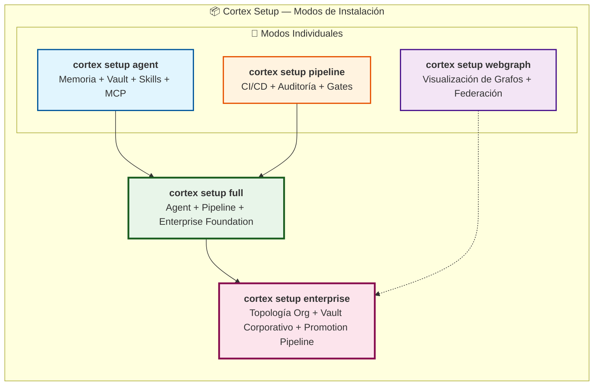
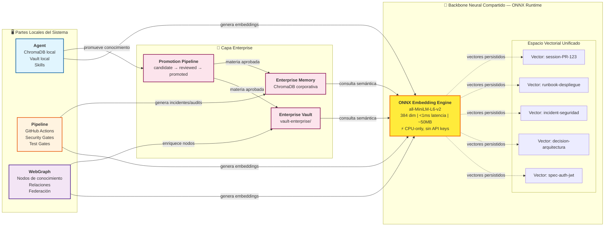
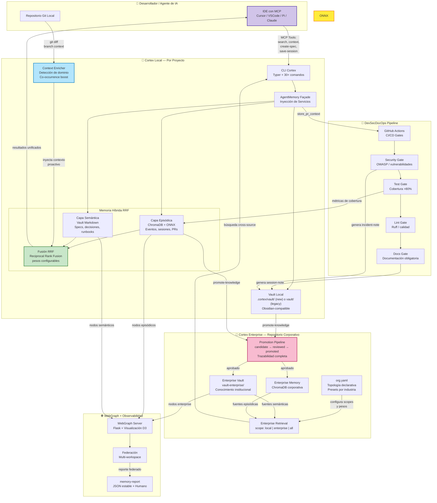
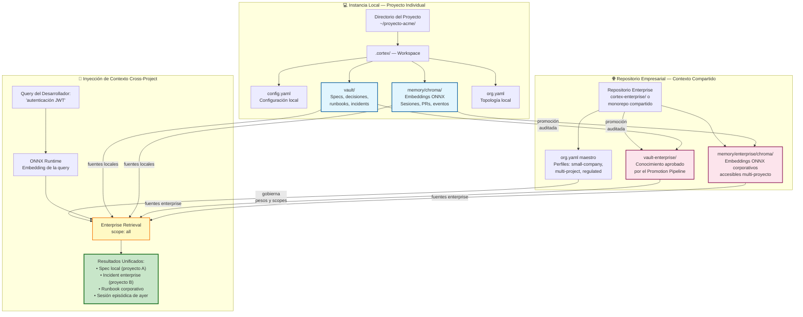
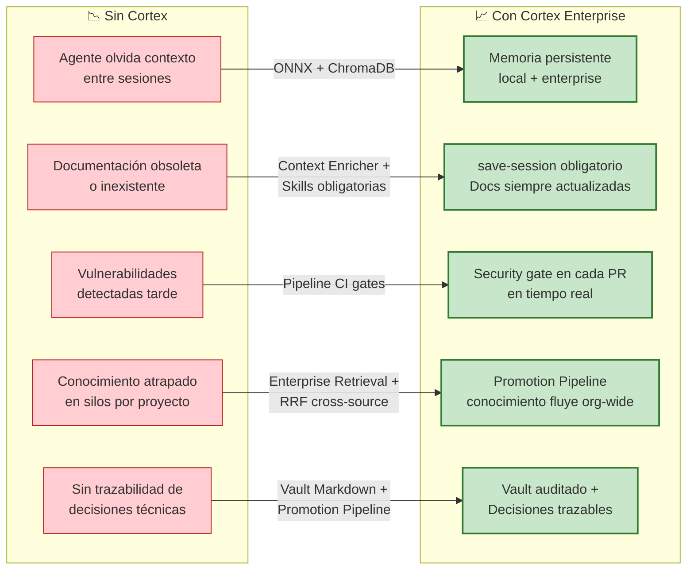

# 🧠 Cortex Enterprise — Arquitectura Global del Sistema

> **Documento para Patrocinadores** | Versión 0.3.0 (Alpha)  
> *Sistema de Gobernanza, Memoria Corporativa y DevSecDocOps para Organizaciones con Agentes de IA*

---

## 📋 Resumen Ejecutivo

**Cortex** es una plataforma de infraestructura cognitiva que transforma la memoria de sesión volátil de los agentes de IA en **memoria institucional persistente y auditable**. A diferencia de las soluciones aisladas por proyecto, Cortex opera como capa transversal empresarial donde el conocimiento fluye desde lo local (un desarrollador, un proyecto) hacia lo corporativo (toda la organización) mediante un pipeline de promoción gobernado.

La arquitectura está diseñada para ser **modular por instalación** (`agent`, `pipeline`, `full`, `webgraph`) pero **unificada en ejecución** gracias a un backbone de embeddings ONNX que permite la interoperabilidad semántica entre todas las partes sin depender de APIs externas ni GPUs.

---

## 🏛️ Visión Macro: Las 4 Partes Instalables

Cortex se instala de forma progresiva según la madurez de la organización. Cada parte es autónoma pero diseñada para componerse en el sistema integral.

| Modo | Propósito de Negocio | Quién lo instala |
|------|---------------------|------------------|
| **`setup agent`** | Habilita la memoria híbrida (episódica + semántica) en el proyecto local, conecta el IDE vía MCP y establece el vault de conocimiento. | Desarrollador individual |
| **`setup pipeline`** | Activa los GitHub Actions de gobernanza: Security, Lint, Test, Docs gates en cada PR. | DevOps / Tech Lead |
| **`setup full`** | Despliegue completo de gobernanza + memoria en un solo paso. Ideal para nuevos proyectos. | Tech Lead / Arquitecto |
| **`setup webgraph`** | Activa la visualización interactiva de grafos de conocimiento y federación entre workspaces. | Data Team / Arquitecto |
| **`setup enterprise`** | Escalado a nivel organizacional: vault corporativo, promoción de conocimiento y topología declarativa (`org.yaml`). | CTO / Enterprise Architect |

---

## 🔗 Arquitectura de Interconexión: El Backbone ONNX

El elemento diferenciador de Cortex es que **no es un monolito con acoplamiento fuerte**. Es un ecosistema de componentes distribuidos que se entienden entre sí porque comparten el mismo espacio vectorial semántico generado por ONNX Runtime.

### ¿Por qué ONNX es el pegamento arquitectónico?

| Característica | Valor para la Organización |
|---------------|---------------------------|
| **Modelo único compartido** (`all-MiniLM-L6-v2`) | Todos los componentes —agente, pipeline, webgraph, vault enterprise— "hablan el mismo idioma numérico". Un embedding generado en el proyecto A es comparable con uno generado en el proyecto B. |
| **Zero dependencies externas** | No requiere API keys de OpenAI, ni GPUs, ni conectividad a internet. El modelo corre 100% on-premise en CPU. |
| **Footprint mínimo** | ~50MB de RAM vs ~2.5GB de PyTorch. Se puede desplegar en cualquier runner de CI, laptop de desarrollador o servidor edge. |
| **Sub-milisegundo de latencia** | Búsquedas semánticas en tiempo real dentro del flujo de desarrollo sin fricción perceptible. |
| **Intercambio de contexto** | Gracias a que todos los componentes usan el mismo espacio vectorial, el contexto de una sesión de desarrollo local puede ser **inyectado automáticamente** en la búsqueda de otro proyecto o del vault enterprise. |

---

## 🏛️ Arquitectura Integral: Flujo de Datos y Contexto

Este diagrama muestra cómo fluye la información a través del sistema completo, desde que un desarrollador escribe código hasta que el conocimiento se convierte en activo corporativo.

---

## 🏦 El Vault Empresarial: Local vs Remoto

Cortex distingue dos geometrías de vault que trabajan en conjunto mediante el mismo motor ONNX:

### Cómo funciona la inyección de contexto multi-local

1. **Cada proyecto local** tiene su propio vault y memoria episódica, ambos indexados con ONNX.
2. Cuando un desarrollador ejecuta `cortex search "auth JWT" --scope all`, la query se convierte en un vector ONNX.
3. El **Enterprise Retrieval Service** consulta simultáneamente:
   - Vault local del proyecto actual
   - Memoria episódica local del proyecto actual
   - Vault enterprise compartido (si está habilitado)
   - Memoria episódica enterprise (si está habilitada)
4. Los resultados se fusionan con **RRF (Reciprocal Rank Fusion)** con pesos configurables por scope.
5. El desarrollador recibe contexto que incluye decisiones de arquitectura de **otros proyectos** que nunca vio, porque el espacio vectorial ONNX es compartido.

> **Valor de negocio**: Un equipo que resuelve un problema de seguridad en el proyecto A genera conocimiento que el equipo del proyecto B recupera automáticamente semanas después, sin reuniones ni documentación manual.

---

## 🧩 Descripción Detallada de Componentes

### 1. `cortex setup agent` — La Memoria Cognitiva
- **Qué hace**: Instala ChromaDB (episódica), el vault Markdown (semántica), skills de documentación y el servidor MCP.
- **Valor**: Elimina la "amnesia de sesión" de los agentes de IA. Cada tarea deja un rastro persistente.
- **Tecnología clave**: ONNX Runtime para embeddings locales, ChromaDB como vector store, Typer para CLI.

### 2. `cortex setup pipeline` — La Gobernanza CI/CD
- **Qué hace**: Genera GitHub Actions con gates de Security, Lint, Test y Documentation.
- **Valor**: Convierte la calidad, seguridad y documentación en requisitos automáticos, no afterthoughts.
- **Tecnología clave**: Workflows YAML parametrizados, perfiles de enforcement (`advisory` vs `enforced`).

### 3. `cortex setup full` — La Fundación Completa
- **Qué hace**: Ejecuta `agent` + `pipeline` en una sola operación idempotente.
- **Valor**: Un solo comando para que un nuevo proyecto entre en gobernanza total.
- **Tecnología clave**: `SetupOrchestrator` con `WorkspaceLayout` que adapta la estructura de directorios automáticamente.

### 4. `cortex setup webgraph` — La Visualización del Conocimiento
- **Qué hace**: Levanta un servidor Flask que visualiza el grafo de relaciones entre specs, decisiones, sesiones e incidents.
- **Valor**: Transforma la memoria textual en topología navegable. Permite descubrir clusters de conocimiento ocultos.
- **Tecnología clave**: Federación multi-workspace, enriquecimiento de nodos con embeddings ONNX.

### 5. `cortex setup enterprise` — La Escalabilidad Organizacional
- **Qué hace**: Crea `org.yaml`, vault enterprise, y habilita el Promotion Pipeline.
- **Valor**: El conocimiento deja de ser propiedad de un repo y se convierte en activo corporativo con trazabilidad.
- **Tecnología clave**: Pydantic models para validación de topología, RRF cross-source, pesos configurables `local_weight` / `enterprise_weight`.

---

## 🎯 Flujos de Valor para el Patrocinador

---

## 🔐 Modelo de Seguridad y Gobernanza

| Capa | Control | Implementación |
|------|---------|----------------|
| **Datos** | Embeddings y vault permanecen on-premise | ONNX local + ChromaDB local/empresarial |
| **Promoción** | Conocimiento no fluye sin revisión | `require_review: true` en `org.yaml` |
| **CI** | Gates pueden bloquear merge | `block_on_failure: true` por stage |
| **Auditoría** | Todo cambio en vault es git-tracked | Markdown bajo control de versiones |
| **Aislamiento** | Proyectos pueden operar aislados o compartidos | `project_memory_mode: isolated \| shared` |

---

## 📊 Métricas de Arquitectura

| Indicador | Valor |
|-----------|-------|
| Latencia de embedding | `< 1 ms` (CPU) |
| Dimensiones vectoriales | `384` (all-MiniLM-L6-v2) |
| Footprint de memoria ONNX | `~50 MB` |
| Comandos CLI disponibles | `30+` |
| Backends de embedding soportados | `ONNX (default), sentence-transformers, OpenAI` |
| Scopes de retrieval | `local, enterprise, all` |
| Estados del Promotion Pipeline | `candidate, reviewed, promoted` |
| Perfiles de organización | `small-company, multi-project-team, regulated-organization, custom` |
| Cobertura de tests objetivo | `> 85%` |

---

> **Conclusión para el Patrocinador**: Cortex no es una herramienta más. Es infraestructura cognitiva que convierte el conocimiento disperso de desarrolladores y agentes de IA en **activo corporativo estructurado, auditable y reutilizable**. La arquitectura modular permite adoptarlo progresivamente (agent → pipeline → enterprise), mientras que ONNX garantiza que cada pieza del sistema comparta el mismo lenguaje semántico sin costos de API ni dependencia de terceros.
